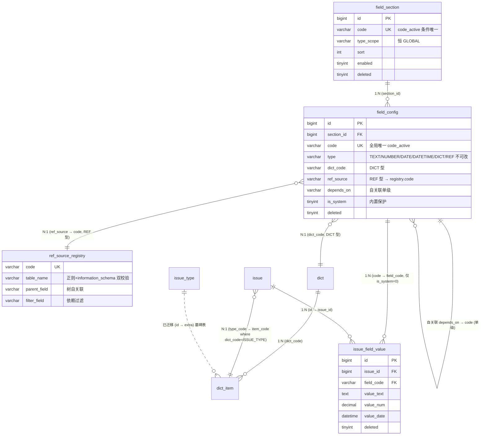
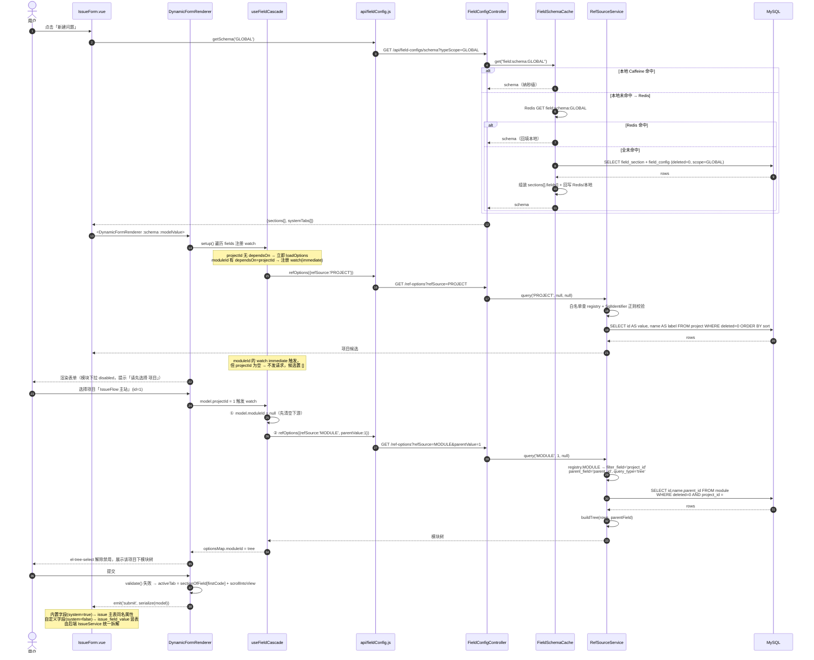

# issueFlow 架构设计｜问题类型下沉字典 + 动态字段配置（Dynamic Field）

- 文档编号：`ARCH_dynamic_field_2026-08-01`
- 架构师：高见远
- 上游输入：`PRD`（产品经理 许清楚，3 段需求 + F1~F19 需求池 + UI 设计稿要点 + Q1~Q7 待确认）
- 代码基线：`D:\WorkBuddyProjects\issueFlow`（Phase8 W4 后）
- 状态：**设计定稿，待工程实现**

---

## 〇、代码现状核对结论（设计前置）

设计前已逐一核对下列文件，本文所有 DDL / 接口 / 组件均与现状对齐：

| 核对项 | 真实现状 | 对本设计的影响 |
|---|---|---|
| `db/schema.sql` | 仅 `role/user/user_role/issue/issue_attachment/issue_history/tag/sys_config` 8 表；首行有 `SET NAMES utf8mb4` | 新表**不进 schema.sql**，走 `scripts/V*.sql` 增量脚本（项目既有惯例） |
| `dict` / `dict_item` | `scripts/V20260731_issueflow_phase7.sql` 建表。`dict` 有 `dict_code/is_system/enabled/deleted + code_active 生成列`；`dict_item` 有 `dict_code(冗余)/item_code/is_system/extra/enabled/deleted + code_active=IF(deleted=0,CONCAT(dict_code,'_',item_code),NULL)` | **ISSUE_TYPE 直接复用该结构，零表结构改动**；`extra` 列正好用于存旧 `issue_type.id` 做灰度回查 |
| `issue_type` | `scripts/V20260803_issueflow_phase6.sql` 建表 + 6 条种子（BUG/FEATURE/PERFORMANCE/UI/QUESTION/OTHER），`code_active` 条件唯一（V20260803b 修复） | 本期**下线为墓碑表**（不 DROP），数据迁入 `dict_item` |
| `issue` 表 | `type_id BIGINT`（Phase6 加列，存 `issue_type.id`）；`source VARCHAR` 存 `dict_item.item_code`；`priority` 为固定枚举 | 类型引用口径由 **id 改为 code**，与 `source` 对齐；新增 `type_code` 列并回填 |
| `IssueTypeService` | 含 `delete()` 引用计数阻断（`"该类型下存在 N 个问题，无法删除，可改为停用"`，`ResultCode.ISSUE_TYPE_HAS_USAGE=40062`）+ `countIssuesByType()` 批量 GROUP BY 防 N+1 | 两段逻辑**平移进 `DictService`**（见 §3.5） |
| `DictService.deleteItem()` | 已有 `if (DICT_TYPE_ISSUE_SOURCE.equals(dictCode)) { refCount... }` 硬编码分支 | 重构为**引用计数注册表 `Map<dictCode, RefCounter>`**，ISSUE_SOURCE / ISSUE_TYPE 各注册一条 |
| `DictService.createItem()` | `DictTypeCodeEnum.isMirrorType()` 拦截镜像类型新增 | ISSUE_TYPE **非镜像**，可自由增删项 → 行为与原 `IssueTypeManage` 一致 |
| `DictCache` | 本地 `ConcurrentHashMap` + Redis（`dict:items:{typeCode}`，TTL 3600s），异常降级直读 DB，独立 `ObjectMapper` 注册 `JavaTimeModule` | **`FieldSchemaCache` 完全照抄该范式**，不新造轮子 |
| `menu` 表 | `/admin/business`（业务管理，parent_id=0）下：问题列表 sort=1、项目配置 2、模块配置 3、字典配置 4；`/admin/issue-types` 为**一级平铺** sort=3 | 软删 `/admin/issue-types`；新增 `/admin/field-configs` 挂 business 下 sort=2，后续项目/字典 sort 顺延 |
| `router/routes.js` | `admin` 布局下已有 `dicts`(dict-manage) / `issue-types`(issue-type-manage) | 移除 `issue-types` 路由项，新增 `field-configs` |
| `IssueForm.vue` (689 行) | `watch(() => model.projectId, (val) => { lastProject=val; model.moduleId=null; loadModules(val) })`（L577-585）+ 硬编码 `SECTION_BY_FIELD`（L424）+ 硬编码 `filledTabs`（L400）+ 硬编码 `rules`（L383） | **这三段硬编码正是需求三要通用化的靶点**，见 §3.6 / §4.2 |
| `IssueFormSections.vue` (234 行) | 5 个写死的 `el-tab-pane`（basic/detail/attachment/relation/history），`expand(name)` 定位，`filledTabs` 红点，`inject('drawerFullscreen')` 响应式布局 | 改为 `v-for` 动态区域 + **系统固定标签恒定追加**，`expand/filledTabs/tabPosition` 全部保留 |
| `FormDrawer.vue` | `size sm/md/lg`、`fullscreenable`、`@confirm/@closed`、`provide('drawerFullscreen')` | 字段配置抽屉/预览抽屉直接复用，零改造 |
| `MENU_KEY_BY_PATH` (`utils/i18nEnum.js` L119) | path → i18n key 映射表 | 新增 `'/admin/field-configs': 'menu.admin.fieldConfig'`，删 `'/admin/issue-types'` |
| 本机环境 | 无 JDK17，后端无法本地编译 | 本文**只做设计与静态审查**，未执行任何 `mvn` |

---

## 一、实现方案 + 框架选型 + Q1~Q7 决策

### 1.1 技术栈（沿用，零新增框架）

| 层 | 选型 | 本期用法 |
|---|---|---|
| 后端框架 | Spring Boot 3.2 | 新增 `FieldConfigController` / `RefSourceController`（或合并为一个） |
| ORM | MyBatis-Plus | 新表全部走 `BaseMapper` + `LambdaQueryWrapper`；**REF 动态查询例外**，走 `@Select` 动态 SQL（见 §3.3 注入防护） |
| DB | MySQL 8 | 生成列 + 条件唯一（`code_active` 范式），全表逻辑删除 `deleted` |
| 缓存 | Redis 7 | `FieldSchemaCache`（照抄 `DictCache` 两级缓存范式） |
| 鉴权 | JWT + `PermissionService.requirePermission()` | 新权限码 `field:config:*` |
| 前端 | Vue3 + Element Plus + Pinia + vue-i18n + Vite | 动态渲染器用 `<component :is>`；树形表格用 `el-table` 的 `row-key + tree-props`；REF 树形用 `el-tree-select`（Element Plus 内置，**无新依赖**） |

> **核心判断**：本需求不需要引入任何低代码/表单引擎（formily、vue-form-create 等）。字段类型仅 6 类、联动仅单级，用 `<component :is>` + 一张控件映射表即可，引入引擎反而带来 300KB+ 体积与调试黑盒。**拒绝过度设计。**

### 1.2 本期范围

| 优先级 | 编号 | 内容 | 本期 |
|---|---|---|---|
| P0 | F1 | 问题类型下沉字典 | ✅ 全做 |
| P0 | F2 | 引用兼容（存量 `issue.type_id`） | ✅ 全做（新增 `type_code` + 回填 + 兼容端点） |
| P0 | F3 | 删除阻断继承 | ✅ 全做（平移进 `DictService` 引用计数注册表） |
| P0 | F4 | 字段配置菜单 | ✅ |
| P0 | F5 | 树形两层表格 | ✅ |
| P0 | F6 | 六类字段类型 | ✅ |
| P0 | F7 | DICT 取值 | ✅（复用 `/api/dicts/options`） |
| P0 | F8 | REF 取值（白名单） | ✅（`ref_source_registry` + 双重校验） |
| P0 | F9 | 字段联动 | ✅（单级，`dependsOn/dependsParam`） |
| P0 | F10 | 表单动态渲染 | ✅ |
| P0 | F11 | 值存储与回显 | ✅（`issue_field_value` 竖表） |
| P1 | F12 | 内置字段保护 | ✅（`is_system=1` 只允许改 label/必填/排序/占位） |
| P1 | F13 | 配置预览 | ✅（预览抽屉复用 `DynamicFormRenderer`，`readonly` 模式） |
| P1 | F14 | 列表列联动 | ⚠️ **只做表结构与索引支撑 + `visible_in_list/searchable` 元数据落库**，列表页消费留到下期（避免本期改动 `AdminIssueList` 分页 SQL 引入回归） |
| P1 | F15 | i18n | ✅ 全做（zh-CN / en-US 双语 key） |
| P2 | F16 | 按问题类型差异化 | 🔲 留接口：`type_scope` 列已预埋 |
| P2 | F17 | 多级级联 | 🔲 留接口：`depends_on` 单级，环检测算法已按多级实现 |
| P2 | F18 | 导入导出 | 🔲 留接口：schema JSON 即导出格式 |
| P2 | F19 | 字段级权限 | 🔲 留接口：`field_config.perm_code` 预留列 |

### 1.3 Q1~Q7 最终决策

| # | 问题 | **决策** | 理由（架构视角） |
|---|---|---|---|
| **Q1** | 是否区分问题类型维度 | **本期全局唯一一套。** `field_section.type_scope` / `field_config.type_scope` 两列**立即建**，值恒为 `'GLOBAL'`；Redis schema key 带 scope 段 `field:schema:{typeScope}` | 列先建、值先固定，是「零成本预埋」：后续 F16 只需放开写入 + 改查询条件，**不触发 DDL 变更与数据迁移**。反之若不建列，后期加列要重刷全量 schema 缓存与前端契约 |
| **Q2** | 历史静态字段迁移 | **方案 A：内置字段继续读写 `issue` 主表原列，字段配置仅为「元数据描述层」。** `field_config.is_system=1` 的字段其 `code` 与 `issue` 实体属性名**严格同名**（title/typeCode/source/severity/priority/projectId/moduleId/tags/description/reproduceSteps/envOs/envBrowser/envAppVersion/envDevice） | 零数据迁移；现有列表/统计/导出/看板 SQL **一行不改**；风险面收敛到「渲染层」。若走 B（全量搬进竖表），`DashboardService` 的 GROUP BY 统计、`IssueMapper` 的分页查询、备份/导出全要重写，收益为零、回归面巨大 |
| **Q3** | 自定义字段存储 | **`issue_field_value` 竖表**（`issue_id + field_code + value_text/value_num/value_date`），**不用 JSON 列** | ① F14 列表筛选需要走索引，JSON 列的 `->>` 提取无法用普通 B-Tree 索引（要建函数索引，每加一个字段就要加一个索引，DDL 成本更高）；② 竖表天然支持 `(field_code, value_*)` 复合索引一次覆盖所有字段；③ 逻辑删除/审计粒度到「单值」而非「整包」 |
| **Q4** | 字段类型变更 | **完全禁止改 `type`**（编辑抽屉中类型选择器 `disabled`，后端 `updateField` 静默忽略入参 type 并在不一致时抛 `FIELD_TYPE_IMMUTABLE`） | 与项目既有 `dict_code 创建后不可改` 口径一致。类型一改，`issue_field_value` 里已落的 `value_text/value_num/value_date` 归属列即错位，需要跨列数据搬迁 + 失败回滚，代价远高于「删旧字段 + 建新字段」 |
| **Q5** | 停用/删除后历史值呈现 | **停用** → 表单不可选；详情页**只读展示** + 灰色 `已停用` tag（复用现有 `extraSourceOption` 的「补一条 disabled 只读项」手法）。**删除** → 表单与详情**均隐藏**，`issue_field_value` 数据软删保留（`deleted=1`），不物理清理 | 与 Phase6/7 既有语义完全一致（`IssueForm.vue` L346-377 已有同款实现），用户心智不割裂；数据不丢，便于回滚与审计 |
| **Q6** | 联动级数 | **本期单级依赖（A→B）。** 保存字段配置时校验：① 不可自依赖；② `dependsOn` 指向的字段自身 `dependsOn` 必须为空（本期强约束，P2 放开）；③ 依赖源**不得为多选字段**（`multi_select=1` 时报 `FIELD_DEPENDS_MULTI_NOT_ALLOWED`）；④ 依赖源必须与本字段 `type_scope` 相同且 `enabled=1`。**环检测按多级 DFS 实现**（代码就绪，仅约束②在本期收紧） | 单级覆盖 100% 已知场景（项目→模块）；多选做依赖源会导致「父值是数组」，候选查询语义分叉（IN 还是 ANY？），本期直接禁止。环检测提前写好，P2 放开约束②即可，**不重写算法** |
| **Q7** | 引用关系跨库/任意表 | **禁止裸表名。** 引入 `ref_source_registry` 白名单表，本期注册 `PROJECT / MODULE / USER / ISSUE` 四个源。前端**只传 `refSource` 编码**，永不传表名/列名。后端**双重防护**：① 白名单表查出的 `table_name/label_field/value_field/parent_field/filter_field/order_field` 全部经正则 `^[A-Za-z_][A-Za-z0-9_]{0,63}$` 校验；② 应用启动时用 `information_schema` 逐条校验「表存在 + 列存在」，不通过则**启动失败快速暴露**（Fail-Fast），杜绝运维手工插入恶意注册行 | 白名单表本身也是「用户可写数据」，只白名单不校验等于把注入点从 API 挪到 DB。两道校验后，SQL 拼接的所有标识符均来自「正则 + information_schema 双验」的封闭集合 |

> **架构师增补决策（PRD 未覆盖，但实现必需）**
>
> | # | 项 | 决策 |
> |---|---|---|
> | A1 | `ref_source_registry` 需区分「树父列」与「依赖过滤列」 | PRD 只给了 `parent_field`。但 MODULE 依赖 PROJECT 时，过滤列是 `project_id`，而树自关联父列是 `parent_id`，**二者不是同一列**。故拆为 `parent_field`（树形自关联）+ `filter_field`（依赖过滤）两列 |
> | A2 | API 路径 | PRD 草案写 `/api/field-config/...`。项目既有资源根一律复数（`/api/dicts`、`/api/issue-types`、`/api/projects`）。**采用 `/api/field-configs`**，前端在 `api/fieldConfig.js` 一处封装，改动成本为零。已在本文标注差异，请 PM 知悉 |
> | A3 | `field_config` 的「同区域重码」索引 | **只建全局 `uk_field_config_code`，不建 `section_code_active`**。因为 `issue_field_value.field_code` 无 section 上下文、`dependsOn` 也按 code 引用，**code 必须全局唯一**；全局唯一已严格覆盖同区域唯一，再建即冗余索引，白占写入成本 |
> | A4 | 列名 `system` | MySQL 8 中 `system` 语义敏感且与 `dict/dict_item` 既有风格不一致。**列名用 `is_system`**，schema JSON 对外仍输出 `system`（`@JsonProperty("system")`），契约不变 |
> | A5 | ISSUE_TYPE 字典项的 `is_system` | 迁移时 6 条种子 **`is_system=0`**（保持原 `IssueTypeManage` 的「无引用即可删」语义，不做行为回退）；仅 `dict` 类型行本身 `is_system=1`（保护 ISSUE_TYPE 字典不被整类删除） |

---


## 2. 数据模型（DDL 级）

### 2.0 迁移脚本落位与执行顺序

新表**不进** `src/backend/src/main/resources/db/schema.sql`（该文件仅保留 8 张基线表），统一走增量脚本（项目惯例，见 §0）。

| 项 | 值 |
|---|---|
| 脚本文件 | `scripts/V20260806_issueflow_phase9_dynamic_field.sql` |
| 执行入口 | `scripts/migrate.sh`（沿用，无需改造） |
| 幂等要求 | 建表用 `CREATE TABLE IF NOT EXISTS`；加列用 `information_schema` 探测 + `PREPARE/EXECUTE`（照抄 `V20250730_issueflow_p0.sql` L56+ 范式）；种子用 `INSERT ... SELECT ... WHERE NOT EXISTS` |
| 脚本内节次 | ① 4 张新表 → ② `ref_source_registry` 种子 → ③ `dict`/`dict_item` 的 ISSUE_TYPE 迁移 → ④ `issue.type_code` 加列 + 回填 → ⑤ `field_section`/`field_config` 内置字段种子 → ⑥ `menu` 变更 |

> **顺序强约束**：④ 回填依赖 ③ 之前的 `issue_type` 原表数据仍在（`issue_type` 是墓碑表，不 DROP，故 ③④ 顺序可互换；但 ⑤ 的 `typeCode` 字段种子 `dict_code='ISSUE_TYPE'` 依赖 ③ 已完成）。

```sql
-- ============================================================
-- issueFlow Phase9 动态字段配置 增量脚本
-- 字符集 utf8mb4 / 存储引擎 InnoDB
-- 约定：逻辑删除 deleted / 条件唯一走 code_active 生成列
-- ============================================================
SET NAMES utf8mb4;
```

---

### 2.1 `field_section`（字段区域 / 表单分组）

```sql
-- ---------------------------------------------------------------------------
-- 2.1 field_section：表单分区（对应 IssueForm 的 el-tabs 页签）
--     type_scope 本期恒为 'GLOBAL'（Q1 零成本预埋，P2-F16 放开写入即可）
-- ---------------------------------------------------------------------------
CREATE TABLE IF NOT EXISTS `field_section` (
  `id`          BIGINT       NOT NULL AUTO_INCREMENT,
  `code`        VARCHAR(64)  NOT NULL            COMMENT '区域编码（大写下划线），程序依赖，创建后不可改',
  `name`        VARCHAR(50)  NOT NULL            COMMENT '区域名称（页签标题，i18n 缺失时的兜底文案）',
  `i18n_key`    VARCHAR(100) DEFAULT NULL        COMMENT 'i18n key，如 field.section.BASIC；为空则回退 name',
  `type_scope`  VARCHAR(64)  NOT NULL DEFAULT 'GLOBAL'
                COMMENT '生效范围：本期恒为 GLOBAL；P2-F16 存 issue 类型 code',
  `sort`        INT          NOT NULL DEFAULT 0  COMMENT '升序展示（页签左右顺序）',
  `enabled`     TINYINT      NOT NULL DEFAULT 1  COMMENT '1启用 0停用（停用则整个页签不渲染）',
  `is_system`   TINYINT      NOT NULL DEFAULT 0  COMMENT '1=系统预设区域，删除接口硬拦截，仅可改名/排序',
  `created_at`  DATETIME     DEFAULT NULL,
  `updated_at`  DATETIME     DEFAULT NULL,
  `deleted`     TINYINT      NOT NULL DEFAULT 0,
  -- 条件唯一辅助列：未删除行取 code，软删行取 NULL（唯一索引忽略 NULL）
  -- 不可用 (code, deleted) 复合唯一：MyBatis-Plus 逻辑删除会把元组由 (code,0) 变 (code,1)，
  -- 与既有墓碑撞唯一键 → 删除报 500（教训见 V20260803b_fix_issuetype_unique.sql）
  `code_active` VARCHAR(64) GENERATED ALWAYS AS (IF(`deleted` = 0, `code`, NULL)) VIRTUAL
                COMMENT '条件唯一辅助列，仅供 uk_field_section_code 使用，Java 实体不映射',
  PRIMARY KEY (`id`),
  UNIQUE KEY `uk_field_section_code` (`code_active`),
  KEY `idx_field_section_scope_sort` (`type_scope`, `sort`)
) ENGINE=InnoDB DEFAULT CHARSET=utf8mb4 COMMENT='字段区域（表单分区/页签）';
```

**区域种子（3 条，全部 `is_system=1`，与现有 `IssueForm.vue` 的 `SECTION_BY_FIELD` 完全对齐）**

```sql
INSERT INTO `field_section`
  (`code`,`name`,`i18n_key`,`type_scope`,`sort`,`enabled`,`is_system`,`created_at`,`updated_at`)
SELECT 'BASIC','基本信息','field.section.BASIC','GLOBAL',1,1,1,NOW(),NOW()
WHERE NOT EXISTS (SELECT 1 FROM `field_section` WHERE `code`='BASIC' AND `deleted`=0);

INSERT INTO `field_section`
  (`code`,`name`,`i18n_key`,`type_scope`,`sort`,`enabled`,`is_system`,`created_at`,`updated_at`)
SELECT 'DETAIL','详细描述','field.section.DETAIL','GLOBAL',2,1,1,NOW(),NOW()
WHERE NOT EXISTS (SELECT 1 FROM `field_section` WHERE `code`='DETAIL' AND `deleted`=0);

INSERT INTO `field_section`
  (`code`,`name`,`i18n_key`,`type_scope`,`sort`,`enabled`,`is_system`,`created_at`,`updated_at`)
SELECT 'ENV','环境信息','field.section.ENV','GLOBAL',3,1,1,NOW(),NOW()
WHERE NOT EXISTS (SELECT 1 FROM `field_section` WHERE `code`='ENV' AND `deleted`=0);
```

> **系统固定页签**（`relation` 关联 / `history` 历史 / `attachment` 附件）**不入库**，由 schema 接口以 `systemTabs` 数组下发、前端恒定追加在动态页签之后。理由：它们不是「字段容器」，无字段可配，入库反而给管理员「可删」的错觉。

---

### 2.2 `field_config`（字段配置，本期核心表）

```sql
-- ---------------------------------------------------------------------------
-- 2.2 field_config：字段元数据
--     A3：只建全局 uk_field_config_code，不建 section_code_active
--         （issue_field_value.field_code 与 depends_on 均无 section 上下文，code 必须全局唯一）
--     A4：列名 is_system，对外 JSON 仍输出 system（@JsonProperty("system")）
--     Q2：is_system=1 的字段其 code 与 Issue 实体属性名严格同名，值仍读写 issue 主表原列
-- ---------------------------------------------------------------------------
CREATE TABLE IF NOT EXISTS `field_config` (
  `id`             BIGINT       NOT NULL AUTO_INCREMENT,
  `section_id`     BIGINT       NOT NULL            COMMENT '所属区域 field_section.id（无外键，避免逻辑删除冲突）',
  `code`           VARCHAR(64)  NOT NULL            COMMENT '字段编码（小驼峰），全局唯一，创建后不可改；is_system=1 时须与 Issue 实体属性同名',
  `name`           VARCHAR(50)  NOT NULL            COMMENT '字段标签（i18n 缺失时兜底）',
  `i18n_key`       VARCHAR(100) DEFAULT NULL        COMMENT 'i18n key，如 field.label.title',
  `type`           VARCHAR(20)  NOT NULL            COMMENT '字段类型：TEXT/NUMBER/DATE/DATETIME/DICT/REF，创建后不可改（Q4）',
  `required`       TINYINT      NOT NULL DEFAULT 0  COMMENT '1必填 0选填',
  `placeholder`    VARCHAR(200) DEFAULT NULL        COMMENT '占位提示',
  `default_value`  VARCHAR(500) DEFAULT NULL        COMMENT '默认值（字符串形态，按 type 解析）',
  `span`           TINYINT      NOT NULL DEFAULT 12 COMMENT '栅格宽度 1~24（el-col），常用 12=半行 24=整行',
  `multiline`      TINYINT      NOT NULL DEFAULT 0  COMMENT 'TEXT 专用：1=textarea 0=input',
  `max_length`     INT          DEFAULT NULL        COMMENT 'TEXT 专用：最大字符数',
  `min_val`        DECIMAL(20,6) DEFAULT NULL       COMMENT 'NUMBER 专用：最小值',
  `max_val`        DECIMAL(20,6) DEFAULT NULL       COMMENT 'NUMBER 专用：最大值',
  `decimal_scale`  TINYINT      DEFAULT NULL        COMMENT 'NUMBER 专用：小数位数，NULL=整数',
  `dict_code`      VARCHAR(50)  DEFAULT NULL        COMMENT 'DICT 专用：dict.dict_code，候选走 /api/dicts/options',
  `ref_source`     VARCHAR(50)  DEFAULT NULL        COMMENT 'REF 专用：ref_source_registry.code 白名单编码（Q7，永不存表名）',
  `display_type`   VARCHAR(10)  DEFAULT NULL        COMMENT 'REF 专用：select 平铺 / tree 树形；为空按 registry.query_type 兜底',
  `multi_select`   TINYINT      NOT NULL DEFAULT 0  COMMENT '1多选 0单选（DICT/REF 有效；多选值逗号拼接存 value_text）',
  `depends_on`     VARCHAR(64)  DEFAULT NULL        COMMENT '依赖的上游字段 code（本期单级，Q6）',
  `depends_param`  VARCHAR(64)  DEFAULT NULL        COMMENT '传给 ref-options 的过滤参数名；为空则取 registry.filter_field',
  `is_system`      TINYINT      NOT NULL DEFAULT 0  COMMENT '1=内置字段（F12）：仅可改 name/i18n_key/required/sort/placeholder/span，code/type/删除均硬拦截',
  `visible_in_list` TINYINT     NOT NULL DEFAULT 0  COMMENT 'F14 元数据：是否可作为列表列（本期只落库，列表页消费留下期）',
  `searchable`     TINYINT      NOT NULL DEFAULT 0  COMMENT 'F14 元数据：是否可作为查询条件（本期只落库）',
  `perm_code`      VARCHAR(100) DEFAULT NULL        COMMENT 'P2-F19 预留：字段级权限标识，本期恒 NULL 且不参与鉴权',
  `type_scope`     VARCHAR(64)  NOT NULL DEFAULT 'GLOBAL' COMMENT '生效范围：本期恒 GLOBAL（Q1）',
  `sort`           INT          NOT NULL DEFAULT 0  COMMENT '区域内升序展示',
  `enabled`        TINYINT      NOT NULL DEFAULT 1  COMMENT '1启用 0停用（停用：表单不可选，详情只读+灰 tag，Q5）',
  `created_at`     DATETIME     DEFAULT NULL,
  `updated_at`     DATETIME     DEFAULT NULL,
  `deleted`        TINYINT      NOT NULL DEFAULT 0,
  -- 条件唯一辅助列（同 2.1 说明）
  `code_active`    VARCHAR(64) GENERATED ALWAYS AS (IF(`deleted` = 0, `code`, NULL)) VIRTUAL
                   COMMENT '条件唯一辅助列，仅供 uk_field_config_code 使用，Java 实体不映射',
  PRIMARY KEY (`id`),
  UNIQUE KEY `uk_field_config_code` (`code_active`),
  KEY `idx_field_config_section_sort` (`section_id`, `sort`),
  KEY `idx_field_config_scope` (`type_scope`, `enabled`),
  KEY `idx_field_config_depends` (`depends_on`)
) ENGINE=InnoDB DEFAULT CHARSET=utf8mb4 COMMENT='字段配置（动态表单元数据）';
```

**字段类型 × 生效属性矩阵**（后端 `validateByType()` 与前端渲染共同遵循；非生效属性保存时强制置 NULL，避免脏配置）

| 属性 | TEXT | NUMBER | DATE | DATETIME | DICT | REF |
|---|:--:|:--:|:--:|:--:|:--:|:--:|
| `multiline` | ✅ | — | — | — | — | — |
| `max_length` | ✅ | — | — | — | — | — |
| `min_val`/`max_val` | — | ✅ | — | — | — | — |
| `decimal_scale` | — | ✅ | — | — | — | — |
| `dict_code` | — | — | — | — | ✅ **必填** | — |
| `ref_source` | — | — | — | — | — | ✅ **必填** |
| `display_type` | — | — | — | — | — | ✅ |
| `multi_select` | — | — | — | — | ✅ | ✅ |
| `depends_on`/`depends_param` | — | — | — | — | ✅ | ✅ |
| 值落库列 | `value_text` | `value_num` | `value_date` | `value_date` | `value_text` | `value_text` |

---

### 2.3 `issue_field_value`（自定义字段值，竖表）

```sql
-- ---------------------------------------------------------------------------
-- 2.3 issue_field_value：仅存 is_system=0 的自定义字段值（Q2/Q3）
--     内置字段值仍在 issue 主表原列，本表不存，零数据迁移
--     多选值以英文逗号拼接存 value_text（与 issue.tags 既有惯例一致），
--     故 (issue_id, field_code) 条件唯一成立，保存即一次 upsert
-- ---------------------------------------------------------------------------
CREATE TABLE IF NOT EXISTS `issue_field_value` (
  `id`          BIGINT        NOT NULL AUTO_INCREMENT,
  `issue_id`    BIGINT        NOT NULL            COMMENT '所属问题 issue.id（无外键）',
  `field_code`  VARCHAR(64)   NOT NULL            COMMENT '字段编码 field_config.code（冗余存 code 而非 id，避免回显 JOIN）',
  `value_text`  TEXT          DEFAULT NULL        COMMENT 'TEXT/DICT/REF 值；多选为逗号拼接',
  `value_num`   DECIMAL(20,6) DEFAULT NULL        COMMENT 'NUMBER 值',
  `value_date`  DATETIME      DEFAULT NULL        COMMENT 'DATE/DATETIME 值（DATE 取 00:00:00）',
  `created_at`  DATETIME      DEFAULT NULL,
  `updated_at`  DATETIME      DEFAULT NULL,
  `deleted`     TINYINT       NOT NULL DEFAULT 0  COMMENT '字段被删除时值软删保留（Q5），不物理清理',
  `pair_active` VARCHAR(96) GENERATED ALWAYS AS
                (IF(`deleted` = 0, CONCAT(`issue_id`, '_', `field_code`), NULL)) VIRTUAL
                COMMENT '条件唯一辅助列，仅供 uk_ifv_pair 使用，Java 实体不映射',
  PRIMARY KEY (`id`),
  UNIQUE KEY `uk_ifv_pair` (`pair_active`),
  KEY `idx_ifv_issue` (`issue_id`, `deleted`),
  -- F14 下期列表筛选走此索引：WHERE field_code=? AND value_text=?（竖表相对 JSON 列的核心收益，Q3）
  KEY `idx_ifv_code_text` (`field_code`, `value_text`(64)),
  KEY `idx_ifv_code_num`  (`field_code`, `value_num`),
  KEY `idx_ifv_code_date` (`field_code`, `value_date`)
) ENGINE=InnoDB DEFAULT CHARSET=utf8mb4 COMMENT='问题自定义字段值（竖表）';
```

> **多选筛选口径**：下期 F14 对 `multi_select=1` 字段的筛选用 `FIND_IN_SET(?, value_text)`（不走索引，仅限低基数字段），与 `issue.tags` 现有筛选口径完全一致，不引入新范式。

---

### 2.4 `ref_source_registry`（引用源白名单，Q7 + A1）

```sql
-- ---------------------------------------------------------------------------
-- 2.4 ref_source_registry：REF 字段可引用的表白名单
--     A1：parent_field（树形自关联父列）与 filter_field（依赖过滤列）是两列，
--         MODULE 的树父列是 parent_id、依赖 PROJECT 的过滤列是 project_id，不是同一列
--     Q7：本表虽是「用户可写数据」，仍须过 ① 正则 ② information_schema 双校验
-- ---------------------------------------------------------------------------
CREATE TABLE IF NOT EXISTS `ref_source_registry` (
  `id`          BIGINT       NOT NULL AUTO_INCREMENT,
  `code`        VARCHAR(50)  NOT NULL            COMMENT '引用源编码（大写），前端只传此值，永不传表名',
  `name`        VARCHAR(50)  NOT NULL            COMMENT '引用源名称（配置页下拉展示）',
  `table_name`  VARCHAR(64)  NOT NULL            COMMENT '目标表名，须过正则 + information_schema 校验',
  `label_field` VARCHAR(64)  NOT NULL            COMMENT '展示列（下拉 label）',
  `value_field` VARCHAR(64)  NOT NULL DEFAULT 'id' COMMENT '取值列（下拉 value）',
  `query_type`  VARCHAR(10)  NOT NULL DEFAULT 'flat' COMMENT 'flat 平铺列表 / tree 树形',
  `parent_field` VARCHAR(64) DEFAULT NULL        COMMENT '树形自关联父列，query_type=tree 时必填',
  `filter_field` VARCHAR(64) DEFAULT NULL        COMMENT '依赖过滤列：被 depends_on 触发时用于 WHERE 的列',
  `order_field` VARCHAR(64)  DEFAULT NULL        COMMENT '排序列，为空时按 value_field 升序',
  `enabled`     TINYINT      NOT NULL DEFAULT 1  COMMENT '1启用 0停用（停用后不出现在配置页下拉）',
  `created_at`  DATETIME     DEFAULT NULL,
  `updated_at`  DATETIME     DEFAULT NULL,
  `deleted`     TINYINT      NOT NULL DEFAULT 0,
  `code_active` VARCHAR(50) GENERATED ALWAYS AS (IF(`deleted` = 0, `code`, NULL)) VIRTUAL
                COMMENT '条件唯一辅助列，仅供 uk_ref_source_code 使用，Java 实体不映射',
  PRIMARY KEY (`id`),
  UNIQUE KEY `uk_ref_source_code` (`code_active`)
) ENGINE=InnoDB DEFAULT CHARSET=utf8mb4 COMMENT='REF 字段引用源白名单';
```

**种子数据（4 条）**

| code | table_name | label_field | value_field | query_type | parent_field | filter_field | order_field |
|---|---|---|---|---|---|---|---|
| `PROJECT` | `project` | `name` | `id` | `flat` | NULL | NULL | `sort` |
| `MODULE` | `module` | `name` | `id` | `tree` | `parent_id` | `project_id` | `sort` |
| `USER` | `user` | `username` | `id` | `flat` | NULL | NULL | `id` |
| `ISSUE` | `issue` | `title` | `id` | `flat` | NULL | NULL | `id` |

```sql
INSERT INTO `ref_source_registry`
 (`code`,`name`,`table_name`,`label_field`,`value_field`,`query_type`,`parent_field`,`filter_field`,`order_field`,`enabled`,`created_at`,`updated_at`)
SELECT 'PROJECT','项目','project','name','id','flat',NULL,NULL,'sort',1,NOW(),NOW()
WHERE NOT EXISTS (SELECT 1 FROM `ref_source_registry` WHERE `code`='PROJECT' AND `deleted`=0);

INSERT INTO `ref_source_registry`
 (`code`,`name`,`table_name`,`label_field`,`value_field`,`query_type`,`parent_field`,`filter_field`,`order_field`,`enabled`,`created_at`,`updated_at`)
SELECT 'MODULE','模块','module','name','id','tree','parent_id','project_id','sort',1,NOW(),NOW()
WHERE NOT EXISTS (SELECT 1 FROM `ref_source_registry` WHERE `code`='MODULE' AND `deleted`=0);

INSERT INTO `ref_source_registry`
 (`code`,`name`,`table_name`,`label_field`,`value_field`,`query_type`,`parent_field`,`filter_field`,`order_field`,`enabled`,`created_at`,`updated_at`)
SELECT 'USER','用户','user','username','id','flat',NULL,NULL,'id',1,NOW(),NOW()
WHERE NOT EXISTS (SELECT 1 FROM `ref_source_registry` WHERE `code`='USER' AND `deleted`=0);

INSERT INTO `ref_source_registry`
 (`code`,`name`,`table_name`,`label_field`,`value_field`,`query_type`,`parent_field`,`filter_field`,`order_field`,`enabled`,`created_at`,`updated_at`)
SELECT 'ISSUE','问题','issue','title','id','flat',NULL,NULL,'id',1,NOW(),NOW()
WHERE NOT EXISTS (SELECT 1 FROM `ref_source_registry` WHERE `code`='ISSUE' AND `deleted`=0);
```

> **`order_field` 可为空的处理**：`project`/`module` 表已有 `sort` 列；`user`/`issue` 无，故填 `id`。启动期 `information_schema` 校验对 `order_field` 同样生效，写错列名 → **启动失败**（Fail-Fast）。

---

### 2.5 `dict` / `dict_item` 改动：ISSUE_TYPE 系统字典 + 数据迁移

**① 新增 ISSUE_TYPE 字典类型行（`is_system=1`，保护整类不被删除，A5）**

```sql
INSERT INTO `dict` (`dict_code`,`name`,`description`,`sort`,`enabled`,`is_system`,`created_at`,`updated_at`)
SELECT 'ISSUE_TYPE','问题类型','问题的分类维度，原 issue_type 表迁入（Phase9）',5,1,1,NOW(),NOW()
WHERE NOT EXISTS (SELECT 1 FROM `dict` WHERE `dict_code`='ISSUE_TYPE' AND `deleted`=0);
```

**② `issue_type` → `dict_item` 数据迁移（字段映射表）**

| `issue_type` 列 | → `dict_item` 列 | 说明 |
|---|---|---|
| `name` | `name` | 直迁 |
| `code` | `item_code` | 直迁；`issue.type_code` 即引用此值 |
| `description` | `description` | 直迁 |
| `sort` | `sort` | 直迁 |
| `enabled` | `enabled` | 直迁 |
| — | `dict_code` | 固定 `'ISSUE_TYPE'` |
| — | `is_system` | 固定 **`0`**（A5：保持原「无引用即可删」语义，不做行为回退） |
| `id` | `extra` | **存旧 id 字符串**，供灰度期按旧 `issue.type_id` 回查比对 |

```sql
-- 仅迁移存活行；按 code 去重幂等（重跑不产生重复项）
INSERT INTO `dict_item`
  (`dict_code`,`item_code`,`name`,`description`,`sort`,`enabled`,`is_system`,`extra`,`created_at`,`updated_at`,`deleted`)
SELECT 'ISSUE_TYPE', t.`code`, t.`name`, t.`description`, t.`sort`, t.`enabled`, 0,
       CAST(t.`id` AS CHAR), NOW(), NOW(), 0
FROM `issue_type` t
WHERE t.`deleted` = 0
  AND NOT EXISTS (
    SELECT 1 FROM `dict_item` d
    WHERE d.`dict_code` = 'ISSUE_TYPE' AND d.`item_code` = t.`code` AND d.`deleted` = 0
  );
```

**③ `issue_type` 墓碑化**：**不 DROP、不改结构、不软删数据**。仅在代码层下线（`IssueTypeController` 移除映射、`IssueTypeService` 标 `@Deprecated`、菜单软删）。物理清理排到「迁移验证通过 + 1 个发布周期」之后，另开脚本。

---

### 2.6 `menu` 变更

```sql
-- ① 软删一级平铺的「问题类型」菜单（不物理删，便于回滚）
UPDATE `menu`
SET `deleted` = 1, `updated_at` = NOW()
WHERE `path` = '/admin/issue-types' AND `type` = 2 AND `deleted` = 0;

-- ② 取业务管理父菜单 id
SET @business_id := (
  SELECT `id` FROM `menu` WHERE `path` = '/admin/business' AND `type` = 2 AND `deleted` = 0 LIMIT 1
);

-- ③ 新增「字段配置」子菜单（sort=2，插在 问题列表(1) 与 项目(原2→顺延) 之间）
INSERT INTO `menu` (`name`,`path`,`parent_id`,`sort`,`permission`,`icon`,`type`,`created_at`,`updated_at`,`deleted`)
SELECT '字段配置','/admin/field-configs',@business_id,2,'field:config:list','SetUp',2,NOW(),NOW(),0
WHERE @business_id IS NOT NULL
  AND NOT EXISTS (
    SELECT 1 FROM `menu` WHERE `path`='/admin/field-configs' AND `type`=2 AND `deleted`=0
  );

-- ④ 原 /admin/business 下 项目(2)/模块(3)/字典(4) 顺延为 3/4/5
UPDATE `menu` SET `sort`=3, `updated_at`=NOW()
 WHERE `parent_id`=@business_id AND `path`='/admin/projects' AND `deleted`=0;
UPDATE `menu` SET `sort`=4, `updated_at`=NOW()
 WHERE `parent_id`=@business_id AND `path`='/admin/modules'  AND `deleted`=0;
UPDATE `menu` SET `sort`=5, `updated_at`=NOW()
 WHERE `parent_id`=@business_id AND `path`='/admin/dicts'    AND `deleted`=0;
```

**变更后 `/admin/business` 子菜单顺序**

| sort | 名称 | path | permission |
|---|---|---|---|
| 1 | 问题列表 | `/admin/issues` | `issue:list` |
| **2** | **字段配置** | **`/admin/field-configs`** | **`field:config:list`** |
| 3 | 项目管理 | `/admin/projects` | `project:list` |
| 4 | 模块管理 | `/admin/modules` | `module:list` |
| 5 | 字典管理 | `/admin/dicts` | `dict:list` |
| ~~—~~ | ~~问题类型~~ | ~~`/admin/issue-types`~~ | 已软删，能力并入字典管理 |

---

### 2.7 `issue` 新增 `type_code` 列 + 回填

```sql
-- ① 幂等加列（照抄 V20250730_issueflow_p0.sql 的 information_schema 探测范式）
SET @col_exist := (
  SELECT COUNT(*) FROM information_schema.COLUMNS
  WHERE TABLE_SCHEMA = DATABASE() AND TABLE_NAME = 'issue' AND COLUMN_NAME = 'type_code'
);
SET @ddl := IF(@col_exist = 0,
  'ALTER TABLE `issue` ADD COLUMN `type_code` VARCHAR(64) DEFAULT NULL COMMENT ''问题类型编码，引用 dict_item(ISSUE_TYPE).item_code（Phase9 起以此为准，type_id 仅灰度回查）'' AFTER `type_id`',
  'SELECT 1');
PREPARE s FROM @ddl; EXECUTE s; DEALLOCATE PREPARE s;

-- ② 从 issue_type 回填（墓碑表数据仍在，含已软删类型也一并回填，保证历史问题可读）
UPDATE `issue` i
JOIN `issue_type` t ON t.`id` = i.`type_id`
SET i.`type_code` = t.`code`
WHERE i.`type_code` IS NULL AND i.`type_id` IS NOT NULL;

-- ③ 索引：列表页按类型筛选走此索引（对齐 source 的既有索引口径）
SET @idx_exist := (
  SELECT COUNT(*) FROM information_schema.STATISTICS
  WHERE TABLE_SCHEMA = DATABASE() AND TABLE_NAME = 'issue' AND INDEX_NAME = 'idx_issue_type_code'
);
SET @ddl2 := IF(@idx_exist = 0,
  'ALTER TABLE `issue` ADD KEY `idx_issue_type_code` (`type_code`)', 'SELECT 1');
PREPARE s2 FROM @ddl2; EXECUTE s2; DEALLOCATE PREPARE s2;

-- ④ 回填校验（迁移脚本末尾输出，非 0 需人工介入）
SELECT COUNT(*) AS `unfilled_type_code`
FROM `issue` WHERE `type_id` IS NOT NULL AND `type_code` IS NULL AND `deleted` = 0;
```

**`type_id` 处置**：本期**保留列且继续双写**（`IssueService` 保存时按 `type_code` 反查 `dict_item.extra` 写回 `type_id`），确保任何遗漏的旧 SQL 不炸；下期确认无引用后再单独下线。

---

### 2.8 内置字段种子（14 条，`is_system=1`，Q2 元数据层）

> **关键约束**：`code` 与 `Issue` 实体属性名**严格同名**，值仍读写 `issue` 主表原列，**不入 `issue_field_value`**。

| # | section | code | type | required | span | 类型专属配置 | 备注 |
|---|---|---|---|:--:|:--:|---|---|
| 1 | BASIC | `title` | TEXT | ✅ | 24 | maxLength=200 | |
| 2 | BASIC | `typeCode` | DICT | ✅ | 12 | dictCode=`ISSUE_TYPE` | 由 `issue_type` 迁入 |
| 3 | BASIC | `source` | DICT | ❌ | 12 | dictCode=`ISSUE_SOURCE` | |
| 4 | BASIC | `severity` | DICT | ✅ | 12 | dictCode=`ISSUE_SEVERITY` | 枚举镜像 |
| 5 | BASIC | `priority` | DICT | ✅ | 12 | dictCode=`ISSUE_PRIORITY` | 枚举镜像 |
| 6 | BASIC | `projectId` | REF | ✅ | 12 | refSource=`PROJECT`, displayType=`select` | 联动源 |
| 7 | BASIC | `moduleId` | REF | ❌ | 12 | refSource=`MODULE`, displayType=`tree`, **dependsOn=`projectId`** | 联动靶点 |
| 8 | BASIC | `tags` | TEXT | ❌ | 24 | maxLength=255 | 逗号拼接，沿用现状 |
| 9 | DETAIL | `description` | TEXT | ✅ | 24 | multiline=1, maxLength=5000 | |
| 10 | DETAIL | `reproduceSteps` | TEXT | ❌ | 24 | multiline=1, maxLength=5000 | |
| 11 | ENV | `envOs` | TEXT | ❌ | 12 | maxLength=100 | |
| 12 | ENV | `envBrowser` | TEXT | ❌ | 12 | maxLength=100 | |
| 13 | ENV | `envAppVersion` | TEXT | ❌ | 12 | maxLength=50 | |
| 14 | ENV | `envDevice` | TEXT | ❌ | 12 | maxLength=100 | |

```sql
SET @sec_basic  := (SELECT `id` FROM `field_section` WHERE `code`='BASIC'  AND `deleted`=0 LIMIT 1);
SET @sec_detail := (SELECT `id` FROM `field_section` WHERE `code`='DETAIL' AND `deleted`=0 LIMIT 1);
SET @sec_env    := (SELECT `id` FROM `field_section` WHERE `code`='ENV'    AND `deleted`=0 LIMIT 1);

-- 示例 3 条（其余 11 条同构，工程师按上表补全；i18n_key 一律 field.label.<code>）
INSERT INTO `field_config`
 (`section_id`,`code`,`name`,`i18n_key`,`type`,`required`,`span`,`max_length`,`is_system`,`type_scope`,`sort`,`enabled`,`created_at`,`updated_at`)
SELECT @sec_basic,'title','标题','field.label.title','TEXT',1,24,200,1,'GLOBAL',1,1,NOW(),NOW()
WHERE NOT EXISTS (SELECT 1 FROM `field_config` WHERE `code`='title' AND `deleted`=0);

INSERT INTO `field_config`
 (`section_id`,`code`,`name`,`i18n_key`,`type`,`required`,`span`,`dict_code`,`is_system`,`type_scope`,`sort`,`enabled`,`created_at`,`updated_at`)
SELECT @sec_basic,'typeCode','问题类型','field.label.typeCode','DICT',1,12,'ISSUE_TYPE',1,'GLOBAL',2,1,NOW(),NOW()
WHERE NOT EXISTS (SELECT 1 FROM `field_config` WHERE `code`='typeCode' AND `deleted`=0);

INSERT INTO `field_config`
 (`section_id`,`code`,`name`,`i18n_key`,`type`,`required`,`span`,`ref_source`,`display_type`,`depends_on`,`is_system`,`type_scope`,`sort`,`enabled`,`created_at`,`updated_at`)
SELECT @sec_basic,'moduleId','所属模块','field.label.moduleId','REF',0,12,'MODULE','tree','projectId',1,'GLOBAL',7,1,NOW(),NOW()
WHERE NOT EXISTS (SELECT 1 FROM `field_config` WHERE `code`='moduleId' AND `deleted`=0);
```

> `moduleId.depends_param` 留空 → 后端取 `ref_source_registry.MODULE.filter_field = 'project_id'`（A1）。这正是「硬编码 `watch(projectId)` → 配置驱动」的等价替换点。

---

### 2.9 ER 关系简述



**三条关系口径说明**

| 关系 | 物理实现 | 为何不用外键 |
|---|---|---|
| `field_config.section_id → field_section.id` | 应用层保证 | 项目全局约定：逻辑删除 + 外键会导致软删父行后子行无法级联，`V20250730` 起一律无外键 |
| `issue_field_value.field_code → field_config.code` | 存 **code 而非 id** | 回显时免 JOIN；字段被删后值仍可按 code 归档追溯 |
| `issue.type_code → dict_item.item_code` | 存 item_code | 与 `issue.source` 完全同构（Phase7 已验证的口径） |

---

## 3. 字段联动逻辑（本期核心）

### 3.1 后端接口全集

| 方法 | 路径 | 权限 | 说明 |
|---|---|---|---|
| GET | `/api/field-configs/schema?typeScope=GLOBAL` | 登录即可 | **表单渲染契约**，走 `FieldSchemaCache` 两级缓存 |
| GET | `/api/field-configs/ref-options?refSource=&parentValue=&keyword=` | 登录即可 | REF 候选项，flat 返回 list / tree 返回树 |
| GET | `/api/field-configs/ref-sources` | `field:config:list` | 配置页下拉：白名单可选源 |
| GET | `/api/field-configs` | `field:config:list` | 管理页树形列表（section + fields 两层） |
| POST | `/api/field-configs` | `field:config:save` | 新增字段 |
| PUT | `/api/field-configs/{id}` | `field:config:save` | 修改字段（type 不一致 → `FIELD_TYPE_IMMUTABLE`） |
| DELETE | `/api/field-configs/{id}` | `field:config:delete` | 删除字段（`is_system=1` 硬拦截） |
| GET/POST/PUT/DELETE | `/api/field-sections[/{id}]` | 同上 | 区域 CRUD |

> A2：路径用**复数** `/api/field-configs`，前端在 `api/fieldConfig.js` 一处封装。

---

### 3.2 `GET /api/field-configs/schema` JSON 契约

```jsonc
{
  "code": 200,
  "message": "success",
  "data": {
    "typeScope": "GLOBAL",
    "version": "1722500000000",          // updated_at 最大值毫秒，前端可做本地缓存比对
    "sections": [
      {
        "code": "BASIC",
        "name": "基本信息",
        "i18nKey": "field.section.BASIC",
        "sort": 1,
        "fields": [
          {
            "code": "title",
            "name": "标题",
            "i18nKey": "field.label.title",
            "type": "TEXT",
            "required": true,
            "placeholder": null,
            "defaultValue": null,
            "span": 24,
            "multiline": false,
            "maxLength": 200,
            "minVal": null, "maxVal": null, "decimalScale": null,
            "dictCode": null,
            "refSource": null, "displayType": null,
            "multiSelect": false,
            "dependsOn": null, "dependsParam": null,
            "system": true,                // ← A4：列名 is_system，JSON 输出 system
            "enabled": true,
            "visibleInList": true, "searchable": true,
            "typeScope": "GLOBAL",
            "sort": 1
          },
          {
            "code": "moduleId",
            "name": "所属模块",
            "i18nKey": "field.label.moduleId",
            "type": "REF",
            "required": false,
            "span": 12,
            "refSource": "MODULE",
            "displayType": "tree",
            "multiSelect": false,
            "dependsOn": "projectId",      // ← 联动声明，前端据此生成 watch
            "dependsParam": null,          // 空 → 后端取 registry.MODULE.filter_field='project_id'
            "system": true,
            "enabled": true,
            "typeScope": "GLOBAL",
            "sort": 7
          }
        ]
      }
    ],
    "systemTabs": ["relation", "history", "attachment"]  // 恒定追加，不入库
  }
}
```

**契约不变量（前后端共同遵守）**

1. `sections` 与 `fields` 均**已按 sort 升序**，前端不再排序。
2. `enabled=false` 的字段**仍下发**（详情页需只读展示 + 灰 tag，Q5）；`deleted=1` 的**不下发**。
3. `system=true` 的字段值读写走 `issue` 主表同名属性；`false` 走 `issue_field_value`。前端**无需区分**，由后端 `IssueService` 装配/拆解。
4. `typeScope` 本期恒 `GLOBAL`，前端**不做分支**，仅原样回传。

---

### 3.3 `GET /api/field-configs/ref-options`

**入参**

| 参数 | 必填 | 说明 |
|---|:--:|---|
| `refSource` | ✅ | 白名单编码，如 `MODULE` |
| `parentValue` | ❌ | 依赖源当前值；有值则拼 `WHERE {filter_field} = ?` |
| `keyword` | ❌ | 模糊搜索 `{label_field} LIKE ?`（远程搜索场景） |

**出参（`query_type=flat`）**

```jsonc
{ "code": 200, "data": [ { "value": 1, "label": "IssueFlow 主站" }, { "value": 2, "label": "运营后台" } ] }
```

**出参（`query_type=tree`）**

```jsonc
{ "code": 200, "data": [
  { "value": 10, "label": "用户中心", "children": [
      { "value": 11, "label": "登录注册", "children": [] } ] } ] }
```

**注入防护实现（Q7 双重校验）**

```java
// service/RefSourceService.java
public List<RefOptionVO> query(String refSource, String parentValue, String keyword) {
    RefSourceRegistry reg = registryCache.getEnabled(refSource);          // ① 只能来自白名单表
    if (reg == null) throw new BizException(ResultCode.REF_SOURCE_NOT_ALLOWED);

    // ② 所有标识符再过一次正则（防运维手工插入恶意注册行）
    String table  = SqlIdentifier.check(reg.getTableName());   // ^[A-Za-z_][A-Za-z0-9_]{0,63}$
    String label  = SqlIdentifier.check(reg.getLabelField());
    String value  = SqlIdentifier.check(reg.getValueField());
    String order  = SqlIdentifier.checkOrDefault(reg.getOrderField(), value);
    String filter = parentValue == null ? null : SqlIdentifier.check(
                        nvl(fieldDependsParam, reg.getFilterField()));

    // ③ 标识符用反引号包裹拼接；**值一律走 #{} 预编译占位符，绝不拼接**
    return refSourceMapper.selectOptions(table, label, value, order, filter, parentValue, keyword);
}
```

```java
// util/SqlIdentifier.java —— 单一出口，全项目唯一允许拼接标识符的地方
private static final Pattern P = Pattern.compile("^[A-Za-z_][A-Za-z0-9_]{0,63}$");
public static String check(String id) {
    if (id == null || !P.matcher(id).matches()) throw new BizException(ResultCode.REF_SOURCE_ILLEGAL_IDENTIFIER);
    return id;
}
```

```java
// config/RefSourceStartupValidator.java —— 启动期 Fail-Fast（Q7 第②道）
@PostConstruct
public void validate() {
    for (RefSourceRegistry r : registryMapper.selectEnabled()) {
        SqlIdentifier.check(r.getTableName()); /* ...其余列同 */
        requireTableExists(r.getTableName());                       // information_schema.TABLES
        requireColumnExists(r.getTableName(), r.getLabelField());   // information_schema.COLUMNS
        requireColumnExists(r.getTableName(), r.getValueField());
        if ("tree".equals(r.getQueryType())) requireColumnExists(r.getTableName(), r.getParentField());
        if (r.getFilterField() != null) requireColumnExists(r.getTableName(), r.getFilterField());
        if (r.getOrderField()  != null) requireColumnExists(r.getTableName(), r.getOrderField());
    }
    // 任一不通过 → 抛 IllegalStateException，Spring 上下文启动失败
}
```

> **Mapper 侧**：`@Select("<script> SELECT ${valueField} AS value, ${labelField} AS label FROM ${tableName} WHERE deleted=0 <if test='filterField!=null'> AND ${filterField} = #{parentValue} </if> ... </script>")`。`${}` 仅用于**已过双校验的标识符**，`#{}` 用于**所有用户值**。此边界须在 Code Review Checklist 中列为必查项。

**DICT 候选**：不新增接口，复用现有 `/api/dicts/options?dictCode=ISSUE_TYPE`。前端 `DynamicField` 按 `type` 分派到不同 loader，对上层透明。

---

### 3.4 保存字段配置：循环依赖 DFS 检测

> Q6：本期强约束「依赖源自身 `dependsOn` 必须为空」，理论上环不可能形成；但**算法按多级 DFS 实现**，P2-F17 放开约束时**零改动**。

```java
// service/FieldConfigService.java
public void validateDepends(FieldConfigDTO dto) {
    String self = dto.getCode(), dep = dto.getDependsOn();
    if (dep == null) return;

    // —— 本期强约束（P2 放开时删除本段 4 条，DFS 保留）——
    if (self.equals(dep))                          throw biz(FIELD_DEPENDS_SELF);
    FieldConfig src = getByCodeActive(dep);
    if (src == null || src.getEnabled() == 0)      throw biz(FIELD_DEPENDS_SOURCE_INVALID);
    if (!src.getTypeScope().equals(dto.getTypeScope())) throw biz(FIELD_DEPENDS_SCOPE_MISMATCH);
    if (src.getMultiSelect() == 1)                 throw biz(FIELD_DEPENDS_MULTI_NOT_ALLOWED);
    if (StringUtils.isNotBlank(src.getDependsOn())) throw biz(FIELD_DEPENDS_LEVEL_EXCEEDED); // 单级
    // ——————————————————————————————————————————————

    // —— 多级环检测（算法就绪，本期即启用）——
    List<String> cycle = detectCycle(self, dep, buildDependsMap(dto));
    if (cycle != null) throw biz(FIELD_DEPENDS_CYCLE, String.join(" → ", cycle));
}

/**
 * 以「假设本次保存已生效」的依赖图做 DFS。
 * @return 环路径（如 [A, B, C, A]）；无环返回 null
 */
private List<String> detectCycle(String self, String dep, Map<String,String> graph) {
    graph.put(self, dep);                       // 把本次待保存的边并入图（关键：校验的是保存后的图）
    Set<String> visiting = new LinkedHashSet<>();
    return dfs(self, graph, visiting);
}

private List<String> dfs(String node, Map<String,String> graph, Set<String> visiting) {
    if (node == null) return null;              // 走到根，无环
    if (visiting.contains(node)) {              // 回到栈内节点 → 成环
        List<String> path = new ArrayList<>(visiting);
        path = path.subList(path.indexOf(node), path.size());
        path.add(node);                          // 闭合环，便于前端提示 "A → B → C → A"
        return path;
    }
    visiting.add(node);
    List<String> r = dfs(graph.get(node), graph, visiting);   // 单依赖：出度恒 ≤1，退化为链式遍历
    visiting.remove(node);
    return r;
}

/** 依赖图：code → dependsOn，仅取同 typeScope 且未删除的字段 */
private Map<String,String> buildDependsMap(FieldConfigDTO dto) {
    return mapper.selectActiveByScope(dto.getTypeScope()).stream()
        .filter(f -> f.getDependsOn() != null)
        .collect(Collectors.toMap(FieldConfig::getCode, FieldConfig::getDependsOn, (a,b)->a, HashMap::new));
}
```

> **复杂度**：单依赖场景出度恒 ≤1，DFS 退化为 O(depth) 链式遍历，字段量级（百级）下无性能顾虑。P2 若放开为多依赖（`depends_on` 变多值），仅需把 `graph` 的 value 换成 `List<String>` 并在 dfs 中 for 循环，**递归骨架不变**。

---

### 3.5 ISSUE_TYPE 引用计数删除阻断（F3 平移）

原 `IssueTypeService` 的删除阻断（`ISSUE_TYPE_HAS_USAGE=40062` + 批量 `GROUP BY` 防 N+1）**平移进 `DictService` 的引用计数注册表**，使「字典项删除阻断」成为可扩展能力，而非 ISSUE_TYPE 专属补丁。

```java
// service/dict/DictItemRefCounter.java —— 扩展点接口
public interface DictItemRefCounter {
    /** 关心哪个字典 */
    String dictCode();
    /** 批量统计引用数：itemCode → count（实现必须一次 GROUP BY，禁止循环单查） */
    Map<String, Long> countByItemCodes(Collection<String> itemCodes);
    /** 被引用时抛出的错误码 */
    String errorCode();
}
```

```java
// service/dict/IssueTypeRefCounter.java —— 唯一实现（本期）
@Component
public class IssueTypeRefCounter implements DictItemRefCounter {
    public String dictCode()  { return "ISSUE_TYPE"; }
    public String errorCode() { return ResultCode.ISSUE_TYPE_HAS_USAGE; }   // 复用 40062，前端文案不变
    public Map<String, Long> countByItemCodes(Collection<String> codes) {
        // SELECT type_code, COUNT(*) FROM issue WHERE deleted=0 AND type_code IN (...) GROUP BY type_code
        return issueMapper.countGroupByTypeCode(codes);
    }
}
```

```java
// service/DictService.java —— 注册表由 Spring 自动装配
private final Map<String, DictItemRefCounter> refCounters;   // dictCode → counter
public DictService(List<DictItemRefCounter> counters) {
    this.refCounters = counters.stream()
        .collect(Collectors.toMap(DictItemRefCounter::dictCode, Function.identity()));
}

public void deleteItem(Long id) {
    DictItem item = getById(id);
    if (item.getIsSystem() == 1) throw biz(DICT_ITEM_SYSTEM_PROTECTED);
    DictItemRefCounter c = refCounters.get(item.getDictCode());
    if (c != null) {
        long n = c.countByItemCodes(List.of(item.getItemCode()))
                  .getOrDefault(item.getItemCode(), 0L);
        // 文案沿用："该类型下存在 N 个问题，无法删除，可改为停用"
        if (n > 0) throw biz(c.errorCode(), n);
    }
    mapper.deleteById(id);   // 逻辑删除
}

/** 列表页批量回填 refCount（一次 GROUP BY 防 N+1，行为与原 IssueTypeService 完全一致） */
public void fillRefCount(String dictCode, List<DictItemVO> items) {
    DictItemRefCounter c = refCounters.get(dictCode);
    if (c == null) { items.forEach(i -> i.setRefCount(null)); return; }
    Map<String, Long> m = c.countByItemCodes(items.stream().map(DictItemVO::getItemCode).toList());
    items.forEach(i -> i.setRefCount(m.getOrDefault(i.getItemCode(), 0L)));
}
```

**行为等价性校验表**（QA 必测）

| 场景 | 原 `IssueTypeManage` | 迁移后 `DictManage`(ISSUE_TYPE) | 期望 |
|---|---|---|---|
| 删除有引用的类型 | 40062 + "存在 N 个问题" | 同左 | ✅ 一致 |
| 删除无引用的类型 | 成功（软删） | 同左（`is_system=0`，A5） | ✅ 一致 |
| 列表展示引用数 | 一次 GROUP BY | 同左 | ✅ 无 N+1 |
| 停用类型 | 表单不可选，详情灰 tag | 同左（Q5 复用 `extraSourceOption`） | ✅ 一致 |

---

### 3.6 前端：DynamicFormRenderer / DynamicField 组件树

```
DynamicFormRenderer.vue                    ← 唯一对外入口（IssueForm / 预览抽屉 共用）
├── props: { schema, modelValue, readonly, mode: 'form'|'preview'|'detail' }
├── emits: ['update:modelValue', 'validate-fail']
├── useDynamicSchema(schema)               ← 派生：fieldMap / sectionOfField / rules / defaultModel
├── useFieldCascade(schema, model)         ← 联动：动态注册 watch + options 仓库
└── <el-tabs v-model="activeTab">
    ├── v-for section in schema.sections   ← 动态页签
    │   └── <el-tab-pane :name="section.code">
    │       └── <el-row :gutter="16">
    │           └── v-for field in section.fields
    │               └── <el-col :span="field.span">
    │                   └── <DynamicField :field :model :options :disabled />
    │                       └── <el-form-item :prop="field.code" :label="labelOf(field)">
    │                           └── <component :is="controlOf(field.type)" v-bind="attrsOf(field)" />
    └── v-for tab in schema.systemTabs      ← 系统固定页签，恒定追加在动态页签之后
        └── <el-tab-pane :name="tab">  <slot :name="`tab-${tab}`" />  </el-tab-pane>
```

**控件映射表**（`components/dynamic/fieldControls.js`，纯数据，无逻辑）

| `type` | 组件 | 关键 props（由 `attrsOf(field)` 生成） |
|---|---|---|
| `TEXT` | `el-input` | `type: field.multiline ? 'textarea' : 'text'`, `maxlength`, `show-word-limit`, `rows:4`, `placeholder` |
| `NUMBER` | `el-input-number` | `:min="field.minVal"`, `:max="field.maxVal"`, `:precision="field.decimalScale ?? 0"`, `controls-position:'right'` |
| `DATE` | `el-date-picker` | `type:'date'`, `value-format:'YYYY-MM-DD'` |
| `DATETIME` | `el-date-picker` | `type:'datetime'`, `value-format:'YYYY-MM-DD HH:mm:ss'` |
| `DICT` | `el-select` | `:multiple="field.multiSelect"`, `filterable`, `clearable`, options 来自 `/api/dicts/options` |
| `REF` + `displayType='select'` | `el-select` | 同上，options 来自 `/api/field-configs/ref-options` |
| `REF` + `displayType='tree'` | `el-tree-select` | `:data`, `:props="{label:'label',children:'children'}"`, `check-strictly`, `node-key:'value'`, `:multiple` |

> `el-tree-select` 为 Element Plus **内置组件**（v2.2+），无需新增依赖（见 §6）。

```js
// components/dynamic/fieldControls.js
export const CONTROL_BY_TYPE = {
  TEXT:     () => 'el-input',
  NUMBER:   () => 'el-input-number',
  DATE:     () => 'el-date-picker',
  DATETIME: () => 'el-date-picker',
  DICT:     () => 'el-select',
  REF:      (f) => (f.displayType === 'tree' ? 'el-tree-select' : 'el-select'),
}
export const controlOf = (f) => (CONTROL_BY_TYPE[f.type] ?? CONTROL_BY_TYPE.TEXT)(f)
```

---

### 3.7 联动 watch 动态生成（替代硬编码 `watch(() => model.projectId)`）

```js
// composables/useFieldCascade.js
export function useFieldCascade(schema, model) {
  const optionsMap = reactive({})   // fieldCode → 候选项数组（flat 或 tree）
  const loadingMap = reactive({})
  const stopHandles = []

  /** 拉取某字段候选项；parentValue 为依赖源当前值 */
  async function loadOptions(field, parentValue) {
    loadingMap[field.code] = true
    try {
      if (field.type === 'DICT') {
        optionsMap[field.code] = await dictApi.options(field.dictCode)
      } else if (field.type === 'REF') {
        // 依赖源无值 → 直接清空，不发请求（避免全量拉模块）
        if (field.dependsOn && (parentValue === null || parentValue === undefined || parentValue === '')) {
          optionsMap[field.code] = []; return
        }
        optionsMap[field.code] = await fieldConfigApi.refOptions({
          refSource: field.refSource, parentValue,
        })
      }
    } finally { loadingMap[field.code] = false }
  }

  function setup() {
    const fields = schema.sections.flatMap(s => s.fields)

    fields.forEach(field => {
      if (field.type !== 'DICT' && field.type !== 'REF') return

      if (!field.dependsOn) {
        loadOptions(field, null)                       // 无依赖：初始化即拉一次
        return
      }

      // ★ 通用化联动：等价替换 IssueForm 原硬编码
      //   watch(() => model.projectId, () => { model.moduleId = null; loadModules() })
      const stop = watch(
        () => model[field.dependsOn],
        (nv, ov) => {
          if (nv === ov) return
          model[field.code] = field.multiSelect ? [] : null   // ① 先清空下游值，防脏数据提交
          loadOptions(field, nv)                              // ② 再按新父值刷新候选
        },
        { immediate: true }                                   // 编辑态回显：进来即按已有父值拉一次
      )
      stopHandles.push(stop)
    })
  }

  /** 依赖未选时禁用下游字段 */
  function isDisabled(field) {
    if (!field.dependsOn) return false
    const pv = model[field.dependsOn]
    return pv === null || pv === undefined || pv === '' || (Array.isArray(pv) && !pv.length)
  }

  /** 禁用态提示：「请先选择 XXX」 */
  function placeholderOf(field, fieldMap) {
    if (isDisabled(field)) {
      return t('field.tip.selectFirst', { name: labelOf(fieldMap[field.dependsOn]) })
    }
    return field.placeholder || t('field.tip.pleaseInput', { name: labelOf(field) })
  }

  onScopeDispose(() => stopHandles.forEach(s => s()))
  setup()
  return { optionsMap, loadingMap, isDisabled, placeholderOf, loadOptions }
}
```

**联动的 3 条不变量**

| # | 规则 | 理由 |
|---|---|---|
| 1 | 父值变化 → **先清空子值，再拉候选** | 顺序反了会出现「旧子值 + 新候选」的一帧脏态，用户可能直接提交 |
| 2 | 父值为空 → **不发请求**，候选置 `[]` | 避免退化成「全量拉模块」（原硬编码的隐性 bug） |
| 3 | `immediate: true` | 编辑态打开抽屉时，`model.projectId` 已有值，需立即拉一次模块候选完成回显 |

---

### 3.8 校验规则动态生成

```js
// composables/useDynamicSchema.js
const RULE_BY_TYPE = {
  TEXT:     (f) => f.maxLength ? [{ max: f.maxLength, message: t('field.rule.maxLength', { n: f.maxLength }), trigger: 'blur' }] : [],
  NUMBER:   (f) => [{ type: 'number', message: t('field.rule.number'), trigger: 'blur' },
                    ...(f.minVal != null || f.maxVal != null
                        ? [{ type: 'number', min: f.minVal ?? -Infinity, max: f.maxVal ?? Infinity,
                             message: t('field.rule.range', { min: f.minVal, max: f.maxVal }), trigger: 'blur' }] : [])],
  DATE:     () => [], DATETIME: () => [],
  DICT:     () => [], REF: () => [],
}

export function buildRules(schema) {
  const rules = {}
  schema.sections.flatMap(s => s.fields)
    .filter(f => f.enabled)                       // 停用字段不参与校验（Q5：表单里本就不可选）
    .forEach(f => {
      const list = []
      if (f.required) list.push({
        required: true,
        message: t('field.rule.required', { name: labelOf(f) }),
        trigger: (f.type === 'DICT' || f.type === 'REF' || f.type.startsWith('DATE')) ? 'change' : 'blur',
      })
      list.push(...RULE_BY_TYPE[f.type](f))
      if (list.length) rules[f.code] = list
    })
  return rules
}
```

---

### 3.9 `SECTION_BY_FIELD` / `filledTabs` 的通用化替代

**原实现（`IssueForm.vue`，硬编码）**

```js
const SECTION_BY_FIELD = { title:'basic', typeId:'basic', /* ...逐个手写 14 条... */ }
const filledTabs = computed(() => { /* 手写判断每个 tab 是否有值 */ })
```

**新实现（遍历 schema 派生，字段增删零改代码）**

```js
// composables/useDynamicSchema.js
/** ① fieldCode → sectionCode 映射（替代 SECTION_BY_FIELD 常量） */
export const sectionOfField = computed(() => {
  const m = {}
  schema.value.sections.forEach(s => s.fields.forEach(f => { m[f.code] = s.code }))
  return m
})

/** ② 默认值模型（用于「是否已填」的基准比对） */
export const defaultModel = computed(() => {
  const m = {}
  schema.value.sections.forEach(s => s.fields.forEach(f => { m[f.code] = parseDefault(f) }))
  return m
})

/** ③ 红点：section 下任一字段值 ≠ 默认值 → 该页签打点（替代 filledTabs） */
export const filledSections = computed(() => {
  const set = new Set()
  schema.value.sections.forEach(s => {
    const touched = s.fields.some(f => !isEqual(model[f.code], defaultModel.value[f.code])
                                       && !isEmptyVal(model[f.code]))
    if (touched) set.add(s.code)
  })
  return set
})

/** ④ 校验失败自动定位页签（替代原硬编码跳转） */
async function submit() {
  try {
    await formRef.value.validate()
  } catch (invalidFields) {
    const firstCode = Object.keys(invalidFields)[0]
    activeTab.value = sectionOfField.value[firstCode]     // 切到出错字段所在页签
    await nextTick()
    document.querySelector(`[data-field="${firstCode}"]`)
            ?.scrollIntoView({ behavior: 'smooth', block: 'center' })
    emit('validate-fail', invalidFields)
    return
  }
  emit('submit', serialize(model))
}
```

> `DynamicField` 根节点须输出 `:data-field="field.code"`，供上述定位查询命中。

---

### 3.10 时序图：打开表单 → 拉 schema → 渲染 → 选项目 → 联动刷新模块



---

## 4. 页面结构（组件树）

### 4.1 `FieldConfigManage.vue`（字段配置管理页）

```
views/admin/FieldConfigManage.vue
├── <PageHeader title="字段配置" />                         ← 复用现有布局组件
├── 查询栏 <el-form :inline="true">
│   ├── <el-input v-model="query.keyword" placeholder="字段名称/编码" clearable />
│   ├── <el-select v-model="query.type" :options="FIELD_TYPES" placeholder="字段类型" clearable />
│   ├── <el-select v-model="query.enabled" placeholder="状态" clearable />
│   ├── <el-button type="primary" @click="load">查询</el-button> / <el-button @click="reset">重置</el-button>
│   └── 右侧操作组
│       ├── <el-button type="primary" icon="Plus" @click="openSection()">新增区域</el-button>
│       ├── <el-button icon="Plus" @click="openField()">新增字段</el-button>
│       └── <el-button icon="View" @click="preview.visible = true">预览表单</el-button>   ← F13
├── 树形两层表格 <el-table :data="tree" row-key="rowKey"
│                          :tree-props="{ children: 'children', hasChildren: 'hasChildren' }"
│                          default-expand-all>
│   ├── col 名称        ← 区域行加粗 + <el-tag size="small">区域</el-tag>；字段行缩进展示 name
│   ├── col 编码 code   ← <el-text type="info"><code>{{ row.code }}</code></el-text>
│   ├── col 类型        ← 区域行显示 "—"；字段行 <el-tag>{{ typeLabel(row.type) }}</el-tag>
│   ├── col 必填        ← <el-tag type="danger" v-if="row.required">必填</el-tag>
│   ├── col 取值来源    ← DICT 显示 dictCode / REF 显示 refSource + displayType 徽标
│   ├── col 联动        ← v-if row.dependsOn → <el-tag type="warning">依赖 {{ labelOf(row.dependsOn) }}</el-tag>
│   ├── col 排序 sort
│   ├── col 状态        ← <el-switch v-model="row.enabled" @change="toggleEnabled(row)" />
│   └── col 操作
│       ├── 编辑        ← 区域行 → openSection(row)；字段行 → openField(row)
│       ├── 删除        ← row.system === true 时 disabled + tooltip「内置字段不可删除」(F12)
│       └── 新增字段    ← 仅区域行可见，openField({ sectionId: row.id })
├── <FormDrawer v-model="sectionDrawer" title="区域配置" @submit="saveSection">   ← 复用现有 FormDrawer
│   └── FieldSectionForm: code(编辑时 disabled) / name / i18nKey / sort / enabled
├── <FormDrawer v-model="fieldDrawer" :title="fieldDrawerTitle" @submit="saveField">
│   └── FieldConfigForm.vue（分组表单）
│       ├── 基础组: sectionId / code(编辑时 disabled) / name / i18nKey / sort / enabled
│       ├── 类型组: type ← **编辑态恒 disabled**(Q4) + tooltip「字段类型创建后不可修改」
│       ├── 布局组: span / required / placeholder / defaultValue
│       ├── 类型专属组 (v-if 按 type 切换，对齐 §2.2 矩阵)
│       │   ├── TEXT     → multiline / maxLength
│       │   ├── NUMBER   → minVal / maxVal / decimalScale
│       │   ├── DICT     → dictCode(下拉 /api/dicts) / multiSelect
│       │   └── REF      → refSource(下拉 /ref-sources) / displayType / multiSelect
│       ├── 联动组 (v-if type ∈ {DICT,REF}): dependsOn(下拉，已过滤自身/多选源/已有依赖源) / dependsParam
│       ├── 列表组 (F14 元数据): visibleInList / searchable
│       └── 内置保护: row.system === true 时，code/type/dictCode/refSource/dependsOn 全部 disabled，
│                     仅 name/i18nKey/required/sort/placeholder/span 可编辑 (F12)
└── <el-drawer v-model="preview.visible" title="表单预览" size="720px">        ← F13
    └── <DynamicFormRenderer :schema="previewSchema" mode="preview" readonly />
        （直接复用同一渲染器，保证「预览即所见」；readonly 下所有控件 disabled 但联动仍可演示）
```

**树形数据装配**（后端 `GET /api/field-configs` 直接返回两层结构，前端不拼装）

```jsonc
[ { "rowKey": "S_1", "id": 1, "code": "BASIC", "name": "基本信息", "nodeType": "SECTION",
    "hasChildren": true,
    "children": [
      { "rowKey": "F_11", "id": 11, "code": "title", "name": "标题", "nodeType": "FIELD",
        "type": "TEXT", "required": true, "system": true, "sort": 1, "enabled": true } ] } ]
```

> `rowKey` 用 `"S_"+id` / `"F_"+id` 前缀拼接，避免区域与字段 id 撞号导致 `el-table` 树展开错乱（`row-key` 必须全表唯一）。

---

### 4.2 改造后的 `IssueForm.vue` / `IssueFormSections`

**改造前后对照**

| 关注点 | 改造前（硬编码） | 改造后（配置驱动） |
|---|---|---|
| 页签 | 模板里手写 4 个 `el-tab-pane` | `v-for` 遍历 `schema.sections` + `systemTabs` |
| 字段 | 模板里手写 14 个 `el-form-item` | `DynamicField` 按 schema 渲染 |
| 联动 | `watch(() => model.projectId, ...)` 硬编码 | `useFieldCascade` 遍历 `dependsOn` 动态注册 |
| 分区映射 | `SECTION_BY_FIELD` 常量 | `sectionOfField` computed |
| 红点 | `filledTabs` 手写判断 | `filledSections` 遍历派生 |
| 校验规则 | `rules` 对象手写 | `buildRules(schema)` |

```
views/issue/IssueForm.vue                          ← 瘦身为「数据编排层」
├── setup
│   ├── const { schema, loading } = useIssueSchema()          // 拉 /field-configs/schema（带缓存）
│   ├── const model = reactive({})                            // 内置 + 自定义字段扁平同层
│   └── async function submit(payload) { issueApi.save(payload) }
└── <FormDrawer v-model="visible" :loading="loading" @submit="renderer.submit()">
    └── <DynamicFormRenderer ref="renderer" :schema :modelValue="model" mode="form">
        ├── #tab-relation    → <IssueRelationPanel  :issue-id />      ← 原组件原样复用
        ├── #tab-history     → <IssueHistoryPanel   :issue-id />      ← 原组件原样复用
        └── #tab-attachment  → <IssueAttachmentPanel :issue-id />     ← 原组件原样复用
```

**页签顺序**：`schema.sections`（按 sort：基本信息 → 详细描述 → 环境信息）+ `systemTabs`（关联 → 历史 → 附件）恒定追加在末尾。

**数据装配职责**（前端不判断 `system`，全由后端处理）

```
GET /api/issues/{id}  →  IssueService.detail()
    ├── 主表列        → 按 field_config(is_system=1).code 反射装入 fieldValues（同名属性）
    └── 竖表          → SELECT field_code, value_* FROM issue_field_value WHERE issue_id=? AND deleted=0
                         按 field_config.type 从对应列取值 → 装入 fieldValues
    返回：{ ...issue 基础字段, "fieldValues": { "title": "...", "moduleId": 11, "customA": 3.14 } }

POST/PUT /api/issues   →  IssueService.save()
    拆解 fieldValues：
    ├── code ∈ 内置集合 → 反射写 Issue 实体属性（含 type_code / type_id 双写，§2.7）
    └── 其余            → upsert issue_field_value（按 type 选 value_text/value_num/value_date）
                          未出现在本次提交里的字段值 → 不动（保留历史值，Q5）
```

---

### 4.3 菜单 / 路由 / i18n 变更清单

| 文件 | 变更 |
|---|---|
| `src/frontend/src/router/routes.js` | **移除** `{ path:'/admin/issue-types', component: IssueTypeManage }`；**新增** `{ path:'/admin/field-configs', name:'FieldConfigManage', component: () => import('@/views/admin/FieldConfigManage.vue'), meta:{ permission:'field:config:list', title:'menu.fieldConfig' } }` |
| `src/frontend/src/components/layout/SideMenu.vue` | `MENU_KEY_BY_PATH` **删** `'/admin/issue-types': 'issueType'`，**增** `'/admin/field-configs': 'fieldConfig'` |
| `menu` 表 | 见 §2.6（软删旧、新增新、同级 sort 顺延） |
| `src/frontend/src/locales/zh-CN.js` | 新增 `menu.fieldConfig` / `field.section.*` / `field.label.*` / `field.type.*` / `field.rule.*` / `field.tip.*` / `field.error.*` |
| `src/frontend/src/locales/en-US.js` | 同上，英文对照 |
| `src/frontend/src/views/admin/IssueTypeManage.vue` | **保留文件不删**（回滚需要），仅从路由摘除；下期确认无回滚需求后清理 |

**i18n key 命名规范**（详见 §7）

```js
// zh-CN.js 片段
field: {
  section: { BASIC: '基本信息', DETAIL: '详细描述', ENV: '环境信息' },
  label:   { title: '标题', typeCode: '问题类型', projectId: '所属项目', moduleId: '所属模块', /* ... */ },
  type:    { TEXT: '文本', NUMBER: '数字', DATE: '日期', DATETIME: '日期时间', DICT: '字典', REF: '引用' },
  rule:    { required: '请输入{name}', maxLength: '最多 {n} 个字符', number: '请输入数字',
             range: '取值范围 {min} ~ {max}' },
  tip:     { selectFirst: '请先选择{name}', pleaseInput: '请输入{name}', typeImmutable: '字段类型创建后不可修改',
             systemField: '内置字段不可删除' },
  error:   { typeImmutable: '字段类型不可修改', dependsCycle: '存在循环依赖：{path}',
             dependsMulti: '多选字段不可作为依赖源', codeDuplicate: '字段编码已存在' },
}
```

> **i18n 回退链**：`i18nKey` 存在且 `te(i18nKey)` 为真 → 用翻译；否则回退 `field_config.name`（DB 原值）。保证管理员新建的自定义字段**无需改代码**即可展示中文名。

---

## 5. 任务列表（按实现顺序，含依赖）

> **粒度原则**：按「层次」分组而非按文件拆分，5 个任务覆盖全量交付。每个任务内部给出有序子项，工程师可逐条勾选。

| 任务 | 名称 | 依赖 | 优先级 | 预估 |
|---|---|---|---|---|
| **T01** | 数据库层：建表 + 种子 + 数据迁移 | — | P0 | 0.5d |
| **T02** | 后端领域层：Entity / Mapper / DTO / 枚举 / 缓存 | T01 | P0 | 1d |
| **T03** | 后端服务与接口层：FieldConfig / RefSource / DictService 平移 | T02 | P0 | 2d |
| **T04** | 前端动态渲染引擎 + 字段配置管理页 | T03 | P0 | 2.5d |
| **T05** | IssueForm 消费改造 + 菜单/路由/i18n + QA 回归 | T04 | P0 | 1.5d |

---

### T01 数据库层（P0，无依赖）

**产出文件**：`scripts/V20260806_issueflow_phase9_dynamic_field.sql`

| # | 子项 | 对应章节 |
|---|---|---|
| 1 | 建 `field_section` + 3 条区域种子 | §2.1 |
| 2 | 建 `field_config`（含 `code_active` 生成列 + `uk_field_config_code`） | §2.2 |
| 3 | 建 `issue_field_value`（含 `pair_active` + 3 个类型索引） | §2.3 |
| 4 | 建 `ref_source_registry` + 4 条白名单种子 | §2.4 |
| 5 | 新增 `dict.ISSUE_TYPE` 类型行 + `issue_type → dict_item` 迁移 | §2.5 |
| 6 | `issue` 加 `type_code` 列 + 回填 + `idx_issue_type_code` + 回填校验 SQL | §2.7 |
| 7 | 14 条内置字段种子（`is_system=1`） | §2.8 |
| 8 | `menu`：软删 `/admin/issue-types`、新增 `/admin/field-configs`、同级 sort 顺延 | §2.6 |

**验收**：脚本**连续执行两次**结果一致（幂等）；回填校验 SQL 返回 `unfilled_type_code = 0`；`SELECT COUNT(*) FROM dict_item WHERE dict_code='ISSUE_TYPE'` 与原 `issue_type` 存活行数一致。

---

### T02 后端领域层（P0，依赖 T01）

**产出文件**

```
com/issueflow/entity/     FieldSection.java  FieldConfig.java  IssueFieldValue.java  RefSourceRegistry.java
com/issueflow/mapper/     FieldSectionMapper  FieldConfigMapper  IssueFieldValueMapper  RefSourceMapper
com/issueflow/enums/      FieldType.java（TEXT/NUMBER/DATE/DATETIME/DICT/REF）
                          RefQueryType.java（FLAT/TREE）  RefDisplayType.java（SELECT/TREE）
com/issueflow/dto/        FieldConfigDTO  FieldSectionDTO  FieldSchemaVO  FieldNodeVO  RefOptionVO
com/issueflow/service/    FieldSchemaCache.java          ← 照抄 DictCache 两级缓存范式
com/issueflow/util/       SqlIdentifier.java             ← 标识符正则校验单一出口
com/issueflow/common/     ResultCode.java（新增错误码，见 §7）
```

| # | 子项 | 要点 |
|---|---|---|
| 1 | 4 个 Entity + `@TableLogic deleted`；**`code_active`/`pair_active` 生成列不映射**（加 `@TableField(exist=false)` 或直接不声明） | §2.1 注释 |
| 2 | `FieldType` 枚举 + `FieldConfig.type` 用 `String` 存、Service 层转枚举（与项目既有 `dict` 风格一致） | §7 |
| 3 | `FieldConfig` 加 `@JsonProperty("system")` 于 `isSystem` getter（A4） | §2.2 |
| 4 | `FieldSchemaCache`：本地 Caffeine + Redis 两级，key = `field:schema:{typeScope}`（Q1） | §7 |
| 5 | `RefSourceMapper.selectOptions(...)` 用 `@Select("<script>")`，标识符 `${}`、值 `#{}` | §3.3 |
| 6 | `IssueMapper.countGroupByTypeCode(codes)` —— 一次 GROUP BY 防 N+1 | §3.5 |
| 7 | 新增错误码常量 | §7 |

**验收**：单测覆盖 `SqlIdentifier.check()` 的合法/非法用例（含 `` ` ``、`;`、空格、超 64 字符、中文）。

---

### T03 后端服务与接口层（P0，依赖 T02）

**产出文件**

```
com/issueflow/service/    FieldConfigService.java  FieldSectionService.java  RefSourceService.java
com/issueflow/service/dict/  DictItemRefCounter.java（接口）  IssueTypeRefCounter.java（实现）
com/issueflow/service/    DictService.java（改：注入 RefCounter 注册表）
                          IssueService.java（改：fieldValues 装配/拆解 + type_code 双写）
com/issueflow/controller/ FieldConfigController.java  FieldSectionController.java
                          IssueTypeController.java（改：移除 @RequestMapping，标 @Deprecated）
com/issueflow/config/     RefSourceStartupValidator.java
```

| # | 子项 | 依赖章节 |
|---|---|---|
| 1 | `FieldConfigService` CRUD + `validateByType()`（非生效属性强制置 NULL） | §2.2 矩阵 |
| 2 | `validateDepends()` 5 条强约束 + **多级 DFS 环检测** | §3.4 |
| 3 | `update()` 中 `type` 不一致 → `FIELD_TYPE_IMMUTABLE`；`is_system=1` 时仅放行白名单属性（F12） | Q4 / F12 |
| 4 | 任一写操作成功后 **evict `field:schema:{typeScope}`**（本地 + Redis 双清） | §7 |
| 5 | `getSchema()` 组装 `sections[].fields[] + systemTabs` | §3.2 |
| 6 | `RefSourceService.query()` 双校验 + `buildTree()` | §3.3 |
| 7 | `RefSourceStartupValidator` 启动期 information_schema 逐条校验（Fail-Fast） | §3.3 |
| 8 | `DictService` 引入 `Map<dictCode, DictItemRefCounter>` 注册表 + `deleteItem` 阻断 + `fillRefCount` 批量 | §3.5 |
| 9 | `IssueService`：`fieldValues` 装配（主表反射 + 竖表查询）/ 拆解（反射写 + upsert） | §4.2 |
| 10 | `IssueService` 保存时 `type_code → dict_item.extra` 反查回写 `type_id`（双写过渡） | §2.7 |
| 11 | `IssueTypeController` 下线（保留 Service 类标 `@Deprecated`，便于回滚） | §2.5 |

**验收**：Postman/单测覆盖 —— ① 改 type 报 40xxx；② A→B→A 环报错并返回环路径；③ 多选字段做依赖源报错；④ 删有引用的 ISSUE_TYPE 项报 40062 且文案含数量；⑤ `ref-options` 传 `refSource=';DROP TABLE'` 报 `REF_SOURCE_NOT_ALLOWED`；⑥ 故意在 registry 插入 `table_name='no_such_table'` → **应用启动失败**。

---

### T04 前端渲染引擎 + 配置管理页（P0，依赖 T03）

**产出文件**

```
src/frontend/src/api/fieldConfig.js
src/frontend/src/components/dynamic/DynamicFormRenderer.vue
src/frontend/src/components/dynamic/DynamicField.vue
src/frontend/src/components/dynamic/fieldControls.js
src/frontend/src/composables/useDynamicSchema.js
src/frontend/src/composables/useFieldCascade.js
src/frontend/src/views/admin/FieldConfigManage.vue
src/frontend/src/views/admin/components/FieldConfigForm.vue
src/frontend/src/views/admin/components/FieldSectionForm.vue
```

| # | 子项 | 依赖章节 |
|---|---|---|
| 1 | `api/fieldConfig.js` 封装 8 个接口（A2 复数路径在此一处收敛） | §3.1 |
| 2 | `fieldControls.js` 控件映射表 + `attrsOf(field)` | §3.6 |
| 3 | `DynamicField.vue`：`<component :is>` + `data-field` 属性 + 停用字段灰 tag（Q5） | §3.6 / Q5 |
| 4 | `useFieldCascade.js`：动态 watch + `loadOptions` + `isDisabled` + `placeholderOf` | §3.7 |
| 5 | `useDynamicSchema.js`：`sectionOfField` / `defaultModel` / `filledSections` / `buildRules` | §3.8 §3.9 |
| 6 | `DynamicFormRenderer.vue`：动态页签 + `systemTabs` 插槽 + 校验失败定位 | §3.6 §3.9 |
| 7 | `FieldConfigManage.vue`：查询栏 + 树形表格（`row-key` 前缀防撞号）+ 两个 FormDrawer | §4.1 |
| 8 | `FieldConfigForm.vue`：类型专属分组 + 编辑态 `type` disabled + 内置字段属性锁定 | §4.1 |
| 9 | 预览抽屉：复用 `DynamicFormRenderer` `mode="preview"`（F13） | §4.1 |

**验收**：配置页新建一个 `REF + tree + dependsOn` 字段 → 预览抽屉里选父值可看到子候选刷新（不刷新页面）。

---

### T05 表单消费改造 + 集成 + QA（P0，依赖 T04）

**产出文件**

```
src/frontend/src/views/issue/IssueForm.vue        （重写渲染部分，瘦身为编排层）
src/frontend/src/views/issue/IssueDetail.vue      （详情页按 schema 渲染自定义字段 + 停用灰 tag）
src/frontend/src/router/routes.js
src/frontend/src/components/layout/SideMenu.vue
src/frontend/src/locales/zh-CN.js  /  en-US.js
docs/CHANGELOG.md
```

| # | 子项 | 依赖章节 |
|---|---|---|
| 1 | `IssueForm.vue` 删除 `SECTION_BY_FIELD` / `filledTabs` / `rules` / `watch(projectId)` 四处硬编码，接入 `DynamicFormRenderer` | §4.2 |
| 2 | 三个系统页签（关联/历史/附件）以具名插槽注入，原组件零改动 | §4.2 |
| 3 | `IssueDetail.vue` 按 schema 渲染自定义字段；停用字段只读 + 灰「已停用」tag（Q5） | Q5 |
| 4 | 路由摘除 `issue-types`、新增 `field-configs`；`MENU_KEY_BY_PATH` 增删 | §4.3 |
| 5 | i18n 双语 key 补全（F15） | §4.3 |
| 6 | **QA 回归清单**（见下） | — |
| 7 | CHANGELOG 记录 Phase9 | — |

**QA 回归清单（必测）**

| 类别 | 用例 |
|---|---|
| 迁移正确性 | 存量问题详情页类型展示与迁移前一致；列表按类型筛选结果一致；`type_code` 无空值 |
| 内置字段 | 14 个内置字段渲染、校验、保存、回显全部与改造前一致（**逐字段对比截图**） |
| 联动 | 换项目 → 模块清空且候选刷新；未选项目 → 模块禁用且提示；编辑态打开直接回显模块 |
| 停用/删除 | 停用字段：表单不可选、详情灰 tag；删除字段：表单与详情均隐藏、`issue_field_value` 仍有行 |
| 保护 | 内置字段删除按钮 disabled；编辑抽屉 type 不可改；后端强改 type 报错 |
| 引用阻断 | 有引用的 ISSUE_TYPE 项删除报「存在 N 个问题」；列表引用数一次查询（看 SQL 日志无 N+1） |
| 安全 | `refSource` 传非白名单值报错；registry 写坏表名 → 启动失败 |
| 缓存 | 改字段配置后**刷新表单立即生效**（两级缓存均已 evict）；多实例场景 Redis key 同步 |
| i18n | 中英切换下页签、标签、错误提示全部翻译；自定义字段无 i18nKey 时回退 DB name |

---

## 6. 依赖包列表

**结论：本期无新增第三方依赖。**

| 能力 | 使用方案 | 是否新增 |
|---|---|---|
| 树形下拉 | `el-tree-select`（Element Plus v2.2+ **内置**） | ❌ 无需新增 |
| 树形表格 | `el-table` 的 `row-key` + `tree-props`（内置） | ❌ |
| 动态组件 | Vue 3 内置 `<component :is>` | ❌ |
| ORM / 逻辑删除 | MyBatis-Plus（现有）`@TableLogic` | ❌ |
| 两级缓存 | Caffeine + Spring Data Redis（现有 `DictCache` 已引） | ❌ |
| 深比较 `isEqual` | 优先手写 `shallowEqual`；若已引 lodash-es 则复用 | ❌（不为此单独引 lodash） |

> 需确认 `package.json` 中 Element Plus 版本 ≥ 2.2.0（`el-tree-select` 引入版本）。低于此版本则**升级 Element Plus 补丁版本**，而非引入第三方树选择器。

---

## 7. 共享知识（跨文件约定）

### 7.1 `FieldType` 枚举统一定义位置

| 端 | 位置 | 形态 |
|---|---|---|
| 后端 | `com/issueflow/enums/FieldType.java` | `enum FieldType { TEXT, NUMBER, DATE, DATETIME, DICT, REF }` |
| 数据库 | `field_config.type VARCHAR(20)` | 存枚举 name 字符串（与 `dict` 系列风格一致，不存序号） |
| 前端 | `components/dynamic/fieldControls.js` 的 `FIELD_TYPES` | `[{ value:'TEXT', labelKey:'field.type.TEXT' }, ...]` |

**唯一真源是后端枚举**。前端常量与 i18n key 必须与之逐字对齐；新增类型时三处同步修改（后端枚举 → 前端常量 → 双语 i18n）。

### 7.2 i18n key 命名规范

| 用途 | 规范 | 示例 |
|---|---|---|
| 区域标题 | `field.section.<SECTION_CODE>` | `field.section.BASIC` |
| 字段标签 | `field.label.<fieldCode>` | `field.label.moduleId` |
| 字段类型 | `field.type.<TYPE>` | `field.type.DICT` |
| 校验文案 | `field.rule.<ruleName>` | `field.rule.required` |
| 交互提示 | `field.tip.<tipName>` | `field.tip.selectFirst` |
| 业务错误 | `field.error.<errorName>` | `field.error.dependsCycle` |
| 菜单 | `menu.<camelCase>` | `menu.fieldConfig` |

**回退链**：`i18nKey && te(i18nKey) ? t(i18nKey) : (DB.name)`。管理员新建自定义字段不填 `i18nKey` 时，直接展示 DB `name`，**不出现 key 裸露**。

### 7.3 schema Redis 缓存策略（照抄 `DictCache`）

| 项 | 值 |
|---|---|
| Redis key | `field:schema:{typeScope}`（本期恒 `field:schema:GLOBAL`，Q1 预埋 scope 段） |
| 本地缓存 | Caffeine，`maximumSize=32`，`expireAfterWrite=5min`（与 `DictCache` 同参） |
| Redis TTL | 30min |
| 读路径 | 本地 → Redis → DB，逐级回填 |
| 失效时机 | `field_config` / `field_section` 任一**写操作**（新增/修改/删除/启停）成功后，**同步 evict 本地 + Redis** |
| 多实例一致性 | 与 `DictCache` 同款：Redis 删除后，其他实例本地缓存最长 5min 后自然过期（可接受，配置类数据低频变更） |
| 序列化 | JSON（与 `DictCache` 一致），便于跨版本兼容 |

### 7.4 逻辑删除约定

1. **一律软删**：所有新表 `deleted TINYINT NOT NULL DEFAULT 0` + MyBatis-Plus `@TableLogic`。
2. **条件唯一必须走生成列**：`code_active = IF(deleted=0, code, NULL) VIRTUAL` + `UNIQUE(code_active)`。**严禁** `UNIQUE(code, deleted)` —— MyBatis-Plus 把 `deleteById` 翻译成 `UPDATE SET deleted=1`，元组 `(code,0)→(code,1)` 会与既有墓碑撞唯一键导致删除 500（`V20260803b_fix_issuetype_unique.sql` 的历史教训）。
3. **生成列不映射到 Java 实体**（`code_active` / `pair_active`），否则 MyBatis-Plus 插入时会带上该列导致 `ERROR 3105`。
4. **无外键**：跨表关联全部应用层保证（软删 + 外键会导致父行软删后子行无法级联）。

### 7.5 SQL 注入边界（本期唯一动态拼接点）

| 允许 | 禁止 |
|---|---|
| `${}` 仅用于**过 `SqlIdentifier.check()` + information_schema 校验**的标识符 | `${}` 用于任何用户输入值 |
| 所有值一律 `#{}` 预编译 | 字符串拼 WHERE 条件 |
| 标识符来源仅限 `ref_source_registry` | 前端传表名/列名 |

> **Code Review 必查项**：全项目 `${` 出现位置只应存在于 `RefSourceMapper`；新增其他位置一律驳回。

### 7.6 错误码段位

新增错误码统一落在 `com/issueflow/common/ResultCode.java`，沿用现有 400xx 段：

| 常量 | 建议码 | 文案 |
|---|---|---|
| `ISSUE_TYPE_HAS_USAGE` | **40062（复用现有）** | 该类型下存在 {n} 个问题，无法删除，可改为停用 |
| `FIELD_TYPE_IMMUTABLE` | 40070 | 字段类型创建后不可修改 |
| `FIELD_CODE_DUPLICATE` | 40071 | 字段编码已存在 |
| `FIELD_SYSTEM_PROTECTED` | 40072 | 内置字段不可删除或修改编码/类型 |
| `FIELD_DEPENDS_SELF` | 40073 | 字段不可依赖自身 |
| `FIELD_DEPENDS_CYCLE` | 40074 | 存在循环依赖：{path} |
| `FIELD_DEPENDS_MULTI_NOT_ALLOWED` | 40075 | 多选字段不可作为依赖源 |
| `FIELD_DEPENDS_LEVEL_EXCEEDED` | 40076 | 本期仅支持单级依赖 |
| `FIELD_DEPENDS_SOURCE_INVALID` | 40077 | 依赖源字段不存在或已停用 |
| `FIELD_DEPENDS_SCOPE_MISMATCH` | 40078 | 依赖源与当前字段生效范围不一致 |
| `REF_SOURCE_NOT_ALLOWED` | 40079 | 引用源不在白名单中 |
| `REF_SOURCE_ILLEGAL_IDENTIFIER` | 40080 | 引用源配置非法 |

> 实现时先 `grep 4007` 确认 `ResultCode` 中该段位未被占用；若已占用，整体顺延至下一空闲连续段并同步更新本表。

---

## 8. 待明确事项

**Q1~Q7 及 A1~A5 已全部决策，本期实现无阻塞项。** 以下仅为 P2 排期确认，不影响本期开工：

| # | 事项 | 状态 | 已预埋的接口 |
|---|---|---|---|
| 1 | **F16 按问题类型差异化字段**（P2） | 待排期 | `field_section.type_scope` / `field_config.type_scope` 两列已建、Redis key 已带 scope 段。放开只需：写入真实 typeCode + 查询条件改 `IN (GLOBAL, {typeCode})` |
| 2 | **F17 多级级联**（P2） | 待排期 | DFS 环检测已按多级实现。放开只需删除 `FIELD_DEPENDS_LEVEL_EXCEEDED` 单级约束；若进一步支持「多依赖源」，把 `graph` value 换成 `List<String>` 并在 dfs 中 for 循环，递归骨架不变 |
| 3 | **F18 字段配置导入导出**（P2） | 待排期 | `GET /schema` 的 JSON 即导出格式；导入端仅需加一个 `POST /field-configs/import`（须复用 `validateDepends`） |
| 4 | **F19 字段级权限**（P2） | 待排期 | `field_config.perm_code` 列已建，本期恒 NULL 且不参与鉴权 |
| 5 | **F14 列表列联动的页面消费**（P1 下期） | 待排期 | `visible_in_list` / `searchable` 元数据本期已落库；`idx_ifv_code_text/num/date` 三索引已建。下期只做 `AdminIssueList` 的动态列与动态筛选器 |
| 6 | `issue.type_id` 物理下线 | 迁移验证通过 + 1 个发布周期后 | 本期双写过渡，下期单独脚本 `ALTER TABLE issue DROP COLUMN type_id` |
| 7 | `issue_type` 墓碑表物理清理 | 同上 | 本期不 DROP、不改结构 |
| 8 | 错误码段位 40070-40080 占用核对 | 实现期自查（T02 子项 7） | 撞号则整体顺延并更新 §7.6 |

---

> **文档状态**：§0 现状核对 → §1 实现方案与决策 → §2 数据模型 → §3 联动逻辑 → §4 页面结构 → §5 任务列表 → §6 依赖 → §7 共享知识 → §8 待明确，**设计阶段已完备，可直接进入 T01 实现**。
