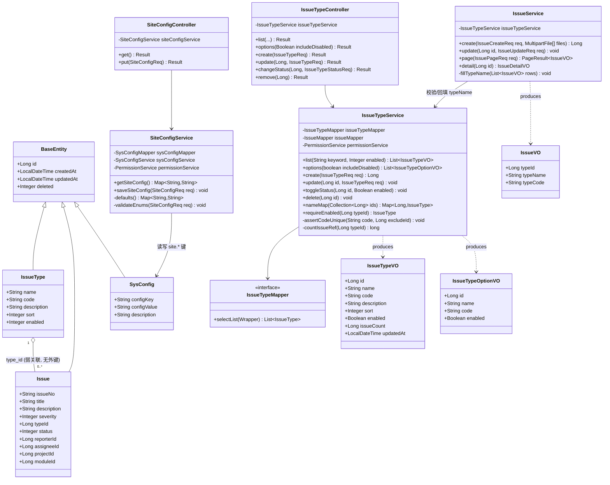
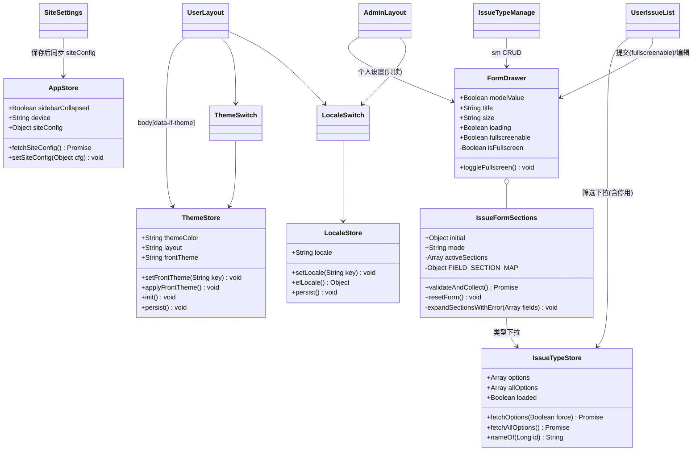
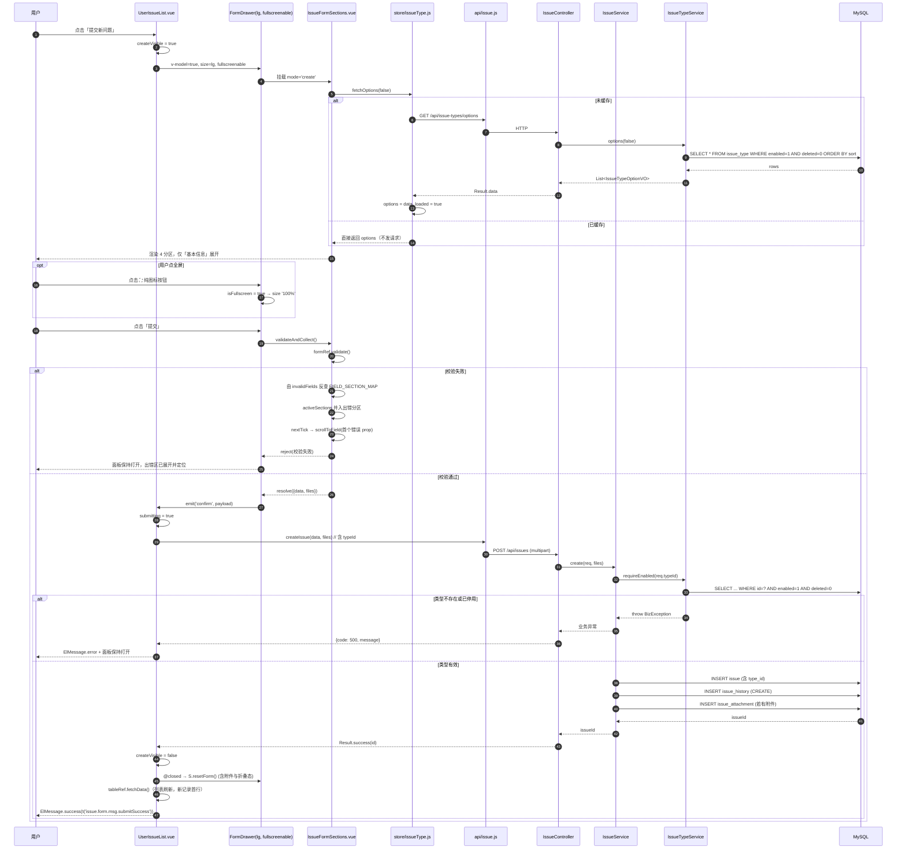
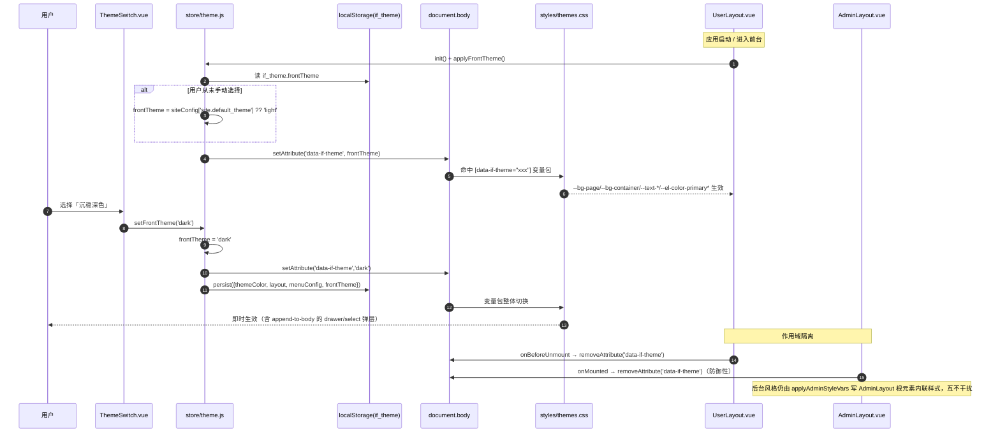
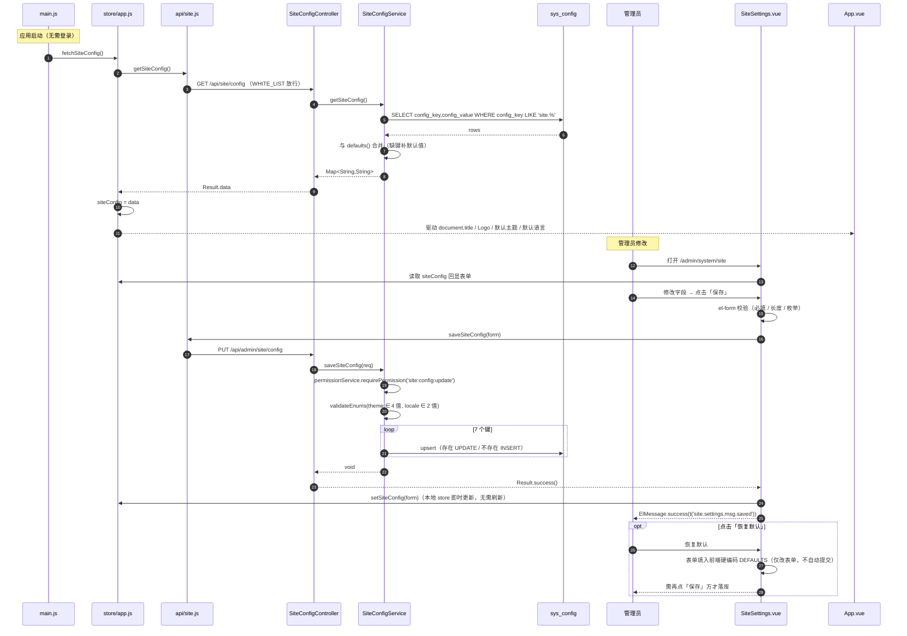

# issueFlow Phase 6 系统架构设计与任务分解（ARCH）

| 项目信息 | 内容 |
| --- | --- |
| 项目名称 | issue_flow |
| 迭代版本 | Phase 6 |
| 架构师 | 高见远 |
| 上游输入 | `docs/PRD_phase6.md`（许清楚 v1.0） |
| 技术栈 | 后端 Spring Boot 3.2 + MyBatis-Plus + MySQL 8 + Redis 7 + JWT；前端 Vue 3 + Element Plus + Pinia + Vue Router + Axios + ECharts + Vite |
| 迁移脚本 | `scripts/V20260803_issueflow_phase6.sql` |
| 文档定位 | 只做设计与任务分解，不含实现代码 |

> **用户已拍板的 4 个关键决策（本文档全程遵循，不再讨论）**
>
> - **Q4 = 全站一次性全量 i18n**：前台全部页面 + 后台所有存量页面（Phase 1-5）均需中英文资源。
> - **Q5 = 后台菜单保持「问题管理」不变**，同级平铺新增「问题类型」（**兄弟菜单**，不做分组容器升级）。
> - **Q2 = 4 套主题**：light / dark / blue / green，每套完整 CSS 变量包。
> - **Q6 = 停用类型**：筛选下拉可选并追加「(已停用)」标记；新建/编辑表单下拉仅显示启用项。

---

## 一、实现方案与框架选型

### 1.1 本期五个技术难点与对策

| # | 难点 | 风险 | 对策 |
| --- | --- | --- | --- |
| D1 | **全站 i18n 从 0 搭建**，涉及 20+ 页面、30+ 组件，工作量最大且最容易漏 | 漏改导致中英混排；一次性大改易引入回归 | 引入 `vue-i18n@9`（`legacy:false` Composition 模式）；locales **按业务模块拆 19 个文件**，工程师可按文件分批交付；枚举文案（状态/严重等级/角色/动作）集中在 `utils/format.js`，改造为**接受 t 函数的工厂函数**，一处改动全站生效 |
| D2 | **主题变量作用域隔离**：现有 `applyThemeVars` 直接写 `document.documentElement`，天然污染后台 | 前台切深色导致后台变黑；`append-to-body` 的 drawer/select 弹层逃逸出 UserLayout 子树，拿不到主题变量 | 采用 **`data-if-theme` 属性 + 纯 CSS 变量包**方案，落点为 **`document.body`（非 documentElement）**，由 UserLayout 挂载时写入、卸载时移除，AdminLayout 挂载时防御性移除。body 是所有 teleport 弹层的父节点，既覆盖弹层又天然与后台互斥 |
| D3 | **提交面板分区折叠 + 校验定位**：必填字段可能落在已折叠区 | 用户点提交后「什么都没发生」 | 建立 `字段 prop → 分区 name` 静态映射表；`validate` 失败回调拿到 `invalidFields`，反查需展开的分区 → 追加进 `activeSections` → `nextTick` 后 `scrollToField(firstProp)` |
| D4 | **issue.type_id 存量回填** + 类型删除引用阻断 | 列表出现空白类型；误删造成脏数据 | 迁移脚本按 `code='OTHER'` 反查 id 回填全部 `type_id IS NULL` 的存量行；删除接口先 `COUNT(issue WHERE type_id=? AND deleted=0)`，>0 抛 `BizException` 并把 count 带回前端做 i18n 插值 |
| D5 | **后台侧栏 100vh 吸底**：现状 `LayoutSwitchEntry` 用 `position:fixed` 钉视口左下 | fixed 与折叠宽度、移动端 transform 抽屉不同步 | 改为 **flex 自然吸底**：`.if-sidebar{display:flex;flex-direction:column}` + `.if-layout--admin .if-sidebar{height:100vh}` + `.if-sidebar__menu{flex:1;min-height:0;overflow-y:auto}` + 入口块 `margin-top:auto;flex-shrink:0`。UserLayout 已是 flex column，天然兼容 |

### 1.2 框架与技术选型

| 领域 | 选型 | 理由 |
| --- | --- | --- |
| 国际化 | **vue-i18n@^9.13.1**（`legacy: false`） | Vue3 官方生态标准；Composition API `useI18n()` 与 `<script setup>` 无缝；支持 `fallbackLocale`、`missing` 钩子（满足「缺失 key 回退中文 + 控制台告警」验收） |
| 组件库语言联动 | `el-config-provider` + `element-plus/es/locale/lang/zh-cn`、`.../en` | 官方推荐方式，覆盖分页、日期、上传等内建文案，无需自行翻译 |
| 主题 | **CSS 变量包 + `[data-if-theme]` 属性选择器**（新增 `styles/themes.css`） | 纯 CSS 切换零运行时开销；属性挂 body 天然覆盖 teleport 弹层；与 Phase 5 的 adminStyle（走 `applyAdminStyleVars` 写 AdminLayout 根元素内联样式）**分属两条独立通道**，互不干扰 |
| 主题状态 | 扩展现有 `store/theme.js`，新增 `frontTheme` 字段（复用 `if_theme` localStorage key） | 复用既有持久化结构，避免多个 key 各自为政；旧结构缺 `frontTheme` 时回退默认 |
| 问题类型 | **新建 `issue_type` 表**（而非 sys_config JSON / 枚举硬编码） | 需要 CRUD、启停、排序、引用计数校验；表结构最直接，且与既有 BaseEntity 逻辑删除体系一致 |
| 网站设置 | **复用既有 `sys_config` 表**，键名统一 `site.` 前缀 | 无需新表；`SysConfigService.setConfig` 已是 upsert 语义，直接复用 |
| 表单抽屉 | 扩展现有 `FormDrawer.vue`，新增 `fullscreenable` prop | Phase 5 已沉淀 rtl + sm/md/lg + 移动端满宽，本期只做增量能力，不重写 |
| 架构模式 | 后端 Controller-Service-Mapper 三层；前端 MVVM + Pinia 单向数据流 | 与 Phase 1-5 完全一致，零学习成本 |

### 1.3 架构约束（必须遵守）

1. **主题隔离**：任何主题逻辑**严禁写入 `document.documentElement`**。前台主题落 `document.body[data-if-theme]`；后台风格落 AdminLayout 根元素内联样式（Phase 5 现状，不改）。
2. **i18n 只做 UI 文案**：数据库文案（菜单名 `menu.name`、问题类型名 `issue_type.name`）**本期不做多语言存储**，前端按 `path` / `code` 查映射表翻译，无映射时回退数据库原值。
3. **迁移脚本全幂等**：沿用 Phase 5 写法——建表 `CREATE TABLE IF NOT EXISTS`；加列走 `information_schema` 动态判断；种子 `INSERT ... SELECT ... WHERE NOT EXISTS`；父 id 用派生表子查询解析。
4. **不回归**：Phase 1-5 功能零回归，`/user/submit-issue` 旧链接不得白屏。
5. **部署顺序硬约束**（Phase 5 血泪经验）：`StateMachine` 的 `@PostConstruct` 启动即读 `flow` 表 → **必须先灌 SQL、再重启后端**，顺序颠倒会启动失败。

---

## 二、文件列表（逐文件，标注新增 / 修改）

图例：**[新]** = 新增文件；**[改]** = 修改现有文件。

### 2.1 数据库（1 个新增）

| # | 文件 | 状态 | 内容要点 |
| --- | --- | --- | --- |
| 1 | `scripts/V20260803_issueflow_phase6.sql` | **[新]** | ① `issue_type` 建表 + 6 条种子；② `issue` 加 `type_id` + `idx_issue_type` + 存量回填 OTHER；③ 前台菜单：新增「问题管理」分组、「我的问题」改挂父下、逻辑删除「提交问题」；④ 后台菜单：**同级平铺**新增「问题类型」、系统管理下新增「网站设置」；⑤ **菜单 icon 全量修复**（`Tree` → `Grid`）+ 清理无路由死菜单；⑥ `permission` + `role_permission` 种子（5 个新权限码）；⑦ `sys_config` 的 `site.*` 7 键默认值 |

### 2.2 后端（10 新增 / 9 修改）

| # | 文件（相对 `src/backend/src/main/java/com/issueflow/`） | 状态 | 归属 | 说明 |
| --- | --- | --- | --- | --- |
| 2 | `entity/IssueType.java` | **[新]** | 问题类型 | 继承 `BaseEntity`；`@TableName("issue_type")`；字段 name/code/description/sort/enabled |
| 3 | `mapper/IssueTypeMapper.java` | **[新]** | 问题类型 | `extends BaseMapper<IssueType>` |
| 4 | `service/IssueTypeService.java` | **[新]** | 问题类型 | list/options/create/update/toggleStatus/delete；code 唯一校验；删除前引用计数；`nameMap(ids)` 供 IssueService 批量回填 |
| 5 | `controller/IssueTypeController.java` | **[新]** | 问题类型 | `/api/issue-types` 共 6 个接口 |
| 6 | `dto/req/IssueTypeReq.java` | **[新]** | 问题类型 | name(必填,≤50) / code(必填,≤50) / description(≤200) / sort / enabled |
| 7 | `dto/req/IssueTypeStatusReq.java` | **[新]** | 问题类型 | enabled(Boolean) —— 启停切换入参 |
| 8 | `dto/resp/IssueTypeVO.java` | **[新]** | 问题类型 | id/name/code/description/sort/enabled/issueCount/updatedAt |
| 9 | `dto/resp/IssueTypeOptionVO.java` | **[新]** | 问题类型 | id/name/code/enabled —— 下拉专用轻量结构 |
| 10 | `controller/SiteConfigController.java` | **[新]** | 网站设置 | `GET /api/site/config`（**公开**）+ `PUT /api/admin/site/config`（`site:config:update`） |
| 11 | `service/SiteConfigService.java` | **[新]** | 网站设置 | 读取全部 `site.*` 键为 Map（缺键补默认值）；批量 upsert；枚举值校验 |
| 12 | `dto/req/SiteConfigReq.java` | **[新]** | 网站设置 | 7 个字段 + 枚举/长度约束 |
| 13 | `entity/Issue.java` | **[改]** | 问题 | 新增 `private Long typeId;` |
| 14 | `dto/req/IssueCreateReq.java` | **[改]** | 问题 | 新增 `@NotNull(message="请选择问题类型") private Long typeId;` |
| 15 | `dto/req/IssueUpdateReq.java` | **[改]** | 问题 | 新增 `private Long typeId;`（编辑允许改类型） |
| 16 | `dto/req/IssuePageReq.java` | **[改]** | 问题 | 新增 `private Long typeId;` 筛选条件 |
| 17 | `dto/resp/IssueVO.java` | **[改]** | 问题 | 新增 `typeId` / `typeName` / `typeCode` |
| 18 | `dto/resp/IssueDetailVO.java` | **[改]** | 问题 | 同上 3 字段 |
| 19 | `service/IssueService.java` | **[改]** | 问题 | create 校验 typeId 指向 enabled=1；page 增加 `eq(type_id)`；列表/详情**批量**回填 typeName（仿 `ProjectService.nameMap` 模式，**禁止 N+1**） |
| 20 | `config/SecurityConfig.java` | **[改]** | 安全 | `WHITE_LIST` 追加 `"/api/site/config"`（登录页需读站点名） |
| 21 | `common/Constants.java` | **[改]** | 通用 | 追加 `CFG_SITE_*` 7 个键名常量 + `ISSUE_TYPE_CODE_OTHER = "OTHER"` |

> **注**：i18n 资源**全部放前端静态文件**，后端**不提供**语言包接口，也**不做**后端文案多语言化（业务异常消息保持中文；前端对已知业务码用本地 i18n 文案覆盖展示）。

### 2.3 前端 - 通用基础设施（30 新增 / 6 修改）

| # | 文件（相对 `src/frontend/src/`） | 状态 | 说明 |
| --- | --- | --- | --- |
| 22 | `locales/index.js` | **[新]** | `createI18n` 初始化；`legacy:false`、`fallbackLocale:'zh-CN'`、`missing` 钩子控制台告警；导出 `i18n` / `setLocale()` / `t` |
| 23 | `locales/zh-CN/index.js` | **[新]** | 聚合 19 个模块文件 |
| 24 | `locales/en-US/index.js` | **[新]** | 同上（结构完全镜像） |
| 25 | `locales/{zh-CN,en-US}/common.js` 等 **19 模块 × 2 语言 = 38 文件** | **[新]** | 模块名：`common / enum / menu / layout / login / issue / issueType / dashboard / project / module / org / user / role / menuManage / flow / system / site / theme / locale`；key 清单见 §六 T8 |
| 26 | `styles/themes.css` | **[新]** | 4 套主题完整变量包（`[data-if-theme="light|dark|blue|green"]`） |
| 27 | `store/locale.js` | **[新]** | Pinia：`locale` 状态、`setLocale()`、`elLocale` getter、`if_locale` 持久化 |
| 28 | `store/issueType.js` | **[新]** | 问题类型下拉缓存：`options` / `loaded` / `fetchOptions(force)` / `nameOf(id)`，满足「单页面生命周期内不重复请求」 |
| 29 | `components/LocaleSwitch.vue` | **[新]** | 顶栏语言下拉（地球图标 + 当前语言名 + 打勾） |
| 30 | `components/ThemeSwitch.vue` | **[新]** | 前台顶栏主题下拉（调色板图标 + 色块预览 + 打勾） |
| 31 | `api/issueType.js` | **[新]** | 6 个接口封装 |
| 32 | `api/site.js` | **[新]** | `getSiteConfig()` / `saveSiteConfig(data)` |
| 33 | `utils/i18nEnum.js` | **[新]** | 枚举 i18n 工厂：`useStatusOptions()` / `useSeverityOptions()` / `statusLabelI18n` / `severityLabelI18n` / `roleLabelI18n` / `actionLabelI18n` / `menuLabelI18n(node)` / `issueTypeLabelI18n(row)` |
| 34 | `main.js` | **[改]** | `app.use(i18n)`；引入 `./styles/themes.css`（**必须排在 theme.css 之后**）；启动拉取 `/api/site/config` → `store/app.siteConfig` → 初始化默认语言与默认主题 |
| 35 | `components/FormDrawer.vue` | **[改]** | 新增 `fullscreenable` prop（默认 false）+ 内部 `isFullscreen` + 头部纯图标按钮 + `@closed` 重置全屏态；默认按钮文案改 i18n |
| 36 | `store/theme.js` | **[改]** | 新增 `frontTheme` 状态 + `setFrontTheme(key)` + `applyFrontTheme()`；持久化沿用 `if_theme` |
| 37 | `store/app.js` | **[改]** | 新增 `siteConfig` 状态 + `setSiteConfig()` + `fetchSiteConfig()` |
| 38 | `utils/format.js` | **[改]** | 保留色值/tag 类型映射；文案类常量标 `@deprecated`，由 `utils/i18nEnum.js` 取代；`formatDate` 不变 |
| 39 | `styles/theme.css` | **[改]** | `.if-sidebar` 增加 `display:flex; flex-direction:column`（供 R7 flex 吸底）；`.if-layout--user` 增加 `background: var(--bg-page)`（深色主题下 body 背景兜底） |

### 2.4 前端 - 用户前台（1 新增 / 7 修改）

| # | 文件（相对 `src/frontend/src/`） | 状态 | 说明 |
| --- | --- | --- | --- |
| 40 | `components/IssueFormSections.vue` | **[新]** | **提交/编辑共用的 4 分区折叠表单**（`el-collapse`，非手风琴）。props: `initial` / `mode('create'\|'edit')`；expose: `validateAndCollect()` / `resetForm()`；内含「字段 prop → 分区 name」映射与校验展开定位逻辑 |
| 41 | `views/user/UserIssueList.vue` | **[改]** | ①「提交新问题」不再 `router.push`，改开 `FormDrawer`(lg + `fullscreenable`)；② 编辑 `el-dialog` → `FormDrawer`(lg)；③ 筛选区新增类型下拉（停用项带「(已停用)」）；④ 全量 i18n |
| 42 | `components/IssueForm.vue` | **[改]** | 改为**薄封装**：内部渲染 `IssueFormSections`，对外保持 `@submit` / `@cancel` 契约不变；移除内部提交/重置按钮（交由 FormDrawer footer 驱动） |
| 43 | `components/IssueTable.vue` | **[改]** | 新增「类型」列；表头/操作/空态全量 i18n |
| 44 | `components/IssueDetailDrawer.vue` | **[改]** | 详情新增「类型」展示项；全量 i18n |
| 45 | `views/user/IssueCreate.vue` | **[改]** | 不再作为菜单/路由入口（路由直接 redirect）；文件保留以备回滚，标注 `@deprecated` |
| 46 | `layouts/UserLayout.vue` | **[改]** | 顶栏新增 `<LocaleSwitch/>` + `<ThemeSwitch/>`；`onMounted` 写 `body[data-if-theme]`、`onBeforeUnmount` 移除；Logo 文案读 `siteConfig['site.name'] / ['site.short_name']`；全量 i18n |
| 47 | `router/routes.js` | **[改]** | `/user/submit-issue` 改 `redirect: '/user/my-issues'`；新增 `/admin/issue-types`、`/admin/system/site`；全部 `meta.title` 改为 **i18n key** |

### 2.5 前端 - 管理后台（2 新增 / 15 修改）

| # | 文件（相对 `src/frontend/src/`） | 状态 | 说明 |
| --- | --- | --- | --- |
| 48 | `views/admin/IssueTypeManage.vue` | **[新]** | 问题类型管理页：表格（名称/编码/描述/排序/状态开关/更新时间/操作）+ 右上「新增类型」+ `FormDrawer`(sm) CRUD + 删除引用阻断提示 |
| 49 | `views/admin/SiteSettings.vue` | **[新]** | 网站设置页：3 分组单列表单（基础信息 / 外观默认值 / 页脚信息）+「保存」「恢复默认」 |
| 50 | `layouts/AdminLayout.vue` | **[改]** | ①「个人设置」`el-dialog` → `FormDrawer`(sm，只读，footer 仅「关闭」)；② 侧栏 100vh + flex 吸底；③ 顶栏新增 `<LocaleSwitch/>`；④ `onMounted` 防御性移除 `body[data-if-theme]`；⑤ Logo 读 siteConfig；⑥ 全量 i18n |
| 51 | `components/LayoutSwitchEntry.vue` | **[改]** | `variant="sidebar"` 由 `position:fixed` → `position:static; margin-top:auto; flex-shrink:0`；顶部加 `border-top:1px solid rgba(255,255,255,.08)`；文案 i18n |
| 52 | `styles/admin-style.css` | **[改]** | 新增 `.if-layout--admin .if-sidebar{height:100vh;min-height:100vh}`、`.if-sidebar__menu{flex:1;min-height:0;overflow-y:auto}` |
| 53 | `views/admin/AdminIssueList.vue` | **[改]** | 编辑 `el-dialog` → `FormDrawer`(lg)；筛选区新增类型下拉（含停用标记）；全量 i18n |
| 54 | `components/StatusFlowButtons.vue` | **[改]** | 「填写备注」`el-dialog` → `FormDrawer`(sm)；全量 i18n |
| 55 | `views/admin/Dashboard.vue` | **[改]** | 全量 i18n |
| 56 | `views/admin/ProjectManage.vue` | **[改]** | 全量 i18n |
| 57 | `views/admin/ModuleManage.vue` | **[改]** | 全量 i18n（菜单图标修复在 SQL 侧） |
| 58 | `views/admin/OrganizationManage.vue` | **[改]** | 全量 i18n |
| 59 | `views/admin/UserManage.vue` | **[改]** | 全量 i18n |
| 60 | `views/admin/RoleManage.vue` | **[改]** | 全量 i18n |
| 61 | `views/admin/MenuManage.vue` | **[改]** | 全量 i18n |
| 62 | `views/admin/FlowConfig.vue` | **[改]** | 全量 i18n |
| 63 | `views/admin/FlowMonitor.vue` | **[改]** | 全量 i18n |
| 64 | `views/admin/SystemSettings.vue` | **[改]** | 全量 i18n |

### 2.6 前端 - 公共页面 / 组件（i18n 波及，14 修改）

| # | 文件（相对 `src/frontend/src/`） | 状态 | 说明 |
| --- | --- | --- | --- |
| 65 | `App.vue` | **[改]** | 外层包 `<el-config-provider :locale="elLocale">`；`watch` 语言变化同步 `document.title` |
| 66 | `views/Login.vue` | **[改]** | i18n；标题/副标题/版权/备案号读 siteConfig；页内语言切换入口 |
| 67 | `views/error/Forbidden.vue` | **[改]** | i18n |
| 68 | `views/error/NotFound.vue` | **[改]** | i18n |
| 69 | `components/SideMenu.vue` | **[改]** | 菜单名走 `menuLabelI18n(node)`（按 path 查 `menu.*`，无映射回退 `node.name`） |
| 70 | `components/AttachmentUploader.vue` | **[改]** | i18n |
| 71 | `components/AdminStyleDrawer.vue` | **[改]** | i18n |
| 72 | `components/DataResetDrawer.vue` | **[改]** | i18n |
| 73 | `components/DashboardFilters.vue` | **[改]** | i18n + 枚举改用 `useStatusOptions()` |
| 74 | `components/IssueRelationPanel.vue` | **[改]** | i18n |
| 75 | `components/StatusTimeline.vue` | **[改]** | i18n + `actionLabelI18n` |
| 76 | `components/ModuleTreePanel.vue` | **[改]** | i18n |
| 77 | `components/ModuleTreeDrawer.vue` | **[改]** | i18n |
| 78 | `components/charts/TrendChart.vue`、`components/charts/DistributionChart.vue` | **[改]** | i18n（图例 / 坐标轴 / tooltip / 空态） |

### 2.7 文档（3 个）

| # | 文件 | 状态 |
| --- | --- | --- |
| 79 | `docs/ARCH_phase6.md` | **[新]** 本文档 |
| 80 | `docs/class-diagram.mermaid` | **[新]** 类图抽取 |
| 81 | `docs/sequence-diagram.mermaid` | **[新]** 时序图抽取 |

**文件规模合计**：约 **119 个文件**（新增 ~46，其中 38 个为 i18n 资源；修改 ~73）。

---

## 三、数据结构与接口设计

### 3.1 新表 `issue_type`

| 字段 | 类型 | 约束 | 说明 |
| --- | --- | --- | --- |
| `id` | BIGINT | PK AUTO_INCREMENT | 主键 |
| `name` | VARCHAR(50) | NOT NULL | 类型名称 |
| `code` | VARCHAR(50) | NOT NULL（唯一性由 `code_active` 承担） | 类型编码，供程序判断与 i18n key 拼接 |
| `description` | VARCHAR(200) | NULL | 描述 |
| `sort` | INT | NOT NULL DEFAULT 0 | 升序展示 |
| `enabled` | TINYINT | NOT NULL DEFAULT 1 | 1 启用 / 0 停用 |
| `created_at` | DATETIME | NULL | BaseEntity |
| `updated_at` | DATETIME | NULL | BaseEntity |
| `deleted` | TINYINT | NOT NULL DEFAULT 0 | 逻辑删除 |
| `code_active` | VARCHAR(50) | GENERATED ALWAYS AS (`IF(deleted=0, code, NULL)`) VIRTUAL，UNIQUE(`uk_issue_type_code`) | 条件唯一辅助列，仅供唯一索引使用；Java 实体不映射该列 |

索引：`PRIMARY(id)`、`UNIQUE uk_issue_type_code(code_active)`、`KEY idx_issue_type_sort(sort)`。

> **注意（2026-08-03 修订，勿回退）**：`code` 唯一性用**生成列 + 条件唯一索引**实现。唯一索引忽略 NULL，故「存活行同 code 至多一条 + 墓碑行任意多条」，与 Service 的 `assertCodeUnique`（只查 `deleted=0`）语义完全一致，且软删后可复用同一 code。
>
> **两个已被否决的写法**：
> 1. ~~`uk_issue_type_code(code, deleted)`~~ —— MyBatis-Plus 逻辑删除把 `deleteById` 翻译成 `UPDATE SET deleted=1`，索引元组由 `(code,0)` 变 `(code,1)`，撞既有墓碑 → `DELETE /api/issue-types/{id}` 返回 500（Phase 6 线上实际故障，修复见 `scripts/V20260803b_fix_issuetype_unique.sql`）。
> 2. ~~`uk_issue_type_code(code)`~~ 单列 —— 墓碑行对 Java 不可见、对 DB 可见，只是把 500 从 delete 迁移到「软删后同 code 新建」，且需改 Java 才能兜住。

### 3.2 `issue` 表增量

```
ALTER TABLE issue ADD COLUMN type_id BIGINT DEFAULT NULL COMMENT '问题类型 issue_type.id' AFTER severity;
ALTER TABLE issue ADD KEY idx_issue_type (type_id);
UPDATE issue SET type_id = (SELECT id FROM issue_type WHERE code='OTHER' AND deleted=0) WHERE type_id IS NULL;
```

- 允许为 NULL（兼容历史 + 类型被删场景），但**新建接口强制必填**。
- 关系：`IssueType 1 ── N Issue`（弱关联，逻辑删除下**不建外键**，与项目既有约定一致）。

### 3.3 `sys_config` 网站设置 7 键

| config_key | 类型 | 默认值 | 校验 |
| --- | --- | --- | --- |
| `site.name` | 文本 | `issueFlow` | 必填，≤50 |
| `site.short_name` | 文本 | `IF` | 必填，≤8 |
| `site.subtitle` | 文本 | `问题跟踪与流程管理平台` | 选填，≤100 |
| `site.default_theme` | 枚举 | `light` | ∈ {light,dark,blue,green} |
| `site.default_locale` | 枚举 | `zh-CN` | ∈ {zh-CN,en-US} |
| `site.copyright` | 文本 | `(c) 2026 issueFlow` | 选填，≤100 |
| `site.icp` | 文本 | 空 | 选填，≤50 |

### 3.4 接口清单

#### 问题类型 `/api/issue-types`

| 方法 | 路径 | 权限码 | 入参 | 出参 |
| --- | --- | --- | --- | --- |
| GET | `/api/issue-types` | `issue:type:list` | `keyword?`、`enabled?` | `Result<List<IssueTypeVO>>`（含停用项，按 sort 升序；带 `issueCount`） |
| GET | `/api/issue-types/options` | 登录即可 | `includeDisabled?=false` | `Result<List<IssueTypeOptionVO>>`（默认仅 enabled=1；筛选场景传 true 拿全量） |
| POST | `/api/issue-types` | `issue:type:create` | `IssueTypeReq` | `Result<Long>` |
| PUT | `/api/issue-types/{id}` | `issue:type:update` | `IssueTypeReq` | `Result<Void>` |
| PUT | `/api/issue-types/{id}/status` | `issue:type:update` | `IssueTypeStatusReq` | `Result<Void>` |
| DELETE | `/api/issue-types/{id}` | `issue:type:delete` | - | `Result<Void>`；被引用时抛 `BizException(ResultCode.BUSINESS_ERROR, "该类型下存在 N 个问题，无法删除，可改为停用")` |

> **Q6 落地要点**：`/options?includeDisabled=true` 是筛选下拉的数据源，返回项带 `enabled` 布尔；**「(已停用)」后缀由前端拼接**（因为要跟随 i18n 语言），后端不拼中文。

#### 网站设置

| 方法 | 路径 | 权限 | 说明 |
| --- | --- | --- | --- |
| GET | `/api/site/config` | **公开**（加入 `SecurityConfig.WHITE_LIST`） | 返回全部 `site.*` 的 `Map<String,String>`，缺键用默认值补齐 |
| PUT | `/api/admin/site/config` | `site:config:update` | 批量 upsert，全部 7 键一次提交 |

#### 既有接口增量

| 接口 | 增量 |
| --- | --- |
| `POST /api/issues` | 请求体新增 `typeId`（必填） |
| `PUT /api/issues/{id}` | 请求体新增 `typeId`（选填） |
| `GET /api/issues`（分页） | query 新增 `typeId` 筛选 |
| `GET /api/issues/{id}` | 响应新增 `typeId` / `typeName` / `typeCode` |

#### 新增权限码（写入 `permission` 表并授予 ADMIN）

`issue:type:list`、`issue:type:create`、`issue:type:update`、`issue:type:delete`、`site:config:update`

### 3.5 类图



### 3.6 前端核心结构类图



---

## 四、程序调用流程（时序图）

### 4.1 提交新问题（分区校验 → 展开出错区 → 创建）



### 4.2 前台主题切换（store → body[data-if-theme] → CSS 变量）



### 4.3 网站设置读写



### 4.4 问题类型下拉加载与「(已停用)」标记

```mermaid
sequenceDiagram
    autonumber
    participant F as 表单下拉(IssueFormSections)
    participant Q as 筛选下拉(UserIssueList/AdminIssueList)
    participant TS as store/issueType.js
    participant API as api/issueType.js
    participant SV as IssueTypeService
    participant DB as issue_type

    Note over F: 场景 A —— 新建/编辑表单（仅启用项）
    F->>TS: fetchOptions()
    alt loaded == false
        TS->>API: GET /api/issue-types/options
        API->>SV: options(includeDisabled=false)
        SV->>DB: WHERE enabled=1 AND deleted=0 ORDER BY sort ASC
        DB-->>SV: rows
        SV-->>TS: [{id,name,code,enabled:true}]
        TS->>TS: options = rows; loaded = true
    else loaded == true
        TS-->>F: 命中缓存，0 请求
    end
    F-->>F: 渲染 label = t('issueType.value.'+code, name)

    Note over Q: 场景 B —— 筛选下拉（含停用，Q6）
    Q->>TS: fetchAllOptions()
    TS->>API: GET /api/issue-types/options?includeDisabled=true
    API->>SV: options(true)
    SV->>DB: WHERE deleted=0 ORDER BY sort ASC
    DB-->>SV: rows（含 enabled=0）
    SV-->>TS: [{id,name,code,enabled}]
    TS->>TS: allOptions = rows
    Q->>Q: label = enabled ? base : base + ' ' + t('issueType.suffix.disabled')
    Note right of Q: 中文 →「界面样式 (已停用)」<br/>英文 →「UI / Style (Disabled)」<br/>后缀由前端拼接，随语言变化

    Note over F,Q: 场景 C —— 类型 CRUD 后
    F->>TS: invalidate()（IssueTypeManage 保存/启停/删除成功后调用）
    TS->>TS: loaded = false，下次访问重新拉取
```

### 4.5 后台弹窗 → 抽屉改造后的通用交互（以 AdminIssueList 编辑为例）

```mermaid
sequenceDiagram
    autonumber
    participant A as 管理员
    participant V as AdminIssueList.vue
    participant D as FormDrawer(lg)
    participant S as IssueFormSections(mode=edit)
    participant API as api/issue.js

    A->>V: 点击行「编辑」
    V->>V: editRow = row; editVisible = true
    V->>D: v-model=true, title=t('issue.form.title.edit'), size=lg
    D->>S: :initial="editRow" :mode="'edit'"
    S->>S: 4 分区**全部默认展开**（编辑场景便于核对）
    S-->>A: 回显（含 typeId）
    A->>D: 点击「保存」
    D->>S: validateAndCollect()
    S-->>D: {data}
    D->>V: emit('confirm')
    V->>API: updateIssue(id, data)
    API-->>V: Result.success()
    V->>V: editVisible = false
    V->>D: @closed → resetForm()（无残留）
    V->>V: 列表刷新
    V-->>A: ElMessage.success(t('common.msg.saveSuccess'))
```

---

## 五、依赖包列表

### 前端（`src/frontend/package.json`）

| 包 | 版本 | 用途 | 备注 |
| --- | --- | --- | --- |
| `vue-i18n` | `^9.13.1` | 国际化 | **本期唯一新增依赖** |

**复用既有**：`vue@^3.4.27`、`vue-router@^4.3.2`、`pinia@^2.1.7`、`element-plus@^2.7.3`（自带 `element-plus/es/locale/lang/zh-cn` 与 `.../en`，**无需额外装包**）、`@element-plus/icons-vue@^2.3.1`（`FullScreen`/`Aim`/`Grid`/`CollectionTag`/`Monitor` 均已内置）、`axios`、`echarts`、`file-saver`。

> 安装：`cd src/frontend && npm i vue-i18n@^9.13.1`（构建脚本 `scripts/build.sh` 无需改动）。

### 后端

**无新增依赖。** `spring-boot-starter-validation`、`mybatis-plus-boot-starter`、`lombok` 均已在用。

---

## 六、任务列表（核心交付）

> 依赖原则：**T0 / T1 是全局前置**；T2 依赖 T1（表要先在）；T3-T7 尽量只依赖 T0/T1/T2，可并行；T8 依赖 T0，且各子任务 T8.x 相互独立可并行；T9 最后收口。

### 总览

| ID | 任务 | 优先级 | 依赖 | 规模 |
| --- | --- | --- | --- | --- |
| T0 | 国际化与主题基础设施搭建 | P0 | — | 中 |
| T1 | 数据库迁移脚本 + 菜单/icon 修复 + 存量回填 | P0 | — | 中 |
| T2 | 后端：问题类型 CRUD + Issue.typeId + 网站设置接口 | P0 | T1 | 大 |
| T3 | 前台导航调整（移除提交问题 / 新增问题管理父菜单） | P0 | T1 | 小 |
| T4 | 提交面板重构（FormDrawer 全屏 + 4 分区折叠 + 校验定位） | P0 | T0, T2 | 大 |
| T5 | 前台主题切换（4 套变量 + 入口 + 持久化 + 隔离） | P1 | T0 | 中 |
| T6 | 后台问题类型管理页 + 网站设置页 | P0 | T0, T2 | 中 |
| T7 | 全量弹窗→抽屉（5 处）+ 后台侧栏 100vh 吸底 | P0 | T0 | 中 |
| T8 | 全站 i18n 资源补全（9 个子批次） | P0 | T0 | **特大** |
| T9 | 全局一致性审查与冒烟自检 | P0 | T1-T8 | 中 |

---

### T0 — 国际化与主题基础设施搭建

**优先级** P0　**依赖** 无　**必须最先做**（后续所有页面改造都要用）

**涉及文件**

- 新增：`locales/index.js`、`locales/zh-CN/index.js`、`locales/en-US/index.js`、`locales/{zh-CN,en-US}/common.js`、`locales/{zh-CN,en-US}/enum.js`、`locales/{zh-CN,en-US}/locale.js`、`locales/{zh-CN,en-US}/theme.js`
- 新增：`store/locale.js`、`store/issueType.js`、`utils/i18nEnum.js`、`components/LocaleSwitch.vue`、`api/site.js`
- 新增：`styles/themes.css`（骨架，4 套变量由 T5 填满）
- 修改：`package.json`（加 vue-i18n）、`main.js`、`App.vue`、`store/theme.js`、`store/app.js`、`components/FormDrawer.vue`、`utils/format.js`

**实现要点**

1. `createI18n({ legacy:false, globalInjection:true, locale, fallbackLocale:'zh-CN', messages, missing(locale,key){ console.warn('[i18n] missing key:', locale, key) } })`。
2. 初始语言优先级：`localStorage.if_locale` → `siteConfig['site.default_locale']` → `'zh-CN'`。
3. `App.vue` 用 `<el-config-provider :locale="elLocale">` 包裹全部内容；`watch(locale)` 时更新 `document.title`。
4. **`FormDrawer` 新增 `fullscreenable`**：见 §七 共享知识的 API 契约。
5. `utils/i18nEnum.js` 提供枚举工厂，替换 `format.js` 中的中文常量（`format.js` 保留色值映射不动）。
6. `store/app.fetchSiteConfig()` 在 `main.js` 中**先于 mount 调用**（`await`），保证登录页首屏就有站点名。失败时静默降级到前端默认值，**不得阻塞挂载**。

**验收标准**

- [ ] `npm run build` 通过，无 vue-i18n 相关告警。
- [ ] 控制台执行 `useLocaleStore().setLocale('en-US')` 后，Element Plus 分页器文案变为英文（证明 `el-config-provider` 联动成功）。
- [ ] 故意访问不存在的 key，控制台输出 `[i18n] missing key: ...` 且页面显示中文回退值。
- [ ] 刷新页面语言保持（`localStorage.if_locale` 生效）。
- [ ] `FormDrawer` 传 `fullscreenable` 后头部出现纯图标按钮（无文字），有 title 提示；不传时**完全不渲染该按钮**（存量 5 处调用零影响）。

---

### T1 — 数据库迁移脚本 + 菜单/icon 修复 + 存量回填

**优先级** P0　**依赖** 无（可与 T0 并行）

**涉及文件**：`scripts/V20260803_issueflow_phase6.sql`（单文件）

**脚本分节（严格按序，全部幂等）**

| 节 | 内容 | 关键写法 |
| --- | --- | --- |
| 1 | `issue_type` 建表 | `CREATE TABLE IF NOT EXISTS`；唯一索引必须为 `uk_issue_type_code(code_active)`（生成列 `code_active = IF(deleted=0, code, NULL)`）。**禁止用 `(code, deleted)` 复合唯一**，见 §3.1 注意事项 |
| 2 | 6 条类型种子 | `INSERT ... SELECT ... WHERE NOT EXISTS (SELECT 1 FROM issue_type WHERE code='BUG')`，逐条 |
| 3 | `issue` 加 `type_id` | `information_schema.COLUMNS` 判断 + `PREPARE/EXECUTE`（照抄 Phase5 写法） |
| 4 | `issue` 加索引 `idx_issue_type` | `information_schema.STATISTICS` 判断 |
| 5 | **存量回填** | `UPDATE issue SET type_id=(SELECT id FROM issue_type WHERE code='OTHER' AND deleted=0) WHERE type_id IS NULL` |
| 6 | 前台菜单：新增「问题管理」分组 | `path='/user/issue'`, `parent_id=0`, `sort=2`, `icon='Tickets'`, `type=1`, `permission=NULL` |
| 7 | 前台菜单：「我的问题」改挂父下 | 派生表子查询解析 `/user/issue` 的 id；`sort=1`；`icon` 由 `Tickets` 改 `Document`（避免与父同图标） |
| 8 | 前台菜单：移除「提交问题」 | `UPDATE menu SET deleted=1 WHERE path='/user/submit-issue' AND type=1` |
| 9 | 前台菜单：「个人看板」sort 调整 | `sort=3`（原 4） |
| 10 | **后台菜单：新增「问题类型」（Q5 平铺）** | `path='/admin/issue-types'`, **`parent_id=0`**, `sort=3`, `icon='CollectionTag'`, `permission='issue:type:list'`, `type=2`；同时把「项目管理」组 sort 3→4、「流程管理」4→5、「系统管理」5→6，避免 sort 冲突 |
| 11 | 后台菜单：系统管理 → 新增「网站设置」 | `path='/admin/system/site'`, 父=`/admin/system`, `sort=5`, `icon='Monitor'`, `permission='site:config:update'`；同时把既有「系统设置」`/admin/system/settings` 的 sort 由 5 改 6 |
| 12 | **菜单 icon 全量合法性修复** | 见下表 |
| 13 | 权限种子 | 5 个新权限码 insert + 授 ADMIN（照抄 Phase5 `role_permission` 写法） |
| 14 | `sys_config` 的 `site.*` 7 键默认值 | `INSERT ... WHERE NOT EXISTS`，**已存在则不覆盖**（避免二次执行冲掉管理员配置） |

**菜单 icon 全量排查结论（已逐条比对 `@element-plus/icons-vue` 组件名）**

| 菜单 | path | 现 icon | 合法性 | 处置 |
| --- | --- | --- | --- | --- |
| 工作台 | `/user` | `HomeFilled` | ✅ | 保持 |
| 我的问题 | `/user/my-issues` | `Tickets` | ✅ | 改 `Document`（父节点占用 Tickets） |
| 提交问题 | `/user/submit-issue` | `EditPen` | ✅ | 记录逻辑删除 |
| 个人看板 | `/user/stats` | `DataLine` | ✅ | 保持 |
| 概览 | `/admin/index` | `DataLine` | ✅ | 保持 |
| 问题管理 | `/admin/issues` | `Tickets` | ✅ | 保持（Q5：页面不变） |
| 项目管理(组) | `/admin/project` | `Management` | ✅ | 保持 |
| 项目配置 | `/admin/projects` | `Folder` | ✅ | 保持 |
| **模块配置** | `/admin/modules` | **`Tree`** | ❌ **不存在** | **`UPDATE` → `Grid`（R8 核心修复）** |
| 流程监控 | `/admin/flow-monitor` | `Switch` | ✅ | 保持 |
| 流程管理(组) | `/admin/flow` | `Operation` | ✅ | 保持 |
| 流程配置 | `/admin/flow-config` | `Tools` | ✅ | 保持 |
| 系统管理 | `/admin/system` | `Setting` | ✅ | 保持 |
| 用户管理 | `/admin/system/users` | `User` | ✅ | 保持 |
| 组织管理 | `/admin/system/organizations` | `OfficeBuilding` | ✅ | 保持 |
| 菜单管理 | `/admin/system/menus` | `Grid` | ✅ | 保持 |
| 角色管理 | `/admin/system/roles` | `UserFilled` | ✅ | 保持 |
| 系统设置 | `/admin/system/settings` | `Setting` | ✅ | 保持 |
| **系统设置(僵尸)** | **`/admin/settings`** | `Brush` | ⚠️ **无对应路由** | **`UPDATE menu SET deleted=1`**（Phase2 遗留死菜单，点击必然 404） |

> **兜底防御**：除脚本修复外，`SideMenu.vue` 应加一层保护——`<component :is>` 前判断该图标名是否存在于全局组件注册表，不存在时回退 `Grid` 并 `console.warn`，杜绝将来再出现空白图标（放在 T7 实施）。

**验收标准**

- [ ] 脚本**连续执行两次**无报错、无重复数据（幂等）。
- [ ] `SELECT COUNT(*) FROM issue WHERE type_id IS NULL` = 0。
- [ ] `SELECT * FROM issue_type` 返回 6 行，`code` 分别为 BUG/FEATURE/PERFORMANCE/UI/QUESTION/OTHER。
- [ ] `SELECT path,icon FROM menu WHERE icon='Tree'` 返回 0 行。
- [ ] 前台菜单树查询结果为：工作台 / 问题管理(含子项 我的问题) / 个人看板，共 3 个一级。
- [ ] 后台一级菜单包含**平铺的**「问题类型」（`parent_id=0`），且「问题管理」`/admin/issues` **保持原样未被改成分组**。
- [ ] `SELECT * FROM sys_config WHERE config_key LIKE 'site.%'` 返回 7 行。
- [ ] `permission` 表含 5 个新码，且均已在 `role_permission` 中关联 ADMIN。

---

### T2 — 后端：问题类型 CRUD + Issue.typeId + 网站设置接口

**优先级** P0　**依赖** T1（表结构须先在）

**涉及文件**：§2.2 全部 21 项（10 新增 + 9 修改 + Constants/SecurityConfig）

**实现要点**

1. **`IssueTypeService.delete(id)`**：先 `countIssueRef(id)`；`>0` 时抛 `BizException`，message 携带数量，前端用 `issueType.msg.deleteInUse` 做 i18n 插值覆盖展示。`=0` 时逻辑删除。
2. **`IssueTypeService.options(includeDisabled)`**：`includeDisabled=false`（默认）只返 `enabled=1`；`true` 返全量（含停用），**不拼中文后缀**，把 `enabled` 布尔透传给前端。
3. **code 唯一校验**：`assertCodeUnique(code, excludeId)`，只在 `deleted=0` 范围内查，命中抛 `issueType.msg.codeDuplicated` 对应业务异常。
4. **`IssueService.fillTypeName`**：列表分页后收集 `typeId` 去重 → 一次 `selectBatchIds` → 构建 `Map<Long, IssueType>` → 回填 `typeName` / `typeCode`。**严禁循环单查（N+1）**，参照既有 `ProjectService.nameMap` / `ModuleService.pathMap` 写法。
5. **`IssueService.create`**：`issueTypeService.requireEnabled(req.getTypeId())`，类型不存在/停用/已删均抛业务异常。
6. **`IssueService.update`**：`typeId` 非空时同样校验；为空则保持原值不变。
7. **`SiteConfigService.getSiteConfig`**：读 `config_key LIKE 'site.%'`，与 `defaults()` 做 merge（DB 优先，缺键补默认），**保证永远返回 7 个键**。
8. **`SecurityConfig`**：`WHITE_LIST` 追加 `"/api/site/config"`。注意 `PUT /api/admin/site/config` 走**另一个路径前缀**，不会被白名单误放行。
9. 权限校验统一走既有 `permissionService.requirePermission(code)`，与 Phase 1-5 一致。

**验收标准**

- [ ] Knife4j (`/doc.html`) 中出现 `issue-type-controller`（6 接口）与 `site-config-controller`（2 接口）。
- [ ] `GET /api/issue-types/options` 不带参 → 只返 enabled=1；带 `?includeDisabled=true` → 返全量含停用项。
- [ ] 停用「界面样式」后，`options` 默认调用不再返回它；但已有该类型的问题详情**仍正确显示名称**。
- [ ] 删除被引用的类型 → 返回业务错误且 message 含具体数量；DB 中该行 `deleted` 仍为 0。
- [ ] 删除未被引用的类型 → 成功，`deleted=1`。
- [ ] 创建问题不传 `typeId` → 400 校验失败「请选择问题类型」。
- [ ] 创建问题传已停用类型 id → 业务错误。
- [ ] `GET /api/issues` 列表每行含 `typeId`/`typeName`/`typeCode`；加 `?typeId=x` 能正确过滤。
- [ ] **未登录**直接 `curl GET /api/site/config` 返回 200 + 7 键（白名单生效）。
- [ ] 非 ADMIN 调 `PUT /api/admin/site/config` → 403。
- [ ] 100 条问题的列表接口，SQL 日志中 `issue_type` 查询**只出现 1 次**（无 N+1）。

---

### T3 — 前台导航调整

**优先级** P0　**依赖** T1

**涉及文件**：`router/routes.js`、`components/SideMenu.vue`

**实现要点**

1. `/user/submit-issue` 路由改为 `{ path: 'user/submit-issue', redirect: '/user/my-issues' }`（**保留 path 兼容旧书签**，移除 component 引用）。
2. `SideMenu.vue` 的 `resolveIndex(node)` 已支持无 path 分组节点走 `menu-{id}`；但本设计中「问题管理」**有 path `/user/issue` 但无路由**。若直接给 `el-sub-menu` 的 index 用该 path，`router` 模式下点击父节点标题不会跳转（`el-sub-menu` 标题只做展开，不触发路由），**安全**。仍需确认：`activeMenu = route.path` 为 `/user/my-issues` 时，Element Plus 能自动展开父级并高亮子项——这是 `el-menu` 原生能力，无需额外代码。
3. 若实测父节点被误当作可跳转项，则改为 SQL 侧把 `/user/issue` 的 path 置 NULL，让 `resolveIndex` 走 `menu-{id}` 分支。**此为备选方案，优先走 path 方案。**

**验收标准**

- [ ] 前台侧栏不再出现「提交问题」。
- [ ] 前台侧栏出现可展开的「问题管理」（带 Tickets 图标），展开后显示「我的问题」。
- [ ] 点击「我的问题」→ 进入 `/user/my-issues`，父节点保持展开、子项高亮。
- [ ] 直接在地址栏输入 `/user/submit-issue` → 自动重定向到 `/user/my-issues`，无白屏无报错。
- [ ] 刷新 `/user/my-issues` 页面，父菜单仍自动展开。

---

### T4 — 提交面板重构（全屏抽屉 + 4 分区折叠 + 校验定位）

**优先级** P0　**依赖** T0（FormDrawer 增强）、T2（类型接口）

**涉及文件**：`components/IssueFormSections.vue`【新】、`components/IssueForm.vue`、`views/user/UserIssueList.vue`

**分区与字段映射（工程师直接照建 `FIELD_SECTION_MAP`）**

| 分区 name | i18n key | create 默认 | edit 默认 | 字段（prop） |
| --- | --- | --- | --- | --- |
| `basic` | `issue.form.section.basic` | **展开** | 展开 | `title`*, `typeId`*, `severity`*, `description`* |
| `category` | `issue.form.section.category` | 折叠 | 展开 | `projectId`, `moduleId`, `tags` |
| `material` | `issue.form.section.material` | 折叠 | 展开 | `reproduceSteps`, `attachments` |
| `env` | `issue.form.section.env` | 折叠 | 展开 | `envOs`, `envBrowser`, `envAppVersion`, `envDevice` |

```
const FIELD_SECTION_MAP = {
  title:'basic', typeId:'basic', severity:'basic', description:'basic',
  projectId:'category', moduleId:'category', tags:'category',
  reproduceSteps:'material', attachments:'material',
  envOs:'env', envBrowser:'env', envAppVersion:'env', envDevice:'env'
}
```

**校验定位算法**

```
validate((valid, invalidFields) => {
  if (valid) return resolve(collect())
  const needSections = [...new Set(Object.keys(invalidFields).map(p => FIELD_SECTION_MAP[p]).filter(Boolean))]
  activeSections.value = [...new Set([...activeSections.value, ...needSections])]
  nextTick(() => formRef.value.scrollToField(Object.keys(invalidFields)[0]))
  reject()
})
```

**其他要点**

- `el-collapse` **不开手风琴**（允许多区同展开）。
- 全屏按钮由 `FormDrawer` 提供（`fullscreenable`），`IssueFormSections` 不感知全屏状态。
- 关闭面板时 `@closed` → `resetForm()`：清空 model + `uploaderRef.clear()` + `activeSections` 复位为初始值。
- 提交按钮 loading 由父级 `UserIssueList` 通过 `FormDrawer :loading` 控制，防重复点击。
- 「问题类型」下拉数据源 = `store/issueType.fetchOptions()`（仅启用项）；**编辑场景若原类型已停用**，需把该项临时补入 options 以保证回显不为空（否则显示空白），并置灰不可再选中其他停用项。

**验收标准**

- [ ] 「我的问题」点「提交新问题」→ **URL 不变**，右侧滑出 800px 面板。
- [ ] 面板头部有纯图标全屏按钮（**无文字**），hover 显示 tooltip「全屏」；点击后宽度变 100%，图标变还原态，tooltip 变「退出全屏」；再点恢复 800px。
- [ ] 关闭再打开，全屏状态已重置为非全屏。
- [ ] 打开时仅「基本信息」展开，其余 3 区折叠；点击区标题可展开。
- [ ] **不填任何内容直接点提交** → 面板不关闭，「基本信息」区保持展开并滚动定位到「标题」。
- [ ] **只填标题和描述、折叠状态下提交** → 自动定位到「问题类型」与「严重等级」错误项。
- [ ] 提交成功 → 面板关闭 + 列表刷新 + 新问题出现在首行 + 成功提示。
- [ ] 编辑场景 4 区**全部默认展开**，类型正确回显。
- [ ] ≤768px 视口下面板满宽，折叠区可正常展开。
- [ ] 连续快速点击提交按钮只产生 1 条记录。

---

### T5 — 前台主题切换

**优先级** P1　**依赖** T0

**涉及文件**：`styles/themes.css`【新】、`components/ThemeSwitch.vue`【新】、`store/theme.js`、`layouts/UserLayout.vue`、`layouts/AdminLayout.vue`、`styles/theme.css`

**4 套主题变量（工程师直接照填）**

| 变量 | light | dark | blue | green |
| --- | --- | --- | --- | --- |
| `--theme-color` | `#409EFF` | `#409EFF` | `#1E6FFF` | `#17A97C` |
| `--theme-color-light` | `#79BBFF` | `#79BBFF` | `#5B93FF` | `#4FC49E` |
| `--bg-page` | `#F5F7FA` | `#1E1E20` | `#EEF3FC` | `#F2F8F5` |
| `--bg-container` | `#FFFFFF` | `#2B2B2E` | `#FFFFFF` | `#FFFFFF` |
| `--text-primary` | `#303133` | `#E5EAF3` | `#24304A` | `#22322C` |
| `--text-regular` | `#606266` | `#CFD3DC` | `#4A5568` | `#4A5A52` |
| `--text-secondary` | `#909399` | `#A3A6AD` | `#7A869A` | `#7A8B82` |
| `--border-color` | `#E4E7ED` | `#414243` | `#D6E2F5` | `#D8E8E0` |
| `--if-sidebar-bg` | `#FFFFFF` | `#232324` | `#F3F7FF` | `#F0F7F3` |
| `--el-color-primary` | 同 `--theme-color` | 同 | 同 | 同 |
| `--el-color-primary-light-1..5` | 主色向白递进 10%~50% | dark 下向 **容器色** 递进 | 向白 | 向白 |
| `--el-color-primary-dark-2` | 主色向黑 20% | 同 | 同 | 同 |
| `--el-bg-color`（dark 必需） | `#FFFFFF` | `#2B2B2E` | `#FFFFFF` | `#FFFFFF` |
| `--el-bg-color-overlay`（dark 必需） | `#FFFFFF` | `#2B2B2E` | `#FFFFFF` | `#FFFFFF` |
| `--el-text-color-primary`（dark 必需） | `#303133` | `#E5EAF3` | `#24304A` | `#22322C` |
| `--el-text-color-regular`（dark 必需） | `#606266` | `#CFD3DC` | `#4A5568` | `#4A5A52` |
| `--el-border-color`/`-light`/`-lighter`（dark 必需） | 默认 | `#414243`/`#4C4D4F`/`#363637` | 默认 | 默认 |
| `--el-fill-color-blank`（dark 必需，表格/输入底色） | `#FFFFFF` | `#2B2B2E` | `#FFFFFF` | `#FFFFFF` |
| `--el-fill-color-light`（dark 必需，表格斑马/hover） | `#F5F7FA` | `#333335` | `#F5F7FA` | `#F5F7FA` |
| `--el-mask-color` | 默认 | `rgba(0,0,0,.8)` | 默认 | 默认 |

> ⚠️ **深色主题的关键**：仅覆盖项目自定义变量（`--bg-*`/`--text-*`）**不够**，Element Plus 的表格、卡片、下拉、抽屉底色来自 `--el-bg-color*` / `--el-fill-color*` / `--el-text-color*`，**必须一并覆盖**，否则必然出现「白底白字」（PRD 明确禁止）。

**作用域方案（务必严格遵守）**

```
挂载点：document.body.setAttribute('data-if-theme', key)   ← 不是 documentElement！
写入时机：UserLayout onMounted + watch(frontTheme)
移除时机：UserLayout onBeforeUnmount / AdminLayout onMounted（防御性）
CSS 选择器：[data-if-theme="dark"] { --xxx: yyy; }
```

选 body 而非 UserLayout 根元素的原因：`el-drawer` / `el-select` 下拉 / `el-message-box` 都是 `append-to-body`，挂在 body 直属子节点，**逃逸出 UserLayout 子树**。挂 body 才能同时覆盖页面内容与全部弹层，且因 AdminLayout 挂载即移除该属性，天然与后台互斥。

**其他要点**

- `store/theme.js` 新增 `frontTheme`，持久化进既有 `if_theme` 对象（旧结构缺该字段时回退 `siteConfig['site.default_theme']` → `'light'`）。
- **区分「用户已选」与「未选」**：新增 `frontThemeTouched` 布尔（也存 `if_theme`）。未 touched 时始终跟随后台默认主题；一旦用户手动切过，则忽略后台默认值。
- `styles/theme.css` 给 `.if-layout--user` 加 `background: var(--bg-page)`（body 背景来自 `body{background-color:var(--bg-page)}`，深色下 body 本身也会变，OK，但布局容器兜底更稳）。
- `ThemeSwitch.vue` 仅在 UserLayout 顶栏出现，**后台顶栏不放**。

**验收标准**

- [ ] 前台顶栏出现主题下拉，列出 4 个主题（名称 + 色块预览），当前项打勾。
- [ ] 切换即时生效，无需刷新。
- [ ] 刷新后主题保持。
- [ ] **切到 dark 后进入后台** → 后台配色完全不受影响（仍是 Phase 5 adminStyle 的样子）；`document.body` 上无 `data-if-theme` 属性。
- [ ] 从后台返回前台 → dark 主题自动恢复。
- [ ] dark 主题下：表格无白底白字、下拉面板深色、抽屉深色、`el-card` 深色、输入框可读；主要文字对比度 ≥ 4.5:1。
- [ ] dark 主题下打开「提交新问题」抽屉（append-to-body）→ 抽屉内部也是深色（验证 body 挂载点方案生效）。
- [ ] 后台「网站设置」把默认主题改为 blue → **未手动选过主题**的新用户（清 localStorage 后）前台首屏为 blue。
- [ ] `grep -rn "documentElement" src/frontend/src/store/theme.js` 中新增的前台主题逻辑**不含** documentElement 写入。

---

### T6 — 后台问题类型管理页 + 网站设置页

**优先级** P0　**依赖** T0、T2

**涉及文件**：`views/admin/IssueTypeManage.vue`【新】、`views/admin/SiteSettings.vue`【新】、`router/routes.js`、`api/issueType.js`、`api/site.js`

**IssueTypeManage 规格**

| 项 | 规格 |
| --- | --- |
| 路由 | `/admin/issue-types`，name `issue-type-manage`，`meta.roles=['ADMIN']`，`meta.title='menu.admin.issueTypes'` |
| 页面结构 | `el-card` + header（标题 + 右上「新增类型」按钮）+ 表格 |
| 表格列 | 类型名称 / 编码 / 描述 / 排序 / 状态（`el-switch`）/ 更新时间 / 操作 |
| 排序 | 默认按 `sort` 升序（后端已排好，前端不再排） |
| 行操作 | 编辑（开 FormDrawer sm）、删除（`ElMessageBox.confirm` 二次确认） |
| 新增/编辑 | `FormDrawer` size=`sm`，字段：名称* / 编码* / 描述 / 排序 / 状态 |
| 编码校验 | 前端 `pattern: /^[A-Z][A-Z0-9_]*$/` 提示大写；后端唯一性错误透传展示 |
| 删除阻断 | 捕获业务错误，用 `t('issueType.msg.deleteInUse', { count })` 展示 |
| 缓存失效 | 任何写操作成功后调用 `issueTypeStore.invalidate()` |
| 权限 | 按钮加 `v-perm="'issue:type:create'"` 等 |

**SiteSettings 规格**

| 项 | 规格 |
| --- | --- |
| 路由 | `/admin/system/site`（挂在既有 `system` 子路由下），`meta.title='menu.admin.siteSettings'` |
| 页面结构 | 单列表单卡片，3 个 `el-divider` 分组：基础信息 / 外观默认值 / 页脚信息 |
| 字段 | 见 §3.3 七键；主题下拉 4 项、语言下拉 2 项 |
| 底部按钮 | 「恢复默认」（仅回填表单，不自动提交）+「保存」 |
| 保存后 | `appStore.setSiteConfig(form)` 即时更新本地 store；提示成功 |
| 权限 | 页面 `meta.roles=['ADMIN']`，保存按钮 `v-perm="'site:config:update'"` |

**验收标准**

- [ ] 后台侧栏出现**平铺的一级菜单**「问题类型」（`CollectionTag` 图标），与「问题管理」是**兄弟关系**。
- [ ] 「问题管理」`/admin/issues` 页面与菜单**完全未变**（Q5 硬要求）。
- [ ] 问题类型页展示 6 条种子数据，按 sort 升序。
- [ ] 新增类型 → 抽屉从右滑出（480px）→ 保存成功 → 列表刷新出现新行。
- [ ] 新增重复 code → 提示「类型编码已存在」，不入库。
- [ ] 编辑类型名称 → 保存后前台提交表单下拉的名称同步变化（缓存已失效）。
- [ ] 切换状态开关 → 停用后，前台提交下拉不再出现该项；后台筛选下拉仍出现且带「(已停用)」。
- [ ] 删除「其他(OTHER)」（存量已回填，必被引用）→ 提示「该类型下存在 N 个问题，无法删除，可改为停用」，N 为真实数量。
- [ ] 新建一个无引用类型再删除 → 成功。
- [ ] 「系统管理」下出现「网站设置」，排在「系统设置」之前。
- [ ] 修改网站名称保存 → 提示成功 → **前台侧栏 Logo 文案与浏览器标题随之变化**（刷新前台即可）。
- [ ] 点「恢复默认」→ 表单回填默认值但**未落库**；再点「保存」才生效。
- [ ] 非 ADMIN 访问 `/admin/issue-types` → 403 页。

---

### T7 — 全量弹窗→抽屉改造 + 后台侧栏 100vh 吸底 + icon 兜底

**优先级** P0　**依赖** T0

**涉及文件**：`views/user/UserIssueList.vue`、`views/admin/AdminIssueList.vue`、`components/StatusFlowButtons.vue`、`layouts/AdminLayout.vue`、`components/LayoutSwitchEntry.vue`、`styles/admin-style.css`、`styles/theme.css`、`components/SideMenu.vue`

**弹窗改造清单（实测 `el-dialog` 命中 4 文件 5 处）**

| # | 文件 | 行 | 现状 | 目标 | 尺寸 |
| --- | --- | --- | --- | --- | --- |
| 1 | `views/user/UserIssueList.vue` | 28 | 编辑问题 `el-dialog` 680px | `FormDrawer` | lg |
| 2 | `views/user/UserIssueList.vue` | — | 提交新问题（当前是 `router.push`） | `FormDrawer` + 全屏（**T4 已做**） | lg |
| 3 | `views/admin/AdminIssueList.vue` | 25 | 编辑问题 `el-dialog` 680px | `FormDrawer` | lg |
| 4 | `components/StatusFlowButtons.vue` | 19 | 填写备注 `el-dialog` 420px | `FormDrawer` | sm |
| 5 | `layouts/AdminLayout.vue` | 70 | 个人设置 `el-dialog` 420px | `FormDrawer`（只读，footer 仅「关闭」） | sm |

改造统一要求：`@closed` 由父级重置状态；`close-on-click-modal=false`（FormDrawer 已内置）；只读面板用 `<template #footer>` 自定义为单个「关闭」按钮。

**后台侧栏 100vh + 吸底（R7）**

```
/* styles/theme.css */
.if-sidebar { display: flex; flex-direction: column; }   /* 全局，前台已有局部同款 */
.if-sidebar__menu { flex: 1; min-height: 0; overflow-y: auto; }

/* styles/admin-style.css */
.if-layout--admin .if-sidebar { height: 100vh; min-height: 100vh; }

/* components/LayoutSwitchEntry.vue —— variant=sidebar */
.if-switch-entry--sidebar {
  position: static;          /* 由 fixed 改回文档流 */
  margin-top: auto;          /* flex 自然吸底 */
  flex-shrink: 0;
  width: 100%;               /* 不再手写 var(--sidebar-width)，跟随父容器 */
  border-top: 1px solid rgba(255,255,255,.08);
}
```

同时**删除**侧栏原先为 fixed 入口预留的 `padding-bottom`，以及 `.if-sidebar.is-collapsed .if-switch-entry--sidebar{width:var(--sidebar-collapsed-width)}` 与移动端的 fixed 特例（flex 方案下均不再需要）。

⚠️ **回归风险点**：`LayoutSwitchEntry` 被 UserLayout 与 AdminLayout **共用**。UserLayout 的 `.if-sidebar` 已有局部 `display:flex;flex-direction:column`，改为 flex 吸底后前台同样受益且不破坏。改完**必须同时回归前台侧栏底部入口**。

**SideMenu icon 兜底（防 R8 再犯）**

```
const ICON_FALLBACK = 'Grid'
function safeIcon(name) {
  if (!name) return null
  const ok = !!appContext.components?.[name]   // 或 import * as Icons 后判断 name in Icons
  if (!ok) { console.warn('[SideMenu] 非法图标名，已回退:', name); return ICON_FALLBACK }
  return name
}
```

**验收标准**

- [ ] **`grep -rn "el-dialog" src/frontend/src` 命中数为 0**（R5 硬验收）。
- [ ] `ElMessageBox` / `ElMessage` / `ElNotification` 用法**保持不变**（不在改造范围）。
- [ ] 5 处改造后功能等价：打开 → 校验 → 保存 → 取消 → 关闭后重置，逐一手测通过。
- [ ] 后台个人设置抽屉为只读，底部仅「关闭」一个按钮。
- [ ] StatusFlowButtons 备注抽屉：必填校验仍生效（`remark_required` 的流转不填备注不能提交）。
- [ ] 后台侧栏在 **1080p / 768p / 短窗口(600px 高)** 三种视口下高度均等于 100vh，底部无留白。
- [ ] 菜单项撑满后**只有菜单区滚动**，「返回前台」始终可见且不随之滚动。
- [ ] 侧栏折叠（64px）态下「返回前台」为纯图标、居中、tooltip 正常，仍在最底部。
- [ ] 「返回前台」上方有 1px 分隔线。
- [ ] **前台侧栏底部入口回归通过**（未被本次改动破坏）。
- [ ] 后台「项目管理 → 模块配置」左侧显示 `Grid` 图标；折叠态下图标可见。
- [ ] 手动把某菜单 icon 改成 `NotExistIcon` → 侧栏显示 `Grid` 兜底图标 + 控制台告警，**不出现空白**。
- [ ] ≤768px 视口下所有抽屉满宽。

---

### T8 — 全站 i18n 资源补全（**本期最大工作量，9 个子批次**）

**优先级** P0　**依赖** T0　**说明**：T8.1-T8.9 相互独立，可任意顺序 / 并行推进；每个子批次交付即可自测。

**通用改造手法**（每个页面统一按此四步）

1. `import { useI18n } from 'vue-i18n'` → `const { t } = useI18n()`。
2. 模板中中文字面量 → `{{ t('xxx.yyy') }}`；属性用 `:placeholder="t('xxx.yyy')"`。
3. 脚本中的 `ElMessage.success('保存成功')` → `t('common.msg.saveSuccess')`；`ElMessageBox.confirm` 的文案同理。
4. 表格 `label`、表单 `rules` 的 `message`、`el-empty` 的 `description` 全部替换。

**校验命令**：`grep -rnP "[\x{4e00}-\x{9fa5}]" src/frontend/src/views src/frontend/src/components src/frontend/src/layouts --include=*.vue` 应只剩注释行。

#### T8.1 — common + enum（**必须最先做，所有页面共用**）

`locales/{zh-CN,en-US}/common.js`

| key | zh-CN | en-US |
| --- | --- | --- |
| `common.action.save` | 保存 | Save |
| `common.action.cancel` | 取消 | Cancel |
| `common.action.submit` | 提交 | Submit |
| `common.action.confirm` | 确定 | Confirm |
| `common.action.close` | 关闭 | Close |
| `common.action.create` | 新增 | Create |
| `common.action.edit` | 编辑 | Edit |
| `common.action.delete` | 删除 | Delete |
| `common.action.view` | 查看 | View |
| `common.action.reset` | 重置 | Reset |
| `common.action.search` | 查询 | Search |
| `common.action.refresh` | 刷新 | Refresh |
| `common.action.export` | 导出 | Export |
| `common.action.expandAll` | 展开全部 | Expand All |
| `common.action.collapseAll` | 收起全部 | Collapse All |
| `common.action.restoreDefault` | 恢复默认 | Restore Defaults |
| `common.action.fullscreen` | 全屏 | Fullscreen |
| `common.action.exitFullscreen` | 退出全屏 | Exit Fullscreen |
| `common.action.operation` | 操作 | Actions |
| `common.status.enabled` | 启用 | Enabled |
| `common.status.disabled` | 停用 | Disabled |
| `common.status.all` | 全部 | All |
| `common.field.createdAt` | 创建时间 | Created At |
| `common.field.updatedAt` | 更新时间 | Updated At |
| `common.field.remark` | 备注 | Remark |
| `common.field.sort` | 排序 | Sort |
| `common.field.status` | 状态 | Status |
| `common.field.keyword` | 关键字 | Keyword |
| `common.field.description` | 描述 | Description |
| `common.field.name` | 名称 | Name |
| `common.field.code` | 编码 | Code |
| `common.msg.saveSuccess` | 保存成功 | Saved successfully |
| `common.msg.createSuccess` | 新增成功 | Created successfully |
| `common.msg.deleteSuccess` | 删除成功 | Deleted successfully |
| `common.msg.deleteConfirm` | 确认删除「{name}」？ | Delete "{name}"? |
| `common.msg.operationSuccess` | 操作成功 | Operation succeeded |
| `common.msg.noData` | 暂无数据 | No data |
| `common.msg.loading` | 加载中… | Loading… |
| `common.msg.required` | 此项为必填 | This field is required |
| `common.msg.tip` | 提示 | Notice |
| `common.placeholder.input` | 请输入 | Please enter |
| `common.placeholder.select` | 请选择 | Please select |
| `common.placeholder.search` | 输入关键字搜索 | Search by keyword |
| `common.pager.total` | 共 {total} 条 | {total} total |

`locales/{zh-CN,en-US}/enum.js`

| key | zh-CN | en-US |
| --- | --- | --- |
| `enum.status.0` | 待处理 | Open |
| `enum.status.1` | 处理中 | In Progress |
| `enum.status.2` | 待验证 | Pending Verify |
| `enum.status.3` | 验证通过 | Verified |
| `enum.status.4` | 已关闭 | Closed |
| `enum.status.unknown` | 未知 | Unknown |
| `enum.severity.0` | 致命 | Blocker |
| `enum.severity.1` | 严重 | Critical |
| `enum.severity.2` | 一般 | Major |
| `enum.severity.3` | 轻微 | Minor |
| `enum.role.SUBMITTER` | 提交者 | Submitter |
| `enum.role.DEVELOPER` | 开发人员 | Developer |
| `enum.role.TESTER` | 测试人员 | Tester |
| `enum.role.ADMIN` | 管理员 | Administrator |
| `enum.action.CREATE` | 新建 | Create |
| `enum.action.CLAIM` | 认领 | Claim |
| `enum.action.SUBMIT_FIX` | 提交修复 | Submit Fix |
| `enum.action.VERIFY_PASS` | 验证通过 | Verify Passed |
| `enum.action.VERIFY_REJECT` | 验证回退 | Verify Rejected |
| `enum.action.CLOSE` | 关闭 | Close |
| `enum.action.REOPEN` | 重开 | Reopen |
| `enum.action.EDIT` | 编辑 | Edit |
| `enum.nodeType.1` | 开始 | Start |
| `enum.nodeType.2` | 审核 | Review |
| `enum.nodeType.3` | 结束 | End |

> **落地方式**：`utils/i18nEnum.js` 用 `t('enum.status.' + code)` 拼接，避免每处硬写 switch。

#### T8.2 — menu（菜单名，按 path 映射）

| key（path 映射） | zh-CN | en-US |
| --- | --- | --- |
| `menu.user.dashboard`（`/user`） | 工作台 | Workspace |
| `menu.user.issueManage`（`/user/issue`） | 问题管理 | Issue Management |
| `menu.user.myIssues`（`/user/my-issues`） | 我的问题 | My Issues |
| `menu.user.stats`（`/user/stats`） | 个人看板 | My Dashboard |
| `menu.admin.overview`（`/admin/index`） | 概览 | Overview |
| `menu.admin.issues`（`/admin/issues`） | 问题管理 | Issue Management |
| `menu.admin.issueTypes`（`/admin/issue-types`） | 问题类型 | Issue Types |
| `menu.admin.projectGroup`（`/admin/project`） | 项目管理 | Project |
| `menu.admin.projects`（`/admin/projects`） | 项目配置 | Project Config |
| `menu.admin.modules`（`/admin/modules`） | 模块配置 | Module Config |
| `menu.admin.flowGroup`（`/admin/flow`） | 流程管理 | Workflow |
| `menu.admin.flowMonitor`（`/admin/flow-monitor`） | 流程监控 | Flow Monitor |
| `menu.admin.flowConfig`（`/admin/flow-config`） | 流程配置 | Flow Config |
| `menu.admin.system`（`/admin/system`） | 系统管理 | System |
| `menu.admin.users`（`/admin/system/users`） | 用户管理 | Users |
| `menu.admin.organizations`（`/admin/system/organizations`） | 组织管理 | Organizations |
| `menu.admin.menus`（`/admin/system/menus`） | 菜单管理 | Menus |
| `menu.admin.roles`（`/admin/system/roles`） | 角色管理 | Roles |
| `menu.admin.siteSettings`（`/admin/system/site`） | 网站设置 | Site Settings |
| `menu.admin.systemSettings`（`/admin/system/settings`） | 系统设置 | System Settings |

> `utils/i18nEnum.js` 内建 `MENU_KEY_BY_PATH` 映射表；`menuLabelI18n(node)` 查表命中则 `t(key)`，否则回退 `node.name`（数据库原值）。

#### T8.3 — layout + locale + theme（布局壳、语言、主题）

| key | zh-CN | en-US |
| --- | --- | --- |
| `layout.logo.admin` | issueFlow 后台 | issueFlow Admin |
| `layout.topbar.profile` | 个人设置 | Profile |
| `layout.topbar.clearCache` | 清理缓存 | Clear Cache |
| `layout.topbar.styleSettings` | 整体风格设置 | Appearance |
| `layout.topbar.logout` | 退出登录 | Log Out |
| `layout.msg.logoutConfirm` | 确认退出登录？ | Log out now? |
| `layout.msg.logoutSuccess` | 已退出登录 | Logged out |
| `layout.msg.cacheCleared` | 缓存已清理，即将刷新页面 | Cache cleared, reloading… |
| `layout.profile.realName` | 姓名 | Name |
| `layout.profile.username` | 账号 | Username |
| `layout.profile.role` | 角色 | Role |
| `layout.switch.toAdmin` | 进入后台 | Admin Console |
| `layout.switch.toUser` | 返回前台 | Back to Portal |
| `layout.switch.label` | 切换区域 | Switch Area |
| `locale.action.switch` | 语言 | Language |
| `locale.name.zhCN` | 简体中文 | 简体中文 |
| `locale.name.enUS` | English | English |
| `theme.action.switch` | 主题风格 | Theme |
| `theme.name.light` | 清爽浅色 | Light |
| `theme.name.dark` | 沉稳深色 | Dark |
| `theme.name.blue` | 科技蓝 | Tech Blue |
| `theme.name.green` | 自然绿 | Nature Green |

#### T8.4 — login + error（登录页 / 403 / 404）

| key | zh-CN | en-US |
| --- | --- | --- |
| `login.title` | 登录 | Sign In |
| `login.field.username` | 账号 | Username |
| `login.field.password` | 密码 | Password |
| `login.action.submit` | 登 录 | Sign In |
| `login.msg.usernameRequired` | 请输入账号 | Please enter your username |
| `login.msg.passwordRequired` | 请输入密码 | Please enter your password |
| `login.msg.success` | 登录成功 | Signed in |
| `login.msg.failed` | 账号或密码错误 | Incorrect username or password |
| `error.403.title` | 无权限 | Access Denied |
| `error.403.desc` | 抱歉，你没有访问该页面的权限 | Sorry, you do not have permission to view this page |
| `error.404.title` | 页面不存在 | Page Not Found |
| `error.404.desc` | 抱歉，你访问的页面不存在 | Sorry, the page you visited does not exist |
| `error.action.backHome` | 返回首页 | Back to Home |
| `error.msg.noPermission` | 无权限访问该页面 | You do not have permission to access this page |
#### T8.5 — issue + issueType（问题提交 / 列表 / 详情 / 编辑 + 问题类型页）

`locales/{zh-CN,en-US}/issue.js`　`locales/{zh-CN,en-US}/issueType.js`

**issue.js**

| key | zh-CN | en-US |
| --- | --- | --- |
| `issue.form.title` | 标题 | Title |
| `issue.form.type` | 问题类型 | Issue Type |
| `issue.form.severity` | 严重等级 | Severity |
| `issue.form.priority` | 优先级 | Priority |
| `issue.form.project` | 项目 | Project |
| `issue.form.module` | 模块 | Module |
| `issue.form.assignee` | 指派给 | Assignee |
| `issue.form.description` | 问题描述 | Description |
| `issue.form.steps` | 复现步骤 | Steps to Reproduce |
| `issue.form.expected` | 期望结果 | Expected Result |
| `issue.form.actual` | 实际结果 | Actual Result |
| `issue.form.attachment` | 附件 | Attachment |
| `issue.form.claimTip` | 认领后将无法改派，请确认 | Claimed issues cannot be reassigned |
| `issue.placeholder.selectType` | 请选择问题类型 | Select issue type |
| `issue.placeholder.selectProject` | 请选择项目 | Select project |
| `issue.placeholder.selectModule` | 请选择模块 | Select module |
| `issue.placeholder.selectAssignee` | 请选择指派对象 | Select assignee |
| `issue.section.basic` | 基本信息 | Basic Info |
| `issue.section.detail` | 详细描述 | Details |
| `issue.section.attachment` | 附件与备注 | Attachments |
| `issue.list.title` | 问题列表 | Issue List |
| `issue.list.col.title` | 标题 | Title |
| `issue.list.col.type` | 类型 | Type |
| `issue.list.col.severity` | 严重等级 | Severity |
| `issue.list.col.status` | 状态 | Status |
| `issue.list.col.project` | 项目 | Project |
| `issue.list.col.module` | 模块 | Module |
| `issue.list.col.assignee` | 指派 | Assignee |
| `issue.list.col.createdAt` | 创建时间 | Created |
| `issue.list.col.actions` | 操作 | Actions |
| `issue.list.filter.status` | 状态筛选 | Status |
| `issue.list.filter.type` | 类型筛选 | Type |
| `issue.list.filter.severity` | 等级筛选 | Severity |
| `issue.list.filter.project` | 项目筛选 | Project |
| `issue.filter.typeDisabledSuffix` | （已停用） | (Disabled) |
| `issue.detail.title` | 问题详情 | Issue Detail |
| `issue.detail.section.basic` | 基本信息 | Basic Info |
| `issue.detail.section.flow` | 流转记录 | Flow Log |
| `issue.detail.section.attachment` | 附件 | Attachments |
| `issue.detail.field.reporter` | 报告人 | Reporter |
| `issue.detail.field.claimedBy` | 认领人 | Claimed By |
| `issue.detail.flow.action` | 操作 | Operation |
| `issue.detail.flow.operator` | 操作人 | Operator |
| `issue.detail.flow.time` | 时间 | Time |
| `issue.detail.flow.comment` | 备注 | Comment |
| `issue.detail.flow.empty` | 暂无流转记录 | No flow records yet |
| `issue.msg.createSuccess` | 问题已提交 | Issue submitted |
| `issue.msg.claimSuccess` | 认领成功 | Claimed |
| `issue.msg.submitFixSuccess` | 修复已提交 | Fix submitted |
| `issue.msg.verifyPassSuccess` | 验证通过 | Verified |
| `issue.msg.verifyRejectSuccess` | 已退回 | Rejected |
| `issue.msg.closeSuccess` | 已关闭 | Closed |
| `issue.msg.reopenSuccess` | 已重开 | Reopened |
| `issue.msg.claimRequired` | 请先认领该问题 | Please claim this issue first |
| `issue.msg.notFound` | 问题不存在或已删除 | Issue not found or deleted |
| `issue.action.new` | 提交问题 | Submit Issue |
| `issue.action.viewDetail` | 查看详情 | View Detail |
| `issue.action.flow` | 流转 | Transition |

**issueType.js**

| key | zh-CN | en-US |
| --- | --- | --- |
| `issueType.page.title` | 问题类型 | Issue Types |
| `issueType.col.name` | 类型名称 | Type Name |
| `issueType.col.code` | 编码 | Code |
| `issueType.col.description` | 描述 | Description |
| `issueType.col.sort` | 排序 | Sort |
| `issueType.col.status` | 状态 | Status |
| `issueType.col.updatedAt` | 更新时间 | Updated |
| `issueType.col.actions` | 操作 | Actions |
| `issueType.form.name` | 类型名称 | Type Name |
| `issueType.form.code` | 类型编码 | Type Code |
| `issueType.form.description` | 描述 | Description |
| `issueType.form.sort` | 排序 | Sort |
| `issueType.form.status` | 状态 | Status |
| `issueType.placeholder.code` | 大写字母开头，如 BUG | Uppercase, e.g. BUG |
| `issueType.msg.createSuccess` | 类型已创建 | Type created |
| `issueType.msg.updateSuccess` | 类型已更新 | Type updated |
| `issueType.msg.codeExists` | 类型编码已存在 | Type code already exists |
| `issueType.msg.deleteInUse` | 该类型下存在 {count} 个问题，无法删除，可改为停用 | This type has {count} linked issues and cannot be deleted; disable it instead |
| `issueType.msg.switchToDisabled` | 已停用 | Disabled |
| `issueType.msg.switchToEnabled` | 已启用 | Enabled |

---

#### T8.6 — dashboard + project + module（工作台 / 项目配置 / 模块配置）

`locales/{zh-CN,en-US}/dashboard.js`　`locales/{zh-CN,en-US}/project.js`　`locales/{zh-CN,en-US}/module.js`

**dashboard.js**

| key | zh-CN | en-US |
| --- | --- | --- |
| `dashboard.title` | 工作台 | Workspace |
| `dashboard.greeting.morning` | 上午好 | Good morning |
| `dashboard.greeting.afternoon` | 下午好 | Good afternoon |
| `dashboard.greeting.evening` | 晚上好 | Good evening |
| `dashboard.welcome` | 欢迎回来，{name} | Welcome back, {name} |
| `dashboard.card.todo` | 待我处理 | To Do |
| `dashboard.card.claimed` | 已认领 | Claimed |
| `dashboard.card.submitted` | 我提交 | Submitted |
| `dashboard.card.verifying` | 待我验证 | Awaiting My Verify |
| `dashboard.card.closed` | 已关闭 | Closed |
| `dashboard.section.recent` | 最近更新 | Recently Updated |
| `dashboard.section.mine` | 我的关注 | My Watchlist |
| `dashboard.quick.create` | 提交问题 | Submit Issue |
| `dashboard.quick.list` | 所有问题 | All Issues |
| `dashboard.empty` | 暂无数据 | No data |

**project.js**

| key | zh-CN | en-US |
| --- | --- | --- |
| `project.page.title` | 项目配置 | Project Config |
| `project.col.name` | 项目名称 | Project Name |
| `project.col.code` | 项目编码 | Project Code |
| `project.col.description` | 描述 | Description |
| `project.col.status` | 状态 | Status |
| `project.col.memberCount` | 成员数 | Members |
| `project.col.createdAt` | 创建时间 | Created |
| `project.form.name` | 项目名称 | Project Name |
| `project.form.code` | 项目编码 | Project Code |
| `project.form.description` | 描述 | Description |
| `project.form.status` | 状态 | Status |
| `project.form.members` | 成员 | Members |
| `project.status.active` | 启用 | Active |
| `project.status.archived` | 归档 | Archived |
| `project.placeholder.selectStatus` | 请选择状态 | Select status |
| `project.msg.createSuccess` | 项目已创建 | Project created |
| `project.msg.updateSuccess` | 项目已更新 | Project updated |
| `project.msg.deleteSuccess` | 项目已删除 | Project deleted |
| `project.msg.deleteConfirm` | 确认删除项目「{name}」？ | Delete project "{name}"? |

**module.js**

| key | zh-CN | en-US |
| --- | --- | --- |
| `module.page.title` | 模块配置 | Module Config |
| `module.col.name` | 模块名称 | Module Name |
| `module.col.project` | 所属项目 | Project |
| `module.col.description` | 描述 | Description |
| `module.col.createdAt` | 创建时间 | Created |
| `module.form.name` | 模块名称 | Module Name |
| `module.form.project` | 所属项目 | Project |
| `module.form.description` | 描述 | Description |
| `module.placeholder.selectProject` | 请选择项目 | Select project |
| `module.msg.createSuccess` | 模块已创建 | Module created |
| `module.msg.updateSuccess` | 模块已更新 | Module updated |

---

#### T8.7 — org + user + role + menuManage（组织 / 用户 / 角色 / 菜单管理）

`locales/{zh-CN,en-US}/org.js`　`locales/{zh-CN,en-US}/user.js`　`locales/{zh-CN,en-US}/role.js`　`locales/{zh-CN,en-US}/menuManage.js`

**org.js**

| key | zh-CN | en-US |
| --- | --- | --- |
| `org.page.title` | 组织管理 | Organizations |
| `org.col.name` | 组织名称 | Org Name |
| `org.col.parent` | 上级父级 | Parent |
| `org.col.leader` | 负责人 | Leader |
| `org.col.contact` | 联系方式 | Contact |
| `org.col.memberCount` | 成员数 | Members |
| `org.form.name` | 组织名称 | Org Name |
| `org.form.parent` | 上级组织 | Parent |
| `org.form.leader` | 负责人 | Leader |
| `org.form.contact` | 联系方式 | Contact |
| `org.form.description` | 描述 | Description |
| `org.placeholder.selectParent` | 请选择上级组织 | Select parent org |
| `org.msg.createSuccess` | 组织已创建 | Organization created |
| `org.msg.updateSuccess` | 组织已更新 | Organization updated |
| `org.msg.deleteConfirm` | 确认删除组织「{name}」？ | Delete organization "{name}"? |

**user.js**

| key | zh-CN | en-US |
| --- | --- | --- |
| `user.page.title` | 用户管理 | Users |
| `user.col.username` | 账号 | Username |
| `user.col.realName` | 姓名 | Real Name |
| `user.col.role` | 角色 | Role |
| `user.col.org` | 组织 | Organization |
| `user.col.status` | 状态 | Status |
| `user.col.createdAt` | 创建时间 | Created |
| `user.form.username` | 账号 | Username |
| `user.form.realName` | 姓名 | Real Name |
| `user.form.role` | 角色 | Role |
| `user.form.org` | 组织 | Organization |
| `user.form.password` | 密码 | Password |
| `user.form.status` | 状态 | Status |
| `user.placeholder.selectRole` | 请选择角色 | Select role |
| `user.placeholder.selectOrg` | 请选择组织 | Select organization |
| `user.action.resetPwd` | 重置密码 | Reset Password |
| `user.msg.createSuccess` | 用户已创建 | User created |
| `user.msg.updateSuccess` | 用户已更新 | User updated |
| `user.msg.resetPwdSuccess` | 密码已重置 | Password reset |

**role.js**

| key | zh-CN | en-US |
| --- | --- | --- |
| `role.page.title` | 角色管理 | Roles |
| `role.col.name` | 角色名称 | Role Name |
| `role.col.code` | 角色编码 | Role Code |
| `role.col.description` | 描述 | Description |
| `role.col.userCount` | 用户数 | Users |
| `role.form.name` | 角色名称 | Role Name |
| `role.form.code` | 角色编码 | Role Code |
| `role.form.description` | 描述 | Description |
| `role.form.permissions` | 权限 | Permissions |
| `role.tree.selectAll` | 全选 | Select All |
| `role.tree.expandAll` | 展开全部 | Expand All |
| `role.tree.collapseAll` | 收起全部 | Collapse All |
| `role.msg.createSuccess` | 角色已创建 | Role created |
| `role.msg.updateSuccess` | 角色已更新 | Role updated |

**menuManage.js**

| key | zh-CN | en-US |
| --- | --- | --- |
| `menu.page.title` | 菜单管理 | Menu Management |
| `menu.col.name` | 菜单名称 | Menu Name |
| `menu.col.path` | 路由路径 | Path |
| `menu.col.icon` | 图标 | Icon |
| `menu.col.parent` | 上级 | Parent |
| `menu.col.sort` | 排序 | Sort |
| `menu.col.type` | 类型 | Type |
| `menu.col.permission` | 权限标识 | Permission |
| `menu.form.name` | 菜单名称 | Menu Name |
| `menu.form.path` | 路由路径 | Path |
| `menu.form.icon` | 图标 | Icon |
| `menu.form.parent` | 上级 | Parent |
| `menu.form.sort` | 排序 | Sort |
| `menu.form.type` | 菜单类型 | Menu Type |
| `menu.form.permission` | 权限标识 | Permission |
| `menu.type.catalog` | 目录 | Catalog |
| `menu.type.menu` | 菜单 | Menu |
| `menu.type.button` | 按钮 | Button |
| `menu.placeholder.selectParent` | 请选择上级 | Select parent |
| `menu.msg.createSuccess` | 菜单已创建 | Menu created |
| `menu.msg.updateSuccess` | 菜单已更新 | Menu updated |

---

#### T8.8 — flow + system + site（流程监控 / 流程配置 / 系统设置 / 网站设置）

`locales/{zh-CN,en-US}/flow.js`　`locales/{zh-CN,en-US}/system.js`　`locales/{zh-CN,en-US}/site.js`

**flow.js**

| key | zh-CN | en-US |
| --- | --- | --- |
| `flow.monitor.title` | 流程监控 | Flow Monitor |
| `flow.monitor.col.instance` | 流程实例 | Instance |
| `flow.monitor.col.issue` | 关联问题 | Issue |
| `flow.monitor.col.currentNode` | 当前节点 | Current Node |
| `flow.monitor.col.status` | 状态 | Status |
| `flow.monitor.col.duration` | 耗时 | Duration |
| `flow.monitor.col.startedAt` | 发起时间 | Started |
| `flow.monitor.detail` | 流程详情 | Flow Detail |
| `flow.monitor.node.start` | 开始 | Start |
| `flow.monitor.node.review` | 审核 | Review |
| `flow.monitor.node.end` | 结束 | End |
| `flow.config.title` | 流程配置 | Flow Config |
| `flow.config.col.name` | 流程名称 | Flow Name |
| `flow.config.col.nodes` | 节点数 | Nodes |
| `flow.config.col.status` | 状态 | Status |
| `flow.config.form.name` | 流程名称 | Flow Name |
| `flow.config.form.description` | 描述 | Description |
| `flow.config.node.name` | 节点名称 | Node Name |
| `flow.config.node.type` | 节点类型 | Node Type |
| `flow.config.transition.from` | 来源 | From |
| `flow.config.transition.to` | 目标 | To |
| `flow.config.transition.action` | 动作 | Action |
| `flow.config.msg.saveSuccess` | 流程已保存 | Flow saved |

**system.js（复用既有系统设置页）**

| key | zh-CN | en-US |
| --- | --- | --- |
| `system.title` | 系统设置 | System Settings |
| `system.group.basic` | 基础设置 | Basic |
| `system.group.security` | 安全设置 | Security |
| `system.field.siteName` | 站点名称 | Site Name |
| `system.field.logo` | 站点 Logo | Logo |
| `system.field.sessionTimeout` | 会话超时(分) | Session Timeout (min) |
| `system.field.passwordPolicy` | 密码策略 | Password Policy |
| `system.msg.saveSuccess` | 设置已保存 | Settings saved |

**site.js（本期新增网站设置页）**

| key | zh-CN | en-US |
| --- | --- | --- |
| `site.page.title` | 网站设置 | Site Settings |
| `site.group.basic` | 基础信息 | Basic Info |
| `site.group.appearance` | 外观默认值 | Default Appearance |
| `site.group.footer` | 页脚信息 | Footer |
| `site.form.name` | 网站名称 | Site Name |
| `site.form.title` | 浏览器标题 | Browser Title |
| `site.form.defaultTheme` | 默认主题 | Default Theme |
| `site.form.defaultLocale` | 默认语言 | Default Language |
| `site.form.footerText` | 页脚文案 | Footer Text |
| `site.form.logo` | 网站 Logo | Site Logo |
| `site.form.favicon` | 网站图标 | Favicon |
| `site.action.restoreDefault` | 恢复默认 | Restore Defaults |
| `site.msg.saveSuccess` | 网站设置已保存 | Site settings saved |
| `site.msg.loadError` | 加载网站设置失败 | Failed to load site settings |

---

#### T8.9 — charts（图表通用 + ECharts 标题 / 图例 / 轴 / tooltip）

`locales/{zh-CN,en-US}/chart.js`

| key | zh-CN | en-US |
| --- | --- | --- |
| `chart.issue.trend` | 问题趋势 | Issue Trend |
| `chart.issue.bySeverity` | 严重等级分布 | Severity Distribution |
| `chart.issue.byStatus` | 状态分布 | Status Distribution |
| `chart.issue.byType` | 类型分布 | Type Distribution |
| `chart.issue.byPriority` | 优先级分布 | Priority Distribution |
| `chart.my.workload` | 我的工作量 | My Workload |
| `chart.legend` | 图例 | Legend |
| `chart.axis.x` | X 轴 | X Axis |
| `chart.axis.y` | Y 轴 | Y Axis |
| `chart.series.count` | 数量 | Count |
| `chart.series.issue` | 问题 | Issues |
| `chart.series.open` | 待处理 | Open |
| `chart.series.inProgress` | 处理中 | In Progress |
| `chart.series.verifying` | 待验证 | Pending Verify |
| `chart.series.closed` | 已关闭 | Closed |
| `chart.period.7d` | 近 7 天 | Last 7 Days |
| `chart.period.30d` | 近 30 天 | Last 30 Days |
| `chart.period.thisMonth` | 本月 | This Month |
| `chart.tooltip.empty` | 暂无数据 | No data |
| `chart.dashboard.title` | 概览看板 | Overview |

---

### T9 — 全局一致性审查与冒烟自检

**优先级** P0　**依赖** T1、T2、T3、T4、T5、T6、T7、T8（最后收口）

**涉及文件**：全量 `src/frontend/src` + `src/backend`（验收为主，少量兜底修改）

**审查与自检清单**

1. **i18n 漏网扫描**：`grep -rnP "[\x{4e00}-\x{9fa5}]" src/frontend/src/{views,components,layouts}` 应**只剩注释行**；`ElMessage` / `ElMessageBox` 文案均走 `t()`。
2. **主题隔离验证**：前台切换 4 套主题，逐个打开所有 `append-to-body` 弹层（FormDrawer / el-select 下拉 / el-date-picker）；后台 AdminLayout 在任何前台主题下**保持原生后台风格不串色**（body 属性生效、documentElement 未被污染）。
3. **菜单合法性复核**：`SELECT path,icon FROM menu WHERE deleted=0` 全部图标名在 `@element-plus/icons-vue` 中真实存在；前台 3 个一级、后台「问题类型」平铺、「问题管理」未变。
4. **路由可达性**：`/user/issue`、`/user/issue/list`（T3 新路由）、`/admin/issue-types`、`/admin/system/site` 均可访问，无 404、无白屏；旧链接 `/user/submit-issue` 访问回落（redirect 或 404 友好页，不得崩溃）。
5. **部署顺序回放**：按「先执行 `V20260803_issueflow_phase6.sql` → 再启动后端」顺序跑一遍，确认 `StateMachine` `@PostConstruct` 正常；再确认前端 `npm run build` + 站点名首屏即生效。
6. **回归核心链路**：提交问题（全屏抽屉 + 分区折叠 + 校验定位）→ 列表出现 → 流转（弹窗改抽屉）→ 后台编辑 → 类型停用后筛选下拉「(已停用)」标记正确。
7. **权限兜底**：5 个新权限码在 ADMIN 角色齐全；非 ADMIN 访问 `/admin/issue-types`、`/admin/system/site` 保存均被 403 拦截。
8. **a11y/控制台**：无 `[i18n] missing key` 报错（或仅有预期缺失）；无控制台红色报错。

**验收标准**

- [ ] 上述 8 项全部通过；输出一份一页纸的自检结论（通过/受阻项清单）。
- [ ] 全站中文字面量（非注释）为零。
- [ ] 构建产物体积无异常膨胀（vue-i18n 已 tree-shake）。
- [ ] 给出「可上线 / 需返工」结论，并列出任何 P2 项的处理方式（默认按 §八 建议值落地或显式标注跳过）。

---

## 七、共享知识（跨文件约定，工程师务必遵守）

1. **i18n key 命名规范**：`{module}.{page}.{semantic}`，例如 `issue.list.col.title`、`site.form.name`。子页面共用模块文件（如 `dashboard.js`、`chart.js`），不强行按路由拆。
2. **语言存储 key**：`localStorage.if_locale`，合法值 `zh-CN` / `en-US`；初始值优先级 `localStorage` → `site.default_locale` → 固定 `zh-CN`。
3. **主题挂载约定**：前台主题**只**落 `document.body` 的 `data-if-theme` 属性；**严禁**写入 `document.documentElement`（避免污染后台）。后台风格维持 Phase 5 现状（AdminLayout 根元素内联样式），两条通道互不干扰。
4. **FormDrawer `fullscreenable` API 契约**：`props.fullscreenable: Boolean = false`；为 `true` 时头部渲染一个**纯图标按钮**（`FullScreen` / `Aim` 切换，无文字，带 `title`），点击在「当前 size」与「100vw/100vh」间切换；为 `false` 时不渲染该按钮（存量 5 处调用零影响）。
5. **菜单 type 取值**：`1` = 前台菜单，`2` = 后台菜单；`parent_id` 为 `0` 表示一级。新增前台/后台菜单必须带正确 `type`，否则路由守卫与侧栏渲染会漏。
6. **sys_config 键前缀**：网站设置统一 `site.` 前缀（见 §3.3 七键）；新建任何站点级配置复用此前缀，勿另起炉灶。
7. **枚举文案工厂**：状态/严重等级/角色/动作一律走 `utils/i18nEnum.js` 的 `t('enum.xxx.' + code)` 工厂，禁止在组件内写 `switch(code) { case 0: return '待处理' }`；`utils/format.js` 仅保留**色值与 tag 类型**映射（如 `statusColor`、`severityTagType`），不再持有中文文案。
8. **审计/状态字段复用**：新增表（如 `issue_type`）复用 `BaseEntity`（`id` / `create_time` / `update_time` / `deleted` 逻辑删除），不另立字段名。
9. **日期格式**：统一 ISO 8601（`YYYY-MM-DD HH:mm:ss`），列表展示交给 `el-table-column` 的 `formatter` 或 `dayjs` 处理，不存本地化字符串。
10. **数据字典翻译回退**：菜单名（`menu.name`）、问题类型名（`issue_type.name`）**本期不入库多语言**；前端翻译表无命中时**回退数据库原值**（保证种子数据直出、不空白）。

---

## 八、待明确事项与建议默认值（P2 项，默认按建议值落地，无需等确认）

| # | 事项 | 现状态 | 建议默认值 | 落地位置 |
| --- | --- | --- | --- | --- |
| R11 | 严重等级/状态色标签（color tags）是否随主题变化 | 未明确 | 维持 Phase 5 的 `format.js` 固定色值映射，不随主题切换重新计算；深色主题下由 `--el-color-*` 兜底反白即可 | `utils/format.js`（T0 改造时保留） |
| R12 | 提交面板折叠分区的展开记忆（section-memory） | 未明确 | 默认**不记忆**（每次进入提交面板回到默认展开「基本信息」）；若需记忆，存 `localStorage.issueSubmitSections`，作为后续增强，不在本期范围 | T4（默认实现） |
| R13 | 网站 Logo / Favicon 上传 | 未明确 | 本期**仅做 URL 输入**（字符串存 `site.logo_url` / `site.favicon_url`），不实现文件上传后端；上传能力列为后续迭代 | T6 `SiteSettings.vue` + `site.js` 七键 |
| R14 | 停用类型在前台「筛选」下拉的排序 | 未明确 | 启用项保持 `sort` 原序，停用项统一**置底**并追加「(已停用)」 | T2 `IssueTypeService.enabledList()` |
| R15 | 个人看板/工作台图表在 i18n 后的刷新时机 | 未明确 | 监听 `locale` 变化后 `chart.resize()` + 重新用 `t()` 取轴/图例文案重建 option，避免切语言后图表文案残留中文 | T8.9 / T5 |
| R16 | 迁移脚本在已有 Phase 5 数据库上的兼容 | 需确认目标库 | 默认目标库为「已执行 Phase 5 脚本」的状态；脚本全部 `IF NOT EXISTS` 幂等，**不可在空库上首次运行**（Phase 1-5 脚本需先行） | T1 脚本头注释 |

> 说明：以上 P2 项若产品（许清楚）有不同意见，可在评审会上一并调整；在收到明确指示前，工程师按「建议默认值」推进，不阻塞主线。
