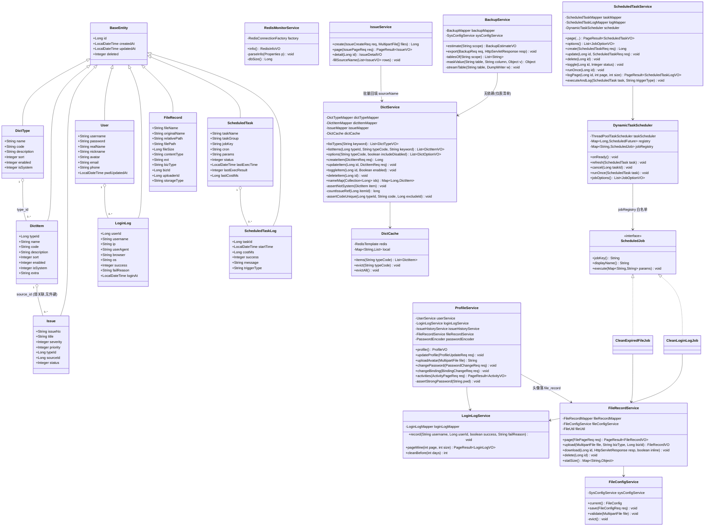
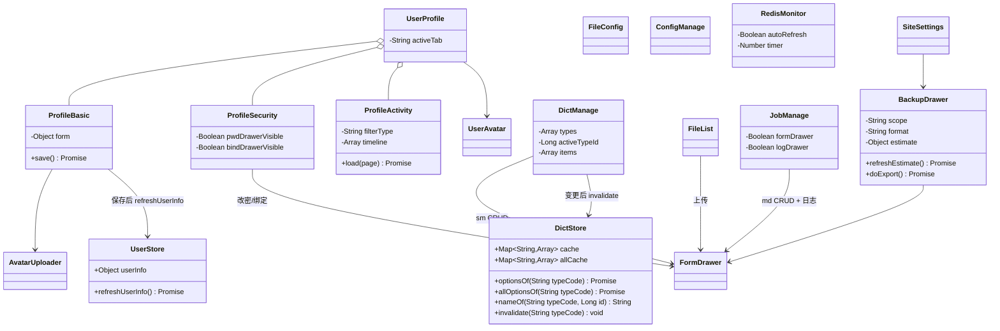
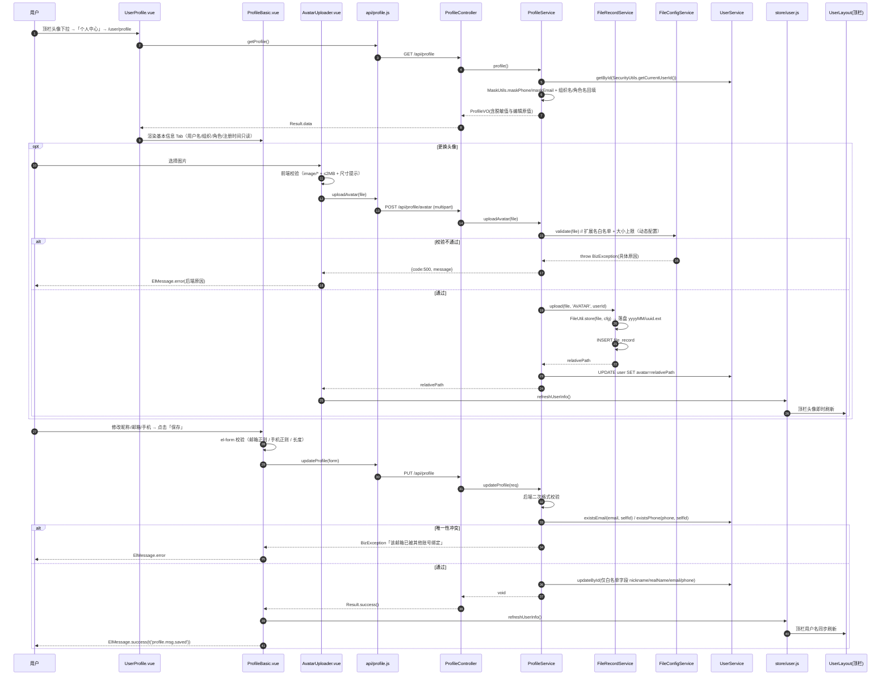
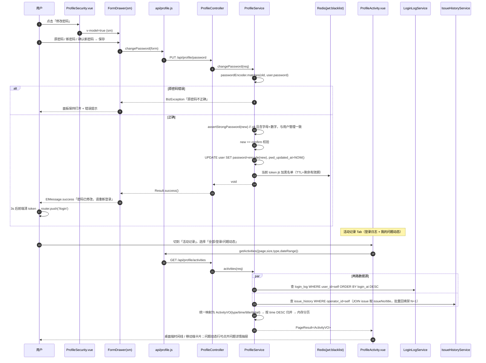
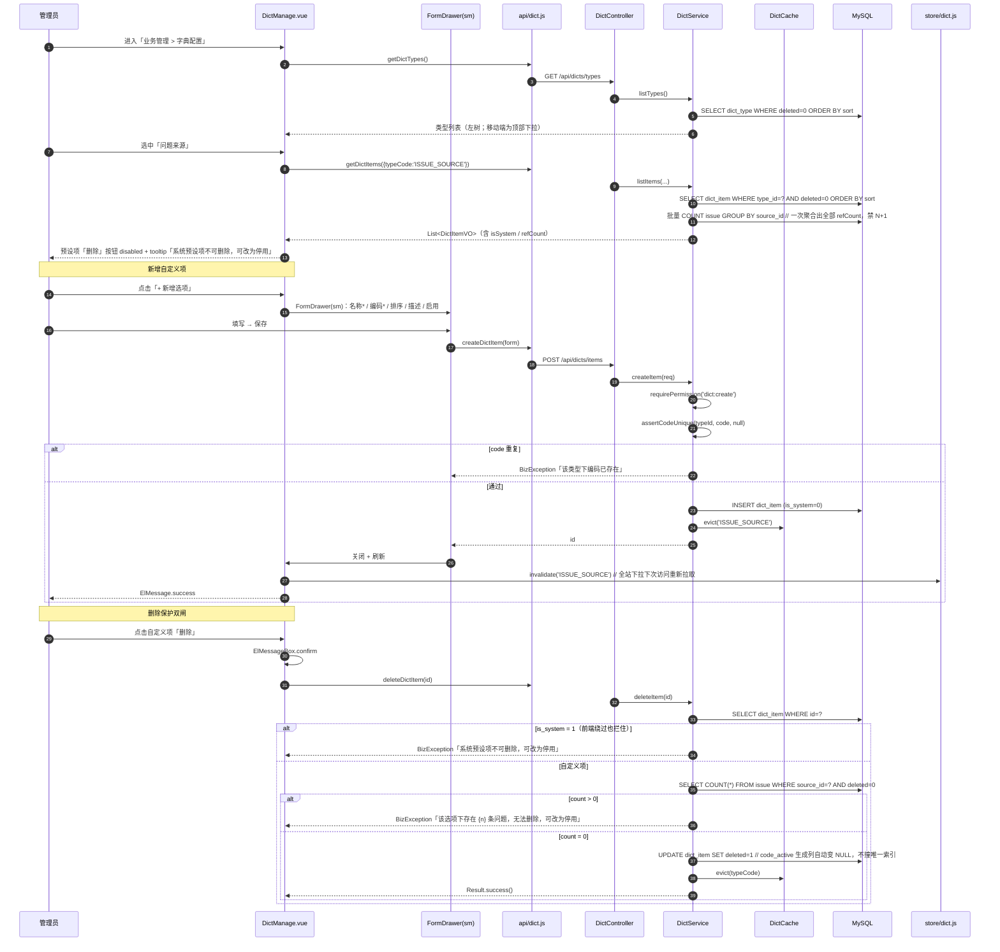
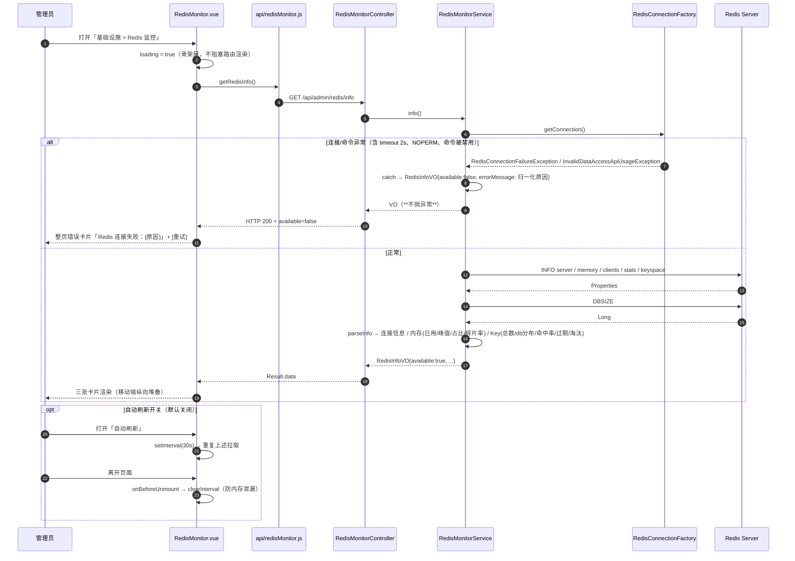
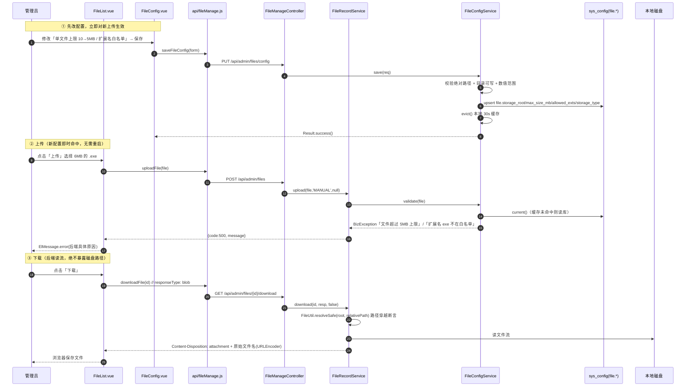
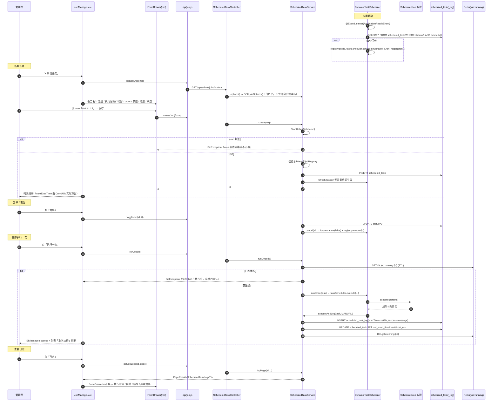
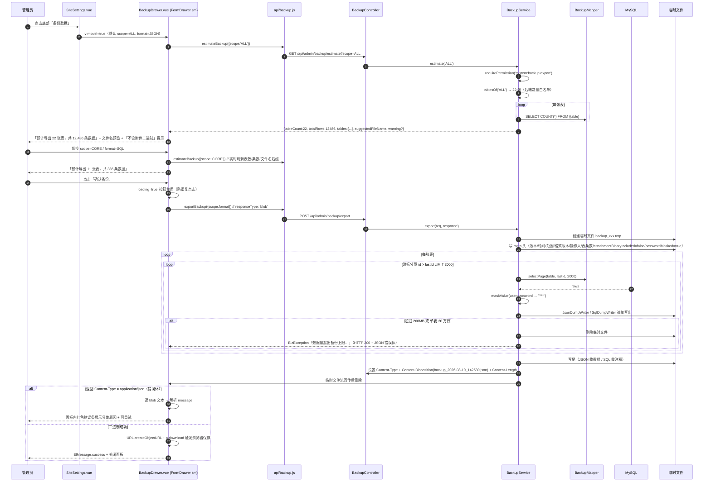
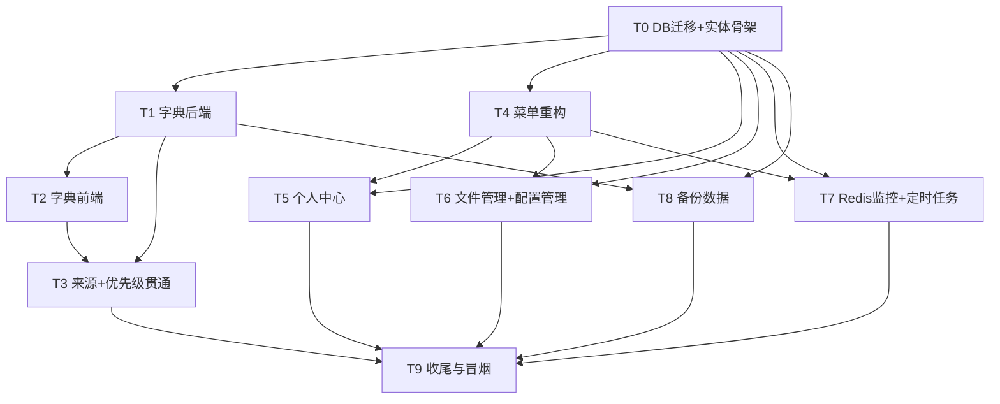

# issueFlow Phase 7 增量架构设计与任务分解（ARCH）

| 项目信息 | 内容 |
| --- | --- |
| 项目名称 | issue_flow |
| 迭代版本 | Phase 7（增量，相对 Phase 6） |
| 架构师 | 高见远 |
| 上游输入 | `docs/PRD_phase7.md`（许清楚 v1.0）、`docs/ARCH_phase6.md`、现有代码库实况 |
| 技术栈 | 后端 Spring Boot 3.2.5 + MyBatis-Plus + MySQL 8 + Redis 7 + JWT；前端 Vue 3 + Element Plus + Pinia + Vue Router + vue-i18n + Vite |
| 迁移脚本 | `scripts/V20260810_issueflow_phase7.sql`（单文件、全幂等） |
| 文档定位 | 只做设计与任务分解，**不含实现代码** |

> **上游已拍板（本文档全程遵循，不再讨论）**
>
> | # | 决策 | 落地方式速览 |
> | --- | --- | --- |
> | 用户 1 | 基础设施四子模块**完整实现**（非占位） | 见 §1.3 / T6-T7 |
> | 用户 2 | 个人中心「活动记录」= 登录日志 + 本人 `issue_history` | 见 §3.6 `/api/profile/activities` 归并时间线 |
> | 用户 3 | 备份支持 **JSON + SQL** 两种格式 × 全量/核心配置两种范围 | 见 §3.9 / §4.6 |
> | 用户 4 | 原需求 7「DB 还原到初始化」**不做** | 已从范围剔除，`SystemDataService.resetData` 保持现状不动 |
> | 主理人 A | 「问题类型」**不迁入**业务管理，保持 Phase 6 的一级平铺位置 | 菜单脚本不动 `/admin/issue-types` 的 `parent_id` |
> | 主理人 B | 优先级 = **固定枚举**（高/中/低），仿 `severity` 实现，不走字典 | `issue.priority` TINYINT + `enum.priority.*` i18n |
> | 主理人 C | 定时任务 = **Spring TaskScheduler 动态注册**，不引 Quartz | `DynamicTaskScheduler`（§1.3.4） |
> | 主理人 D | 备份 = 数据库业务表数据；附件二进制**不导出**（仅记路径元信息）；核心配置排除敏感列 | `BackupService` 表清单 + 列脱敏白名单 |

---

## 一、实现方案与框架选型

### 1.1 本期八个技术难点与对策

| # | 难点 | 风险 | 对策 |
| --- | --- | --- | --- |
| D1 | **菜单从两级升三级**（基础设施 → 文件管理 → 文件配置/文件列表） | 现有 `SideMenu.vue` 虽是递归组件，但三级在 `el-sub-menu` 嵌套下的**折叠态（collapse）**、`default-active` 高亮、移动端抽屉均未被验证过；一旦渲染异常整个后台侧栏不可用 | 组件本身**不改结构**（已确认为自递归实现，天然支持 N 级）；只改 `resolveIndex` 对「无 path 的纯目录节点」的兜底（用 `menu-{id}` 而非空串，避免同 index 冲突）。新增专项验收：折叠态 hover 弹出三级、`/admin/infra/file/list` 直达时父链自动展开 |
| D2 | **「问题管理」叶子菜单原地升级为分组** | 直接删旧行新建会丢 `menu.id`，且旧 `/admin/issues` 若被误删则 404，触碰「零回归」红线 | **原地改造**：`UPDATE menu SET name='业务管理', path='/admin/business', permission=NULL, icon='Management'` —— **保留同一行 id**；再 `INSERT` 子菜单「问题列表」`path='/admin/issues'`。路由侧 `/admin/business` 配 `redirect: '/admin/issues'`，旧路由文件与组件**零改动** |
| D3 | **字典项唯一性**（同一字典类型下 code 唯一） | 若写 `UNIQUE(type_id, code, deleted)` 即重蹈 Phase 6 `issue_type` 的 500 覆辙 | 严守铁律：**生成列 + 条件唯一**。`code_active VARCHAR(120) GENERATED ALWAYS AS (IF(deleted=0, CONCAT(type_id,':',code), NULL)) VIRTUAL` + `UNIQUE KEY uk_dict_item_code(code_active)`。软删行取 NULL，唯一索引忽略 NULL，与 Service 的 `assertCodeUnique(deleted=0)` 语义完全一致 |
| D4 | **来源字段全链路且禁 N+1** | `IssueVO` 要同时返回 `sourceId` + `sourceName`，列表页 20 行会触发 20 次字典查询 | 复用 Phase 6 已验证的 `nameMap(Collection<Long>)` 批量回填模式；再加一层 **`DictCache`（Redis + 本地 ConcurrentHashMap 双层）**，key = `dict:items:{typeCode}`，字典写操作后 `evict`。列表回填走内存 Map，0 次 DB 查询 |
| D5 | **动态定时任务无重启生效** | `@Scheduled` 是编译期绑定；自研调度易出现「暂停后仍在跑」「删除后 future 泄漏」 | `DynamicTaskScheduler` 持有 `ThreadPoolTaskScheduler` + `ConcurrentHashMap<Long, ScheduledFuture<?>>`；CRUD/启停统一走 `refresh(taskId)`（先 `cancel(false)` 再按新 cron 重注册）。执行目标用 **Bean 白名单注册表**（`Map<String, ScheduledJob>`，Spring 自动注入所有 `ScheduledJob` 实现），**禁止**反射任意类名（防远程代码执行） |
| D6 | **备份大表内存溢出** | 一次性 `selectList` 全表 → JSON 序列化，10 万行即 OOM，且失败会产出半截损坏文件 | **游标分页 + 流式写出**：每表按 `id > lastId LIMIT 2000` 逐批查询，直接写 `ServletOutputStream`（`JsonGenerator` / `PrintWriter`）。**先落临时文件再整体回传**（`Content-Disposition` 在写完临时文件后才设置），任一批次异常则删临时文件并抛 `BizException`，保证「不产生半截文件」验收项 |
| D7 | **Redis 不可用不得拖垮页面** | `INFO` 命令在 Redis 挂掉时阻塞到 socket timeout，页面转圈 30s | `RedisMonitorService` 用 `RedisCallback` 执行 `INFO`，全程 `try/catch`，异常统一转 `RedisInfoVO{available:false, errorMessage}`（**HTTP 200 + 业务态**，不抛 500），前端渲染错误卡片。同时在 `application.yml` 收紧 `spring.data.redis.timeout=2s` |
| D8 | **文件配置改动即时生效** | 上传限制若读 `@Value`，改配置必须重启 | 上传校验一律走 `FileConfigService.current()`（读 `sys_config` 的 `file.*` 键，带 30s 本地缓存 + 保存时主动 evict）；`FileUtil` 由「读 `@Value` 常量」改为「入参接收 `FileConfig`」，`Constants.MAX_ATTACHMENT_SIZE` 降级为兜底默认值 |

### 1.2 复用 / 新增模块总览

| 层 | 复用（零改动或小改） | 新增 |
| --- | --- | --- |
| 前端基础 | `FormDrawer.vue`、`SideMenu.vue`、`components/charts/*`、`store/{app,theme,locale}.js`、`utils/{i18nEnum,format}.js`、`styles/themes.css` | `store/dict.js`、`api/{dict,profile,fileManage,configManage,redisMonitor,job,backup}.js`、`locales/{zh-CN,en-US}/{dict,profile,infra,backup}.js` |
| 前台页面 | `IssueFormSections/IssueTable/IssueDetailDrawer/UserIssueList`（补两字段） | `views/user/UserProfile.vue` + 3 个 Tab 子组件 |
| 后台页面 | `AdminIssueList`（补两字段）、`SiteSettings`（加备份按钮） | `DictManage.vue`、`FileConfig.vue`、`FileList.vue`、`ConfigManage.vue`、`RedisMonitor.vue`、`JobManage.vue` |
| 后端 | `PermissionService`、`SysConfigService`、`IssueService`、`FileUtil`、`SecurityUtils`、`BaseEntity` | dict / profile / loginLog / fileRecord / fileConfig / configManage / redisMonitor / scheduledTask / backup 九个纵切 |
| DB | `sys_config`（承载 `file.*`）、`issue_history`（活动记录数据源之一） | `dict_type`、`dict_item`、`login_log`、`file_record`、`scheduled_task`、`scheduled_task_log`；`issue`/`user` 加列 |

### 1.3 关键技术决策落地（A~D）

#### 1.3.1 决策 A — 问题类型保持一级平铺

- 迁移脚本**不触碰** `/admin/issue-types` 这一行的 `parent_id`（保持 0）。
- 后台一级菜单最终排序：`概览(1) / 业务管理(2) / 问题类型(3) / 流程监控(4) / 流程管理(5) / 基础设施(6) / 系统管理(7)`。
- 「项目管理」分组迁空后 `deleted=1`；其原 `sort` 空位由上述重排吸收，**不留空分组**。
- 副作用：PRD §5.3 草图把「问题类型」画在业务管理下 —— 以主理人裁定为准，**UI 草图此处作废**，验收按本文档。

#### 1.3.2 决策 B — 优先级固定枚举（仿 severity）

| 项 | 规格 |
| --- | --- |
| 列 | `issue.priority TINYINT NOT NULL DEFAULT 1` |
| 取值 | `0=高(HIGH) / 1=中(MEDIUM) / 2=低(LOW)`，**数值越小越紧急**，与 `severity`（0 致命→3 轻微）方向一致，避免两个相邻下拉的心智冲突 |
| 后端 | 新增 `enums/PriorityEnum.java`（code/name/i18nSuffix）；`IssueCreateReq.priority` 加 `@NotNull` + `@Min(0) @Max(2)`；`IssuePageReq.priority` 支持筛选；`IssueVO/IssueDetailVO` 返回 `priority` + `priorityDesc` |
| 前端 | `utils/i18nEnum.js` 新增 `usePriorityOptions()` / `priorityLabelI18n(code)`；`utils/format.js` 新增 `priorityTagType(code)` → `danger/warning/info`（**固定色值，不随主题变**，与 Phase 6 §八 R11 约定一致） |
| 布局 | 表单中与「严重等级」**同一 `el-row` 内并排两个 `el-col :span="12"`**，同为 `el-select`，同必填星号；列表中相邻成列 |
| 存量 | `UPDATE issue SET priority=1 WHERE priority IS NULL`（加列时即给 DEFAULT 1，NOT NULL，天然无空） |

> **为何不字典化**：字典化会让优先级下拉走 `dict` 异步 store，与 severity 的同步枚举下拉产生**加载时序差**（一个先渲染一个后渲染），直接违反 R4「用户不应感知两者是不同批次开发」的硬要求。

#### 1.3.3 决策 C — 定时任务用 Spring TaskScheduler 动态注册

```
ScheduledTaskService ──(CRUD/启停/立即执行)──> DynamicTaskScheduler
                                                 ├─ ThreadPoolTaskScheduler(poolSize=4, 优雅停机)
                                                 ├─ Map<Long, ScheduledFuture<?>> registry
                                                 └─ Map<String, ScheduledJob> jobRegistry (Spring 注入)
                                                        ├─ CleanExpiredFileJob   (内置示例1)
                                                        └─ CleanLoginLogJob      (内置示例2, 清理 90 天前登录日志)
```

- **启动装载**：`@EventListener(ApplicationReadyEvent.class)`（**不用 `@PostConstruct`** —— Phase 5 血泪教训：`@PostConstruct` 阶段 Mapper/数据源可能尚未就绪）扫描 `scheduled_task WHERE status=1 AND deleted=0` 全量注册。
- **cron 校验**：`CronExpression.isValidExpression(cron)`（Spring 6 原生），非法直接 `BizException`，保存被拒。
- **立即执行**：`taskScheduler.execute(runnable)` 单次触发，**不影响** cron 注册；执行中加 `Redis SETNX job:running:{id}`（TTL=任务超时时间）做并发互斥，防重复点击。
- **执行日志**：`ScheduledTaskLog` 记录 `startTime/costMs/success/errorMsg(截断 2000 字)`；每任务保留最近 200 条，由内置清理任务滚动裁剪。
- **单机约束**：明确记录在 §8 —— 多实例部署时会重复触发，届时再升 Quartz 集群模式（表结构已按「任务定义与调度器解耦」设计，升级成本可控）。

#### 1.3.4 决策 D — 备份范围与安全边界

| 维度 | 规格 |
| --- | --- |
| 全量范围 | 业务表 + 配置表，共约 22 张（见 §3.9 表清单） |
| 核心配置范围 | `sys_config`、`menu`、`permission`、`role`、`role_permission`、`flow_node`、`flow_transition`、`issue_type`、`dict_type`、`dict_item`、`scheduled_task` —— 共 11 张（采纳 PRD Q7 方案 A，**不含** organization/project/module） |
| 附件 | **不导出二进制**（决策 D）。`issue_attachment` / `file_record` 表的**元信息行照常导出**（含 `file_path`），文件头元信息中标注 `attachmentBinaryIncluded: false` |
| 敏感列 | 「核心配置」范围下 `user` 表**不在清单内**，天然无密码问题；「全量」范围导出 `user` 时 **`password` 列输出为 `"***"`（JSON）/ 注释占位（SQL）**，`BackupService.SENSITIVE_COLUMNS = {user.password}`。文件头标注 `passwordMasked: true` 并提示「本备份无法直接用于账号还原」 |
| 保护阈值 | 单表 > 20 万行 或 累计写出 > 200MB 时中断并抛「数据量超出备份上限，请联系管理员分批导出」；`spring.mvc.async.request-timeout` 场景走同步流式，接口自身 `@Transactional(readOnly=true)` 但**不设长事务**（逐表独立读） |
| 权限 | 新权限码 `system:backup:export`（+ ADMIN 角色天然放行），未授权 403 |

### 1.4 架构约束（继承 + 新增）

1. **唯一索引铁律**（继承）：任何唯一约束必须「生成列 + 条件唯一」，**禁止** `(col, deleted)` 复合。本期 `dict_item` 是唯一新增唯一索引处。
2. **主题隔离**（继承）：前台主题只写 `document.body[data-if-theme]`，严禁 `documentElement`。个人中心属前台页面，随 UserLayout 自动继承。
3. **i18n 只做 UI 文案**（继承）：`dict_item.name` **不入库多语言**（采纳 PRD Q4 方案 A）；前端先查 `t('dict.value.' + typeCode + '.' + code)`，未命中回退数据库 `name`。P2-7 的双语字段本期不做。
4. **弹出层唯一形态**（继承）：一律 `FormDrawer`，仅 `ElMessageBox`/`ElMessage`/`ElNotification` 例外。备份确认面板用 `FormDrawer(sm)`（因含表单与动态统计）。
5. **新增**：个人中心所有接口**不接受 userId 入参**，一律从 `SecurityUtils.getCurrentUserId()` 取 —— 从接口签名层面消灭越权可能（比"校验 userId 相等"更稳）。
6. **新增**：文件下载/预览一律经由 `FileRecordService` 校验后由后端读流回传，**禁止**把绝对路径暴露给前端拼 URL；路径穿越防护统一在 `FileUtil.resolveSafe(base, relative)` 中做 `normalize().startsWith(base)` 断言。
7. **部署顺序硬约束**（继承 + 强化）：**先灌 SQL → 再重启后端**。Phase 7 新增 `DynamicTaskScheduler` 在 `ApplicationReadyEvent` 读 `scheduled_task` 表，表不存在会导致启动即告警（已做 try/catch 降级，但仍须遵守顺序）。

---

## 二、文件列表（逐文件，相对路径）

图例：**[新]** 新增　**[改]** 修改

### 2.1 数据库（1 个）

| # | 文件 | 状态 | 内容要点 |
| --- | --- | --- | --- |
| 1 | `scripts/V20260810_issueflow_phase7.sql` | **[新]** | ① `dict_type`/`dict_item` 建表（生成列条件唯一）+ 4 类型 + 来源 5 项 + 状态 5 项种子；② `issue` 加 `source_id`/`priority` + 索引 + 存量回填；③ `user` 加 `avatar`/`nickname`/`pwd_updated_at`；④ `login_log` 建表；⑤ `file_record` 建表 + 存量 `issue_attachment` 回灌；⑥ `scheduled_task`/`scheduled_task_log` 建表 + 2 条内置任务种子；⑦ 菜单重构（业务管理原地升级、项目/模块迁入、字典配置新增、项目管理组逻辑删除、基础设施三层新增、一级 sort 重排）；⑧ 22 个新权限码 + 授 ADMIN；⑨ `sys_config` 的 `file.*` 4 键默认值 |

### 2.2 后端 —— 新增（相对 `src/backend/src/main/java/com/issueflow/`）

| # | 文件 | 归属 | 说明 |
| --- | --- | --- | --- |
| 2 | `entity/DictType.java` | 字典 | name/code/description/sort/enabled/isSystem |
| 3 | `entity/DictItem.java` | 字典 | typeId/name/code/sort/enabled/isSystem/description/extra |
| 4 | `entity/LoginLog.java` | 个人中心 | userId/username/ip/userAgent/browser/os/success/failReason/loginAt |
| 5 | `entity/FileRecord.java` | 文件管理 | fileName/originalName/filePath/relativePath/fileSize/contentType/ext/bizType/bizId/uploaderId |
| 6 | `entity/ScheduledTask.java` | 定时任务 | taskName/taskGroup/jobKey/cron/params/status/description/lastExecTime/lastExecResult/lastCostMs |
| 7 | `entity/ScheduledTaskLog.java` | 定时任务 | taskId/startTime/costMs/success/message/triggerType(CRON/MANUAL) |
| 8 | `mapper/DictTypeMapper.java` | 字典 | `BaseMapper<DictType>` |
| 9 | `mapper/DictItemMapper.java` | 字典 | `BaseMapper<DictItem>` |
| 10 | `mapper/LoginLogMapper.java` | 个人中心 | `BaseMapper<LoginLog>` |
| 11 | `mapper/FileRecordMapper.java` | 文件管理 | `BaseMapper<FileRecord>` + `sumSize()` |
| 12 | `mapper/ScheduledTaskMapper.java` | 定时任务 | `BaseMapper<ScheduledTask>` |
| 13 | `mapper/ScheduledTaskLogMapper.java` | 定时任务 | `BaseMapper<ScheduledTaskLog>` |
| 14 | `mapper/BackupMapper.java` | 备份 | 通用 `@Select("${sql}")` 动态查询：`countTable(table)` / `selectPage(table, lastId, limit)` / `listColumns(table)`（**表名来自后端白名单常量，绝不来自前端入参**） |
| 15 | `service/DictService.java` | 字典 | 类型/项 CRUD、预设保护、引用计数、`itemsByTypeCode(code)`、`nameMap(ids)`、缓存失效 |
| 16 | `service/DictCache.java` | 字典 | 本地 `ConcurrentHashMap` + Redis 双层，key `dict:items:{typeCode}`，`get/evict/evictAll` |
| 17 | `service/ProfileService.java` | 个人中心 | `profile()` / `updateProfile()` / `changePassword()` / `changeBinding()` / `uploadAvatar()` / `activities()` |
| 18 | `service/LoginLogService.java` | 个人中心 | `record(username,userId,success,failReason,request)`（异步 `@Async`）、`pageMine()`、`cleanBefore(days)` |
| 19 | `service/FileRecordService.java` | 文件管理 | page/upload/download/preview/delete（含物理清理）/`statSize()` |
| 20 | `service/FileConfigService.java` | 文件管理 | 读写 `file.*` 4 键；`current()` 带 30s 缓存；`validate(MultipartFile)` |
| 21 | `service/ConfigManageService.java` | 配置管理 | `sys_config` 全量分页 CRUD；内置键前缀保护（`site.` / `file.` / `flow_` / `theme_` / `layout` / `menu_config`）；保存后 evict 相关缓存 |
| 22 | `service/RedisMonitorService.java` | Redis 监控 | `info()` 解析 INFO 全段 + `dbSize()` + keyspace 分布；异常降级为 `available=false` |
| 23 | `service/ScheduledTaskService.java` | 定时任务 | CRUD / pause / resume / runOnce / logPage；cron 校验；委托 `DynamicTaskScheduler` |
| 24 | `service/BackupService.java` | 备份 | `estimate(scope)` 预估表数与条数；`export(scope, format, response)` 流式导出；表清单与敏感列常量 |
| 25 | `config/DynamicTaskScheduler.java` | 定时任务 | `ThreadPoolTaskScheduler` + registry；`registerAll/refresh/cancel/runOnce` |
| 26 | `config/AsyncConfig.java` | 通用 | `@EnableAsync` + 登录日志专用线程池（`loginLogExecutor`，队列满时 CallerRuns 兜底） |
| 27 | `job/ScheduledJob.java` | 定时任务 | 接口：`String jobKey()` / `String displayName()` / `void execute(Map<String,String> params)` |
| 28 | `job/CleanExpiredFileJob.java` | 定时任务 | 内置示例：清理 `file_record` 中无业务关联且超 N 天的临时文件 |
| 29 | `job/CleanLoginLogJob.java` | 定时任务 | 内置示例：清理 90 天前登录日志（对应 PRD Q9 建议） |
| 30 | `controller/DictController.java` | 字典 | `/api/dicts/**` 9 个接口 |
| 31 | `controller/ProfileController.java` | 个人中心 | `/api/profile/**` 6 个接口 |
| 32 | `controller/FileManageController.java` | 文件管理 | `/api/admin/files/**` 6 个接口 |
| 33 | `controller/ConfigManageController.java` | 配置管理 | `/api/admin/configs/**` 5 个接口 |
| 34 | `controller/RedisMonitorController.java` | Redis 监控 | `/api/admin/redis/info` 1 个接口 |
| 35 | `controller/ScheduledTaskController.java` | 定时任务 | `/api/admin/jobs/**` 8 个接口 |
| 36 | `controller/BackupController.java` | 备份 | `/api/admin/backup/estimate`、`/api/admin/backup/export` |
| 37 | `enums/PriorityEnum.java` | 问题 | 0 HIGH / 1 MEDIUM / 2 LOW + `descOf(code)` |
| 38 | `enums/DictTypeCodeEnum.java` | 字典 | `ISSUE_SOURCE` / `ISSUE_STATUS` / `ISSUE_PRIORITY`(预留) / `ISSUE_SEVERITY`(预留) |
| 39 | `util/CronUtils.java` | 定时任务 | `isValid(cron)` / `nextExecTime(cron)`（基于 `CronExpression`） |
| 40 | `util/UserAgentParser.java` | 个人中心 | 极简 UA 解析（浏览器 + OS），**不引三方库**，正则匹配主流 UA + 兜底 `Unknown` |
| 41 | `util/MaskUtils.java` | 个人中心 | `maskPhone` / `maskEmail` |
| 42 | `util/SqlDumpWriter.java` | 备份 | SQL 格式写出器：注释头、`INSERT INTO ... VALUES` 批量拼装、值转义（`\`、`'`、NULL、二进制拒绝） |
| 43 | `util/JsonDumpWriter.java` | 备份 | JSON 流式写出器（`JsonGenerator`），meta 头 + `tables[]` 数组 |
| 44 | `dto/req/DictTypeReq.java` | 字典 | name/code/description/sort/enabled |
| 45 | `dto/req/DictItemReq.java` | 字典 | typeId/name/code/sort/enabled/description |
| 46 | `dto/req/StatusToggleReq.java` | 通用 | `enabled` —— 字典项/任务通用启停入参（避免重复建 DTO） |
| 47 | `dto/req/ProfileUpdateReq.java` | 个人中心 | nickname/realName/email/phone |
| 48 | `dto/req/PasswordChangeReq.java` | 个人中心 | oldPassword/newPassword/confirmPassword |
| 49 | `dto/req/BindingChangeReq.java` | 个人中心 | type(PHONE/EMAIL)/value/currentPassword |
| 50 | `dto/req/ActivityPageReq.java` | 个人中心 | page/size/type(ALL/LOGIN/ISSUE)/startDate/endDate |
| 51 | `dto/req/FilePageReq.java` | 文件管理 | page/size/keyword/ext/bizType/startDate/endDate |
| 52 | `dto/req/FileConfigReq.java` | 文件管理 | storageRoot/maxSizeMb/allowedExts/storageType |
| 53 | `dto/req/ConfigItemReq.java` | 配置管理 | configKey/configValue/description |
| 54 | `dto/req/ScheduledTaskReq.java` | 定时任务 | taskName/taskGroup/jobKey/cron/params/status/description |
| 55 | `dto/req/BackupReq.java` | 备份 | scope(ALL/CORE)/format(JSON/SQL) |
| 56 | `dto/resp/DictTypeVO.java` | 字典 | id/name/code/description/sort/enabled/isSystem/itemCount |
| 57 | `dto/resp/DictItemVO.java` | 字典 | id/typeId/typeCode/name/code/sort/enabled/isSystem/description/refCount |
| 58 | `dto/resp/DictOptionVO.java` | 字典 | id/name/code/enabled —— 下拉轻量结构（结构与 `IssueTypeOptionVO` 对齐） |
| 59 | `dto/resp/ProfileVO.java` | 个人中心 | id/username/nickname/realName/avatar/email(脱敏)/phone(脱敏)/emailRaw?/phoneRaw?/orgName/roleName/roleCode/createdAt/pwdUpdatedAt |
| 60 | `dto/resp/ActivityVO.java` | 个人中心 | type(LOGIN/ISSUE)/time/title/detail/ip/device/success/issueId/issueNo |
| 61 | `dto/resp/LoginLogVO.java` | 个人中心 | time/ip/browser/os/success/failReason |
| 62 | `dto/resp/FileRecordVO.java` | 文件管理 | id/originalName/ext/contentType/fileSize/uploaderName/createdAt/bizType/bizId/bizRef/relativePath/previewable |
| 63 | `dto/resp/FileConfigVO.java` | 文件管理 | storageRoot/maxSizeMb/allowedExts/storageType/usedSize/fileCount |
| 64 | `dto/resp/ConfigItemVO.java` | 配置管理 | id/configKey/configValue/description/updatedAt/builtin |
| 65 | `dto/resp/RedisInfoVO.java` | Redis 监控 | available/errorMessage/server{...}/memory{...}/keyspace{...}/stats{...} |
| 66 | `dto/resp/ScheduledTaskVO.java` | 定时任务 | id/taskName/taskGroup/jobKey/jobName/cron/status/lastExecTime/lastExecResult/lastCostMs/nextExecTime/description |
| 67 | `dto/resp/ScheduledTaskLogVO.java` | 定时任务 | id/startTime/costMs/success/message/triggerType |
| 68 | `dto/resp/JobOptionVO.java` | 定时任务 | jobKey/displayName —— 执行目标下拉 |
| 69 | `dto/resp/BackupEstimateVO.java` | 备份 | scope/tableCount/totalRows/tables[{name,rows}]/suggestedFileName/warning |

### 2.3 后端 —— 修改

| # | 文件 | 说明 |
| --- | --- | --- |
| 70 | `entity/Issue.java` | 加 `Long sourceId`、`Integer priority` |
| 71 | `entity/User.java` | 加 `String avatar`、`String nickname`、`LocalDateTime pwdUpdatedAt` |
| 72 | `dto/req/IssueCreateReq.java` | 加 `sourceId`（选填，空则服务端填 MANUAL）、`priority`（`@NotNull @Min(0) @Max(2)`，前端默认 1） |
| 73 | `dto/req/IssueUpdateReq.java` | 加 `sourceId`、`priority` |
| 74 | `dto/req/IssuePageReq.java` | 加 `sourceId`、`priority` 筛选 |
| 75 | `dto/resp/IssueVO.java` | 加 `sourceId`/`sourceName`/`sourceCode`/`priority`/`priorityDesc` |
| 76 | `dto/resp/IssueDetailVO.java` | 同上 5 字段 |
| 77 | `dto/resp/UserVO.java` | 加 `avatar`/`nickname`（顶栏头像同步刷新需要） |
| 78 | `service/IssueService.java` | create 默认来源 MANUAL + 校验来源项 enabled；page 增加 `eq(source_id)`/`eq(priority)`；列表/详情走 `DictCache` **批量**回填 `sourceName`（0 次 DB）；Excel 导出补两列 |
| 79 | `service/AuthService.java` | 登录成功/失败双分支埋点 `loginLogService.record(...)`（异步、`try/catch` 包裹，**日志失败绝不影响登录**）；`login` 方法签名加 `HttpServletRequest`（或从 `RequestContextHolder` 取，与现有 `logout` 写法一致，**优先后者以免改 Controller 签名**） |
| 80 | `service/UserService.java` | `getUserVO` 补 `avatar`/`nickname`；暴露 `existsEmail(email, excludeId)` / `existsPhone(phone, excludeId)` 供个人中心唯一性校验复用 |
| 81 | `service/IssueAttachmentService.java` | 上传后**同步写一条 `file_record`**（`bizType='ISSUE'`, `bizId=issueId`），使文件列表能统一看到问题附件；删除附件时同步软删 `file_record` |
| 82 | `util/FileUtil.java` | `store(MultipartFile)` → `store(MultipartFile, FileConfig cfg)`；新增 `resolveSafe(base, relative)` 路径穿越断言；新增 `extOf(name)` |
| 83 | `util/ExcelExportUtil.java` | 问题导出补「来源」「优先级」两列 |
| 84 | `common/Constants.java` | 追加 `CFG_FILE_*` 4 键、`DICT_TYPE_ISSUE_SOURCE`、`DICT_ITEM_SOURCE_MANUAL="MANUAL"`、`REDIS_DICT_PREFIX`、`REDIS_JOB_RUNNING_PREFIX`、`LOGIN_LOG_KEEP_DAYS=90`、`BACKUP_MAX_ROWS`/`BACKUP_MAX_BYTES` |
| 85 | `config/WebMvcConfig.java` | 头像静态访问映射（若采用相对路径直出方案）；否则不改（默认走后端读流，见 §8-2） |
| 86 | `config/SecurityConfig.java` | 无新白名单（个人中心全部需登录）；确认 `/api/admin/**` 已被 JWT 过滤器覆盖 |
| 87 | `resources/application.yml` | `spring.data.redis.timeout: 2s`；`spring.task.scheduling.pool.size: 4`；`app.file.*` 兜底默认值；`spring.servlet.multipart.max-file-size/max-request-size` 提到 50MB（业务上限由 `file.max_size_mb` 动态收紧） |

### 2.4 前端 —— 新增（相对 `src/frontend/src/`）

| # | 文件 | 说明 |
| --- | --- | --- |
| 88 | `api/dict.js` | 字典类型/项 9 个接口 + `getDictOptions(typeCode, includeDisabled)` |
| 89 | `api/profile.js` | 6 个接口（资料读写、改密、绑定、头像、活动记录） |
| 90 | `api/fileManage.js` | 文件分页/上传/下载/预览/删除 + 配置读写 |
| 91 | `api/configManage.js` | 配置项分页/新增/编辑/删除 |
| 92 | `api/redisMonitor.js` | `getRedisInfo()` |
| 93 | `api/job.js` | 任务 CRUD/启停/立即执行/日志/可选执行目标 |
| 94 | `api/backup.js` | `estimateBackup(params)` + `exportBackup(params)`（`responseType:'blob'`） |
| 95 | `store/dict.js` | 按 `typeCode` 分片缓存：`optionsOf(typeCode)` / `allOptionsOf(typeCode)` / `nameOf(typeCode,id)` / `invalidate(typeCode?)`，仿 `store/issueType.js` |
| 96 | `views/user/UserProfile.vue` | 个人中心壳：左概要卡 + 右 3 Tab（`el-tabs`），移动端上下堆叠 |
| 97 | `views/user/profile/ProfileBasic.vue` | 基本信息 Tab：头像上传 + 表单 + 保存/重置 |
| 98 | `views/user/profile/ProfileSecurity.vue` | 账户安全 Tab：改密行 + 手机/邮箱绑定行，各自开 `FormDrawer(sm)` |
| 99 | `views/user/profile/ProfileActivity.vue` | 活动记录 Tab：类型分段器 + 时间线（桌面）/卡片（移动）+ 分页 |
| 100 | `components/AvatarUploader.vue` | 头像上传：裁剪前的尺寸/格式/大小校验 + 预览 + 默认字母头像回退 |
| 101 | `components/UserAvatar.vue` | 通用头像展示（有图显示图，无图显示首字母 + 稳定色），供顶栏与个人中心复用 |
| 102 | `views/admin/DictManage.vue` | 字典配置页：左类型树/右选项表格（移动端类型树折叠为顶部下拉）+ `FormDrawer(sm)` CRUD + 预设保护 |
| 103 | `views/admin/infra/FileConfig.vue` | 文件配置页 |
| 104 | `views/admin/infra/FileList.vue` | 文件列表页（筛选 + 上传 + 预览 + 下载 + 删除） |
| 105 | `views/admin/infra/ConfigManage.vue` | 配置管理页 |
| 106 | `views/admin/infra/RedisMonitor.vue` | Redis 监控页（3 卡片 + 刷新 + 自动刷新开关 + 错误态） |
| 107 | `views/admin/infra/JobManage.vue` | 定时任务页（表格 + CRUD 抽屉 + 日志抽屉 + 启停 + 立即执行） |
| 108 | `components/BackupDrawer.vue` | 备份确认抽屉（范围/格式单选 + 动态预估 + 下载触发 + 错误条） |
| 109 | `locales/zh-CN/dict.js` / `locales/en-US/dict.js` | 字典配置文案 + `dict.value.*` 预设项名映射 |
| 110 | `locales/zh-CN/profile.js` / `locales/en-US/profile.js` | 个人中心文案 |
| 111 | `locales/zh-CN/infra.js` / `locales/en-US/infra.js` | 基础设施四子模块文案（`infra.file.*` / `infra.config.*` / `infra.redis.*` / `infra.job.*`） |
| 112 | `locales/zh-CN/backup.js` / `locales/en-US/backup.js` | 备份文案 |

### 2.5 前端 —— 修改

| # | 文件 | 说明 |
| --- | --- | --- |
| 113 | `router/routes.js` | 新增 `/user/profile`；新增 `/admin/business`（redirect → `/admin/issues`）、`/admin/dicts`、`/admin/infra`（redirect → `/admin/infra/file/list`）、`/admin/infra/file/config`、`/admin/infra/file/list`、`/admin/infra/config`、`/admin/infra/redis`、`/admin/infra/job`；旧 `/admin/issues`、`/admin/projects`、`/admin/modules` **原样保留** |
| 114 | `layouts/UserLayout.vue` | 头像下拉「个人中心」入口（位于「退出登录」之上，divided 之前）；头像位改用 `UserAvatar`；移动端下拉项高度 ≥44px |
| 115 | `layouts/AdminLayout.vue` | 头像下拉「个人设置」→「用户设置」（**仅改 i18n value**，key `layout.topbar.profile` 与路由/图标/抽屉逻辑一律不动） |
| 116 | `components/IssueFormSections.vue` | 基本信息区新增「来源」下拉（默认 MANUAL）与「优先级」下拉；**优先级与严重等级同 `el-row` 并排** |
| 117 | `components/IssueTable.vue` | 新增「来源」（纯文本/浅 tag）与「优先级」（带色 tag）两列，位置紧邻严重等级 |
| 118 | `components/IssueDetailDrawer.vue` | 详情新增两项展示 |
| 119 | `views/user/UserIssueList.vue` | 筛选区新增来源、优先级下拉（来源下拉含停用项 + 「(已停用)」后缀） |
| 120 | `views/admin/AdminIssueList.vue` | 列表列 + 筛选 + 编辑抽屉三处同步补两字段 |
| 121 | `views/user/UserDashboard.vue` / `views/user/UserStats.vue` | 若含问题卡片则同步展示优先级 tag（统计维度切分属 P2，本期不做） |
| 122 | `views/admin/SiteSettings.vue` | 底部新增「备份数据」按钮（与保存区**分隔明显**：右侧独立按钮组 + `type="default"` + 下载图标），点击开 `BackupDrawer` |
| 123 | `utils/i18nEnum.js` | 新增 `usePriorityOptions()` / `priorityLabelI18n(code)` / `useDictOptions(typeCode, includeDisabled)` / `dictLabelI18n(typeCode, item)` |
| 124 | `utils/format.js` | 新增 `priorityTagType(code)`、`formatFileSize(bytes)`、`formatDuration(ms)` |
| 125 | `components/SideMenu.vue` | `resolveIndex` 对无 path 的目录节点回退 `'menu-'+node.id`（三级菜单目录节点防 index 冲突）；折叠态三级 popper 样式微调 |
| 126 | `locales/zh-CN/index.js` / `locales/en-US/index.js` | 聚合新增 4 个模块（dict / profile / infra / backup） |
| 127 | `locales/zh-CN/menu.js` / `locales/en-US/menu.js` | 新增 `menu.admin.business`、`menu.admin.dict`、`menu.admin.infra*` 共 8 个 key；`layout.topbar.profile` 中文值改「用户设置」/ 英文 `User Settings` |
| 128 | `locales/zh-CN/issue.js` / `locales/en-US/issue.js` | 新增来源/优先级字段名、占位符、校验提示 |
| 129 | `locales/zh-CN/enum.js` / `locales/en-US/enum.js` | 新增 `enum.priority.{0,1,2}`；`dict.value.ISSUE_SOURCE.*` 放在 `dict.js` |
| 130 | `locales/zh-CN/layout.js` / `locales/en-US/layout.js` | 新增 `layout.topbar.profileCenter`（前台「个人中心」） |
| 131 | `styles/themes.css` | 补 4 套主题下新页面用到的语义变量：`--if-timeline-line`、`--if-stat-card-bg`、`--if-code-bg`（Redis/配置管理的等宽文本块） |
| 132 | `store/user.js` | `userInfo` 增加 avatar/nickname 消费；新增 `refreshUserInfo()` 供个人中心保存后刷新顶栏 |

### 2.6 文档（3 个）

| # | 文件 | 状态 |
| --- | --- | --- |
| 133 | `docs/ARCH_phase7.md` | **[新]** 本文档 |
| 134 | `docs/class-diagram-phase7.mermaid` | **[新]** 类图抽取 |
| 135 | `docs/sequence-diagram-phase7.mermaid` | **[新]** 时序图抽取 |

**文件规模合计**：约 **135 个文件**（新增 ~90，修改 ~45）。其中后端新增 68、前端新增 25、DB 1、文档 3。

---

## 三、数据结构与接口设计

### 3.1 新表 `dict_type`（字典类型）

| 字段 | 类型 | 约束 | 说明 |
| --- | --- | --- | --- |
| `id` | BIGINT | PK AI | |
| `name` | VARCHAR(50) | NOT NULL | 类型名称（问题来源 / 问题状态 …） |
| `code` | VARCHAR(50) | NOT NULL | 类型编码，程序依赖，**创建后不可改** |
| `description` | VARCHAR(200) | NULL | |
| `sort` | INT | NOT NULL DEFAULT 0 | |
| `enabled` | TINYINT | NOT NULL DEFAULT 1 | |
| `is_system` | TINYINT | NOT NULL DEFAULT 0 | 1=系统预设，不可删除 |
| `created_at`/`updated_at`/`deleted` | | | BaseEntity |
| `code_active` | VARCHAR(50) | `GENERATED ALWAYS AS (IF(deleted=0, code, NULL)) VIRTUAL`，`UNIQUE uk_dict_type_code` | 条件唯一辅助列，Java 实体**不映射** |

种子（均 `is_system=1`）：`ISSUE_SOURCE 问题来源`、`ISSUE_STATUS 问题状态`、`ISSUE_PRIORITY 优先级`（**只读展示用，enabled=1 但项不参与业务读取**）、`ISSUE_SEVERITY 严重等级`（同前）。

> 说明：优先级/严重等级两类**在字典页可见可维护名称**（满足 PRD「结构上支持扩展」），但业务读取仍走固定枚举（决策 B），页面对这两类展示只读提示条「该类型为系统枚举镜像，修改不影响业务取值」。

### 3.2 新表 `dict_item`（字典项）

| 字段 | 类型 | 约束 | 说明 |
| --- | --- | --- | --- |
| `id` | BIGINT | PK AI | |
| `type_id` | BIGINT | NOT NULL，`KEY idx_dict_item_type(type_id, sort)` | 所属类型 |
| `name` | VARCHAR(50) | NOT NULL | |
| `code` | VARCHAR(50) | NOT NULL | 同类型内唯一；预设项**不可改** |
| `description` | VARCHAR(200) | NULL | |
| `sort` | INT | NOT NULL DEFAULT 0 | |
| `enabled` | TINYINT | NOT NULL DEFAULT 1 | |
| `is_system` | TINYINT | NOT NULL DEFAULT 0 | 1=预设，删除接口硬拦截 |
| `extra` | VARCHAR(200) | NULL | 预留（P2-2 颜色标记等） |
| `created_at`/`updated_at`/`deleted` | | | BaseEntity |
| `code_active` | VARCHAR(120) | `GENERATED ALWAYS AS (IF(deleted=0, CONCAT(type_id,':',code), NULL)) VIRTUAL`，`UNIQUE uk_dict_item_code` | **同类型内条件唯一**；软删行取 NULL |

`ISSUE_SOURCE` 种子（`is_system=1`）：`MANUAL 系统录入(1)`、`API_IMPORT 接口导入(2)`、`EXCEL_IMPORT 批量导入(3)`、`EMAIL 邮件反馈(4)`、`OTHER 其他(99)`。
`ISSUE_STATUS` 种子（`is_system=1`，镜像现有枚举 0-4）：`PENDING 待处理(0)`…`CLOSED 已关闭(4)`，`extra` 存对应数值 code。

> **为何 `CONCAT(type_id,':',code)` 而非 `(type_id, code_active)` 复合**：复合索引里 `type_id` 非 NULL，MySQL 唯一索引只在**全部**列含 NULL 时才忽略该行——`(5, NULL)` 仍然参与去重？实际 MySQL 的行为是「只要索引中任一列为 NULL 即视为不重复」，故 `(type_id, code_active)` 也能工作。但**单列拼接方案语义最不易误读、且与 Phase 6 `issue_type` 写法同构**，本期统一采用单列拼接，避免工程师在两种写法间摇摆。

### 3.3 新表 `login_log`

| 字段 | 类型 | 说明 |
| --- | --- | --- |
| `id` | BIGINT PK AI | |
| `user_id` | BIGINT NULL | 失败且用户名不存在时为 NULL |
| `username` | VARCHAR(50) | 冗余存，便于失败场景追溯 |
| `ip` | VARCHAR(64) | 取 `X-Forwarded-For` 首段 → `X-Real-IP` → `getRemoteAddr()` |
| `user_agent` | VARCHAR(512) | 原始 UA（截断） |
| `browser` | VARCHAR(50) | 解析结果 |
| `os` | VARCHAR(50) | 解析结果 |
| `success` | TINYINT NOT NULL | 1 成功 / 0 失败 |
| `fail_reason` | VARCHAR(100) NULL | 「密码错误」「账号已禁用」「用户不存在」 |
| `login_at` | DATETIME NOT NULL | |
| `created_at`/`updated_at`/`deleted` | | BaseEntity |

索引：`KEY idx_login_log_user(user_id, login_at DESC)`、`KEY idx_login_log_time(login_at)`。**无唯一索引**。

### 3.4 新表 `file_record`

| 字段 | 类型 | 说明 |
| --- | --- | --- |
| `id` | BIGINT PK AI | |
| `file_name` | VARCHAR(128) | 存储名 `uuid.ext` |
| `original_name` | VARCHAR(255) | 原始名 |
| `relative_path` | VARCHAR(255) | **相对存储根**的路径 `yyyyMM/uuid.ext`（迁移存储根时不失效） |
| `file_path` | VARCHAR(512) | 绝对路径（兼容存量 `issue_attachment.file_path` 回灌） |
| `file_size` | BIGINT | 字节 |
| `content_type` | VARCHAR(100) | |
| `ext` | VARCHAR(20) | 小写扩展名，供筛选 |
| `biz_type` | VARCHAR(30) | `ISSUE` / `AVATAR` / `MANUAL`（后台手动上传） |
| `biz_id` | BIGINT NULL | 关联业务 id |
| `uploader_id` | BIGINT | |
| `storage_type` | VARCHAR(20) | `LOCAL`（预留 OSS） |
| `created_at`/`updated_at`/`deleted` | | BaseEntity |

索引：`KEY idx_file_biz(biz_type, biz_id)`、`KEY idx_file_ext(ext)`、`KEY idx_file_created(created_at)`。**无唯一索引**。

> 迁移脚本会把存量 `issue_attachment` 一次性回灌为 `file_record`（`biz_type='ISSUE'`），并用 `NOT EXISTS(file_name)` 保证幂等。两表**并存**：`issue_attachment` 仍是问题详情的数据源（零回归），`file_record` 是统一文件视图。新增附件时**双写**（§2.3-81）。

### 3.5 新表 `scheduled_task` / `scheduled_task_log`

**scheduled_task**

| 字段 | 类型 | 说明 |
| --- | --- | --- |
| `id` | BIGINT PK AI | |
| `task_name` | VARCHAR(100) NOT NULL | |
| `task_group` | VARCHAR(50) DEFAULT 'default' | |
| `job_key` | VARCHAR(100) NOT NULL | 执行目标，**必须命中后端 `jobRegistry` 白名单** |
| `cron` | VARCHAR(100) NOT NULL | Spring cron（6 位） |
| `params` | VARCHAR(500) NULL | JSON 字符串，传给 `ScheduledJob.execute` |
| `status` | TINYINT NOT NULL DEFAULT 1 | 1 运行 / 0 暂停 |
| `description` | VARCHAR(200) NULL | |
| `last_exec_time` | DATETIME NULL | |
| `last_exec_result` | TINYINT NULL | 1 成功 / 0 失败 |
| `last_cost_ms` | BIGINT NULL | |
| `created_at`/`updated_at`/`deleted` | | BaseEntity |

索引：`KEY idx_task_status(status)`。`next_exec_time` **不落库**，由 `CronUtils.nextExecTime(cron)` 实时算，避免持久化与调度器状态不一致。

**scheduled_task_log**：`id / task_id / start_time / cost_ms / success / message(VARCHAR 2000) / trigger_type(CRON|MANUAL) / created_at / updated_at / deleted`，索引 `KEY idx_task_log(task_id, start_time DESC)`。

内置任务种子 2 条：`清理过期临时文件 / CLEAN_EXPIRED_FILE / 0 0 3 * * ?`（status=1）、`清理过期登录日志 / CLEAN_LOGIN_LOG / 0 30 3 * * ?`（status=1）。

### 3.6 `issue` / `user` 表增量

```
-- issue（动态 DDL 幂等，写法同 Phase 6 §3.2）
ALTER TABLE issue ADD COLUMN source_id BIGINT DEFAULT NULL COMMENT '来源 dict_item.id' AFTER type_id;
ALTER TABLE issue ADD COLUMN priority TINYINT NOT NULL DEFAULT 1 COMMENT '优先级 0高1中2低' AFTER severity;
ALTER TABLE issue ADD KEY idx_issue_source (source_id);
ALTER TABLE issue ADD KEY idx_issue_priority (priority);
UPDATE issue SET source_id = (SELECT di.id FROM dict_item di JOIN dict_type dt ON di.type_id=dt.id
                              WHERE dt.code='ISSUE_SOURCE' AND di.code='MANUAL' AND di.deleted=0 LIMIT 1)
WHERE source_id IS NULL;

-- user
ALTER TABLE user ADD COLUMN avatar VARCHAR(255) DEFAULT NULL COMMENT '头像相对路径 file_record.relative_path';
ALTER TABLE user ADD COLUMN nickname VARCHAR(50) DEFAULT NULL COMMENT '昵称，为空时展示 real_name';
ALTER TABLE user ADD COLUMN pwd_updated_at DATETIME DEFAULT NULL COMMENT '上次改密时间';
```

- `source_id` 允许 NULL（兼容选项被删场景），但创建接口空值时**服务端兜底填 MANUAL**，满足「`COUNT(*) WHERE source_id IS NULL = 0`」验收。
- `priority` NOT NULL DEFAULT 1，加列瞬间存量即为「中」，无需回填 UPDATE。
- **email/phone 唯一索引本期不加**（存量可能已有重复/空值，加索引会让迁移脚本在生产库直接失败）。唯一性由 `ProfileService` + `UserService.existsEmail/existsPhone` 在 Service 层保证。若后续要加，必须用生成列 `email_active = IF(deleted=0 AND email<>'' , email, NULL)` 条件唯一，并**先跑重复数据体检 SQL**（见 §8-6）。

### 3.7 `sys_config` 新增 `file.*` 4 键

| config_key | 默认值 | 校验 |
| --- | --- | --- |
| `file.storage_root` | `/data/attachments` | 必填，必须为绝对路径，保存时校验目录可写 |
| `file.max_size_mb` | `10` | 1 ≤ n ≤ 100 |
| `file.allowed_exts` | `jpg,jpeg,png,gif,pdf,zip,rar,doc,docx,xls,xlsx,txt,log` | 逗号分隔，小写，去空格 |
| `file.storage_type` | `LOCAL` | ∈ {LOCAL}（预留 OSS） |

> `file.storage_root` **变更不迁移历史文件**：改配置只影响新上传；历史 `file_record` 因存了绝对路径 `file_path` 仍可正常下载。此约束需在页面写明提示。

### 3.8 REST 接口清单

#### 字典配置 `/api/dicts`

| 方法 | 路径 | 权限码 | 入参 | 出参 |
| --- | --- | --- | --- | --- |
| GET | `/api/dicts/types` | `dict:list` | `keyword?` | `Result<List<DictTypeVO>>` |
| POST | `/api/dicts/types` | `dict:create` | `DictTypeReq` | `Result<Long>` |
| PUT | `/api/dicts/types/{id}` | `dict:update` | `DictTypeReq`（`code` 忽略） | `Result<Void>` |
| DELETE | `/api/dicts/types/{id}` | `dict:delete` | - | 预设类型 / 存在子项 → `BizException` |
| GET | `/api/dicts/items` | `dict:list` | `typeId` 或 `typeCode`，`keyword?` | `Result<List<DictItemVO>>`（含 `refCount`） |
| POST | `/api/dicts/items` | `dict:create` | `DictItemReq` | `Result<Long>` |
| PUT | `/api/dicts/items/{id}` | `dict:update` | `DictItemReq`（预设项 `code` 忽略） | `Result<Void>` |
| PUT | `/api/dicts/items/{id}/status` | `dict:update` | `StatusToggleReq` | `Result<Void>` |
| DELETE | `/api/dicts/items/{id}` | `dict:delete` | - | 预设项 → 「系统预设项不可删除，可改为停用」；被引用 → 「该选项下存在 {n} 条问题，无法删除，可改为停用」 |
| GET | `/api/dicts/options` | **登录即可** | `typeCode`，`includeDisabled?=false` | `Result<List<DictOptionVO>>` —— 全站下拉唯一数据源 |

#### 个人中心 `/api/profile`（全部**仅操作当前登录用户**，无 userId 入参）

| 方法 | 路径 | 权限 | 说明 |
| --- | --- | --- | --- |
| GET | `/api/profile` | 登录即可 | `ProfileVO`（email/phone 脱敏 + 原值分字段返回供编辑回填） |
| PUT | `/api/profile` | 登录即可 | `ProfileUpdateReq`；邮箱/手机格式 + 唯一性双重校验 |
| POST | `/api/profile/avatar` | 登录即可 | `multipart/form-data`，走 `FileConfigService.validate` + 图片类型强校验，返回相对路径 |
| PUT | `/api/profile/password` | 登录即可 | `PasswordChangeReq`；原密码校验 + 强度校验（≥8 且含字母与数字）+ `pwd_updated_at` 更新 + **当前 token 加黑名单（强制登出）** |
| PUT | `/api/profile/binding` | 登录即可 | `BindingChangeReq`；变更手机/邮箱，需带当前密码二次确认 |
| GET | `/api/profile/activities` | 登录即可 | `ActivityPageReq`；归并「登录日志 + 本人 issue_history」为统一时间线分页 |

> **越权设计**：路径中不出现 userId；若前端传了 userId 参数一律忽略。`activities` 的 issue 侧查询固定 `operator_id = currentUserId`。

#### 文件管理 `/api/admin/files`

| 方法 | 路径 | 权限码 | 说明 |
| --- | --- | --- | --- |
| GET | `/api/admin/files` | `file:list` | 分页 `FilePageReq` → `PageResult<FileRecordVO>`（含 `bizRef` 如 `IS-20260810-0312`，批量回填禁 N+1） |
| POST | `/api/admin/files` | `file:upload` | 手动上传（`bizType='MANUAL'`） |
| GET | `/api/admin/files/{id}/download` | `file:list` | 后端读流回传，`Content-Disposition: attachment` |
| GET | `/api/admin/files/{id}/preview` | `file:list` | 仅图片，`inline` |
| DELETE | `/api/admin/files/{id}` | `file:delete` | 软删记录 + 物理删除文件（**文件删除失败不回滚记录**，记 warn 日志） |
| GET | `/api/admin/files/config` | `file:config` | `FileConfigVO`（含总占用与文件数） |
| PUT | `/api/admin/files/config` | `file:config` | `FileConfigReq`，保存后 evict 缓存，**对新上传立即生效** |

#### 配置管理 `/api/admin/configs`

| 方法 | 路径 | 权限码 | 说明 |
| --- | --- | --- | --- |
| GET | `/api/admin/configs` | `config:list` | 分页 + `keyword`（键或描述），返回 `builtin` 标记 |
| POST | `/api/admin/configs` | `config:create` | 键唯一校验；键名规则 `^[a-zA-Z][a-zA-Z0-9._-]{1,63}$` |
| PUT | `/api/admin/configs/{id}` | `config:update` | 允许改值与描述，**键名不可改**；保存后按前缀 evict（`site.*`→ 站点缓存，`file.*`→ 文件配置缓存） |
| DELETE | `/api/admin/configs/{id}` | `config:delete` | 内置前缀（`site.`/`file.`/`flow_`/`theme_`/`layout`/`menu_config`）→ 阻断「系统内置配置不可删除，仅可修改值」 |

#### Redis 监控 `/api/admin/redis`

| 方法 | 路径 | 权限码 | 说明 |
| --- | --- | --- | --- |
| GET | `/api/admin/redis/info` | `redis:monitor` | 返回 `RedisInfoVO`；Redis 异常时 **HTTP 200 + `available=false`+`errorMessage`**，页面渲染错误态；只读，无任何写命令 |

#### 定时任务 `/api/admin/jobs`

| 方法 | 路径 | 权限码 | 说明 |
| --- | --- | --- | --- |
| GET | `/api/admin/jobs` | `job:list` | 分页；`nextExecTime` 实时计算 |
| GET | `/api/admin/jobs/options` | `job:list` | `List<JobOptionVO>` —— 可选执行目标（来自 `jobRegistry`） |
| POST | `/api/admin/jobs` | `job:create` | cron 校验 + jobKey 白名单校验；status=1 时立即注册 |
| PUT | `/api/admin/jobs/{id}` | `job:update` | 保存后 `refresh(id)` |
| DELETE | `/api/admin/jobs/{id}` | `job:delete` | `cancel(id)` + 软删（**内置示例任务允许删除**，删除后可由重跑迁移脚本恢复） |
| PUT | `/api/admin/jobs/{id}/status` | `job:update` | 暂停/恢复 |
| POST | `/api/admin/jobs/{id}/run` | `job:run` | 立即执行一次（`triggerType=MANUAL`，Redis 互斥锁防重入） |
| GET | `/api/admin/jobs/{id}/logs` | `job:list` | 分页执行日志 |

#### 备份 `/api/admin/backup`

| 方法 | 路径 | 权限码 | 说明 |
| --- | --- | --- | --- |
| GET | `/api/admin/backup/estimate` | `system:backup:export` | `scope=ALL\|CORE` → `BackupEstimateVO`（表数、总条数、逐表条数、建议文件名、超限 warning） |
| POST | `/api/admin/backup/export` | `system:backup:export` | `BackupReq` → 流式二进制；`Content-Disposition: attachment; filename=backup_YYYY-MM-DD_HHMMSS.{json\|sql}`；失败时返回 JSON 错误体（前端需判断 `Content-Type` 再决定当作 blob 还是错误） |

#### 既有接口增量

| 接口 | 增量 |
| --- | --- |
| `POST /api/issues` | body 加 `sourceId`（选填，默认 MANUAL）、`priority`（必填） |
| `PUT /api/issues/{id}` | body 加 `sourceId`、`priority` |
| `GET /api/issues` | query 加 `sourceId`、`priority` |
| `GET /api/issues/{id}` | resp 加 5 字段 |
| `GET /api/auth/info` | `userInfo` 加 `avatar`、`nickname` |
| `POST /api/auth/login` | 无签名变化，内部新增登录日志埋点（成功/失败均记） |

#### 新增权限码（22 个，写入 `permission` 并授 ADMIN）

```
dict:list dict:create dict:update dict:delete
file:list file:upload file:delete file:config
config:list config:create config:update config:delete
redis:monitor
job:list job:create job:update job:delete job:run
system:backup:export
infra:view            (基础设施一级菜单的挂载权限)
business:view         (业务管理一级菜单的挂载权限)
```

> 个人中心接口**不设权限码**（登录即可），符合「自助」语义；越权由「无 userId 入参」结构性杜绝。

### 3.9 备份表清单（后端常量，前端不可传表名）

**CORE（11 张）**：`sys_config`、`menu`、`permission`、`role`、`role_permission`、`flow_node`、`flow_transition`、`issue_type`、`dict_type`、`dict_item`、`scheduled_task`

**ALL（CORE + 11 张业务表 = 22 张）**：追加 `user`（password 脱敏）、`organization`、`project`、`module`、`module_dependency`、`tag`、`issue`、`issue_history`、`issue_relation`、`issue_attachment`、`file_record`

**不导出**：`scheduled_task_log`、`login_log`（日志类，体量大且无还原价值）。此二表在文件元信息的 `excludedTables` 中显式列出。

**文件元信息（JSON `meta` 段 / SQL 注释头）**

```
appName: issueFlow      appVersion: 1.0.0 (读 pom / build-info)
formatVersion: 1        exportedAt: 2026-08-10 14:25:30
scope: ALL|CORE         format: JSON|SQL
operator: admin(id=1)   tables: [{name, rows}]
attachmentBinaryIncluded: false
passwordMasked: true
excludedTables: [scheduled_task_log, login_log]
```

### 3.10 类图



### 3.11 前端结构类图



---

## 四、程序调用流程（时序图）

### 4.1 个人中心 —— 基本信息编辑 + 头像上传



### 4.2 个人中心 —— 修改密码（强制登出）与活动记录



> **归并分页的性能约束**：两表各自 `LIMIT (page*size)` 后在内存归并再切片（典型分页深度 ≤ 10 页可接受）。深翻页（>50 页）时退化为「按类型单表查询」，前端在 `type=ALL` 且 page>50 时提示改用类型筛选。此约束记入 §8。

### 4.3 字典配置 CRUD（含预设保护与引用阻断）



### 4.4 基础设施 —— Redis 监控（INFO 拉取与失败降级）



### 4.5 基础设施 —— 文件上传/下载 与 定时任务 CRUD + 立即执行





### 4.6 备份导出（全量/核心 × JSON/SQL）



---

## 五、任务列表（T0..T9，按实现顺序）

### 总览与依赖

| ID | 任务 | 优先级 | 依赖 | 涉及文件数 | 规模 |
| --- | --- | --- | --- | --- | --- |
| T0 | DB 迁移脚本 + 实体/Mapper/DTO 骨架 | P0 | — | 1 SQL + 45 Java | 大 |
| T1 | 字典配置：后端 CRUD + 缓存 | P0 | T0 | 8 | 中 |
| T2 | 字典配置：前端页面 + store + i18n | P0 | T1 | 8 | 中 |
| T3 | 来源 + 优先级字段全链路贯通（含 R6 全页面补全） | P0 | T1, T2 | 18 | 大 |
| T4 | 菜单重构（R5 业务管理分组 / R2.1 用户设置 / 基础设施三层） | P0 | T0 | 5 | 中 |
| T5 | 个人中心（后端 + 前端） | P1 | T0, T4 | 22 | 大 |
| T6 | 基础设施 A：文件管理 + 配置管理（后端 + 前端） | P1 | T0, T4 | 22 | 大 |
| T7 | 基础设施 B：Redis 监控 + 定时任务（后端 + 前端） | P1 | T0, T4 | 20 | 大 |
| T8 | 备份数据（后端流式导出 + 前端抽屉） | P1 | T0, T1 | 12 | 中 |
| T9 | i18n / 主题 / 响应式 / 权限 收尾与冒烟自检 | P0 | T1-T8 | 全量 | 中 |



> **并行建议**：T4 与 T1/T2 可并行（互不触碰同一文件）；T5 / T6 / T7 / T8 四条线在 T4 完成后**完全并行**，是本期最大的提速点。T3 是唯一横切既有页面的任务，建议**独占时间窗**，避免与 T5-T8 抢改 `IssueTable.vue` 等文件（实际上不重叠，但列表页改动多，合并冲突风险高）。

---

### T0 — DB 迁移脚本 + 实体/Mapper/DTO 骨架

**优先级** P0　**依赖** 无　**必须最先做且最先部署**

**涉及文件**（46）

- 新增：`scripts/V20260810_issueflow_phase7.sql`
- 新增：`entity/`×6、`mapper/`×7、`enums/`×2、`dto/req/`×12、`dto/resp/`×14
- 修改：`entity/Issue.java`、`entity/User.java`、`common/Constants.java`、`resources/application.yml`

**SQL 脚本 9 段（顺序不可换）**

1. `dict_type` / `dict_item` 建表（生成列 + 条件唯一，见 §3.1/§3.2）
2. 字典种子：4 类型 + `ISSUE_SOURCE` 5 项 + `ISSUE_STATUS` 5 项，全部 `is_system=1`
3. `issue` 加 `source_id`（AFTER type_id）+ `priority`（AFTER severity）+ 2 索引 + 来源回填 MANUAL
4. `user` 加 `avatar` / `nickname` / `pwd_updated_at`
5. `login_log` 建表
6. `file_record` 建表 + `issue_attachment` 存量回灌（`NOT EXISTS(file_name)` 保幂等）
7. `scheduled_task` / `scheduled_task_log` 建表 + 2 条内置任务种子
8. **菜单重构 6 步**（见下）
9. 22 个权限码 + 授 ADMIN（`role_permission` **无 `updated_at` 列**，种子不得携带）+ `sys_config` 的 `file.*` 4 键

**菜单重构 6 步（幂等写法）**

```
① UPDATE menu SET name='业务管理', path='/admin/business', permission='business:view',
     icon='Management', sort=2 WHERE path='/admin/issues' AND type=2 AND deleted=0;   -- 原地升级，保留 id
② INSERT 子菜单「问题列表」path='/admin/issues', parent_id=(业务管理 id), sort=1, permission='issue:list';
③ UPDATE menu SET parent_id=(业务管理 id), sort=2 WHERE path='/admin/projects' ...;   -- 项目配置迁入
   UPDATE menu SET parent_id=(业务管理 id), sort=3 WHERE path='/admin/modules'  ...;   -- 模块配置迁入
④ INSERT 「字典配置」path='/admin/dicts', parent_id=(业务管理 id), sort=4, permission='dict:list', icon='Notebook';
⑤ UPDATE menu SET deleted=1 WHERE path='/admin/project' AND type=2 AND deleted=0;     -- 项目管理空分组
⑥ 基础设施三层：
   INSERT '/admin/infra'             parent=0,   sort=6, permission='infra:view', icon='Tools'
   INSERT '/admin/infra/file'        parent=infra, sort=1, permission='file:list',   icon='Folder'
   INSERT '/admin/infra/file/config' parent=file,  sort=1, permission='file:config', icon='Setting'
   INSERT '/admin/infra/file/list'   parent=file,  sort=2, permission='file:list',   icon='Document'
   INSERT '/admin/infra/config'      parent=infra, sort=2, permission='config:list', icon='Operation'
   INSERT '/admin/infra/redis'       parent=infra, sort=3, permission='redis:monitor', icon='Odometer'
   INSERT '/admin/infra/job'         parent=infra, sort=4, permission='job:list',    icon='Timer'
   一级 sort 重排：概览1 / 业务管理2 / 问题类型3 / 流程监控4 / 流程管理5 / 基础设施6 / 系统管理7
```

**实现要点**

1. **`Timer` 图标必须先验证**存在于 `@element-plus/icons-vue`（Phase 6 有 `Tree` 不存在的教训）。不存在则退回 `Clock` 或 `AlarmClock`；确认后再写入 SQL，并同步补进 Phase 6 脚本第 12 段的 icon 白名单。
2. 决策 A：**不得**出现任何修改 `/admin/issue-types` 的 `parent_id` 的语句。
3. 所有加列走 `information_schema` 动态 DDL，所有种子走 `INSERT ... SELECT ... WHERE NOT EXISTS`，父 id 一律用派生表子查询（`SELECT pid FROM (SELECT id AS pid FROM menu WHERE ...) AS _p`）规避 MySQL「不能在同一语句中查询目标表」限制。
4. 实体一律继承 `BaseEntity`；**生成列 `code_active` 不在 Java 实体中映射**（否则 MyBatis-Plus 会试图 INSERT 该列导致报错）。

**验收标准**

- [ ] 脚本在已执行 Phase 6 的库上**连续执行两次**，第二次全部为 no-op，无报错、无重复数据。
- [ ] `SELECT COUNT(*) FROM issue WHERE source_id IS NULL` = 0；`SELECT COUNT(*) FROM issue WHERE priority IS NULL` = 0。
- [ ] 软删一条自定义 `dict_item` 后，用同 code 再新建成功（生成列条件唯一验证，**这是本期唯一的铁律验证点**）。
- [ ] `SELECT path, icon FROM menu WHERE deleted=0` 全部 icon 在 `@element-plus/icons-vue` 中真实存在。
- [ ] 后端启动无报错（`DynamicTaskScheduler` 能读到 `scheduled_task` 表）。

---

### T1 — 字典配置后端

**优先级** P0　**依赖** T0　**涉及文件** 8

- 新增：`service/DictService.java`、`service/DictCache.java`、`controller/DictController.java`
- 修改：`common/Constants.java`、`config/RedisConfig.java`（若需注册字典缓存序列化器）
- 复用：`mapper/DictTypeMapper`、`mapper/DictItemMapper`、`service/PermissionService`

**实现要点**

1. 10 个接口按 §3.8 实现；权限校验统一 `permissionService.requirePermission(code)` 在 Service 首行。
2. **预设保护双闸**：`deleteType`/`deleteItem` 首先判 `is_system==1` 直接抛异常；`updateItem` 对预设项**忽略入参 code**（不报错，静默保持原 code，避免管理员改名时误踩）。
3. **引用计数批量化**：`listItems` 用 **一条** `SELECT source_id, COUNT(*) FROM issue WHERE deleted=0 GROUP BY source_id` 聚合出全量 refCount，Java 侧 Map 匹配；**禁止**每行一次 COUNT。
4. `options(typeCode, includeDisabled)`：默认仅 `enabled=1`；`includeDisabled=true` 时返回全量并带 `enabled` 布尔（「(已停用)」后缀由前端按语言拼接，后端不拼中文 —— 沿用 Phase 6 Q6 约定）。停用项**置底**排序。
5. `DictCache`：本地 `ConcurrentHashMap` + Redis（key `dict:items:{typeCode}`，TTL 1h）；任何写操作后 `evict(typeCode)`。**本地 Map 不设 TTL 但在 evict 时同步清**（单机部署下一致；多实例需改为 Redis Pub/Sub 广播失效，记入 §8）。

**验收标准**

- [ ] Postman 直接 `DELETE /api/dicts/items/{预设项id}` 返回业务错误而非成功（前端绕过也删不掉）。
- [ ] 删除有引用的自定义项，错误信息包含**准确的引用条数**。
- [ ] `GET /api/dicts/items?typeCode=ISSUE_SOURCE` 的 SQL 日志中 COUNT 语句**只有 1 条**。
- [ ] 停用某来源项后，`options` 默认不返回它，`options?includeDisabled=true` 返回且 `enabled=false`。

---

### T2 — 字典配置前端

**优先级** P0　**依赖** T1　**涉及文件** 8

- 新增：`views/admin/DictManage.vue`、`api/dict.js`、`store/dict.js`、`locales/{zh-CN,en-US}/dict.js`
- 修改：`router/routes.js`（`/admin/dicts`）、`locales/{zh-CN,en-US}/index.js`、`locales/{zh-CN,en-US}/menu.js`

**实现要点**

1. 布局：桌面端左类型树（固定宽 220px）+ 右选项表格；**≤768px 时左树折叠为顶部 `el-select`**（PRD §5.5 明确要求）。
2. 预设项：`code` 输入框 `disabled`；删除按钮 `disabled` + `el-tooltip`「系统预设项不可删除，可改为停用」。
3. `ISSUE_PRIORITY` / `ISSUE_SEVERITY` 两类：表格顶部渲染只读 `el-alert`「该类型为系统枚举镜像，修改名称不影响业务取值」，并隐藏「新增选项」按钮。
4. `store/dict.js` 按 `typeCode` 分片缓存，结构与 `store/issueType.js` 完全对齐（工程师可直接照抄改造）；CRUD 成功后 `invalidate(typeCode)`。
5. i18n：`dict.value.ISSUE_SOURCE.MANUAL` 等预设项名映射入 `dict.js`；自定义项无映射时回退数据库 `name`（Phase 6 约定 10）。

**验收标准**

- [ ] 4 套主题下左树选中态、表格斑马纹、tooltip 均无对比度问题。
- [ ] 移动端（375px）类型选择器可用，表格横向滚动，抽屉满宽。
- [ ] 新增一个来源选项后，**不刷新页面**切到问题提交表单，下拉中已出现该选项（store invalidate 生效）。

---

### T3 — 来源 + 优先级字段全链路贯通（R3/R4/R6）

**优先级** P0　**依赖** T1, T2　**涉及文件** 18

- 后端修改：`Issue.java`、`IssueCreateReq/UpdateReq/PageReq`、`IssueVO`、`IssueDetailVO`、`IssueService`、`ExcelExportUtil`
- 前端修改：`IssueFormSections.vue`、`IssueTable.vue`、`IssueDetailDrawer.vue`、`UserIssueList.vue`、`AdminIssueList.vue`、`utils/i18nEnum.js`、`utils/format.js`、`locales/{zh-CN,en-US}/issue.js`、`locales/{zh-CN,en-US}/enum.js`

**实现要点**

1. **交互一致性硬要求**：优先级与严重等级必须放在**同一个 `el-row` 的两个 `el-col :span="12"`** 中，同为 `el-select`，同必填星号，同校验提示风格。审查方式：截图对比两个下拉的宽度/高度/间距完全一致。
2. `IssueService.create`：`sourceId` 为空时服务端填 MANUAL 的 id（从 `DictCache` 取，**不查库**）；非空时校验该项存在且 `enabled=1`（停用项禁止新建时选中，但历史数据正常回显）。
3. **禁 N+1**：`page()` 收集全部 `sourceId` → `DictCache.items('ISSUE_SOURCE')` 内存 Map 回填 `sourceName`/`sourceCode`，**0 次额外 DB 查询**；`priorityDesc` 由 `PriorityEnum` 直接映射。
4. 筛选：前台/后台列表筛选区各加 2 个下拉；来源下拉用 `allOptionsOf('ISSUE_SOURCE')`（含停用 + 后缀标记），优先级下拉用 `usePriorityOptions()`。
5. **R6 逐页清单**（缺一不可，逐条勾选）：① `IssueFormSections.vue` ② `UserIssueList.vue` 筛选 ③ `IssueTable.vue` 两列 ④ `IssueDetailDrawer.vue` ⑤ `AdminIssueList.vue` 列+筛选+编辑抽屉 ⑥ 后端 7 个类 ⑦ Excel 导出两列 ⑧ i18n 中英。`UserDashboard/UserStats` 若含问题卡片则补优先级 tag（统计维度切分属 P2，跳过）。

**验收标准**

- [ ] 8 页清单逐项截图佐证，任一遗漏即不通过。
- [ ] 列表接口 SQL 日志：加载 20 行问题时**不出现** 20 条字典查询。
- [ ] 优先级 tag 在 4 套主题下文字对比度 ≥ 4.5:1（高=danger 红、中=warning 橙、低=info 灰）。
- [ ] 导出 Excel 打开后含「来源」「优先级」两列且值为中文名而非 id。

---

### T4 — 菜单重构与「用户设置」改名

**优先级** P0　**依赖** T0（SQL 已执行）　**涉及文件** 5

- 修改：`router/routes.js`、`components/SideMenu.vue`、`layouts/AdminLayout.vue`、`locales/{zh-CN,en-US}/menu.js`、`locales/{zh-CN,en-US}/layout.js`

**实现要点**

1. 路由新增 8 条（见 §2.5-113）；`/admin/business` 与 `/admin/infra` 为**纯 redirect 容器**，无组件。
2. **旧路由零改动**：`/admin/issues`、`/admin/projects`、`/admin/modules` 保持原样，确保直达不 404。
3. `SideMenu.resolveIndex`：目录节点（`path` 为空或与子项重复）回退 `'menu-' + node.id`，防三级嵌套 index 冲突导致高亮错乱。
4. **R2.1 改名只改 value**：`layout.topbar.profile` 的 zh-CN 值「个人设置」→「用户设置」，en-US 值 → `User Settings`。**key 不动、路由不动、图标不动、抽屉内容不动**（PRD P0-6 硬约束）。
5. 前台 `UserLayout` 头像下拉新增「个人中心」项（在 `divided` 的退出登录之上），`command='profileCenter'` → `router.push('/user/profile')`；移动端下拉项 `min-height:44px`。

**验收标准**

- [ ] 侧栏结构与 §1.3.1 完全一致；「项目管理」空分组消失；「问题类型」仍在一级。
- [ ] 三级菜单：`/admin/infra/file/list` 直达时，基础设施 → 文件管理父链**自动展开且高亮**。
- [ ] 侧栏折叠态下 hover「基础设施」，弹出层能逐级展开到三级并可点击。
- [ ] 全站检索「个人设置」字面量为 0；`/admin` 头像下拉点击「用户设置」仍打开原只读抽屉。

---

### T5 — 个人中心（后端 + 前端）

**优先级** P1　**依赖** T0, T4　**涉及文件** 22

- 后端新增：`ProfileService`、`ProfileController`、`LoginLogService`、`UserAgentParser`、`MaskUtils`、`AsyncConfig` + 4 个 req DTO + 3 个 resp DTO
- 后端修改：`AuthService`（登录埋点）、`UserService`（`existsEmail/existsPhone`、`getUserVO` 补 avatar/nickname）、`UserVO`
- 前端新增：`views/user/UserProfile.vue`、`views/user/profile/{ProfileBasic,ProfileSecurity,ProfileActivity}.vue`、`components/{AvatarUploader,UserAvatar}.vue`、`api/profile.js`、`locales/{zh-CN,en-US}/profile.js`
- 前端修改：`layouts/UserLayout.vue`、`store/user.js`、`router/routes.js`

**实现要点**

1. **越权结构性杜绝**：所有接口不接受 userId，一律 `SecurityUtils.getCurrentUserId()`。
2. **登录埋点不得影响登录**：`AuthService` 中埋点调用整体包 `try/catch`，走 `@Async` 线程池；IP 取 `X-Forwarded-For` 首段 → `X-Real-IP` → `getRemoteAddr()`；从 `RequestContextHolder` 取 request（与既有 `logout()` 写法一致，**不改 Controller 签名**）。失败分支需覆盖「用户不存在」「密码错误」「账号禁用」三种 `failReason`。
3. **改密后强制登出**（采纳 PRD Q5 方案 A）：复用现有 `jwt:blacklist:{jti}` 机制（Phase 1 已实现），改密成功即把当前 token 拉黑；前端收到成功后提示并 3s 跳登录页。
4. **头像**：走 `FileRecordService.upload(file,'AVATAR',userId)`，`user.avatar` 存 `relative_path`；展示时前端请求 `/api/admin/files/{id}/preview` 不合适（需 admin 权限）—— 因此新增**头像专用只读端点** `GET /api/profile/avatar/{userId}`（登录即可，仅返回图片流）。**注意：这是 §3.8 之外的第 7 个 profile 接口，实现时补上。**
5. **活动记录归并**：两路各取 `page*size` 条后内存归并（见 §4.2 注）；`ISSUE` 行需带 `issueId`/`issueNo` 供前端点击打开详情抽屉（复用 `IssueDetailDrawer`）。
6. 三 Tab 用 `el-tabs`，移动端 `el-tabs` 可横向滚动；左概要卡桌面固定 280px，移动端置顶堆叠。

**验收标准**

- [ ] 用另一个用户的 token 调 `/api/profile` 只能拿到自己的数据（无 userId 可传，天然通过）。
- [ ] 登录成功与失败各一次，`login_log` 各新增一行且 IP/浏览器/OS 正确。
- [ ] 改密后旧 token 立即 401；新密码可登录；`pwd_updated_at` 更新且账户安全页显示「上次修改」。
- [ ] 上传超限/非图片文件被拒并提示具体原因；上传成功后**顶栏头像同步刷新，无需刷新页面**。
- [ ] 手机/邮箱脱敏展示为 `138****8000` / `z***@corp.com`；编辑时回填原值。
- [ ] 4 套主题 + 375px 宽度下三个 Tab 布局正常。

---

### T6 — 基础设施 A：文件管理 + 配置管理

**优先级** P1　**依赖** T0, T4　**涉及文件** 22

- 后端新增：`FileRecordService`、`FileConfigService`、`FileManageController`、`ConfigManageService`、`ConfigManageController` + 5 个 DTO
- 后端修改：`FileUtil`（配置化 + `resolveSafe`）、`IssueAttachmentService`（双写 file_record）、`Constants`、`application.yml`
- 前端新增：`views/admin/infra/{FileConfig,FileList,ConfigManage}.vue`、`api/{fileManage,configManage}.js`、`locales/{zh-CN,en-US}/infra.js`
- 前端修改：`router/routes.js`、`utils/format.js`（`formatFileSize`）

**实现要点**

1. `FileUtil.store` 签名改为接收 `FileConfig`，`Constants.MAX_ATTACHMENT_SIZE` 降级为兜底。**改动波及既有附件上传链路，必须回归验证问题附件功能**。
2. 路径穿越防护：`resolveSafe(root, relative)` 断言 `normalize().startsWith(root)`，不满足直接抛异常。
3. 文件列表 `bizRef` 回填：`ISSUE` 类批量查 `issue` 取 `issue_no`（**一条 IN 查询**，禁 N+1）。
4. 删除文件：先软删记录再删物理文件；物理删除失败**只记 warn 不回滚**（避免记录与文件都删不掉的死锁），并在返回消息中提示「记录已删除，物理文件清理失败，请人工检查」。
5. 配置管理与网站设置**同源不同视图**（采纳 PRD Q11 方案 A）：配置管理展示全量键并对内置前缀打「内置」tag + 禁删；保存 `site.*` 后需 evict 站点缓存，保存 `file.*` 后 evict 文件配置缓存，保证「两处修改互相可见」。
6. 文件配置页需**明确提示**「修改存储根路径不影响历史文件下载，仅对新上传生效」。

**验收标准**

- [ ] 改小文件上限后**不重启后端**，上传超限文件立即被拒。
- [ ] 上传一个问题附件后，后台文件列表能看到该文件且「关联业务」显示问题编号，点击下载得到原文件。
- [ ] 图片可预览（inline），非图片无预览按钮。
- [ ] 构造 `../../etc/passwd` 类相对路径请求被拒（路径穿越防护）。
- [ ] 在配置管理修改 `site.name`，刷新后网站设置页与前台 Logo 同步变化；删除 `site.name` 被阻断。

---

### T7 — 基础设施 B：Redis 监控 + 定时任务

**优先级** P1　**依赖** T0, T4　**涉及文件** 20

- 后端新增：`RedisMonitorService`、`RedisMonitorController`、`ScheduledTaskService`、`ScheduledTaskController`、`DynamicTaskScheduler`、`job/ScheduledJob`、`job/CleanExpiredFileJob`、`job/CleanLoginLogJob`、`CronUtils` + 4 个 DTO
- 后端修改：`application.yml`（redis timeout / 调度池）
- 前端新增：`views/admin/infra/{RedisMonitor,JobManage}.vue`、`api/{redisMonitor,job}.js`
- 前端修改：`locales/{zh-CN,en-US}/infra.js`、`utils/format.js`（`formatDuration`）、`router/routes.js`

**实现要点**

1. Redis 监控：**只读**，禁止实现任何 `DEL`/`FLUSH`/`CONFIG SET`；`INFO` 解析要覆盖 `server`（version/mode/uptime）、`clients`（connected_clients）、`memory`（used/peak/ratio/fragmentation）、`stats`（hits/misses/expired/evicted）、`keyspace`（db0..N 的 keys）。命中率 = `hits/(hits+misses)`，分母 0 时显示 `-`。
2. 失败降级：异常一律转 `available=false` + 归一化错误文案（连接拒绝 / 超时 / 认证失败 / 命令被禁用），**不抛 500**。
3. 定时任务：严格按 §1.3.3；`jobKey` 必须来自 `jobRegistry` 白名单，**任何形式的类名反射一律禁止**（安全红线）。
4. `@EventListener(ApplicationReadyEvent.class)` 装载 + 全局 try/catch，表不存在时只 warn 不阻断启动。
5. `runOnce` 用 Redis `SETNX` 互斥；执行日志 message 截断 2000 字；异常栈只取前 5 行。
6. 前端自动刷新开关默认**关闭**，`onBeforeUnmount` 必须 `clearInterval`。

**验收标准**

- [ ] 停掉 Redis，监控页 2 秒内展示错误卡片而非白屏/长时间转圈；重启 Redis 后点「重试」恢复。
- [ ] 新增一个 cron=`0 0/1 * * * ?` 的任务，**不重启后端**，1 分钟内产生执行日志。
- [ ] 暂停任务后不再产生新日志；恢复后重新产生。
- [ ] 填写非法 cron（如 `* * *`）保存被拒并提示。
- [ ] 连点两次「执行一次」，第二次返回「正在执行中」而非并发跑两遍。
- [ ] 内置的「清理过期登录日志」任务手动执行一次成功，日志可见耗时与结果。

---

### T8 — 备份数据（后端 + 前端）

**优先级** P1　**依赖** T0, T1　**涉及文件** 12

- 后端新增：`BackupService`、`BackupController`、`BackupMapper`、`SqlDumpWriter`、`JsonDumpWriter`、`BackupReq`、`BackupEstimateVO`
- 前端新增：`components/BackupDrawer.vue`、`api/backup.js`、`locales/{zh-CN,en-US}/backup.js`
- 前端修改：`views/admin/SiteSettings.vue`

**实现要点**

1. **表名安全**：表清单是后端 `List<String>` 常量，`BackupMapper` 虽用 `${}` 拼接但入参永不来自前端，**必须在 Service 层做 `TABLES.contains(table)` 断言**（防御性双保险）。
2. 流式导出 + 临时文件（见 §4.6）：任一异常删临时文件并抛业务异常，保证「不产生半截损坏文件」。
3. 敏感列：`user.password` 输出 `"***"`；文件头 `passwordMasked:true` 并附提示。
4. SQL 格式：注释头 + `SET NAMES utf8mb4;` + 逐表 `INSERT INTO \`t\` (cols) VALUES (...),(...);`（每 500 行一条语句）；值转义 `\` `'` 换行符，NULL 输出 `NULL`，日期加引号。
5. 前端：`responseType:'blob'` 后**必须判断 `Content-Type`** —— 若为 `application/json` 说明是错误体，需 `blob.text()` 解析出 message 展示在面板内红条，而不是下载一个坏文件。这是最容易被工程师漏掉的一点。
6. 「备份数据」按钮与「保存」在视觉上分离：右侧独立按钮组 + 下载图标 + `plain` 样式。

**验收标准**

- [ ] 切换范围/格式，预估表数、条数、文件名后缀**实时刷新**。
- [ ] 四种组合（ALL/CORE × JSON/SQL）均能下载成功，文件名格式 `backup_YYYY-MM-DD_HHMMSS.{ext}`。
- [ ] JSON 文件能被 `JSON.parse`；SQL 文件在测试库上能执行（结构已存在的前提下）。
- [ ] 文件头元信息 6 项齐全；`user` 表 password 列为 `***`。
- [ ] 非 ADMIN 调用返回 403。
- [ ] 导出期间按钮 loading 且禁用，重复点击无效。

---

### T9 — i18n / 主题 / 响应式 / 权限 收尾与冒烟自检

**优先级** P0　**依赖** T1-T8　**涉及文件** 全量（验收为主，少量兜底修改）

**审查清单（10 项）**

1. **i18n 漏网扫描**：`grep -rnP "[\x{4e00}-\x{9fa5}]" src/frontend/src/{views,components,layouts}` 应只剩注释行；本期新增 4 个语言模块（dict/profile/infra/backup）中英 key **数量必须一致**（可用脚本对比 key 集合差集）。
2. **主题**：新增 7 个页面 × 4 套主题逐一目视，重点看 Redis 卡片数值区、配置管理等宽文本块、活动记录时间线连线、字典左树选中态。
3. **响应式**：375px / 768px / 1440px 三档，覆盖个人中心、字典配置、Redis 监控、文件列表、定时任务、备份抽屉。
4. **权限**：22 个新权限码在 `permission` 表齐全且已授 ADMIN；用非 ADMIN 账号逐个访问新页面与接口，均 403。
5. **菜单合法性**：全部 icon 存在于 `@element-plus/icons-vue`；无空分组、无死菜单；三级展开/折叠/高亮正常。
6. **零回归回归包**：提交问题（含新两字段）→ 列表 → 流转 → 后台编辑 → 附件上传下载 → 问题类型 CRUD → 网站设置保存 → 数据初始化（不动）。
7. **N+1 体检**：开 MyBatis SQL 日志，加载问题列表 20 行、文件列表 20 行、字典项 20 行，各自 SQL 条数 ≤ 5。
8. **部署顺序回放**：先灌 `V20260810_issueflow_phase7.sql` → 再重启后端 → 再发前端；验证 `DynamicTaskScheduler` 装载日志与 `PermissionService` 预热正常。
9. **控制台洁净**：无 `[i18n] missing key`、无红色报错、无 `clearInterval` 泄漏警告。
10. **验收陈述分段**：按交付流程要求，分「用户前台」「管理后台」两段陈述。

**验收标准**

- [ ] 10 项全过，输出一页纸自检结论（通过/受阻清单）。
- [ ] 给出「可上线 / 需返工」明确结论，P2 项显式标注跳过。

---

## 六、依赖包列表

### 后端（`src/backend/pom.xml`）

**无新增依赖。** 逐项说明为何不引：

| 能力 | 本可引入 | 实际方案 | 理由 |
| --- | --- | --- | --- |
| 定时调度 | Quartz / xxl-job | Spring `ThreadPoolTaskScheduler` + `CronExpression` | 决策 C；单实例部署下原生能力已满足全部验收项，零依赖零表结构成本 |
| UA 解析 | `nl.basjes.parse.useragent` / `eu.bitwalker.UserAgentUtils` | 自研 `UserAgentParser`（正则 + 兜底 Unknown） | 只需「浏览器 + OS」两个粗粒度字段，引 20MB 规则库不划算 |
| JSON 流式写 | 无需额外包 | `com.fasterxml.jackson.core.JsonGenerator`（spring-boot-starter-web 自带） | 已在 classpath |
| Redis INFO | Actuator / Micrometer | `RedisCallback` 直接执行 `INFO` | 决策：字段最全（内存/连接/命中率/淘汰），Actuator 指标残缺 |
| SQL 转义 | commons-text | 自研 `SqlDumpWriter.escape`（`\` `'` 换行三类） | 场景封闭，自研 10 行可控 |
| 异步 | 无 | `@EnableAsync` + `ThreadPoolTaskExecutor`（Spring 原生） | 已内置 |
| 图片处理 | thumbnailator | **不做服务端裁剪/压缩**，仅校验大小与类型 | 本期不需要；如后续要头像裁剪，前端用 canvas 或再引包 |

> **唯一需要留意**：`hutool-all` 已在依赖中，若工程师想用 `Hutool` 的 `UserAgentUtil`/`CronPattern` 也可，但**须统一选择**，不得半数用 Hutool 半数自研。**架构默认：UA 用 Hutool `UserAgentUtil`（已有依赖，白拿）、cron 用 Spring `CronExpression`（与调度器同源，避免两套 cron 语义不一致）**。`util/UserAgentParser.java` 因此降级为「对 Hutool 结果的薄封装 + 兜底」。

### 前端（`src/frontend/package.json`）

**无新增依赖。**

| 能力 | 复用 |
| --- | --- |
| 图表（Redis 内存占比） | 已有 `echarts`（P2 才做趋势图；本期用 `el-progress` 即可，**不引图表**） |
| 文件下载 | 已有 `file-saver`（或原生 `URL.createObjectURL`，二选一，建议原生以少一层依赖） |
| 图标 | `@element-plus/icons-vue@^2.3.1`（需确认 `Timer`/`Odometer`/`Tools`/`Folder`/`Operation`/`Notebook` 均存在） |
| 上传 | `el-upload`（`:auto-upload="false"` + 自定义 `http-request`） |
| 时间线 | `el-timeline` / `el-timeline-item` |
| 日期处理 | 现有 `utils/format.js`（不引 dayjs 新版本） |

---

## 七、共享知识（跨文件约定）

> 本节汇总全模块必须共同遵守的约定，供工程师实现 T0–T9 时统一参照，避免各任务各自发挥导致不一致。

### 7.1 响应包装与异常
- 所有 REST 统一返回 `Result<T>`（`{code, data, message}`），分页返回 `PageResult<T>`（`{list, total, page, size}`）。
- 业务错误统一抛 `BizException(msg)`，由全局异常处理器转 `Result.code≠0`；**禁止**在 Controller 里 `try/catch` 后返回 `null`。
- 备份导出是例外：失败返回 HTTP 200 + `application/json` 错误体（前端按 `Content-Type` 判定），成功返回 `application/octet-stream`。

### 7.2 权限与逻辑删除
- 权限校验统一在 **Service 首行** `permissionService.requirePermission(code)`；Controller 只做 DTO 绑定与 `@Valid`。
- 全部表继承 `BaseEntity`，`deleted` 软删；查询由 MyBatis-Plus 全局插件自动附加 `deleted=0`，**任何 Mapper XML/注解不得手写 `deleted=0`**（防止与插件叠加成 `deleted=0 AND deleted=0`）。

### 7.3 唯一索引铁律（继承）
- 任何唯一约束必须「**生成列 + 条件唯一**」，`uk_col = GENERATED ALWAYS AS (IF(deleted=0, 业务键, NULL))`，禁止 `(col, deleted)` 复合。
- 本期唯一的生成列：`dict_item.code_active = CONCAT(type_id,':',code)`。Java 实体**不映射**该列（避免 MP 尝试 INSERT 报错）。

### 7.4 i18n 约定
- `vue-i18n` 用 `legacy:false`；语言文件按模块拆分（`dict` / `profile` / `infra` / `backup`），由 `index.js` 聚合；**zh-CN 与 en-US 的 key 集合必须一致**（T9 用脚本做差集校验）。
- 字典预设项名：`t('dict.value.' + typeCode + '.' + code)`，未命中回退数据库 `name`（Phase 6 约定 10）。
- **硬约束**：`views/`、`components/`、`layouts/` 内不得出现中文字面量（`grep -rnP "[\x{4e00}-\x{9fa5}]"` 结果应只剩注释行），否则 T9 验收不通过。

### 7.5 主题与弹出层
- 主题只写 `document.body[data-if-theme]`，**严禁** `documentElement`；4 套主题语义变量集中在 `styles/themes.css`（新增页面用到的新变量在此补齐，见 §2.5-131）。
- 弹出层唯一形态为 `FormDrawer`：`sm=480 / md=620 / lg=800`；**≤768px 强制满宽**。仅 `ElMessageBox` / `ElMessage` / `ElNotification` 例外。备份确认面板用 `FormDrawer(sm)`（含表单 + 动态统计）。

### 7.6 枚举 / 字典读取
- 固定枚举（severity、priority）走 `utils/i18nEnum.js`（`usePriorityOptions()` / `priorityLabelI18n(code)` / `priorityTagType(code)`）；**优先级 tag 色固定 `danger/warning/info`，不随主题变**（与 Phase 6 §八 R11 一致）。
- 字典走 `store/dict.js`（`optionsOf(typeCode)` / `allOptionsOf(typeCode)` / `nameOf(typeCode,id)` / `invalidate(typeCode)`），结构与 `store/issueType.js` 对齐；**禁止在组件内硬编码选项数组**。

### 7.7 防 N+1（硬指标）
- 列表回填一律批量：`DictCache.items(typeCode)` / `nameMap(ids)` 内存 Map 匹配，**0 次额外 DB**。
- 引用计数用**单条**聚合 `SELECT source_id, COUNT(*) ... GROUP BY source_id`，Java 侧 Map 匹配；禁止每行一次 `COUNT`。
- T9 验收：开 MyBatis SQL 日志，加载问题/文件/字典各 20 行，各自 SQL 条数 ≤ 5。

### 7.8 文件与越权安全
- 文件下载/预览一律后端读流回传，`FileUtil.resolveSafe(base, relative)` 做 `normalize().startsWith(base)` 路径穿越断言；**禁止**把绝对路径暴露给前端拼 URL。
- 个人中心全部接口**不收 userId 入参**，统一 `SecurityUtils.getCurrentUserId()`；前端即便传了 userId 也忽略（结构性消灭越权）。
- 头像展示走专用只读端点（见 §8-2），不复用 `file:list` 下载权限。

### 7.9 备份 / 调度安全
- 备份表清单为后端 `List<String>` 常量（CORE 11 / ALL 22），`BackupMapper` 虽用 `${}` 拼接，入参**永不来自前端**；Service 层 `TABLES.contains(table)` 双保险。
- 定时任务 cron 用 Spring `CronExpression`（6 位）；`jobKey` 必须命中 `jobRegistry` 白名单，**禁止任何类名反射**（安全红线）。
- Redis 监控**只读**，禁止实现 `DEL/FLUSH/CONFIG SET`；异常统一转 `available=false` + 归一化文案，**不抛 500**。

### 7.10 部署与缓存失效顺序
- **部署顺序硬约束**：先灌 `V20260810_issueflow_phase7.sql` → 再重启后端 → 再发前端。`DynamicTaskScheduler` 在 `ApplicationReadyEvent` 读 `scheduled_task`，表不存在会告警（已 try/catch 降级，但仍须守序）。
- 缓存失效：字典写操作后 `DictCache.evict(typeCode)` + 前端 `store/dict.js.invalidate`；配置写后按前缀 evict（站点 / 文件 / 主题）保证「两处修改互相可见」。

---

## 八、待明确事项（含默认推荐）

> 本章回答三类内容：① PRD 的 12 个待确认问题（Q1–Q12）**已全部由本期决策拍板**，下表给出落点；② 设计中已显式标注「见 §8」的 6 处残点；③ 需交付后持续关注的 P2 / 多实例演进项。

### 8.1 PRD 待确认问题 → 已决策映射

| PRD | 问题 | 决策落点 | 采纳方案 |
| --- | --- | --- | --- |
| Q1 | 问题类型是否迁入业务管理 | 主理人 A | **B 保持一级平铺**；迁移脚本不碰 `/admin/issue-types` 的 `parent_id` |
| Q2 | 优先级是否字典化 | 主理人 B | **A 固定枚举** `priority TINYINT 0/1/2`，仿 severity，不走字典 |
| Q3 | Redis 数据来源 | §1.3 / T7 | **A 后端实时 `INFO`**；自动刷新默认关闭；生产禁 INFO 的处理见 §8-3 |
| Q4 | 字典项名是否 i18n | §1.4-3 | **A 沿用 code 映射**；双语字段列 P2-7（§8-5） |
| Q5 | 改密是否强制登出 | T5 §实现要点 3 | **A 强制登出**；复用 `jwt:blacklist:{jti}` 黑名单，前端 3s 跳登录 |
| Q6 | 备份边界 | 主理人 D | **①不导出二进制 ②设上限 200MB/20 万行 ③password 脱敏为 `***`** |
| Q7 | 核心配置含哪些表 | §3.9 | **A 11 张**（不含 organization/project/module） |
| Q8 | 是否引调度框架 | 主理人 C | **A Spring TaskScheduler 动态注册**，不引 Quartz |
| Q9 | 登录日志留存 | §3.3 / T5 | **B 成功+失败都记 + 近 90 天**（内置清理任务） |
| Q10 | 头像存储方式 | T5 | **A `user.avatar` 存相对路径**，复用文件存储 |
| Q11 | 配置管理 vs 网站设置 | T6 §实现要点 5 | **A 同源不同视图**，内置键打「内置」tag 禁删 |
| Q12 | 后台是否也做个人中心 | T4 §实现要点 4 | **A 仅前台**；后台「用户设置」只改文案不升功能 |

> 结论：PRD 全部 12 个待确认问题均已闭环，无遗留待拍板项。

### 8.2 残点一：头像展示端点形态
- **默认推荐**：**后端读流**，新增专用只读端点 `GET /api/profile/avatar/{userId}`（登录即可，仅返回图片字节），`user.avatar` 存 `file_record.relative_path`；**不**复用 `file:list` 下载端点（避免普通用户需 admin 权限才能看自己头像）。`config/WebMvcConfig.java` **不改**（不引静态映射），即 §2.3-85 的「否则不改」分支。T5 已纳入该端点实现。

### 8.3 残点二：生产 Redis 禁用 `INFO`/`DBSIZE`
- **默认推荐**：保持「只读降级」设计（`available=false` + 错误卡片）。**部署前需运维确认生产 Redis 是否开放 `INFO`/`DBSIZE`**；若被禁用，监控页将稳定显示错误态，需在页面另加「当前 Redis 监控不可用（INFO 命令被禁用）」的运维提示，并评估后续是否改走 Actuator 指标（届时再立项，不阻塞本期）。

### 8.4 残点三：活动记录深翻页（>50 页）
- **默认推荐**：两路数据源各取 `page*size` 后在内存按 `time DESC` 归并再切片（≤10 页体验最佳）。前端在 `type=ALL` 且 `page>50` 时提示「请切换到『登录』或『问题动态』分类型查询」，退化为单表查询。本期不做游标分页（数据量小，收益不抵复杂度）。

### 8.5 残点四：字典项 / 双语字段（P2-7）
- **默认推荐**：本期 `dict_item.name` **不入库多语言**，前端按 code 映射；自定义项回退 DB `name`。双语字段（`name_en`）列为 P2，届时需同步改迁移脚本与所有读取点。

### 8.6 残点五：email / phone 唯一索引
- **默认推荐**：**本期不加唯一索引**（存量可能存在重复/空值，加索引会让迁移在生产库直接失败）。唯一性由 `ProfileService` + `UserService.existsEmail/existsPhone` 在 Service 层保证。
- 若后续要加，必须：①先跑重复数据体检 SQL（列出重复 email/phone 行交业务清洗）；②用生成列 `email_active = IF(deleted=0 AND email<>'', email, NULL)` 条件唯一，**严禁** `(email, deleted)` 复合。

### 8.7 残点六：多实例部署下的两处一致性
- **定时任务重复触发**：`DynamicTaskScheduler` 为进程内调度，多实例会各自注册、重复执行。默认**单机部署**；多实例需升 Quartz 集群（表结构已按「任务定义与调度器解耦」设计，升级成本可控）。
- **DictCache 本地 Map 失效不一致**：本地 `ConcurrentHashMap` 在 evict 时仅清本机，多实例下其他节点缓存不失效。默认单机 OK；多实例需改为 **Redis Pub/Sub 广播失效**（或仅用 Redis 层缓存、去掉本地 Map）。

### 8.8 明确不在本期范围（P2 / 已剔除）
- 原需求 7「DB 还原到初始化」：**已剔除**，`SystemDataService.resetData` 保持现状；未来若做还原，需配套备份文件解析器（与导出器对称）。
- 统计维度按优先级切分、`Redis` 趋势图、服务端头像裁剪（thumbnailator）、组织/项目纳入核心配置备份：均属 P2，本期不做，UI/接口预留扩展位但不实现。

---

> **文档交付说明**：本文档为 issueFlow Phase 7 增量架构设计 + 任务分解，共含八章。类图见 `docs/class-diagram-phase7.mermaid`，时序图见 `docs/sequence-diagram-phase7.mermaid`。所有设计均继承 Phase 6 铁律（生成列条件唯一、主题隔离、FormDrawer 唯一弹出形态、i18n 仅做 UI 文案），并与已确认的四项用户/主理人决策（A 问题类型保持一级 / B 优先级固定枚举 / C 动态调度无 Quartz / D 备份不含附件二进制）严格一致。
