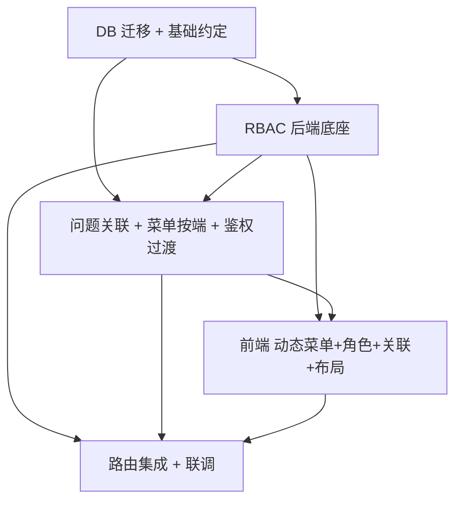
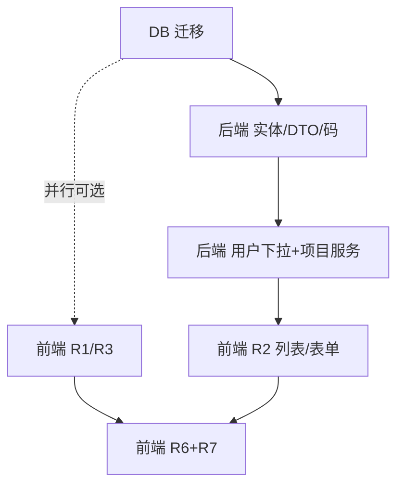
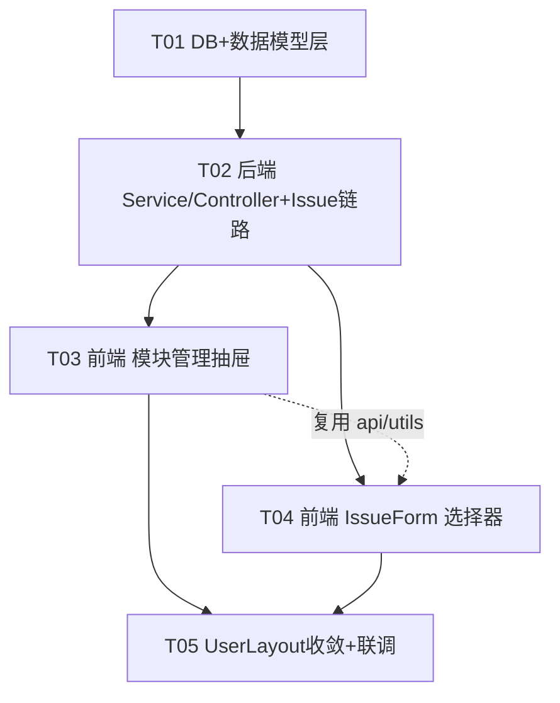
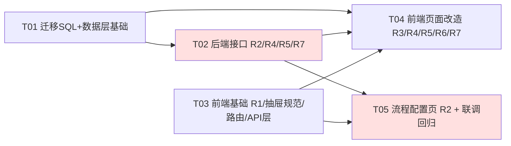

# issueFlow 增量设计演进合集（Phase 2–5）

> 文档版本：v1.0
> 文档日期：2026-08-04
> 文档状态：权威合并态 —— 将 `docs/archive/2026-08-04/` 下 `incremental-design-phase2.md` ~ `incremental-design-phase5.md` 四份增量技术设计按 phase 顺序拼接合并而成；各 phase 原始文档保留在 `docs/archive/2026-08-04/` 作为历史快照（不删除）。
> 角色：架构师 高见远
> 说明：Phase 6 / Phase 7 的增量架构设计已并入权威文档 `docs/ARCHITECTURE.md`（其详细任务分解保留在 `docs/archive/2026-08-04/ARCH_phase6.md`、`docs/archive/2026-08-04/ARCH_phase7.md`）。本文档仅覆盖 Phase 2–5 的增量技术设计。

## 版本历史

| 版本 | 日期 | 来源文档 | 内容 |
| --- | --- | --- | --- |
| v0.1 | 2026-07-30 | `incremental-design-phase2.md` | Phase 2 增量技术设计 + 任务分解：问题关联、权限目录、角色管理、菜单按端配置 |
| v0.2 | 2026-07-30 | `incremental-design-phase3.md` | Phase 3 增量架构设计：项目负责人/成员、流程配置、风格设置抽屉 |
| v0.3 | 2026-07-30 | `incremental-design-phase4.md` | Phase 4 增量架构设计：模块树、模块关联、流程管理菜单、功能联动约束 |
| v0.4 | 2026-07-31 | `incremental-design-phase5.md` | Phase 5 增量架构设计 + 任务分解：管理后台界面优化、组织管理、抽屉标准 |
| v1.0 | 2026-08-04 | 本文档 | 四份 phase 文档按顺序拼接合并 |

> 相关类图/时序图已归位至 `docs/diagrams/`（`class-diagram-phase2~5.mermaid` / `sequence-diagram-phase2~5.mermaid`）。
> **引用说明（重要）**：本文档内嵌各 phase 原文，其中引用的 `incremental-design-phaseN.md` / `prd-phaseN.md` / `ARCH_phaseN.md` 等历史文档均位于 **`docs/archive/2026-08-04/`** 下（同名保留，不删除）；引用的 `docs/incremental-class-diagram-phaseN.mermaid` / `docs/incremental-sequence-diagram-phaseN.mermaid` 已按规范归位至 **`docs/diagrams/class-diagram-phaseN.mermaid`** / **`docs/diagrams/sequence-diagram-phaseN.mermaid`**。

---

<!-- ========== 以下为 incremental-design-phase2.md 全文（保留原标题） ========== -->

# issueFlow 增量技术设计 + 任务分解（Phase 2）

> 架构师：高见远｜基于产品经理增量 PRD（prd-phase2.md）与主理人 6 项决策
> 代码根：`D:\WorkBuddyProjects\issueFlow`（`src/backend` 与 `src/frontend`）
> 本文为**增量设计**，仅描述 Phase 2 新增/改动点；既有 `architecture.md` / `incremental-design.md`（P0）/ 基线 mermaid 不覆盖。
> 配套图文件：`docs/incremental-class-diagram-phase2.mermaid`、`docs/incremental-sequence-diagram-phase2.mermaid`。
> 硬性约束：**不引入任何新第三方依赖**（后端无新 starter，前端零新包）。

---

## 1. 实现方案 + 框架选型

### 1.1 核心难点与原则
- **最小改动落地**：复用既有分层（Controller/Service/Mapper/Entity + req/resp DTO）、`Result<>`/`PageResult<>` 响应、`BaseEntity` 逻辑删除、私有 `requireAdmin()` 权限模式。Phase 2 在 P0 基座上做「横向能力增强」而非重构。
- **6 项需求归类**：
  - R1 后台顶栏入口收敛（纯前端，删 1 行）→ T04
  - R2 前台缓存清理（纯前端，加 1 项）→ T04
  - R3 问题关联（前置边建模 + 防环）→ T03（后端）+ T04（前端）
  - R4 菜单按端可配置 + 动态渲染（自引用树 + 递归 `SideMenu`）→ T03（后端）+ T04（前端）
  - R5 角色管理 + RBAC（单角色 + 权限集，Redis 缓存）→ T02（后端底座）+ T04（前端页）
  - R6 测试数据（幂等种子 SQL）→ T01
- **不触碰 JWT / AuthUtils 结构**（决策 1）：JWT 仍仅携带 `roleCode`；权限集走 Redis 缓存（key `perm:role:{roleId}`），变更即失效，无需重新登录（决策 4）。

### 1.2 技术选型（沿用既有栈，无新增）
| 关注点 | 选型 | 说明 |
|---|---|---|
| 后端 ORM | MyBatis-Plus（`BaseMapper` + `LambdaQueryWrapper`） | 实体继承 `BaseEntity`，逻辑删除 `deleted` |
| 鉴权助手 | `PermissionService.requirePermission(...)` 替代各 service 私有 `requireAdmin()` | ADMIN 首判放行；其余查 Redis 权限集 |
| 权限缓存 | Redis（`RedisTemplate<String,Object>`，与 `AuthService` 同 bean） | key `perm:role:{roleId}`，value 为逗号分隔权限码字符串 |
| 防环算法 | 内存 BFS（数据量小） | 沿"前置边"反向遍历；可选 MySQL 8 `WITH RECURSIVE` CTE |
| 前端框架 | Vue3 + Element Plus + Pinia + Vue Router | 复用 `request.js` 拦截器 |
| 动态菜单 | 新增递归组件 `SideMenu.vue`（`el-menu`/`el-sub-menu`） | 后端返回按端树，前端递归渲染 |
| 树/表单/表格 | `el-tree-select` / `el-table` + `el-dialog` | 与 `MenuManage`/`UserManage` 同范式 |

### 1.3 架构模式
沿用「贫血实体 + Service 业务逻辑 + Mapper 数据访问」MVC 变体；前后端分离、JWT 无状态。
新增模块（Permission/Role/IssueRelation）与既有 `Menu`/`Project` 完全同构。
`requirePermission` 作为共享 `@Service` 注入各业务 Service/Controller，取代散落的私有 `requireAdmin()`，实现「平滑迁移、ADMIN 始终放行、管理接口逐步切到权限码」。

---

## 2. 数据库变更清单（精确 DDL，落在 T01）

> 约定（与 `BaseEntity` 对齐）：`id BIGINT AUTO_INCREMENT`；`created_at`/`updated_at DATETIME`（MP 自动填充）；`deleted INT DEFAULT 0`；字符集 `utf8mb4`、引擎 `InnoDB`。
> 全部写入 `scripts/V20250801_issueflow_phase2.sql`，幂等（`CREATE TABLE IF NOT EXISTS` + `INSERT ... WHERE NOT EXISTS` + 动态 `ALTER` 防重复列）。

### 2.1 新表：`issue_relation`（仅存前置边，后置由反向推导）
```sql
CREATE TABLE IF NOT EXISTS `issue_relation` (
  `id`         BIGINT NOT NULL AUTO_INCREMENT,
  `issue_id`   BIGINT NOT NULL COMMENT '当前问题 X',
  `related_id` BIGINT NOT NULL COMMENT '关联问题 P（rel_type=1 表示 P 是 X 的前置）',
  `rel_type`   TINYINT NOT NULL DEFAULT 1 COMMENT '1=related_id 是 issue_id 的前置任务',
  `created_at` DATETIME DEFAULT NULL,
  `updated_at` DATETIME DEFAULT NULL,
  `deleted`    INT DEFAULT 0,
  PRIMARY KEY (`id`),
  UNIQUE KEY `uk_ir` (`issue_id`,`related_id`,`rel_type`),
  KEY `idx_ir_related` (`related_id`,`rel_type`),
  KEY `idx_ir_issue` (`issue_id`,`rel_type`)
) ENGINE=InnoDB DEFAULT CHARSET=utf8mb4 COMMENT='问题关联表（前置边）';
```

### 2.2 新表：`permission`（权限目录）
```sql
CREATE TABLE IF NOT EXISTS `permission` (
  `id`         BIGINT NOT NULL AUTO_INCREMENT,
  `code`       VARCHAR(100) NOT NULL COMMENT 'module:resource:action',
  `name`       VARCHAR(100) NOT NULL COMMENT '权限名称',
  `module`     VARCHAR(50)  DEFAULT NULL COMMENT '模块',
  `action`     VARCHAR(30)  DEFAULT NULL COMMENT '动作',
  `type`       TINYINT DEFAULT 2 COMMENT '1=前台端 2=后台端（授权页分组）',
  `sort`       INT DEFAULT 0,
  `created_at` DATETIME DEFAULT NULL,
  `updated_at` DATETIME DEFAULT NULL,
  `deleted`    INT DEFAULT 0,
  PRIMARY KEY (`id`),
  UNIQUE KEY `uk_perm_code` (`code`)
) ENGINE=InnoDB DEFAULT CHARSET=utf8mb4 COMMENT='权限目录';
```

### 2.3 新表：`role_permission`（角色-权限映射）
```sql
CREATE TABLE IF NOT EXISTS `role_permission` (
  `id`            BIGINT NOT NULL AUTO_INCREMENT,
  `role_id`       BIGINT NOT NULL,
  `permission_id` BIGINT NOT NULL,
  `created_at`    DATETIME DEFAULT NULL,
  PRIMARY KEY (`id`),
  UNIQUE KEY `uk_rp` (`role_id`,`permission_id`),
  KEY `idx_rp_role` (`role_id`)
) ENGINE=InnoDB DEFAULT CHARSET=utf8mb4 COMMENT='角色权限映射';
```

### 2.4 既有 `menu` 加端维度（迁移，防重复列）
```sql
SET @c := (SELECT COUNT(*) FROM information_schema.COLUMNS
  WHERE TABLE_SCHEMA=DATABASE() AND TABLE_NAME='menu' AND COLUMN_NAME='type');
SET @sql := IF(@c=0,
  'ALTER TABLE `menu` ADD COLUMN `type` TINYINT NOT NULL DEFAULT 2 COMMENT \'1前台端 2后台端\' AFTER `icon`',
  'SELECT 1');
PREPARE s FROM @sql; EXECUTE s; DEALLOCATE PREPARE s;
```

### 2.5 种子数据（R6，幂等，节选要点，详见 T01 任务说明）
- 组织层级、项目（默认项目 + 3 个新项目）、用户（admin + 职能角色用户各 2~3 名）。
- **权限目录**：写入 §5 附录全部权限码（约 27 条）。
- **角色权限映射**：ADMIN 全量；SUBMITTER/DEVELOPER/TESTER 最小集（`issue:list/create/update`、`dashboard:view`）。
- **菜单（按端）**：后台端(type=2) 整棵树（含「系统管理」父级 + 用户/组织/菜单/**角色**管理子项，均带 `permission`）；前台端(type=1) 工作台/我的问题/提交问题/个人看板。
- **问题 ≥12 条**：覆盖 status/severity/标签/项目；构造链式关联（A 前置 B、B 前置 C；D 前置 E），仅落前置边。
- **流程配置**：`sys_config` 置 `flow_reopen_enabled=1`、`flow_reject_enabled=1`。

---

## 3. 后端 API 契约（REST URL / Method / DTO / 权限）

> 权限列：`登录`=仅需 JWT；`ADMIN`=原 `requireAdmin`；`PERM:xxx`=本期 `requirePermission("xxx")`。
> `/options` 等只读下拉保持仅登录（决策：过渡期不收紧）。

### 3.1 问题关联（IssueController 新增，挂 `/api/issues`）
| Method | URL | 入参 | 出参 | 权限 |
|---|---|---|---|---|
| GET | `/api/issues/{id}/relations` | path `id` | `IssueRelationVO{predecessors:List<IssueRefVO>, successors:List<IssueRefVO>}` | 登录 |
| PUT | `/api/issues/{id}/relations` | path `id`；body `IssueRelationReq{predecessorIds:Long[], successorIds:Long[]}` | `void` | 登录 +（ADMIN 或 提交人）；成环抛 `RELATION_CYCLE` |
| GET | `/api/issues/options` | query `excludeId`(可选) | `List<IssueRefVO{id,issueNo,title,status}>` | 登录 |

- `IssueRefVO`：`Long id; String issueNo; String title; Integer status`
- 后置由反向推导：`successors` = 满足 `(issue_id=S, related_id=当前)` 的 S。
- 防环仅在前置边建模下校验（见 §6 + 时序图）。

### 3.2 菜单按端 + 动态渲染（MenuController 改造）
| Method | URL | 入参 | 出参 | 权限 |
|---|---|---|---|---|
| GET | `/api/menus` | query `type`(可选 1/2) | `List<MenuVO>`（扁平，含 `type`） | `PERM:menu:list`（ADMIN 放行） |
| GET | `/api/menus/sidebar` | query `type`(1/2，必填) | `List<MenuNodeVO>`（树，含 `children`） | 登录 |
| POST | `/api/menus` | `MenuReq(+type)` | `MenuVO` | `PERM:menu:create` |
| PUT | `/api/menus/{id}` | `MenuReq(+type)` | `MenuVO` | `PERM:menu:update` |
| DELETE | `/api/menus/{id}` | path `id` | `void` | `PERM:menu:delete`（有子节点 `NODE_HAS_CHILDREN`） |

- `MenuVO` 新增 `Integer type`；`MenuNodeVO extends MenuVO { List<MenuNodeVO> children; }`。
- `sidebar` 接口按 `type` + `deleted=0` + `sort,id` 排序后前端/后端组装树，返回整棵该端菜单树。

### 3.3 角色管理 + 权限目录（RoleController 新增，`/api/roles`；PermissionController 新增，`/api/permissions`）
| Method | URL | 入参 | 出参 | 权限 |
|---|---|---|---|---|
| GET | `/api/roles` | — | `List<RoleVO{id,code,name,description,permissionCount,builtin}>` | `PERM:role:list` |
| POST | `/api/roles` | `RoleReq{code,name,description}` | `RoleVO` | `PERM:role:create`（码不可与内置重复→`ROLE_CODE_DUPLICATE`） |
| PUT | `/api/roles/{id}` | `RoleReq{name,description}`（码不可改） | `RoleVO` | `PERM:role:update` |
| DELETE | `/api/roles/{id}` | path `id` | `void` | `PERM:role:delete`（内置角色→`ROLE_BUILTIN_PROTECTED`） |
| GET | `/api/roles/{id}/permissions` | path `id` | `List<String>` 权限码 | `PERM:role:assign` |
| PUT | `/api/roles/{id}/permissions` | body `RolePermissionReq{permissionCodes:String[]}` | `void`（整体替换 + 失效缓存） | `PERM:role:assign` |
| GET | `/api/permissions` | — | `List<PermissionVO{id,code,name,module,action,type,sort}>` | `PERM:role:assign`（或登录） |
| POST | `/api/roles/permissions/refresh` | — | `void`（重载全部角色权限缓存） | `PERM:role:assign` |

- 内置角色码集合：`ADMIN/SUBMITTER/DEVELOPER/TESTER`（`Constants.BUILTIN_ROLE_CODES`）；`builtin` 字段由 `code ∈ 内置集合` 推导。
- 原 `UserController.GET /api/roles` 迁移至 `RoleController`，避免重复映射（T02 同步移除 `UserController` 中的 `/roles`）。

### 3.4 全局 `requireAdmin → requirePermission` 过渡（T03 收口）
将以下管理模块 Service 层私有 `requireAdmin()` 替换为 `permissionService.requirePermission("xxx:action")`（ADMIN 在 `requirePermission` 内首判放行，行为不回退）：

| 模块 Service | 替换点 → 权限码 |
|---|---|
| `ProjectService` | create→`project:create`、update→`project:update`、delete→`project:delete`（list 保持仅登录） |
| `UserService` | 用户 CRUD→`user:create/update/delete`（list 保持仅登录） |
| `OrganizationService` | create/update/delete→`organization:create/update/delete` |
| `MenuService` | create/update/delete→`menu:create/update/delete`（list→`menu:list`） |
| `IssueService` | list/detail→`issue:list`、create→`issue:create`、update/delete→`issue:update`/`issue:delete`（保留 SUBMITTER 数据范围 + 提交人规则） |
| `SysConfigService` | 流程配置/系统设置写→`flow:config` / `settings:update`（读→`flow:view`/`settings:view`） |

> 说明：前端 admin 路由仍由 `routes.js` 的 `meta.roles:['ADMIN']` 守卫（P0 行为不变）；本期仅完成后端鉴权底座与「管理接口逐步切权限码」，功能角色可访问 admin 页面的路由级放行列入 P1（不阻塞本期交付）。

---

## 4. 数据结构与接口（类图，详见 `incremental-class-diagram-phase2.mermaid`）

### 4.1 新增实体
| 类 | 关键字段 |
|---|---|
| `IssueRelation extends BaseEntity` | `Long issueId; Long relatedId; Integer relType`（默认 1） |
| `Permission` | `String code; String name; String module; String action; Integer type; Integer sort`（**不继承 BaseEntity**，与 `role`/`sys_config` 同风格，无逻辑删除） |
| `RolePermission` | `Long roleId; Long permissionId`（**不继承 BaseEntity**） |
| `Menu`(+type) | 原字段 + `Integer type`（1前台/2后台，默认2） |

### 4.2 新增/扩展 DTO
| 类 | 字段 |
|---|---|
| `IssueRelationReq` | `List<Long> predecessorIds; List<Long> successorIds` |
| `IssueRelationVO` | `List<IssueRefVO> predecessors; List<IssueRefVO> successors` |
| `IssueRefVO` | `Long id; String issueNo; String title; Integer status` |
| `MenuReq`(+type) | 原字段 + `Integer type` |
| `MenuVO`(+type) | 原字段 + `Integer type` |
| `MenuNodeVO` | `MenuVO` + `List<MenuNodeVO> children` |
| `RoleReq` | `String code; String name; String description` |
| `RoleVO` | `Long id; String code; String name; String description; Integer permissionCount; Boolean builtin` |
| `RolePermissionReq` | `List<String> permissionCodes` |
| `PermissionVO` | `Long id; String code; String name; String module; String action; Integer type; Integer sort` |

### 4.3 新增 Mapper（均 `extends BaseMapper<T>`）
- `IssueRelationMapper`：`selectByIssueId(Long)`、`deleteByIssueId(Long)`、`selectIssueIdsByRelatedId(Long)`（自定义 `@Select`）
- `PermissionMapper`：`extends BaseMapper<Permission>`
- `RolePermissionMapper`：自定义 `@Select` `List<String> selectPermissionCodesByRoleId(Long roleId)`、`deleteByRoleId(Long)`、`insertBatch(...)`

### 4.4 新增 Service / Controller
- `PermissionService`（核心）：`requirePermission(String... perms)`、`Set<String> getPermissions(Long roleId)`（Redis 读→DB 兜底→写回）、`invalidate(Long roleId)`、`refreshAll()`、`@PostConstruct init()` 预热全部角色权限集与 `code→id` 内存映射。
- `RoleService`：CRUD + `assignPermissions(id, codes)`（整体替换 `role_permission` + 调 `permissionService.invalidate`）+ 内置保护。
- `IssueRelationService`：`getRelations(id)`、`saveRelations(id, predIds, succIds, uid, roleCode)`（防环 BFS + 事务替换）、`listOptions(excludeId)`。
- `RoleController` / `PermissionController`（见 §3.3）。
- `IssueController` 增 §3.1 三接口；`MenuController` 增 `sidebar` + `type` 过滤；`MenuService` 增 `listByType`/`listSidebarTree`。

---

## 5. 程序调用流程（时序图，详见 `incremental-sequence-diagram-phase2.mermaid`）

三张关键时序图：
1. **问题关联保存防环**：`IssueDetailDrawer` → `PUT /relations` → `IssueRelationService.saveRelations` → 权限校验 → 逐边 BFS 防环（`selectIssueIdsByRelatedId` 沿后继扩展）→ 事务删旧边 + 批量插新边 → 返回/抛 `RELATION_CYCLE`。
2. **角色权限分配与鉴权生效**：`RoleManage` → `PUT /roles/{id}/permissions` → `RoleService.assignPermissions` → 替换映射 → `permissionService.invalidate(roleId)`（删 `perm:role:{id}`）→ 下次请求 `requirePermission` 读 Redis 未命中→DB 重新加载→写回→即时生效（无需重新登录）。
3. **菜单动态渲染**：`AdminLayout` 挂载 `SideMenu type=2` → `onMounted` 调 `GET /menus/sidebar?type=2` → 后端按端组装树 → `SideMenu` 递归 `el-sub-menu`/`el-menu-item` 渲染（图标动态组件 + 激活态 + 折叠态保留）。

---

## 6. 关联防环算法（重点，具体实现建议）

### 6.1 建模约定（决策 2）
- 仅存**前置边**：`issue_relation(issue_id=X, related_id=P, rel_type=1)` ⇔ **P 是 X 的前置**（P 必须先于 X 完成）。
- 后置由反向查询推导：`X` 的后置 = 满足 `(issue_id=S, related_id=X)` 的 S。
- UI 提交 `{predecessorIds, successorIds}` 的落库映射：
  - `predecessorIds` 中每个 P → 边 `(issue_id=当前, related_id=P)`（P 是当前的前置）。
  - `successorIds` 中每个 S → 边 `(issue_id=S, related_id=当前)`（S 的前置是当前）。

### 6.2 成环判定（BFS，推荐，数据量小内存遍历即可）
新增边 `e=(issue_id=A, related_id=Y)`（即 Y 成为 A 的前置）。**成环当且仅当 A 已经（传递）必须在 Y 之前**——即存在 must-precede 路径 `A → … → Y`。
BFS 从 `A` 出发，沿"后继"方向扩展：当前节点 `N` 的后继 = `SELECT issue_id FROM issue_relation WHERE related_id = N AND rel_type=1 AND deleted=0` 得到的 `issue_id`（即 N 作为其前置的那些问题）。
- 若遍历中命中 `Y` → 成环，拒绝并提示冲突对 `(A, Y)`。
- 自关联 `A==Y` 直接拒绝。

```java
// IssueRelationService 片段（伪代码）
boolean wouldCreateCycle(Long A, Long Y) {
    if (A.equals(Y)) return true;                 // 自环
    Set<Long> visited = new HashSet<>();
    Deque<Long> q = new ArrayDeque<>();
    q.add(A); visited.add(A);
    while (!q.isEmpty()) {
        Long n = q.poll();
        if (n.equals(Y)) return true;             // A 能到达 Y → 成环
        for (Long succ : mapper.selectIssueIdsByRelatedId(n)) {  // related_id=n 的 issue_id
            if (visited.add(succ)) q.add(succ);
        }
    }
    return false;
}
```
- `saveRelations` 对每条待写边先 `wouldCreateCycle` 校验，全部通过后才在 `@Transactional` 内「删 `issue_id=A` 旧边 + 批量插新边」。
- **可选 MySQL 8 CTE 实现**（更稳，适合大数据）：用 `WITH RECURSIVE` 从 A 沿 `related_id` 反向展开后继，判断是否能到达 Y；本项目数据量小，BFS 更直观，推荐 BFS。

### 6.3 种子数据防环验证
构造链：5001 前置 5002、5002 前置 5003（边 `(5001,5002)`、`(5002,5003)`）。再尝试 5003 前置 5001（边 `(5003,5001)`）→ BFS 从 5003 命中 5001 → 应被拒。该用例供联调（T05）验证。

---

## 7. 前端设计要点

### 7.1 `SideMenu.vue`（递归动态菜单，R4 重点）
- Props：`type: Number`（1/2）。
- `onMounted` 调 `GET /menus/sidebar?type={type}`，存入 `menuTree`。
- 递归渲染：`v-for` 节点，有 `children` 用 `<el-sub-menu>`（index=path），否则 `<el-menu-item>`（index=path）；`router` 模式 + `:default-active="route.path"` 保持激活态。
- 图标：`icon` 字段（Element Plus 图标名）→ `<component :is="resolveIcon(icon)" />` 动态组件（`@element-plus/icons-vue` 按需引入映射表；未知图标降级为 `Menu` 默认图标）。
- 折叠态：接收 `appStore.sidebarCollapsed && !appStore.isMobile`，`el-menu :collapse` 保持现状体验。
- 权限过滤（P1 基础版，本期一并实现）：节点有 `permission` 且 `!userStore.isAdmin && !hasPerm(code)` 则隐藏；无 `permission` 对登录用户可见。（`hasPerm` 见 `utils/permission.js` 扩展。）

### 7.2 `AdminLayout.vue` / `UserLayout.vue`（R1 + R4 + R2）
- `AdminLayout`：① 移除顶栏 `<LayoutSwitchEntry variant="topbar" />`（第 85 行，R1）；② 侧栏 `<el-menu>` 硬编码整段替换为 `<SideMenu :type="2" />`，保留底部 `<LayoutSwitchEntry variant="sidebar" />` 与头像下拉（清理缓存/个人设置/退出）。
- `UserLayout`：① 侧栏硬编码菜单替换为 `<SideMenu :type="1" />`；② 头像下拉在「退出登录」前新增「清理缓存」（command=`clearCache`，图标 `Refresh`），逻辑复用后台 `localStorage.clear() + ElMessage + 600ms reload`（R2）。

### 7.3 `RoleManage.vue`（R5 前端，置于「系统管理」下）
- 列表 `el-table`：角色码/名称/描述/权限数/操作（编辑、分配权限、删除；内置角色禁用删除与改码）。
- 新建/编辑 Dialog：`RoleReq`（新建可填 code，内置角色不可改码）。
- 分配权限 Dialog：左模块分组 + 右操作复选（查看/新增/编辑/删除/导出），保存调 `PUT /roles/{id}/permissions`；权限目录来自 `GET /permissions` 按 `module` 分组。
- 路由：`routes.js` 在 `system` 父级下新增 `roles` 子路由（`meta.roles:['ADMIN']`，与现有 admin 页一致），`SystemLayout.vue` 作为容器透传。

### 7.4 `IssueDetailDrawer.vue`（R3 前端）
- 新增「关联问题」区（`el-divider` 分隔）：两个 `el-select multiple`「前置任务」「后置任务」，选项来自 `GET /issues/options`（排除自身）。
- 列表展示已关联问题（issueNo + 标题 + 状态标签），可点击跳转 `/admin/issues?issueId=xxx` 或调起详情。
- 抽取 `components/IssueRelationPanel.vue` 承载关联编辑 UI，被 `IssueDetailDrawer` 引入；保存调 `PUT /issues/{id}/relations`，失败（成环）提示具体冲突对。

### 7.5 `MenuManage.vue`（R4 管理页）
- 顶部「端」切换（Radio：前台端/后台端），列表与表单仅操作当前端。
- 表单新增「端」`el-radio`（1前台/2后台）。
- 树形列表按当前端构建；`parentTreeOptions` 仅含同端节点（跨端不可做父子）。
- 调用 `GET /menus?type=` 拉取当前端扁平列表，本地组装树。

---

## 8. 新增/修改文件列表（按路径，标注 后端/前端/DB）

> 后端根：`src/backend/src/main/java/com/issueflow/`；前端根：`src/frontend/src/`。

### 8.1 DB
- `scripts/V20250801_issueflow_phase2.sql`（新建 3 表 + menu 加 type + 全模块种子数据）

### 8.2 后端（新增 / 修改）
新增：
- `entity/IssueRelation.java`、`entity/Permission.java`、`entity/RolePermission.java`
- `mapper/IssueRelationMapper.java`、`mapper/PermissionMapper.java`、`mapper/RolePermissionMapper.java`
- `service/PermissionService.java`、`service/RoleService.java`、`service/IssueRelationService.java`
- `controller/RoleController.java`、`controller/PermissionController.java`
- `dto/req/RoleReq.java`、`dto/req/RolePermissionReq.java`、`dto/req/IssueRelationReq.java`
- `dto/resp/RoleVO.java`、`dto/resp/PermissionVO.java`、`dto/resp/IssueRelationVO.java`、`dto/resp/IssueRefVO.java`、`dto/resp/MenuNodeVO.java`

修改：
- `entity/Menu.java`（+`type`）、`dto/req/MenuReq.java`（+`type`）、`dto/resp/MenuVO.java`（+`type`）
- `common/ResultCode.java`（+`RELATION_CYCLE`/`ROLE_BUILTIN_PROTECTED`/`ROLE_CODE_DUPLICATE`）
- `common/Constants.java`（+`BUILTIN_ROLE_CODES`/`REDIS_PERM_ROLE_PREFIX`/`MENU_TYPE_*`）
- `service/MenuService.java`（+`type` 过滤、`listSidebarTree`、`requirePermission` 替换 `requireAdmin`）
- `service/IssueService.java`（+`requirePermission` 过渡；可选注入 `IssueRelationService` 供列表/详情回显关联摘要）
- `service/ProjectService.java` / `UserService.java` / `OrganizationService.java` / `SysConfigService.java`（私有 `requireAdmin` → `permissionService.requirePermission(...)`）
- `controller/MenuController.java`（+`/menus?type`、`/menus/sidebar`）
- `controller/IssueController.java`（+`/relations` 两接口、`/options`）
- `controller/UserController.java`（移除 `GET /roles` 列表，避免与 `RoleController` 冲突）

### 8.3 前端（新增 / 修改）
新增：
- `components/SideMenu.vue`、`components/IssueRelationPanel.vue`
- `views/admin/RoleManage.vue`
- `api/role.js`、`api/permission.js`

修改：
- `layouts/AdminLayout.vue`（移除顶栏 `LayoutSwitchEntry variant="topbar"`；侧栏硬编码菜单→`<SideMenu :type="2" />`）
- `layouts/UserLayout.vue`（侧栏→`<SideMenu :type="1" />`；头像下拉加「清理缓存」）
- `views/admin/MenuManage.vue`（+端切换）
- `components/IssueDetailDrawer.vue`（+关联区，引入 `IssueRelationPanel`）
- `api/menu.js`（+`getSidebarMenus(type)`、`listMenus(type)`）、`api/issue.js`（+`getRelations`、`saveRelations`、`listIssueOptions`）
- `store/user.js`（+`permissions` 状态、`getInfo` 时从 `GET /roles/{id}/permissions` 或独立接口装载；`hasPerm` getter）
- `utils/permission.js`（扩展 `hasPerm(code)` 按权限码判断；`v-perm` 指令兼容权限码）
- `router/routes.js`（system 下加 `roles` 子路由）

---

## 9. 任务列表（有序 + 依赖 + 实现顺序）

> 优先级均为 P0（本期交付）。依赖关系保证「DB→后端底座→后端收口→前端功能→集成联调」。
> 硬性约束：任务数 ≤5，每任务 ≥3 个相关文件，首任务为基础设施（本增量项目无新依赖/配置，故以「DB 迁移 + 基础约定」作为地基）。

| 任务 | 名称 | 源文件（新增/修改，标注 后端/F/前端/DB） | 依赖 | 优先级 |
|---|---|---|---|---|
| **T01** | 数据库迁移 + 基础数据约定 | DB：`scripts/V20250801_issueflow_phase2.sql`；后端：`common/ResultCode.java`、`common/Constants.java`、`entity/Menu.java`、`dto/req/MenuReq.java`、`dto/resp/MenuVO.java` | 无 | P0 |
| **T02** | RBAC 后端底座（角色/权限/鉴权助手） | 后端：`entity/Permission.java`、`entity/RolePermission.java`、`mapper/PermissionMapper.java`、`mapper/RolePermissionMapper.java`、`service/PermissionService.java`、`service/RoleService.java`、`controller/RoleController.java`、`controller/PermissionController.java`、`dto/req/RoleReq.java`、`dto/req/RolePermissionReq.java`、`dto/resp/RoleVO.java`、`dto/resp/PermissionVO.java`、`controller/UserController.java`（移除/roles） | T01 | P0 |
| **T03** | 问题关联 + 菜单按端 + 全局鉴权过渡（后端收口） | 后端：`entity/IssueRelation.java`、`mapper/IssueRelationMapper.java`、`service/IssueRelationService.java`、`dto/req/IssueRelationReq.java`、`dto/resp/IssueRelationVO.java`、`dto/resp/IssueRefVO.java`、`controller/IssueController.java`（+relations/options）、`service/MenuService.java`（+type/sidebar/`requirePermission`）、`controller/MenuController.java`（+/menus?type、/menus/sidebar）、`dto/resp/MenuNodeVO.java`、`service/IssueService.java`（+requirePermission 过渡）、`service/ProjectService.java`/`UserService.java`/`OrganizationService.java`/`SysConfigService.java`（requireAdmin→requirePermission）、`entity/Menu.java`/`dto/req/MenuReq.java`/`dto/resp/MenuVO.java`（已在 T01 改，本任务联调） | T01, T02 | P0 |
| **T04** | 前端 动态菜单 + 角色管理 + 问题关联 + 布局收敛 | 前端：`components/SideMenu.vue`、`components/IssueRelationPanel.vue`、`views/admin/RoleManage.vue`、`api/role.js`、`api/permission.js`、`layouts/AdminLayout.vue`（移除顶栏入口 + 用 SideMenu）、`layouts/UserLayout.vue`（用 SideMenu + 清理缓存）、`views/admin/MenuManage.vue`（+端）、`components/IssueDetailDrawer.vue`（+关联）、`api/menu.js`（+sidebar/options）、`api/issue.js`（+relations）、`store/user.js`（+permissions）、`utils/permission.js`（+hasPerm）、`router/routes.js`（+roles 路由） | T02, T03 | P0 |
| **T05** | 路由集成 + 联调回归 | 前端：`router/routes.js`（与 T04 同一文件，本任务核对 role 路由 + 权限守卫）、`views/admin/SystemLayout.vue`（确认 role 子路由容器）；测试：`tests/api/issueflow.postman_collection.json`（补充角色/权限/关联/菜单接口用例）；回归验证 6 需求 + 防环 + 权限即时生效 | T02, T03, T04 | P0 |

> 说明：T01 为地基；T02/T03 为后端（T03 依赖 T02 的 `PermissionService`）；T04 为前端功能（依赖后端接口）；T05 为集成与回归。R1（顶栏收敛）与 R2（前台缓存）已在 T04 的 `AdminLayout.vue`/`UserLayout.vue` 改动中落实，故不单列任务。

### 任务依赖关系图


---

## 10. 依赖包

**无新第三方依赖**（硬性约束）。
- 后端沿用：Spring Boot 3.2.5、MyBatis-Plus 3.5.7、MySQL 8 Connector、Redis 7（Spring Data Redis）、jjwt 0.12.x、Element/BCrypt 等既有依赖。
- 前端沿用：Vue3、Element Plus、Pinia、Vue Router、Axios、@element-plus/icons-vue。
- 防环 BFS 为纯 Java 集合实现；动态菜单复用 Element Plus `el-menu`；权限缓存复用既有 `RedisTemplate<String,Object>`。

---

## 11. 共享约定（跨模块，供 Engineer 遵循）

1. **权限模型**：单角色 `User.roleId` + 权限集（`role_permission`→`permission`）；JWT 不改结构，仅携带 `roleCode`；权限集走 Redis（`perm:role:{roleId}`，逗号分隔码字符串），变更即失效，无需重新登录。
2. **`requirePermission` 语义**：ADMIN 首判放行；其余取该角色权限集，与入参权限码做「存在交集即放行」（`!Collections.disjoint`，OR 语义，与 PRD 一致）；无权限抛 `PERMISSION_DENIED`。所有管理接口逐步从 `requireAdmin()` 切到 `requirePermission("module:resource:action")`。
3. **权限码命名**：`module:resource:action`，`action∈{list,create,update,delete,export,assign,view,config}`；模块见 §3.3 与权限目录种子。
4. **关联仅存前置边**：`issue_relation(issue_id=X, related_id=P, rel_type=1)` ⇔ P 是 X 的前置；后置由反向查询推导；保存时整体替换 `issue_id=当前` 的边；成环抛 `RELATION_CYCLE`（含冲突对）。
5. **菜单端维度**：`menu.type` 1=前台端 / 2=后台端（默认2）；整棵树（含「系统管理」父级）完全来自 `menu` 自引用 `parent_id`，数据驱动；前端 `SideMenu` 按 `type` 动态递归渲染，激活态/图标/折叠态保持现状。
6. **内置角色保护**：`ADMIN/SUBMITTER/DEVELOPER/TESTER` 禁止删除、禁止改角色码；新建角色码不可与内置重复（`ROLE_CODE_DUPLICATE`）。
7. **统一响应**：`Result<T>`/`PageResult<T>`；分页 `page`(默认1)/`size`(默认10)；列表 `sort ASC, id ASC`。
8. **逻辑删除**：`deleted`(0/1) + MP 全局；菜单/组织删除前校验无子节点（`NODE_HAS_CHILDREN`）；`issue_relation` 软删（MP 逻辑删）。
9. **种子数据幂等**：`CREATE TABLE IF NOT EXISTS` + `INSERT ... WHERE NOT EXISTS`；菜单/组织父子用「按 name+type 子查询解析 parent_id」保证可重跑；权限/角色权限映射用「按 code 子查询解析 id」避免硬编码 ID。
10. **前端调用约定**：复用 `request.js` 拦截器（解包 `Result`、401→登录、403→/403）；新增 API 封装到对应 `api/*.js`。

---

## 12. 风险与待明确事项

### 12.1 风险点（需主理人/工程师特别注意）
1. **菜单种子必须覆盖全部路由 path**：动态渲染后侧栏完全来自 `menu` 表；若种子漏写某路由（如新增的 `/admin/system/roles`），对应页面将无法从侧栏进入（路由本身仍可达）。**务必按 `routes.js` 现有/新增 path 一一对应写入种子**（见 T01 种子脚本注释清单）。
2. **`requireAdmin→requirePermission` 过渡的隐性放行**：`requirePermission` 对 ADMIN 首判放行，但若某管理接口误写为不调用 `requirePermission` 且未保留 `requireAdmin`，则任何登录用户可访问。**T03 替换时需逐方法核对，禁止「既无 requireAdmin 也无 requirePermission」的裸接口**（写操作）。
3. **权限缓存与 `code→id` 映射一致性**：`PermissionService` 在内存维护 `roleCode→roleId` 映射用于查缓存 key；新建/删除角色后必须 `refreshAll()` 或至少刷新该映射，否则新角色权限查不到（会被拒）。种子数据在应用首次启动 `@PostConstruct` 预热，需确认启动顺序（DB 已初始化后再起后端）。
4. **关联防环的并发写**：BFS 校验与落库非原子；高并发下两个请求可能同时通过校验后插入成环边。**本期数据量小、管理后台低频操作，可接受**；如需严格，可在 `(issue_id, related_id, rel_type)` 唯一索引 + 插入冲突时回滚并提示，或在事务内加 `SELECT ... FOR UPDATE` 锁。建议在 T03 实现时用 `@Transactional` + 唯一索引兜底。
5. **`/options` 等只读下拉保持仅登录**：过渡期不收紧，避免影响非管理员前端页面（如提交问题页的下拉）。切勿给 `/issues/options`、`/projects/options` 加 `requirePermission`。

### 12.2 待明确（已给推荐默认值，非阻塞）
1. **功能角色能否进入 admin 页面**：本期 admin 路由仍由 `meta.roles:['ADMIN']` 守卫（P0 行为），故即便后端授予 `issue:list`，功能角色仍被路由挡在 admin 页外；前端路由级按权限放行列入 P1。推荐本期保持 ADMIN 守卫，仅完成后端权限底座。
2. **`store/user.js` 权限装载时机**：推荐在 `getInfo()` 成功后并行拉取当前角色权限码集合（`GET /roles/{roleId}/permissions`）存入 `permissions`，供 `SideMenu` 过滤与 `v-perm` 指令使用；若担心额外请求，可改由后端 `info()` 一并返回（需改 `LoginVO`/`UserVO`，改动较大，故不采用）。
3. **前台「个人设置」**：按决策 6 本期不做，仅前台加「清理缓存」；个人设置 Dialog 沿用后台已有实现，不新增。

---

## 13. 待明确事项（Anything UNCLEAR / 假设）

- 假设：种子数据中的角色 ID、权限 ID 由 `WHERE NOT EXISTS` + 自增生成，不硬编码；菜单/组织父子用 name+type 子查询解析，避免重跑冲突。
- 假设：前端 `SideMenu` 图标映射表覆盖现有菜单所用图标（DataLine/Tickets/Folder/Switch/Setting/Brush/Tools/User/OfficeBuilding/Grid/HomeFilled/EditPen/DataLine 等），未知图标降级。
- 假设：`IssueService` 列表/详情本期不强制回显关联摘要（关联在详情 Drawer 内独立拉取），降低改动面；P1 再扩展列表「有依赖」标记列。
- 未明确（采用推荐默认）：功能角色进入 admin 页面的路由级放行（P1）；关联依赖图可视化（P2）；菜单拖拽排序（P2）；行级数据权限精细化（保持现状）。

---

> 配套图：`docs/incremental-class-diagram-phase2.mermaid`（实体/DTO/Service/Controller 关系）、`docs/incremental-sequence-diagram-phase2.mermaid`（防环保存 / 权限分配生效 / 菜单动态渲染）。


---

<!-- ========== 以下为 incremental-design-phase3.md 全文（保留原标题） ========== -->

# issueFlow 增量架构设计（Phase 3）

> 文档版本：v1.0（增量设计）
> 角色：架构师 高见远
> 关联：产品经理 PRD `docs/prd-phase3.md`、主理人 8 项决策、Phase 2 设计 `docs/incremental-design-phase2.md`
> 技术栈（沿用）：后端 Spring Boot 3.2.5 + MyBatis-Plus 3.5.7 + MySQL 8 + Redis 7 + JWT；前端 Vue3 + Element Plus + Pinia + Vue Router + Vite。**不引入任何新第三方依赖。**

---

## 1. 实现方案

### 1.1 技术难点与应对

| 难点 | 应对方案 |
|---|---|
| **R2 成员/负责人批量回填（避免 N+1）** | `ProjectService.pageProjects` 在 `toVO` 阶段，汇总当页所有 `leaderId` 与切分后的 `memberIds`，**一次性** `userMapper.selectBatchIds(...)`，构建 `Map<Long,User>`，回填 `leaderName` 与 `members`。逐行查 user 一律禁止。 |
| **R4 停用校验的一致性** | `ProjectService.updateProject` 加 `@Transactional`；仅当 `req.status==0 && exist.status==1` 时 `issueMapper.selectCount(projectId + status!=CLOSED + deleted=0)`，`>0` 抛 `BizException(PROJECT_HAS_OPEN_ISSUES)`。窄竞态由事务 + 既有行锁兜底，本期不做乐观锁。 |
| **R7 作用域隔离（不污染前台）** | 新写 `applyAdminStyleVars(state, rootEl)`，只写 **AdminLayout 根元素**（`.if-layout--admin`）的内联 CSS 变量 + `data-if-admin-style` 属性，**严禁**写 `document.documentElement`。前台 `UserLayout` 的 `el-color-picker` 仍走 `store/theme` + `localStorage['if_theme']`，互不影响。 |
| **R7 sticky 与现有 flex 布局兼容** | `position: sticky` 需要可滚动祖先与 `top:0`/`align-self`。在 `admin-style.css` 中为 `.if-topbar`/`.if-sidebar` 绑定 `--if-topbar-position`/`--if-sidebar-position` 变量（默认 `sticky`）。已知限制见 §9。 |
| **R5/R6 幂等种子 SQL** | 菜单 UPDATE 用子查询 `SELECT id FROM menu WHERE path='/admin/system'`（派生表包裹）解析父 id，避免硬编码；菜单软删除用 `deleted=1`。重跑安全。 |
| **R2 切换状态会误清空负责人/成员** | 后端 `updateProject` 对 `leaderId/memberIds` 采用「存在即覆盖」（不过滤 null）。前端 `onToggleStatus` 必须发送**完整 payload**（含 `leaderId`/`memberIds`），否则每次切状态会把负责人/成员置空。见 §9 风险 1。 |

### 1.2 框架选型

- 后端：沿用 Spring Boot + MyBatis-Plus + JWT + Redis。**无新依赖**。
- 前端：沿用 Vue3 + Element Plus + Pinia + Vue Router + Vite。**无新依赖**。
- 复用范式：`BaseEntity` / `Result<T>` / `PageResult<T>` / `ResultCode` / `BizException` / `PermissionService.requirePermission`（ADMIN 始终放行）；菜单动态渲染沿用 `SideMenu` + `menu.type`（R5 仅改种子，无前端代码）。
- R7 风格状态仅写 `localStorage`（key `if_admin_style`），**不进 Pinia**（避免 store 膨胀），由 `AdminStyleDrawer` 持有、`AdminLayout` `onMounted` 读取一次。

---

## 2. 数据库变更

> 文件：`scripts/V20260730_issueflow_phase3.sql`（今天 2026-07-30）
> 约定：ALTER 用 `information_schema` 动态防重复；菜单变更用软删除 + 子查询解析父 id；全部可重跑。

```sql
-- ============================================================
-- issueFlow Phase 3 增量 DDL + 种子数据（R2 / R5 / R6）
-- 幂等：ALTER 防重复列；菜单 UPDATE 用子查询解析父 id；软删除 deleted=1
-- ============================================================
SET NAMES utf8mb4;

-- ---------------------------------------------------------------------------
-- 1. project 加 leader_id / member_ids（动态 ALTER 防重复）
-- ---------------------------------------------------------------------------
SET @c1 := (SELECT COUNT(*) FROM information_schema.COLUMNS
  WHERE TABLE_SCHEMA=DATABASE() AND TABLE_NAME='project' AND COLUMN_NAME='leader_id');
SET @sql := IF(@c1=0,
  'ALTER TABLE `project` ADD COLUMN `leader_id` BIGINT DEFAULT NULL COMMENT \'负责人 id（user.id）\' AFTER `status`',
  'SELECT 1');
PREPARE s FROM @sql; EXECUTE s; DEALLOCATE PREPARE s;

SET @c2 := (SELECT COUNT(*) FROM information_schema.COLUMNS
  WHERE TABLE_SCHEMA=DATABASE() AND TABLE_NAME='project' AND COLUMN_NAME='member_ids');
SET @sql := IF(@c2=0,
  'ALTER TABLE `project` ADD COLUMN `member_ids` VARCHAR(500) DEFAULT NULL COMMENT \'项目成员 id，逗号分隔（上限约 80 人）\' AFTER `leader_id`',
  'SELECT 1');
PREPARE s FROM @sql; EXECUTE s; DEALLOCATE PREPARE s;

-- ---------------------------------------------------------------------------
-- 2. R5：流程配置 parent_id 指向「系统管理」（用子查询解析父 id，防硬编码）
--    派生表包裹以绕过 MySQL「不能在同一语句中 UPDATE 目标表又 SELECT 它」的限制
-- ---------------------------------------------------------------------------
UPDATE `menu`
SET `parent_id` = (SELECT `pid` FROM (
  SELECT `id` AS `pid` FROM `menu`
  WHERE `path` = '/admin/system' AND `type` = 2 AND `deleted` = 0
) AS `_p`)
WHERE `path` = '/admin/flow-config' AND `type` = 2 AND `deleted` = 0
  AND `parent_id` <> (SELECT `pid` FROM (
    SELECT `id` AS `pid` FROM `menu`
    WHERE `path` = '/admin/system' AND `type` = 2 AND `deleted` = 0
  ) AS `_p2`);

-- ---------------------------------------------------------------------------
-- 3. R6：系统设置菜单软删除（deleted=1，与 BaseEntity 软删约定一致）
-- ---------------------------------------------------------------------------
UPDATE `menu` SET `deleted` = 1
WHERE `path` = '/admin/settings' AND `type` = 2 AND `deleted` = 0;

-- ---------------------------------------------------------------------------
-- 4. （可选）R2 测试数据：给默认项目补负责人 + 成员（幂等 UPDATE，按 name 解析用户）
--    仅用于联调演示；生产环境可省略
-- ---------------------------------------------------------------------------
UPDATE `project`
SET `leader_id` = (SELECT `id` FROM `user` WHERE `username` = 'dev_zhang' AND `deleted` = 0 LIMIT 1),
    `member_ids` = (
      SELECT GROUP_CONCAT(`id`) FROM `user`
      WHERE `username` IN ('dev_zhao','test_li','test_qian') AND `deleted` = 0
    )
WHERE `name` = '核心交易系统' AND `deleted` = 0
  AND (`leader_id` IS NULL OR `member_ids` IS NULL);
```

> 说明：`sys_config` 表与 `/api/sys-config` 接口**保留不动**（主理人决策 R6）；`theme_color`/`layout`/`menu_config` 三个 key 本期不再由前端写入（R7 改存 localStorage），但库中不删除。

---

## 3. 新增 / 修改文件列表

### 3.1 后端（Spring Boot，`src/backend/.../com/issueflow/`）

| 操作 | 文件 | 改动要点 |
|---|---|---|
| 修改 | `entity/Project.java` | 新增 `leaderId`(Long)、`memberIds`(String) |
| 修改 | `dto/req/ProjectReq.java` | 新增 `leaderId`(Long)、`memberIds`(String)（非必填） |
| 修改 | `dto/resp/ProjectVO.java` | 新增 `leaderId`、`leaderName`、`memberIds`、`members: List<UserBriefVO>` |
| 新增 | `dto/resp/UserBriefVO.java` | `{id, realName, username, roleName}` |
| 修改 | `common/ResultCode.java` | 新增 `PROJECT_HAS_OPEN_ISSUES(40020, "该项目下存在未关闭问题，无法停用")` |
| 修改 | `service/ProjectService.java` | 注入 `UserMapper`/`IssueMapper`/`RoleMapper`；`pageProjects` 批量回填；`createProject`/`updateProject` 写 `leaderId`/`memberIds`；`updateProject` 加 `@Transactional` + R4 校验；`listOptions` 加 `.eq(status,1)`（R3） |
| 修改 | `controller/UserController.java` | 新增 `GET /api/users/options?keyword=`（仅登录，返回 `List<UserBriefVO>`） |
| 修改 | `service/UserService.java` | 新增 `listUserOptions(String keyword)`：查 `status=1 & deleted=0`，按 `real_name/username` 模糊匹配，上限 100，回填 `roleName` |

### 3.2 前端（`src/frontend/src/`）

| 操作 | 文件 | 改动要点 |
|---|---|---|
| 修改 | `api/user.js` | 新增 `listUserOptions(params)` → `GET /users/options` |
| 修改 | `views/admin/AdminIssueList.vue` | **R1**：删除头部「提交问题」按钮 + `goCreate` + `Plus` 引用 |
| 修改 | `views/admin/ProjectManage.vue` | **R2**：新增「负责人」「项目成员」列；表单加负责人/成员远程搜索 `el-select`；新增「列设置」Popover（localStorage `if_project_columns`）；`onToggleStatus` 发送完整 payload |
| 修改 | `components/IssueForm.vue` | **R3**：移除 `:disabled="p.status!==1"` 与「（停用）」后缀文案（后端已过滤） |
| 修改 | `router/routes.js` | **R6**：删除 `/admin/settings` 路由条目及 `SystemSettings.vue` 懒加载引用 |
| 删除 | `views/admin/SystemSettings.vue` | **R6**：迁移后死代码，删除 |
| 删除 | `components/ThemeConfigPanel.vue` | **R6**：能力已迁至 R7 抽屉，删除 |
| 修改 | `layouts/AdminLayout.vue` | **R7**：头像下拉加「整体风格设置」项（command=`styleSettings`）；挂载 `AdminStyleDrawer`；`onMounted` 读取 `if_admin_style` 并 `applyAdminStyleVars` |
| 新增 | `components/AdminStyleDrawer.vue` | **R7**：`ElDrawer` 右侧抽屉，7 项控件（本期仅亮色/暗色、主题色 10 预设、侧边菜单类型、内容区域宽度、固定 Header、固定侧边菜单、色弱模式），变更即时应用 + 持久化 |
| 修改 | `utils/theme.js` | 新增 `applyAdminStyleVars(state, rootEl)`（仅写 AdminLayout 根元素） |
| 新增 | `utils/adminStyle.js` | 常量 `ADMIN_STYLE_KEY`、`DEFAULT_ADMIN_STYLE`、`ADMIN_THEME_COLORS`（10 色）、`loadAdminStyle()`、`saveAdminStyle()` |
| 新增 | `styles/admin-style.css` | **R7** 作用域 CSS：仅对 `.if-layout--admin` / `[data-if-admin-style]` 生效，绑定 `--admin-sidebar-bg`/`--admin-content-max`/`--if-topbar-position`/`--if-sidebar-position`/`--if-color-weak-filter` 及暗色模式 |

> `api/sysConfig.js` 在 R6 后变为无引用死代码，可保留（不影响编译）或确认无引用后删除；`components/README.md`、`views/README.md`、`router/README.md` 中仍有 `SystemSettings.vue`/`ThemeConfigPanel.vue` 文档描述，非阻塞，建议后续清理。

---

## 4. 接口契约

统一响应：`Result<T> = { code, data, message }`，`code=200` 成功；业务异常由全局异常处理器返回对应 `code` + `message`，前端响应拦截器统一 `ElMessage.error(message)`。

| Method | URL | 入参 | 出参 | 权限 |
|---|---|---|---|---|
| GET | `/api/users/options` | `keyword`(可选，模糊匹配 real_name/username) | `List<UserBriefVO{id,realName,username,roleName}>`（上限 100，仅 `status=1 & deleted=0`） | 仅登录 |
| GET | `/api/projects` | `page,size` | `PageResult<ProjectVO>`（含 `leaderId,leaderName,memberIds,members`） | `project:list` |
| POST | `/api/projects` | `ProjectReq{name,description,status,leaderId,memberIds}` | `ProjectVO` | `project:create` |
| PUT | `/api/projects/{id}` | `ProjectReq`（同上；切停用走 R4） | `ProjectVO` | `project:update` |
| DELETE | `/api/projects/{id}` | path | `void` | `project:delete` |
| GET | `/api/projects/options` | — | `List<ProjectOptionVO>`（**R3 后仅 `status=1`**，保留 `status` 字段恒为 1） | 仅登录 |
| PUT | `/api/projects/{id}`（R4 校验失败） | `status` 由 1→0 且存在未关闭问题 | `BizException` → `Result{code:40020, message:"该项目下存在未关闭问题，无法停用"}` | `project:update` |

**UserBriefVO（新增）**
```java
class UserBriefVO { Long id; String realName; String username; String roleName; }
```

**ProjectVO 扩展字段**
```java
// 在既有 id/name/description/status/createdAt/updatedAt 基础上新增：
Long leaderId;
String leaderName;        // 由 userService 回查，缺省 null
String memberIds;         // 原始逗号串
List<UserBriefVO> members;// 由 memberIds 切分后批量查 user 封装（按原顺序，丢弃无效 id）
```

**权限要点**
- R2 项目负责人/成员维护沿用 `project:create`/`project:update`，不新增权限码。
- R2 `/api/users/options`、R3 `/api/projects/options`：仅登录（不调 `permissionService`），收紧的是可见性而非权限。
- R5/R6 菜单迁移为种子 SQL，无运行时权限变更；既有 `ADMIN` 始终放行规则不变。

---

## 5. 程序调用流程

> 完整时序见 `docs/incremental-sequence-diagram-phase3.mermaid`（R4 停用校验、R2 批量回填、R7 风格即时应用）。

**R2 项目分页批量回填（后端）**
`AdminLayout→ProjectManage.vue` 调 `GET /api/projects` → `ProjectController.page` → `ProjectService.pageProjects` → `projectMapper.selectPage` → 汇总当页 `leaderId` + 切分 `memberIds` → `userMapper.selectBatchIds(ids)`（一次）→ 构建 `Map<Long,User>` + `roleMap` → `toVO` 回填 `leaderName`/`members` → `PageResult<ProjectVO>`。

**R4 停用校验（后端）**
`ProjectManage.vue` `onToggleStatus`（完整 payload） → `PUT /api/projects/{id}` → `ProjectService.updateProject`@Transactional → `status` 由 1→0 且存在 `issue.project_id=id & status!=CLOSED & deleted=0` 时 `selectCount>0` → 抛 `BizException(40020)` → 全局异常处理器 → 前端 `catch` 回滚 `row.status` + 拦截器提示。

**R7 风格抽屉即时应用（前端）**
`AdminLayout.onMounted` → `loadAdminStyle()`（localStorage）→ `applyAdminStyleVars(state, rootEl)` 写 `.if-layout--admin` 内联变量 + `data-if-admin-style`。点击头像「整体风格设置」→ `AdminStyleDrawer` 打开 → 任一控件 change → `applyAdminStyleVars(state, document.querySelector('.if-layout--admin'))` 即时生效 + `saveAdminStyle(state)`。`rootEl` 限定后台根，不触 `document.documentElement`。

---

## 6. 任务列表（有序、含依赖、按实现顺序）

> 标注：【DB】数据库 /【后端】Spring Boot /【前端】Vue3。工程师按 T 序号顺序实现。

### T01【DB】Phase 3 数据库迁移（无后端依赖，最先执行）
- 文件：`scripts/V20260730_issueflow_phase3.sql`
- 内容：§2 的 ALTER（leader_id/member_ids）+ R5 菜单 UPDATE + R6 菜单软删除 + 可选测试数据。
- 依赖：无
- 验收：重跑 2 次无报错；`project` 含两新列；「流程配置」父级为「系统管理」；「系统设置」`deleted=1`。

### T02【后端】实体 / DTO / 业务码扩展
- 文件：`entity/Project.java`、`dto/req/ProjectReq.java`、`dto/resp/ProjectVO.java`、`dto/resp/UserBriefVO.java`（新）、`common/ResultCode.java`
- 内容：Project 加 `leaderId`/`memberIds`；ProjectReq 同加；ProjectVO 加 `leaderId/leaderName/memberIds/members`；新增 UserBriefVO；ResultCode 加 `PROJECT_HAS_OPEN_ISSUES(40020,...)`。
- 依赖：T01（字段需与 DB 对齐，但编译不依赖；可并行）
- 验收：`mvn compile` 通过；新枚举存在。

### T03【后端】用户下拉 + 项目服务（R2/R3/R4 核心）
- 文件：`service/UserService.java`、`controller/UserController.java`、`service/ProjectService.java`
- 内容：
  - `UserService.listUserOptions(keyword)`：登录用户、`status=1 & deleted=0`、模糊匹配、`LIMIT 100`、回填 `roleName`。
  - `UserController` 新增 `GET /api/users/options`。
  - `ProjectService`：注入 `UserMapper`/`IssueMapper`/`RoleMapper`；`pageProjects` 批量回填（见 §5）；`createProject`/`updateProject` 写 `leaderId`/`memberIds`（存在即覆盖）；`updateProject` 加 `@Transactional` + R4 校验；`listOptions` 加 `.eq(status,1)`。
- 依赖：T02
- 验收：分页接口返回 `leaderName`/`members`；`/api/users/options` 上限 100；停用有未关闭问题返回 40020；`/api/projects/options` 仅启用项。

### T04【前端】R1/R3 收口（纯前端，轻量）
- 文件：`views/admin/AdminIssueList.vue`、`components/IssueForm.vue`
- 内容：
  - R1：删除「提交问题」按钮 + `goCreate` + `Plus` import。
  - R3：`IssueForm` 关联项目下拉移除 `:disabled` 与「（停用）」后缀（`label` 直接用 `p.name`）。
- 依赖：无（可与 T05 并行）
- 验收：`/admin/issues` 头部无新建按钮；提交问题页下拉无停用项且无灰显。

### T05【前端】R2 项目列表/表单增强
- 文件：`api/user.js`、`views/admin/ProjectManage.vue`
- 内容：
  - `api/user.js` 加 `listUserOptions(params)`。
  - `ProjectManage.vue`：列表加「负责人」「项目成员」列（成员首 3 名 +「…等 N 人」）；表单加负责人/成员远程搜索 `el-select`（成员 `multiple`）；「列设置」Popover + Checkbox（localStorage `if_project_columns`，操作列恒显）；`onToggleStatus` 发送**完整 payload**（含 `leaderId`/`memberIds`）；提交表单带 `leaderId`/`memberIds`。
- 依赖：T03（接口就绪）
- 验收：新建项目选负责人+成员后列表正确回显；列设置持久化；切状态不丢负责人/成员。

### T06【前端】R6 收尾 + R7 风格抽屉
- 文件：`router/routes.js`、`views/admin/SystemSettings.vue`（删）、`components/ThemeConfigPanel.vue`（删）、`layouts/AdminLayout.vue`、`components/AdminStyleDrawer.vue`（新）、`utils/theme.js`、`utils/adminStyle.js`（新）、`styles/admin-style.css`（新）
- 内容：
  - R6：`routes.js` 删除 `/admin/settings` 路由及 `SystemSettings.vue` 引用；删除两个 vue 文件；`grep` 清理悬空 import。
  - R7：`utils/theme.js` 加 `applyAdminStyleVars(state, rootEl)`（仅写 AdminLayout 根）；`utils/adminStyle.js` 加常量/读写；`AdminStyleDrawer` 实现 7 项控件（按 §3.2 + 决策 6/7）；`AdminLayout` 下拉加项 + 挂载抽屉 + `onMounted` 应用；`admin-style.css` 作用域 CSS。
- 依赖：T04/T05 已稳定（避免冲突）；R7 独立
- 验收：侧栏无「系统设置」；抽屉 7 项即时生效且刷新保持；前台 `UserLayout` 不受任何项影响；`grep ThemeConfigPanel|SystemSettings` 无残留引用（README 除外）。

### 任务依赖关系图


---

## 7. 依赖包

**无新增依赖。** 全部复用既有栈：
- 后端：`spring-boot-starter-web` 3.2.5、`mybatis-plus-boot-starter` 3.5.7、`spring-boot-starter-data-redis` 7、`jjwt`(JWT)、`lombok`、`mysql-connector-j` 8。
- 前端：`vue` 3、`element-plus`、`pinia`、`vue-router`、`axios`、`@element-plus/icons-vue`、`vite`。

---

## 8. 共享约定

1. **响应契约**：`Result<T>{code,data,message}`，`code=200` 成功；业务异常由 `GlobalExceptionHandler` 统一包装；前端 `api/request.js` 拦截器对 `code!=200` 调 `ElMessage.error(message)` 并 reject。
2. **日期**：JSON 用 `yyyy-MM-dd HH:mm:ss`（`@JsonFormat`）。
3. **localStorage key 约定**：
   - `if_project_columns`：项目列表列显隐（JSON 数组，操作列恒显）。
   - `if_admin_style`：R7 后台风格（JSON，仅 AdminLayout）。
   - `if_theme`：前台主题（store/theme，独立于 R7）。
   - `if_user` / `if_app`：既有用户态 / 侧栏折叠态。
4. **软删除**：`deleted=1`；查询过滤 `deleted=0`；菜单/用户下拉均过滤。
5. **权限**：`PermissionService.requirePermission` 鉴权；`ADMIN` 始终放行；下拉类接口仅登录（不调 `requirePermission`）。
6. **R7 作用域铁律**：`applyAdminStyleVars` 第一个参数为 AdminLayout 根元素，**绝不**写 `document.documentElement`；CSS 选择器以 `.if-layout--admin` / `[data-if-admin-style]` 限定。

---

## 9. 风险与待明确事项

1. **【高】R4 与切状态会清空负责人/成员**：后端 `updateProject` 对 `leaderId/memberIds` 采用「存在即覆盖」，前端 `onToggleStatus` **必须**发送完整 payload（`name/description/status/leaderId/memberIds`）。若只发 `{name,status}`，每次切状态会把负责人/成员置空。`ProjectManage.vue` 的 `onToggleStatus` 必须用 `row.leaderId`/`row.memberIds` 补足。
2. **【高】R7 作用域污染**：`applyAdminStyleVars` 严禁写 `document.documentElement`；一旦写全局 `:root`，前台 `UserLayout` 顶栏 `el-color-picker` 会串色。落点必须是 `.if-layout--admin` 根元素。
3. **【中】R7 sticky 已知限制**：当前布局 `.if-layout{height:100%}` + `.if-content{overflow:auto}`（内容内部滚动），`.if-topbar`/`.if-sidebar` 当前本就「固定」。将 `fixedHeader/fixedSidebar` 切为 `static` 时可见差异有限，属已知限制；建议默认保持 ON，滚动模型改造留 P1。
4. **【中】R2 N+1 回归**：`pageProjects` 必须一次性 `selectBatchIds` 回填，禁止在 `toVO` 中对单行逐个查 user；成员 `memberIds` 切分后丢弃无法解析的 id（避免脏数据导致回显缺失）。
5. **【中】R6 死代码清理**：删除 `SystemSettings.vue`/`ThemeConfigPanel.vue` 后，需 `grep` 确认 `routes.js`、`api/sysConfig.js` 引用清理；`api/sysConfig.js` 将无引用，可保留（无害）或删除（需确认无其他 import）。
6. **【低】R5 路由 path 兼容**：保留 `/admin/flow-config` 旧 path（深链兼容），仅改菜单 `parent_id`；SideMenu 动态渲染使其归到「系统管理」下，无前端路由改动。P1 再考虑 301 到 `/admin/system/flow-config`。
7. **【待明确】R7 主题色 10 色具体 hex**：主理人决策「完全沿用截图 10 色预设（蓝/浅蓝/红/橙/黄/绿/青/紫/紫红/粉灰）」，但设计侧未拿到精确 hex。本设计在 `adminStyle.js` 给出**推荐默认 10 色**（蓝 #409EFF、浅蓝 #69B1FF、红 #F56C6C、橙 #E6A23C、黄 #FADB14、绿 #67C23A、青 #13C2C2、紫 #722ED1、紫红 #EB2F96、粉灰 #D597B9），**工程师实现时需对照实际截图核对精确色值**。
8. **【低】R3 前端冗余**：`IssueForm` 移除 `disabled` 后，后端已过滤停用项，下拉不会出现停用项；保留 `status` 字段用于 P1 扩展，但不应再用于前端判断。
9. **【低】暗色模式范围**：R7「主题模式（亮色/暗色）」仅作用于后台内容区/文本底色（`admin-style.css` 提供 `[data-if-admin-theme="dark"]` 最小覆盖），侧栏默认深色不变；完整暗色主题（含 Element Plus 组件暗色）留 P1。


---

<!-- ========== 以下为 incremental-design-phase4.md 全文（保留原标题） ========== -->

# issueFlow 增量架构设计（Phase 4）

> 文档版本：v1.0（增量设计）
> 角色：架构师 高见远
> 关联：产品经理 PRD `docs/prd-phase4.md`、主理人 10 项决策（Q1~Q10 已全部拍板）、Phase 3 设计 `docs/incremental-design-phase3.md`
> 技术栈（沿用）：后端 Spring Boot 3.2.5 + MyBatis-Plus 3.5.7 + MySQL 8 + Redis 7 + JWT；前端 Vue3 + Element Plus + Pinia + Vue Router + Vite。**不引入任何新第三方依赖。**
> 配套图：`docs/incremental-class-diagram-phase4.mermaid`、`docs/incremental-sequence-diagram-phase4.mermaid`

---

## 1. 实现方案

### 1.1 技术难点与应对

| 难点 | 应对方案 |
|---|---|
| **R1 树形存储与「查子孙」**（Q1 已拍板：邻接表） | `module` 表 `parent_id` 自引用（与 `menu` 表同范式）。单项目模块量级可控（P2 才考虑 >1000 节点），所有树操作采用「**一次全量查该项目模块 → 内存组树**」：`ModuleService.loadProjectModules(projectId)` 返回 `List<Module>`，内存构建 `parentId -> children` 映射，`collectDescendantIds` / `depthOf` 均为内存递归。**禁止**逐层递归查库，不用 MySQL 递归 CTE。 |
| **R1 层级软上限**（Q2：产品软限 10 层） | `create`：`depthOf(parentId)+1 > 10` 抛 `MODULE_DEPTH_EXCEEDED`；`move`/`batch-move`：`目标深度 + 被移子树高度 > 10` 同样拦截（子树高度内存计算）。技术上不设硬限。 |
| **R1 拖拽即拖即存**（Q3） | 一次拖拽 = 1 个接口：`PUT /api/modules/{id}/move`，body `{targetParentId, orderedSiblingIds}`。后端在事务内：改 `parent_id` + 按 `orderedSiblingIds` 全量重排目标层级 `sort=1..n`。前端 `@node-drop` 调接口，**失败 catch 后重新拉树回滚 UI**（不做本地 undo，简单可靠）。 |
| **R1 拖拽/移动防环** | `targetParentId` 命中「自身或其子孙集合」→ 抛 `MODULE_MOVE_CYCLE`。前端 `el-tree` 的 `allow-drop` 做同规则预检（体验），后端为最终裁决（安全）。 |
| **R1 依赖标记防环**（Q4：提 P0，单向 A→B，仅展示） | `PUT /api/modules/{id}/dependencies` 全量替换该模块的依赖集合。校验：以「项目内现有依赖边（排除本模块旧边）+ 本次新边」构有向图，从 `id` 出发 DFS，若可回到 `id` 则抛 `MODULE_DEPENDENCY_CYCLE`。 |
| **依赖表唯一索引与软删的冲突** | `module_dependency` 保留 `deleted` 列对齐 BaseEntity 范式，但唯一索引 `uk(from_module_id,to_module_id)` 与软删复活相斥（软删后重建同边会撞唯一键）。**设置依赖采用「先物理清空该 from 的全部行（含 deleted=1 残留）再批量插入」**：`ModuleDependencyMapper.deletePhysicalByFromId(fromId)`（自定义 `@Delete` SQL 绕过 `@TableLogic`）。关系表无审计价值，物理清空可接受；删除模块时同样物理清理其作为 from / to 的所有边。 |
| **R5-2 删除校验（Q5 批量整体原子阻断 + Q6 级联软删子孙）** | 事务内：收集所选节点 ∪ 各自子孙 → 去重得 `scopeIds` → `issueMapper.selectCount(module_id IN scopeIds AND deleted=0)`。批量删除按「所选根节点」分组统计关联数，任一 >0 则**整体拒绝**，message 列出「模块名(N)」明细；全部为 0 才对 `scopeIds` 批量软删 + 物理清理依赖边。单删是批量的特例（ids 长度 1）。 |
| **R5-1 模块归属校验** | `IssueService.createIssue/updateIssue`：`moduleId` 非空时查 `module`，要求 `deleted=0` 且 `module.project_id == 最终生效的 issue.projectId`（projectId 为空而 moduleId 非空也判 mismatch），否则抛 `MODULE_PROJECT_MISMATCH`。 |
| **问题列表回显模块路径（避免 N+1）** | 沿用 Phase 3 批量回填范式：当页收集 `moduleIds` → `ModuleService.pathMap(moduleIds)`：批查这些 module → 汇总涉及 projectIds → 一次查这些项目的全量模块 → 内存向上拼「父 > 子 > 孙」路径 Map → 回填 `IssueVO.modulePath`。无归属/查不到时前端显示「—」。 |
| **R2-2 搜索过滤高亮复用** | 后台抽屉搜索与前台 IssueForm 树选择器共用 `utils/moduleTree.js`：`filterTreeByKeyword`（命中节点 + 祖先链保留）、`splitByKeyword`（返回分段数组供自定义节点插槽渲染 `<span class="hl">`，**不用 v-html**，防 XSS）。 |
| **R4 菜单归拢零前端改动**（Q10：不建路由） | 「流程管理」父菜单 `path=/admin/flow` 仅作 `el-sub-menu` 的 index。论证：`SideMenu.vue` 对含 children 的节点渲染 `el-sub-menu`，点击父级只触发展开/收起、**不产生路由导航**（与「系统管理」父级行为一致——SystemLayout 路由从不经父菜单点击触达），故无 404 风险，**不加 redirect 兜底路由**，`routes.js` 零改动。手输 `/admin/flow` 属非预期路径，走全局 404 兜底，可接受。 |
| **R3 移除取色器不伤主题**（Q7：仅移除入口） | 仅删 `UserLayout.vue` 中 `<LayoutSwitchEntry variant="topbar">`、`el-color-picker` 及 `themeColor` / `onThemeChange` / `useThemeStore` 引用；`store/theme.js`、`utils/theme.js`、`localStorage['if_theme']` 与 `main.js` 的 `themeStore.init()` **全部保留**，已存主题色继续生效。`LayoutSwitchEntry.vue` 组件文件保留（sidebar 形态仍在用）。 |

### 1.2 框架选型

- 后端：沿用 Spring Boot + MyBatis-Plus + JWT + Redis，**无新依赖**。
- 前端：沿用 Vue3 + Element Plus（`el-tree` draggable/checkbox、`el-tree-select`、`el-drawer` 均为内置组件）+ Pinia + Vue Router + Vite，**无新依赖**。
- 复用范式：`BaseEntity` / `Result<T>` / `ResultCode` / `BizException` / `GlobalExceptionHandler` / `PermissionService.requirePermission`（ADMIN 放行）；菜单动态渲染 `SideMenu` + 种子 SQL（R4 零前端代码）。
- **权限决策**：模块写操作**复用 `project:update`**，`GET /api/modules/tree` 仅登录。理由：模块管理入口挂在「项目管理」页抽屉内，不新增独立菜单/页面；不新增 `module:*` 权限码即无 permission 表种子与角色勾选联动，改动面最小（采纳 PRD §6 备选一）。

---

## 2. 数据库变更

> 文件：`scripts/V20260801_issueflow_phase4.sql`
> 约定（沿用 Phase 3）：建表 `CREATE TABLE IF NOT EXISTS`；加列用 `information_schema` 动态防重复；菜单种子 `INSERT ... WHERE NOT EXISTS` + UPDATE 用派生表子查询解析父 id；全部可重跑（幂等）。

```sql
-- ============================================================
-- issueFlow Phase 4 增量 DDL + 种子（R1 / R2 / R4 / R5）
-- ============================================================
SET NAMES utf8mb4;

-- 1. module 表（邻接表：parent_id 自引用，0=根；同 menu 范式）
CREATE TABLE IF NOT EXISTS `module` (
  `id`          BIGINT       NOT NULL AUTO_INCREMENT,
  `project_id`  BIGINT       NOT NULL           COMMENT '所属项目 id（project.id，逻辑删除下不加外键）',
  `parent_id`   BIGINT       NOT NULL DEFAULT 0 COMMENT '父模块 id，0=根',
  `name`        VARCHAR(50)  NOT NULL           COMMENT '模块名称（同父级下唯一，应用层校验）',
  `description` VARCHAR(200) DEFAULT NULL       COMMENT '模块描述',
  `sort`        INT          NOT NULL DEFAULT 0 COMMENT '同级排序号，升序',
  `created_at`  DATETIME     DEFAULT NULL,
  `updated_at`  DATETIME     DEFAULT NULL,
  `deleted`     TINYINT      NOT NULL DEFAULT 0 COMMENT '逻辑删除 0/1',
  PRIMARY KEY (`id`),
  KEY `idx_module_project` (`project_id`, `parent_id`, `deleted`)
) ENGINE=InnoDB DEFAULT CHARSET=utf8mb4 COMMENT='项目模块（树形，邻接表）';

-- 2. module_dependency 表（单向 A 依赖 B；uk 防重；service 层物理清空重建，deleted 列仅对齐范式）
CREATE TABLE IF NOT EXISTS `module_dependency` (
  `id`             BIGINT   NOT NULL AUTO_INCREMENT,
  `from_module_id` BIGINT   NOT NULL COMMENT '依赖方模块 id（A）',
  `to_module_id`   BIGINT   NOT NULL COMMENT '被依赖模块 id（B）',
  `created_at`     DATETIME DEFAULT NULL,
  `updated_at`     DATETIME DEFAULT NULL,
  `deleted`        TINYINT  NOT NULL DEFAULT 0,
  PRIMARY KEY (`id`),
  UNIQUE KEY `uk_dep_from_to` (`from_module_id`, `to_module_id`),
  KEY `idx_dep_to` (`to_module_id`)
) ENGINE=InnoDB DEFAULT CHARSET=utf8mb4 COMMENT='模块依赖（A 依赖 B，仅展示语义）';

-- 3. issue 加 module_id（可空 + 索引，动态 ALTER 防重复）
SET @c1 := (SELECT COUNT(*) FROM information_schema.COLUMNS
  WHERE TABLE_SCHEMA=DATABASE() AND TABLE_NAME='issue' AND COLUMN_NAME='module_id');
SET @sql := IF(@c1=0,
  'ALTER TABLE `issue` ADD COLUMN `module_id` BIGINT DEFAULT NULL COMMENT ''所属模块 id（module.id，可空）'' AFTER `project_id`, ADD INDEX `idx_issue_module` (`module_id`)',
  'SELECT 1');
PREPARE s FROM @sql; EXECUTE s; DEALLOCATE PREPARE s;

-- 4. R4 菜单种子：新增一级「流程管理」（无 permission，登录可见，同「系统管理」父级范式）
INSERT INTO `menu` (`name`, `path`, `parent_id`, `sort`, `permission`, `icon`, `type`, `created_at`, `updated_at`)
SELECT '流程管理', '/admin/flow', 0, 4, NULL, 'Operation', 2, NOW(), NOW()
WHERE NOT EXISTS (SELECT 1 FROM `menu` WHERE `path`='/admin/flow' AND `type`=2 AND `deleted`=0);

-- 4.1 「流程配置」父级：系统管理 → 流程管理（派生表绕过 MySQL 同表 UPDATE/SELECT 限制），子级 sort=1
UPDATE `menu`
SET `parent_id` = (SELECT `pid` FROM (
      SELECT `id` AS `pid` FROM `menu`
      WHERE `path`='/admin/flow' AND `type`=2 AND `deleted`=0) AS `_p`),
    `sort` = 1
WHERE `path`='/admin/flow-config' AND `type`=2 AND `deleted`=0
  AND `parent_id` <> (SELECT `pid` FROM (
      SELECT `id` AS `pid` FROM `menu`
      WHERE `path`='/admin/flow' AND `type`=2 AND `deleted`=0) AS `_p2`);

-- 4.2 「流程监控」父级：顶级(0) → 流程管理，子级 sort=2
UPDATE `menu`
SET `parent_id` = (SELECT `pid` FROM (
      SELECT `id` AS `pid` FROM `menu`
      WHERE `path`='/admin/flow' AND `type`=2 AND `deleted`=0) AS `_p`),
    `sort` = 2
WHERE `path`='/admin/flow-monitor' AND `type`=2 AND `deleted`=0
  AND `parent_id` <> (SELECT `pid` FROM (
      SELECT `id` AS `pid` FROM `menu`
      WHERE `path`='/admin/flow' AND `type`=2 AND `deleted`=0) AS `_p2`);
```

> 顶级菜单最终排序：概览(1) → 问题管理(2) → 项目管理(3) → **流程管理(4)** → 系统管理(5)。原顶级「流程监控」sort=4 被收编为子级后不与「流程管理」冲突。
> **不新增权限码种子**：模块写操作复用 `project:update`，permission 表零变更。

---

## 3. 新增 / 修改文件列表

### 3.1 数据库（`scripts/`）

| 操作 | 文件 | 改动要点 |
|---|---|---|
| 新增 | `scripts/V20260801_issueflow_phase4.sql` | §2 全部内容（module / module_dependency 建表 + issue 加列 + R4 菜单种子），幂等可重跑 |

### 3.2 后端（`src/backend/src/main/java/com/issueflow/`）

| 操作 | 文件 | 改动要点 |
|---|---|---|
| 新增 | `entity/Module.java` | 继承 `BaseEntity`；`projectId`(Long)、`parentId`(Long)、`name`、`description`、`sort`(Integer)；`@TableName("module")` |
| 新增 | `entity/ModuleDependency.java` | 继承 `BaseEntity`；`fromModuleId`、`toModuleId`；`@TableName("module_dependency")` |
| 新增 | `mapper/ModuleMapper.java` | `extends BaseMapper<Module>`，无自定义 SQL |
| 新增 | `mapper/ModuleDependencyMapper.java` | `extends BaseMapper<ModuleDependency>`；自定义物理删除：`deletePhysicalByFromId(Long)`、`deletePhysicalByModuleIds(List<Long>)`（`@Delete`，绕过 @TableLogic） |
| 修改 | `entity/Issue.java` | 新增 `moduleId`(Long) |
| 修改 | `common/ResultCode.java` | 新增 7 个业务码（见 §4.3） |
| 新增 | `dto/req/ModuleReq.java` | `{projectId, parentId, name, description}`；create 全用，update 仅取 `name/description` |
| 新增 | `dto/req/ModuleMoveReq.java` | `{targetParentId, orderedSiblingIds: List<Long>}` |
| 新增 | `dto/req/ModuleBatchReq.java` | `{projectId, ids: List<Long>, targetParentId}`；batch-delete 不读 `targetParentId`，batch-move 必填 |
| 新增 | `dto/req/ModuleDependencyReq.java` | `{dependsOnIds: List<Long>}`（全量替换语义，空数组=清空） |
| 新增 | `dto/resp/ModuleNodeVO.java` | `{id, projectId, parentId, name, description, sort, dependencyCount, dependencies: List<ModuleBriefVO>, children: List<ModuleNodeVO>}` |
| 新增 | `dto/resp/ModuleBriefVO.java` | `{id, name}`（悬浮依赖列表用） |
| 新增 | `service/ModuleService.java` | tree / create / update / delete / move / batchDelete / batchMove / setDependencies / pathMap；内部内存组树工具（见 §4.1） |
| 新增 | `controller/ModuleController.java` | 8 个端点（见 §4.2），瘦 Controller，逻辑全在 Service |
| 修改 | `dto/req/IssueCreateReq.java` | 新增 `moduleId`(Long，可空) |
| 修改 | `dto/req/IssueUpdateReq.java` | 新增 `moduleId`(Long)；**语义特殊**：编辑时前端始终携带该字段（含 null 清空），后端「存在即覆盖」——与 projectId 的「非空才更新」不同，避免无法清空模块 |
| 修改 | `dto/resp/IssueVO.java` | 新增 `moduleId`、`modulePath`(String，「父 > 子」全路径，null 时前端显「—」) |
| 修改 | `dto/resp/IssueDetailVO.java` | 同上新增 `moduleId`、`modulePath` |
| 修改 | `service/IssueService.java` | 注入 `ModuleService`（或 `ModuleMapper`）；create/update 写 `moduleId` + R5-1 归属校验；列表/详情 toVO 批量回填 `modulePath`（复用 `ModuleService.pathMap`，沿用「当页汇总→一次批查」范式） |

### 3.3 前端（`src/frontend/src/`）

| 操作 | 文件 | 改动要点 |
|---|---|---|
| 新增 | `api/module.js` | `fetchModuleTree(projectId)` / `createModule` / `updateModule` / `deleteModule` / `moveModule` / `batchDeleteModules` / `batchMoveModules` / `setModuleDependencies`，沿用 `request.js` 写法 |
| 新增 | `utils/moduleTree.js` | `filterTreeByKeyword(tree, kw)`、`splitByKeyword(text, kw)`（高亮分段）、`flattenTree(tree)`、`findPathNames(tree, id)`（「父 > 子」路径）、`collectDescendantIds(tree, id)`（前端防环预检）；抽屉与 IssueForm 共用 |
| 新增 | `components/ModuleManageDrawer.vue` | R1 核心组件（见 §5.1 交互清单） |
| 修改 | `views/admin/ProjectManage.vue` | 操作列新增「模块管理」按钮 → 打开 `ModuleManageDrawer`（传 `projectId`、`projectName`） |
| 修改 | `components/IssueForm.vue` | 「关联项目」之后新增「所属模块」`el-tree-select`（见 §5.2）；submit payload 增加 `moduleId: model.moduleId || null` |
| 修改 | `layouts/UserLayout.vue` | R3：删除 `<LayoutSwitchEntry variant="topbar" />` 与 `el-color-picker` 实例、`themeColor` ref、`onThemeChange`、`useThemeStore` import 与实例化；**保留** sidebar 形态入口与 `store/theme.js` 文件 |
| 修改 | `views/user/UserIssueList.vue`、`components/IssueDetailDrawer.vue` | 模块回显：详情/列表如展示模块则显 `modulePath || '—'`（P0 仅详情回显即可，列表列为 P1 R2-4） |

> **零改动确认**：`SideMenu.vue`（动态渲染，R4 由种子驱动）、`router/routes.js`（Q10 不建路由）、`AdminLayout.vue`、`store/theme.js`、`LayoutSwitchEntry.vue` 均不改。

---

## 4. 数据结构与接口

### 4.1 类图（描述）

> 完整 Mermaid 类图见 `docs/incremental-class-diagram-phase4.mermaid`。

核心关系：
- `Module`、`ModuleDependency` 继承 `BaseEntity`；`Issue` 新增 `moduleId` 关联 `Module`（弱引用，无外键）。
- `ModuleController --> ModuleService --> {ModuleMapper, ModuleDependencyMapper, IssueMapper, ProjectMapper, PermissionService}`。
- `IssueService --> ModuleService`（归属校验 `assertModuleBelongsToProject` + 路径回填 `pathMap`）。

`ModuleService` 关键方法签名：

```java
List<ModuleNodeVO> tree(Long projectId);                       // 全量组树 + 依赖数/依赖列表回填（两次查询：module 全量 + dependency IN 全量）
ModuleNodeVO create(ModuleReq req);                            // project:update；父存在性/同级重名/深度<=10 校验；sort=同级 max+1
ModuleNodeVO update(Long id, ModuleReq req);                   // 仅 name/description；同级重名校验（排除自身）
void delete(Long id);                                          // = batchDelete(单元素)；级联软删子孙 + R5-2 校验 + 物理清依赖边
void move(Long id, ModuleMoveReq req);                         // 防环 + 深度校验 + 改 parent_id + 同级 sort 全量重排（事务）
void batchDelete(ModuleBatchReq req);                          // Q5 整体原子阻断；message 含「模块名(N)」明细（事务）
void batchMove(ModuleBatchReq req);                            // 同项目内；目标≠所选自身/子孙；逐个挂到目标层末尾（事务）
List<ModuleBriefVO> setDependencies(Long id, ModuleDependencyReq req); // 全量替换 + 同项目校验 + DFS 防环（事务）
Map<Long, String> pathMap(Collection<Long> moduleIds);          // 批量构建「父 > 子」路径，供 IssueService 回填
void assertModuleBelongsToProject(Long moduleId, Long projectId); // R5-1，供 IssueService 调用
// 私有：loadProjectModules / buildChildrenMap / collectDescendantIds / depthOf / subtreeHeight / hasDependencyCycle
```

### 4.2 接口契约（8 个端点，统一 `Result<T>{code,data,message}`）

| # | Method | URL | 权限 | 入参 | 成功出参 `data` |
|---|---|---|---|---|---|
| 1 | GET | `/api/modules/tree?projectId={pid}` | 仅登录 | query `projectId`（必填） | `List<ModuleNodeVO>`（根级数组，children 递归；同级按 sort 升序） |
| 2 | POST | `/api/modules` | `project:update` | `{projectId, parentId, name, description}`（parentId 空=0 根级） | `ModuleNodeVO`（新节点，children 空） |
| 3 | PUT | `/api/modules/{id}` | `project:update` | `{name, description}` | `ModuleNodeVO` |
| 4 | DELETE | `/api/modules/{id}` | `project:update` | path `id` | `null`（级联软删子孙） |
| 5 | PUT | `/api/modules/{id}/move` | `project:update` | `{targetParentId, orderedSiblingIds}`（targetParentId 空/0=根级；orderedSiblingIds=目标层拖后完整顺序，含 id 自身） | `null` |
| 6 | POST | `/api/modules/batch-delete` | `project:update` | `{projectId, ids}` | `null` |
| 7 | POST | `/api/modules/batch-move` | `project:update` | `{projectId, ids, targetParentId}` | `null` |
| 8 | PUT | `/api/modules/{id}/dependencies` | `project:update` | `{dependsOnIds}`（全量替换；`[]`=清空） | `List<ModuleBriefVO>`（替换后的依赖列表） |

**ModuleNodeVO 示例**：

```json
{
  "id": 3, "projectId": 1, "parentId": 2, "name": "优惠券核销",
  "description": null, "sort": 1,
  "dependencyCount": 1,
  "dependencies": [ { "id": 8, "name": "营销中心" } ],
  "children": []
}
```

**错误响应示例（批量删除被阻断，Q5）**：

```json
{ "code": 40034, "data": null,
  "message": "以下模块（含子模块）存在关联问题，无法删除：支付中心(3)、订单中心(1)" }
```

**问题读写链路变更**：

| Method | URL | 变更点 |
|---|---|---|
| POST `/api/issues` | 新建问题 | `IssueCreateReq` + `moduleId`（可空）；moduleId 非空 → R5-1 校验，失败返 40034 |
| PUT `/api/issues/{id}` | 编辑问题 | `IssueUpdateReq` + `moduleId`（**存在即覆盖**，null=清空）；同上校验（以更新后生效的 projectId 为准） |
| GET `/api/issues`（分页）/ GET `/api/issues/{id}` | 列表/详情 | VO 增加 `moduleId`、`modulePath`（批量回填，null 前端显「—」） |

### 4.3 ResultCode 新增（延续 400xx 段）

```java
MODULE_NOT_FOUND(40030, "模块不存在"),
MODULE_NAME_DUPLICATE(40031, "同一父级下已存在同名模块"),
MODULE_DEPTH_EXCEEDED(40032, "模块层级不能超过 10 层"),
MODULE_MOVE_CYCLE(40033, "不能移动到自身或其子孙模块下"),
MODULE_HAS_ISSUES(40034, "该模块（含子模块）下存在关联问题，无法删除"),
MODULE_PROJECT_MISMATCH(40035, "模块与问题所属项目不一致"),
MODULE_DEPENDENCY_CYCLE(40036, "依赖关系存在循环，无法保存")
```

> 校验类错误允许 Service 用 `BizException(ResultCode, String)` 重载把 message 覆盖为含明细的文案（如批量删除时的「模块名(N)」清单），前端响应拦截器统一 `ElMessage.error(message)`，与 Phase 3 `PROJECT_HAS_OPEN_ISSUES(40020)` 范式一致。

### 4.4 校验规则汇总（后端为准，前端预检仅提升体验）

| 场景 | 规则 | 错误码 |
|---|---|---|
| 创建/编辑模块 | `name` 必填 ≤50 字、`description` ≤200 字（Bean Validation）；同 `projectId`+`parentId`+`deleted=0` 下 name 唯一 | 400 / MODULE_NAME_DUPLICATE |
| 创建 | `parentId≠0` 时父模块必须存在、同项目；深度 ≤10 | MODULE_NOT_FOUND / MODULE_PROJECT_MISMATCH / MODULE_DEPTH_EXCEEDED |
| move / batch-move | 目标父=自身或子孙 → 拒绝；目标父须同项目；移动后深度 ≤10；batch-move 的 ids 中互为祖先-子孙时，仅移动「顶层被选节点」（子孙随祖先移动，忽略重复项） | MODULE_MOVE_CYCLE 等 |
| delete / batch-delete | scope=所选∪子孙；`issue.module_id IN scope AND deleted=0` 计数 >0 → 整体拒绝（Q5）；通过则批量软删 + 物理清依赖边（Q6） | MODULE_HAS_ISSUES |
| 依赖设置 | dependsOnIds 均须同项目、非自身；DFS 防环（Q4/R1-6） | MODULE_PROJECT_MISMATCH / MODULE_DEPENDENCY_CYCLE |
| 问题保存 | moduleId 非空 → module 存在、未删、`module.project_id == issue.projectId` | MODULE_PROJECT_MISMATCH |

---

## 5. 前端组件设计与关键交互

### 5.1 `ModuleManageDrawer.vue`（R1，后台）

- **入口**：`ProjectManage.vue` 行操作「模块管理」→ `el-drawer`（size=560px，title=「模块管理 — {项目名}」），与 Phase 3 风格抽屉交互一致。
- **结构**：顶部工具条（新增根模块 / 批量删除 / 批量移动 / 搜索框）+ `el-tree`。
- **el-tree 配置**：`node-key="id"`、`draggable`、`show-checkbox`、`check-strictly`、`:expand-on-click-node="false"`、`:default-expanded-keys="expandedKeys"`、`:filter-node-method`、`:allow-drop`（禁止落入自身子孙内部，`inner` 与 `prev/next` 均校验目标最终父级）。
- **行内操作**（自定义节点插槽，悬浮显示）：`＋子`（弹新增框，parentId=当前）、`✎`（弹编辑框）、`依赖 N` 标签（点击开依赖弹窗；N=`dependencyCount`，`el-tooltip`/`el-popover` 悬浮列 `dependencies` 名称）、`🗑`（单删）。
- **新增/编辑弹窗**：`el-dialog` + `el-form`，字段 name（必填 ≤50）/ description（≤200）。
- **拖拽（Q3 即拖即存）**：`@node-drop(dragNode, dropNode, dropType)` → 计算 `targetParentId`（`inner`→dropNode.id；`prev/next`→dropNode 的父 id）与目标层 `orderedSiblingIds`（从树数据现序提取）→ `moveModule(id, {...})`；`catch` 时 `reloadTree()` 回滚 + 拦截器已提示。
- **单删（Q6）**：`ElMessageBox.confirm`，文案含「将同时删除 N 个子模块」（N=前端由树数据统计子孙数）；确认后 `deleteModule(id)`，40034 由拦截器提示。
- **批量删除（Q5）**：`getCheckedKeys()` ≥1 可用；确认弹窗列出所选模块名 + 子孙总数提示；整体失败时不部分删除。
- **批量移动**：弹窗内 `el-tree-select` 单选目标父（数据=当前树 + 顶部「根级」虚拟节点 `{id:0,name:'（根级）'}`，禁用所选节点及其子孙）→ `batchMoveModules`。
- **依赖设置弹窗（Q4）**：`el-dialog` 内 `el-tree-select`（`multiple`、`check-strictly`、`filterable`，数据=本项目树排除自身）回显现有 `dependencies` → 保存调 `setModuleDependencies(id, {dependsOnIds})`，40036 环路由拦截器提示。
- **搜索**：输入 → `treeRef.filter(kw)`；`filter-node-method` 用 `utils/moduleTree.filterTreeByKeyword` 同规则（命中自身或存在命中后代则保留）；节点插槽用 `splitByKeyword` 渲染 `<span class="hl">` 高亮；清空恢复全树。
- **展开状态记忆（R1-7）**：`@node-expand/@node-collapse` 维护 `expandedKeys` → 写 `localStorage['if_module_tree_expand_' + projectId]`（JSON 数组）；打开抽屉时读取。
- **任何写操作成功后** `reloadTree()`（全量重拉，简单一致）。

### 5.2 `IssueForm.vue` 模块选择器（R2，前台）

- 位置：「关联项目」表单项之后新增「所属模块」（**选填**，Q9）。
- 控件：`el-tree-select`，`v-model="model.moduleId"`，`:data="moduleTree"`，`node-key="id"`，`:props="{ label: 'name', children: 'children' }"`，`check-strictly`、`filterable`、`clearable`、`:filter-node-method`（同 §5.1 工具）、自定义节点插槽做关键字高亮、`default-expand-all=false`（filterable 命中时 el-tree-select 自动展开父路径）。
- 选中回显：`el-tree-select` 默认显示节点 label；如需全路径回显用 `findPathNames(moduleTree, moduleId).join(' > ')` 渲染（实现取其一即可，优先满足「路径感」）。
- 联动（R2-3）：`watch(() => model.projectId)`：变化 → `model.moduleId = null`；新值非空 → `fetchModuleTree(projectId)`，空 → 清空 `moduleTree` 并 `disabled`（placeholder「请先选择关联项目」）；树为空 → 空态「该项目暂无模块」。
- 编辑回显（R2-5）：`applyInitial` 设 `model.moduleId = src.moduleId`，并先按 `src.projectId` 拉树再回显。
- 提交：payload 增加 `moduleId: model.moduleId || null`。

### 5.3 `UserLayout.vue` 收敛（R3，纯删减）

删除项：template 中 `<LayoutSwitchEntry variant="topbar" />`、`<el-color-picker ...>`；script 中 `useThemeStore` import 与 `themeStore` 实例、`themeColor` ref、`onThemeChange`。保留项：sidebar 形态 `<LayoutSwitchEntry variant="sidebar" />` 及其 import、头像下拉（清理缓存/退出登录）、`store/theme.js` 文件与 `main.js` 中主题初始化（Q7）。

---

## 6. 程序调用流程

> 完整时序见 `docs/incremental-sequence-diagram-phase4.mermaid`（4 段：拖拽移动、批量删除阻断、问题提交归属校验、依赖设置防环）。

**① R1 拖拽移动（即拖即存 + 失败回滚）**
`ModuleManageDrawer` `@node-drop` → 计算 `{targetParentId, orderedSiblingIds}` → `PUT /api/modules/{id}/move` → `ModuleService.move`@Transactional：`requirePermission("project:update")` → `loadProjectModules` 内存组树 → 防环（目标∈自身∪子孙→40033）→ 深度校验（→40032）→ `updateById(parent_id)` + 按 `orderedSiblingIds` 循环重排 `sort=1..n` → 200。失败：`GlobalExceptionHandler` → 前端 catch → `reloadTree()` 回滚 UI + 拦截器提示。

**② R5-2 批量删除（整体原子阻断）**
抽屉勾选 → 确认弹窗 → `POST /api/modules/batch-delete {projectId, ids}` → `ModuleService.batchDelete`@Transactional：逐所选根节点收集子孙 → 汇总 `scopeIds` → 按所选根分组 `issueMapper.selectCount(module_id IN 组内scope AND deleted=0)` → 任一 >0 → 拼「模块名(N)」明细抛 `BizException(40034, 明细)` **整体不删** → 否则 `scopeIds` 批量软删 + `deletePhysicalByModuleIds` 清依赖边 → 200 → 前端 `reloadTree()`。

**③ R2/R5-1 提交问题携带模块**
`IssueForm` 选项目 → `GET /api/modules/tree?projectId` 加载树 → 选模块 → 提交 → `POST /api/issues`（含 `moduleId`）→ `IssueService.createIssue`：`moduleId` 非空 → `moduleService.assertModuleBelongsToProject(moduleId, projectId)`（module 不存在/已删→40030；`project_id` 不等或 projectId 为空→40035）→ 通过则落库。列表/详情读取时 `pathMap` 批量回填 `modulePath`。

**④ R1-5/R1-6 依赖设置（防环）**
依赖弹窗保存 → `PUT /api/modules/{id}/dependencies {dependsOnIds}` → `ModuleService.setDependencies`@Transactional：同项目/非自身校验 → 查项目内全部依赖边（排除 from=id 旧边）+ 新边构图 → 自 `id` DFS 检测可达自身 → 是→40036 → 否→`deletePhysicalByFromId(id)` + 批量 insert → 返回新依赖列表 → 前端更新节点「依赖 N」标签。

---

## 7. 任务列表（有序、含依赖，共 5 个）

> 标注：【DB】数据库 /【后端】Spring Boot /【前端】Vue3。优先级均为本期 P0（含已提级的依赖标记）。工程师按序实现。

### T01【DB + 后端】数据模型层（P0，依赖：无）
- **文件**：`scripts/V20260801_issueflow_phase4.sql`（新）、`entity/Module.java`（新）、`entity/ModuleDependency.java`（新）、`entity/Issue.java`（改，+moduleId）、`mapper/ModuleMapper.java`（新）、`mapper/ModuleDependencyMapper.java`（新，含 2 个物理删除 @Delete）、`common/ResultCode.java`（改，+7 码）、`dto/req/ModuleReq.java`、`dto/req/ModuleMoveReq.java`、`dto/req/ModuleBatchReq.java`、`dto/req/ModuleDependencyReq.java`、`dto/resp/ModuleNodeVO.java`、`dto/resp/ModuleBriefVO.java`（均新）
- **内容**：§2 迁移 SQL 全量（含 R4 菜单种子）；实体/Mapper/DTO/业务码按 §3.2、§4.3。
- **验收**：SQL 重跑 2 次无报错；`module`/`module_dependency` 表存在、`issue.module_id` 列存在；后台侧栏出现「流程管理 > 流程配置/流程监控」且旧深链可访问；`mvn compile` 通过。

### T02【后端】ModuleService/Controller + Issue 链路改造（P0，依赖：T01）
- **文件**：`service/ModuleService.java`（新）、`controller/ModuleController.java`（新）、`service/IssueService.java`（改）、`dto/req/IssueCreateReq.java`、`dto/req/IssueUpdateReq.java`、`dto/resp/IssueVO.java`、`dto/resp/IssueDetailVO.java`（均改）
- **内容**：§4.1 全部方法 + §4.2 八个端点 + §4.4 校验矩阵；IssueService 写 moduleId（update 存在即覆盖）+ R5-1 校验 + `pathMap` 批量回填 modulePath（禁止 N+1）。
- **验收**：8 接口 Postman 全通；跨项目模块保存问题返 40035；批量删除阻断返 40034 含明细；依赖成环返 40036；深度 11 层创建返 40032；问题列表 VO 含 modulePath。

### T03【前端】模块管理抽屉（R1 全量，P0，依赖：T02）
- **文件**：`api/module.js`（新）、`utils/moduleTree.js`（新）、`components/ModuleManageDrawer.vue`（新）、`views/admin/ProjectManage.vue`（改）
- **内容**：§5.1 全部交互（树 CRUD、即拖即存+失败回滚、批量删/移、依赖设置弹窗、搜索高亮、展开记忆、级联删除确认文案）。
- **验收**：4 层树增删改拖全通过；拖入自身子孙被 allow-drop 拦截；删除有关联问题模块被阻断且提示明细；刷新后展开状态保持；搜索命中高亮且祖先链保留。

### T04【前端】IssueForm 模块选择器 + 回显（R2，P0，依赖：T02、T03（复用 api/module.js 与 utils/moduleTree.js））
- **文件**：`components/IssueForm.vue`（改）、`views/user/UserIssueList.vue`（改，如涉及详情入口回显）、`components/IssueDetailDrawer.vue`（改，详情回显 modulePath || '—'）
- **内容**：§5.2 全部（el-tree-select、过滤高亮、项目切换清空联动、禁用态、空态、编辑回显、payload 带 moduleId）。
- **验收**：切项目后 moduleId 清空且树刷新；未选项目禁用；提交后 module_id 落库；详情回显路径，存量问题显「—」。

### T05【前端】UserLayout 收敛 + 全链路联调（R3 + 回归，P0，依赖：T03、T04）
- **文件**：`layouts/UserLayout.vue`（改）、`docs/CHANGELOG.md`（改，记录 Phase 4）、`src/frontend/src/components/README.md`（改，登记新组件，非阻塞）
- **内容**：§5.3 删减；全链路回归：R1~R5 验收标准逐条过 + 前台主题色仍生效（localStorage['if_theme'] 有值时）+ 后台 AdminLayout 不受影响 + SideMenu/routes 零改动确认（grep）。
- **验收**：前台顶栏仅剩头像下拉；左下角入口 ADMIN 可切后台；`grep -r "variant=\"topbar\"" src/frontend/src` 无残留；`grep onThemeChange` 无残留；CHANGELOG 更新。

### 任务依赖关系图



> 说明：T05 中的 R3 删减本身无依赖、可提前并行，但联调回归必须在 T03/T04 之后，故整体排在最后。

---

## 8. 依赖包

**无新增依赖。** 全部复用既有栈：
- 后端：`spring-boot-starter-web` 3.2.5、`mybatis-plus-boot-starter` 3.5.7、`spring-boot-starter-data-redis`、`jjwt`、`lombok`、`mysql-connector-j`。
- 前端：`vue` 3、`element-plus`（`el-tree` / `el-tree-select` / `el-drawer` 内置）、`pinia`、`vue-router`、`axios`、`@element-plus/icons-vue`、`vite`。

---

## 9. 共享约定

1. **响应契约**：`Result<T>{code,data,message}`；业务异常 `BizException` → `GlobalExceptionHandler`；前端 `api/request.js` 拦截器对 `code!=200` 统一 `ElMessage.error(message)`。
2. **包路径/命名**：后端新类落既有分包（`entity`/`mapper`/`dto.req`/`dto.resp`/`service`/`controller`）；模块相关统一 `Module` 前缀；REST 路径统一 `/api/modules/**`。
3. **树约定**：`parent_id=0` 表示根（与 `menu` 一致，非 NULL）；同级按 `sort` 升序、`sort` 从 1 连续重排；「查子孙/深度/高度」一律内存组树计算，禁止逐层查库。
4. **软删/物理删分界**：`module`、`issue` 软删（`deleted=1`）；`module_dependency` 因唯一索引采用**物理清空重建**（仅此一表例外，见 §1.1）。
5. **moduleId 更新语义**：`IssueUpdateReq.moduleId` 为「存在即覆盖」（前端编辑始终携带，null=清空）——与 `projectId`「非空才更新」不同，工程师注意勿套用同一模板。
6. **localStorage key**：新增 `if_module_tree_expand_{projectId}`（展开节点 id JSON 数组）；既有 `if_theme` / `if_admin_style` / `if_project_columns` / `if_user` / `if_app` 不变。
7. **树过滤/高亮工具**：统一走 `utils/moduleTree.js`，抽屉与 IssueForm 禁止各写一份；高亮用分段渲染（`splitByKeyword`），禁止 `v-html`。
8. **权限**：模块写操作 `requirePermission("project:update")`（ADMIN 放行）；`GET /api/modules/tree` 仅登录；不新增权限码。
9. **批量回填铁律**（沿用 Phase 3）：列表类 VO 的关联名称/路径回填必须「当页汇总 id → 一次批查 → Map 回填」，禁止行内单查。
10. **日期**：JSON `yyyy-MM-dd HH:mm:ss`（`@JsonFormat`），Module 相关 VO 如需时间戳沿用。

---

## 10. 待明确事项

**无。** Q1~Q10 已由主理人全部拍板并落入本设计（Q1 邻接表 / Q2 软限 10 层 / Q3 即拖即存 / Q4 依赖标记 P0 单向仅展示+防环 / Q5 批量删除整体原子阻断 / Q6 级联软删子孙 / Q7 仅移除取色器入口保留 store / Q8 模块无 status / Q9 issue.module_id 选填 / Q10 流程管理父菜单不建路由）。

### 附：实现风险提示（非阻塞）

1. **【中】el-tree-select 深层默认展开**：`filterable` 命中时自动展开父路径由组件保证，但「编辑回显时自动展开到已选节点」需设 `:default-expanded-keys="[moduleId]"` 或依赖组件内置行为，联调时验证（T04 验收项）。
2. **【中】拖拽 orderedSiblingIds 的口径**：必须是**拖拽完成后目标层的完整有序 id 列表（含被拖节点）**，从 el-tree 数据源（已被组件就地变更）提取，而非拖拽前快照。
3. **【低】batch-move 所选含祖先-子孙**：按 §4.4 只移「顶层被选节点」，工程师实现时先在所选集合内剔除「其祖先也被选中」的节点。
4. **【低】并发拖拽**：多管理员同时拖同一项目树可能互相覆盖 sort，本期量级下可接受（后写者胜），不做乐观锁（对齐 Phase 3 R4 决策口径）。
5. **【低】`module` 与 MySQL 关键字**：`module` 非 MySQL 8 保留字，但 DDL/自定义 SQL 中一律反引号包裹以防万一（MyBatis-Plus @TableName 无需处理）。


---

<!-- ========== 以下为 incremental-design-phase5.md 全文（保留原标题） ========== -->

# issueFlow 增量架构设计 + 任务分解（Phase 5：管理后台界面优化）

> 文档版本：v1.0 · 架构师 高见远
> 上游输入：`docs/prd-phase5.md`（v1.0）；7 个决策已由主理人拍板（R1~R7）
> 关联图：`docs/incremental-class-diagram-phase5.mermaid`、`docs/incremental-sequence-diagram-phase5.mermaid`
> 所有结论均基于实际读码：`StateMachine.java`、`IssueStatusEnum.java`、`IssueFlowService.java`、`Organization*`、`User.java`、`routes.js`、`AdminLayout.vue`、`theme.css`、`V20260801_issueflow_phase4.sql` 等。

---

## 1. 实现方案与框架选型

**技术栈零变更、依赖零新增**：后端 Spring Boot 3.2.5 + MyBatis-Plus 3.5.7 + MySQL 8 + Redis 7；前端 Vue3 + Element Plus + Pinia + Vue Router 4 + Axios + echarts 5.5.0（已有）。

### 1.1 核心技术难点与决策

| # | 难点 | 方案 |
|---|---|---|
| 1 | **R2 状态机由硬编码转读库（主链路）** | `StateMachine` 保持对外签名兼容（`isAllowed` 不变），内部改为读 `flow_transition`+`flow_node`，加**进程内 volatile 缓存**（单实例部署，无需 Redis 广播）；配置变更由 `FlowDefinitionService` 显式调 `stateMachine.reload()`，**无需重启即生效**。**兜底**：库中查不到任何流转（清库/迁移未跑）→ 回退硬编码 `DEFAULT_TRANSITIONS`（即现有 6 条），保证流转永不断裂 |
| 2 | R2 与存量数据兼容 | `flow_node.status_code` 与 `IssueStatusEnum(0-4)` **一一对应且唯一**（唯一索引 `uk_flow_node_status`），issue 表不动、`issue.status` 语义不变；迁移 SQL **原样种子化** 6 条硬编码流转，升级后行为零变化 |
| 3 | R2 两个旧开关承接 | `flow_transition` 保留 `config_key` 列：VERIFY_REJECT 行写 `flow_reject_enabled`、REOPEN 行写 `flow_reopen_enabled`，`StateMachine` 命中带 key 的流转时仍查 `SysConfigService.isEnabled()`——旧开关、`FlowConfig` 两个 switch、`sys_config` 数据全部继续有效 |
| 4 | R2 流程图可视化 | **echarts `graph` 系列**（`layout:'none'` + 节点显式 x/y + `edgeSymbol:['none','arrow']` + `edgeLabel`）。理由：echarts 5.5.0 已在依赖内（FlowMonitor/Dashboard 已用），自带缩放/平移/tooltip/draggable，**零新依赖**；LogicFlow/X6 违反"不引新依赖"原则，自绘 SVG 需自实现箭头/自环/命中检测，成本高收益低。节点坐标持久化到 `flow_node.pos_x/pos_y`（用户拖动后点"保存布局"批量落库） |
| 5 | R1 固定"返回前台" | 按拍板采用字面 `position:fixed`：桌面态 `.if-switch-entry--sidebar{position:fixed;left:0;bottom:0;width:var(--sidebar-width)}`，折叠态跟随 `--sidebar-collapsed-width`；**三个边界**：① `theme.css` 的 `.if-sidebar{overflow:hidden}` 改为内部 `.if-sidebar__menu{flex:1;overflow-y:auto}` 滚动，侧栏 `padding-bottom` 预留入口高度防遮挡末项；② `--if-sidebar-position:static` 时 fixed 相对视口不受影响，表现一致；③ 移动端 ≤768px 侧栏本身是 fixed 抽屉 → 媒体查询内降级为 `position:absolute;bottom:0`（相对抽屉定位，抽屉关闭不残留） |
| 6 | R3 弹窗统一（有界迁移） | 新建通用 `FormDrawer.vue`（封装 el-drawer rtl + 三档宽度 + 固定底部操作条），本期迁移 Phase5 涉及页面的 **10 处 el-dialog**；`ElMessageBox.confirm` **保持不动**；剩余 4 处（AdminIssueList/UserIssueList/StatusFlowButtons/AdminLayout 个人设置）降 P2 |
| 7 | R4 code 唯一索引与存量数据 | 迁移 SQL 严格三步序：**加列（可空）→ 回填 `CONCAT('ORG', LPAD(id,3,'0'))` → 加唯一索引**，全程 information_schema 动态防重复 |
| 8 | R7 清库不锁死系统 | 单事务 DELETE（不用 TRUNCATE，TRUNCATE 隐式提交且无法保留 admin），按**依赖逆序先子后父**；显式保留 role/permission/role_permission/menu/sys_config/**flow_node/flow_transition**（流程配置属系统骨架，非业务数据）+ admin 账号；AUTO_INCREMENT 重置放事务提交后（ALTER 隐式提交，失败不影响主结果）；磁盘附件在 **DB 提交成功后**递归删除（已授权，不可逆） |
| 9 | R6 菜单调整 | 纯 SQL 完成（照搬 Phase4 `/admin/flow` 分组范式），`SideMenu.vue` 零改动；「模块配置」独立页与 Phase4 行内抽屉**并存**，树交互抽成共享组件 `ModuleTreePanel.vue` 避免双份逻辑 |

### 1.2 架构模式

沿用现有分层：Controller → Service（权限校验在 service 层 `PermissionService.requirePermission`）→ Mapper（MyBatis-Plus）→ MySQL；异常统一 `BizException` + 全局拦截；前端 API 模块化（`src/api/*.js`）+ 页面组件 + 通用组件。

---

## 2. 文件列表

### 2.1 数据库脚本（新增 1 个）

| 文件 | 说明 |
|---|---|
| `scripts/V20260802_issueflow_phase5.sql` 【新增】 | ① 建 `flow_node`/`flow_transition` 表（IF NOT EXISTS）+ 种子 5 节点/6 流转；② organization 加 `code`/`leader_id`/`status`/`description` 列 + 回填 + 唯一索引（三步序）；③ user 加 `leader_id`；④ R6 菜单：新增分组 `/admin/project`(sort=3)、`/admin/projects` 改名"项目配置"挂入(sort=1)、新增 `/admin/modules`"模块配置"(sort=2)、流程管理 sort=4、系统管理 sort=5；⑤ 权限种子 `system:reset`（数据初始化）+ 授予 ADMIN 角色。全程幂等 |

### 2.2 后端（`src/backend/src/main/java/com/issueflow/`）

| 文件 | 动作 | 说明 |
|---|---|---|
| `entity/FlowNode.java` | 新增 | name/code/statusCode/nodeType/color/posX/posY/sort/description/enabled，继承 BaseEntity |
| `entity/FlowTransition.java` | 新增 | fromNodeId/toNodeId/actionCode/actionName/allowRoles/remarkRequired/configKey/enabled/sort |
| `mapper/FlowNodeMapper.java`、`mapper/FlowTransitionMapper.java` | 新增 | BaseMapper 空接口 |
| `dto/req/FlowNodeReq.java`、`dto/req/FlowTransitionReq.java`、`dto/req/FlowNodePositionReq.java` | 新增 | 校验注解；PositionReq={id,posX,posY} 列表批量 |
| `dto/resp/FlowNodeVO.java`、`dto/resp/FlowTransitionVO.java`、`dto/resp/FlowGraphVO.java` | 新增 | GraphVO={nodes,transitions}；TransitionVO 附 fromStatusCode/toStatusCode/fromNodeName/toNodeName |
| `service/FlowDefinitionService.java` | 新增 | 图查询(flow:view) + 节点/流转 CRUD(flow:config) + 坐标批量保存 + resetDefault；删除节点校验（有流转引用或存量 issue 处于该状态 → BizException）；流转校验 from≠to、(from,to) 唯一 |
| `controller/FlowDefinitionController.java` | 新增 | `GET /api/flow/graph`、`POST/PUT/DELETE /api/flow/nodes(/{id})`、`PUT /api/flow/nodes/positions`、`POST/PUT/DELETE /api/flow/transitions(/{id})`、`POST /api/flow/reset-default` |
| `handler/StateMachine.java` | **修改** | 读库 + volatile 缓存 + `reload()` + 空库回退 `DEFAULT_TRANSITIONS`；`getAction` 改 `getActionCode(from,to):String`；新增 `isRemarkRequired(from,to)` |
| `service/IssueFlowService.java` | 修改 | "回退必须填原因"硬编码判断改为 `stateMachine.isRemarkRequired()`；history 记录改用 actionCode 字符串（`historyService.record` 本就收 String，兼容） |
| `entity/Organization.java`、`dto/req/OrganizationReq.java`、`dto/resp/OrganizationVO.java` | 修改 | 加 code/leaderId/status/description；VO 加 leaderName |
| `service/OrganizationService.java` | 修改 | `listAll(name,status)` 筛选（命中回带祖先链，P1）；create/update 增加 code 唯一校验、父级防环（排除自身及全部子孙）；toVO 补 leaderName（复用 `userService.userNameMap()`） |
| `controller/OrganizationController.java` | 修改 | list 加 `@RequestParam(required=false) name/status` |
| `entity/User.java`、`dto/req/UserReq.java`、`dto/resp/UserVO.java` | 修改 | 加 leaderId；VO 加 leaderName |
| `service/UserService.java` | 修改 | create/update 处理 leaderId（不能为自己；P1 汇报链防环 A→B→A 拒绝）；VO 组装 leaderName |
| `service/SystemDataService.java` | 新增 | resetData()：ADMIN + `system:reset` 双校验 → 事务内按序清 10 类业务数据（保留清单见 §4.3）→ 事务后重置自增 → 删磁盘附件 → 返回各表条数 |
| `controller/SystemDataController.java` | 新增 | `POST /api/system/data/reset` |

### 2.3 前端（`src/frontend/src/`）

| 文件 | 动作 | 说明 |
|---|---|---|
| `components/FormDrawer.vue` | 新增 | R3 统一右侧抽屉规范组件（见 §8 共享知识） |
| `components/ModuleTreePanel.vue` | 新增 | 自 `ModuleTreeDrawer.vue` 抽取的模块树交互组件（树+CRUD+拖拽+依赖），Drawer 与新页面共用 |
| `components/DataResetDrawer.vue` | 新增 | R7 确认抽屉：清除/保留双清单 + 输入 `RESET` 才启用提交 + loading 防重 |
| `views/admin/ModuleManage.vue` | 新增 | R6 模块配置页：顶部项目下拉（`GET /api/projects/options`，localStorage 记住上次项目 P1）+ `ModuleTreePanel` |
| `views/admin/SystemSettings.vue` | 修改 | R7 入口卡片"数据初始化"（仅 ADMIN），打开 DataResetDrawer；成功后展示各表条数 |
| `views/admin/FlowConfig.vue` | **重写** | R2：echarts graph 流程图（statusColor 色标、禁用流转虚线灰化、edgeLabel 动作+角色缩写、draggable+保存布局）+ 下方节点/流转双列表 + 顶部保留 2 个旧开关 + 无 flow:config 权限只读 |
| `views/admin/OrganizationManage.vue` | **重写** | R4：筛选区(名称/状态) + 工具栏(左：展开/收缩全部；右：新增/刷新/密度/列设置) + el-table 树形表格 + FormDrawer 表单（含 el-tree-select 上级组织、负责人远程搜索）；移除"新建根组织/新建子组织" |
| `views/admin/UserManage.vue` | 修改 | R5 上级领导选择器（复用 `listUserOptions`，排除自己）+ 列表加"上级领导"列 + R3 dialog→FormDrawer |
| `views/admin/ProjectManage.vue` | 修改 | R3 dialog→FormDrawer；页面标题「项目管理」→「项目配置」 |
| `views/admin/MenuManage.vue`、`views/admin/RoleManage.vue` | 修改 | R3 dialog→FormDrawer（RoleManage 2 处） |
| `components/ModuleTreeDrawer.vue` | 修改 | 内嵌 3 个 dialog→FormDrawer；树逻辑改用 ModuleTreePanel |
| `layouts/AdminLayout.vue` | 修改 | R1：SideMenu 外包 `.if-sidebar__menu` 滚动容器（个人设置 dialog 留 P2 不动） |
| `components/LayoutSwitchEntry.vue` | 修改 | R1：sidebar 变体 fixed 定位三态样式 |
| `styles/theme.css`、`styles/admin-style.css` | 修改 | R1：侧栏 flex 列 + 菜单区滚动 + padding-bottom 预留；fixed 按钮宽度跟随折叠变量与 0.2s transition |
| `router/routes.js` | 修改 | 新增 `/admin/modules`(ModuleManage)；`/admin/projects` meta.title → 项目配置 |
| `api/flow.js` | 新增 | getFlowGraph/createNode/updateNode/deleteNode/saveNodePositions/createTransition/updateTransition/deleteTransition/resetDefaultFlow |
| `api/system.js` | 新增 | resetSystemData() |
| `api/organization.js`、`api/user.js` | 修改 | 组织 list 加筛选参数；确认 listUserOptions 复用（大概率零改动） |
| `components/SideMenu.vue` | **零改动** | 菜单全 DB 驱动（验证项） |

---

## 3. 数据结构与接口

### 3.1 新表 DDL 要点（详见迁移 SQL 任务）

**`flow_node`（流程节点）**

| 列 | 类型 | 约束 | 说明 |
|---|---|---|---|
| id | BIGINT AI | PK | |
| name | VARCHAR(50) | NOT NULL | 节点名（待处理/处理中…） |
| code | VARCHAR(50) | NOT NULL | 节点编码（OPEN/IN_PROGRESS…） |
| status_code | INT | NOT NULL, **UNIQUE**(uk_flow_node_status, 含 deleted 条件处理) | **必须与 IssueStatusEnum 0-4 一一对应**，issue.status 的外延 |
| node_type | TINYINT | NOT NULL DEFAULT 2 | 1开始/2审核/3结束 |
| color | VARCHAR(20) | NULL | 状态色（缺省前端 statusColor 兜底） |
| pos_x / pos_y | INT | NOT NULL DEFAULT 0 | 流程图坐标（拖动持久化） |
| sort | INT | NOT NULL DEFAULT 0 | |
| description | VARCHAR(200) | NULL | |
| enabled | TINYINT | NOT NULL DEFAULT 1 | |
| created_at/updated_at/deleted | | | 对齐 BaseEntity |

**`flow_transition`（流转规则）**

| 列 | 类型 | 约束 | 说明 |
|---|---|---|---|
| id | BIGINT AI | PK | |
| from_node_id / to_node_id | BIGINT | NOT NULL, UNIQUE(from,to)（uk_flow_trans_from_to） | 禁 from==to（应用层） |
| action_code | VARCHAR(30) | NOT NULL | 对齐 HistoryActionEnum（CLAIM/SUBMIT_FIX/VERIFY_PASS/VERIFY_REJECT/CLOSE/REOPEN；允许自定义码） |
| action_name | VARCHAR(30) | NOT NULL | 展示名（认领/提交修复…） |
| allow_roles | VARCHAR(200) | NOT NULL | 逗号分隔角色码，如 `DEVELOPER,ADMIN` |
| remark_required | TINYINT | NOT NULL DEFAULT 0 | 承接原 VERIFY_REJECT 必填原因 |
| config_key | VARCHAR(50) | NULL | 承接旧开关：`flow_reject_enabled`/`flow_reopen_enabled`，其余 NULL |
| enabled | TINYINT | NOT NULL DEFAULT 1 | 禁用=图上虚线灰化+流转拒绝 |
| sort | INT | NOT NULL DEFAULT 0 | |
| created_at/updated_at/deleted | | | |

**种子数据（与 `StateMachine.TRANSITIONS` 逐条对齐，升级零行为变化）**

| from→to | action_code | allow_roles | remark_required | config_key |
|---|---|---|---|---|
| 0→1 | CLAIM | DEVELOPER,ADMIN | 0 | NULL |
| 1→2 | SUBMIT_FIX | DEVELOPER,ADMIN | 0 | NULL |
| 2→3 | VERIFY_PASS | TESTER,ADMIN | 0 | NULL |
| 2→1 | VERIFY_REJECT | TESTER,ADMIN | **1** | flow_reject_enabled |
| 3→4 | CLOSE | TESTER,ADMIN | 0 | NULL |
| 4→0 | REOPEN | ADMIN | 0 | flow_reopen_enabled |

**存量表加列**：`organization` + `code VARCHAR(50)`/`leader_id BIGINT NULL`/`status TINYINT NOT NULL DEFAULT 1`/`description VARCHAR(200)`（加列→`UPDATE organization SET code=CONCAT('ORG',LPAD(id,3,'0')) WHERE code IS NULL OR code=''`→`UNIQUE KEY uk_org_code(code)`）；`user` + `leader_id BIGINT NULL`。均 information_schema 动态防重复。

### 3.2 类图

见 `docs/incremental-class-diagram-phase5.mermaid`（FlowNode/FlowTransition/StateMachine 改造/FlowDefinitionService/Organization 扩展/User 扩展/SystemDataService）。

### 3.3 新增/变更 REST 接口

| 方法 & 路径 | 权限 | 入参 | 出参 | 说明 |
|---|---|---|---|---|
| GET `/api/flow/graph` | flow:view | - | FlowGraphVO{nodes[],transitions[]} | 图+双列表同源数据 |
| POST `/api/flow/nodes` | flow:config | FlowNodeReq | FlowNodeVO | status_code 唯一校验 |
| PUT `/api/flow/nodes/{id}` | flow:config | FlowNodeReq | FlowNodeVO | |
| DELETE `/api/flow/nodes/{id}` | flow:config | - | - | 有流转引用/存量 issue 该状态 → 拒绝 |
| PUT `/api/flow/nodes/positions` | flow:config | [{id,posX,posY}] | - | 拖动布局批量保存 |
| POST `/api/flow/transitions` | flow:config | FlowTransitionReq | FlowTransitionVO | from≠to、(from,to) 唯一 |
| PUT `/api/flow/transitions/{id}` | flow:config | FlowTransitionReq | FlowTransitionVO | 变更后 stateMachine.reload() |
| DELETE `/api/flow/transitions/{id}` | flow:config | - | - | 同上 reload |
| POST `/api/flow/reset-default` | flow:config | - | - | 清空两表→重灌 6 条默认（P1） |
| GET `/api/organizations?name=&status=` | organization:list | 可选筛选 | List\<OrganizationVO\>(+leaderName) | 命中回带祖先链（P1） |
| POST/PUT `/api/organizations` | organization:create/update | OrganizationReq(+code/leaderId/status/description) | OrganizationVO | code 唯一、父级防环（自身+子孙） |
| POST/PUT `/api/users` | user:create/update | UserReq(+leaderId) | UserVO(+leaderName) | leaderId≠自己 |
| POST `/api/system/data/reset` | ADMIN + system:reset | - | Map<表名,条数> | 见时序图场景三 |

既有接口零破坏：`PUT /api/issues/{id}/status`、`GET/PUT /api/flow/config`（旧开关）、`GET /api/users/options`、`api/module.js` 全部 8 接口签名不变。

## 4. 程序调用流程

见 `docs/incremental-sequence-diagram-phase5.mermaid`，三个场景：

1. **R2 状态流转（读库+缓存+兜底）**：changeStatus → StateMachine 缓存未命中则 JOIN 查两表构建规则 → 库空回退 DEFAULT_TRANSITIONS → configKey 命中再查 sys_config 开关 → remarkRequired 数据驱动 → history 记 actionCode。
2. **R2 配置变更即时生效**：FlowDefinition CRUD → 落库 → `stateMachine.reload()` → 下一次流转即用新规则，无需重启。
3. **R7 清库顺序**（单事务 DELETE，先子后父）：
   `issue_attachment`(先留存文件路径) → `issue_history` → `issue_relation` → `issue` → `tag` → `module_dependency` → `module` → `project` → `organization` → `user(username≠'admin')` → `UPDATE user SET leader_id=NULL WHERE username='admin'`；**保留** role/permission/role_permission/menu/sys_config/flow_node/flow_transition + admin；事务提交后逐表 `ALTER TABLE ... AUTO_INCREMENT=1`（隐式提交、失败仅告警）；最后递归删除 `ATTACHMENT_BASE_PATH` 下文件（已授权、不可逆）。
---

## 5. 待明确事项（Anything UNCLEAR）

| # | 事项 | 本设计采用的假设 |
|---|---|---|
| 1 | `flow_node.color` 与前端 `statusColor` 可能不一致 | 节点 color 为空时前端回退 `utils/format.js` 的 statusColor；种子数据直接写入与 statusColor 一致的色值 |
| 2 | 新增自定义节点（如"产品验收"）需要新的 status_code（≥5），`IssueStatusEnum.getByCode` 会返回 null | 本期允许建 ≥5 的节点；`IssueVO.statusDesc` 组装处需兼容：枚举查不到时回查 flow_node.name（工程师注意 IssueFlowService/IssueService 的 toVO）。若主理人认为超纲，可限制本期只允许编辑 0-4 内置节点、新增节点置灰（在流转校验上等价） |
| 3 | 权限缓存：`system:reset` 权限种子写入 role_permission 后，Redis `perm:role:{roleId}` 旧缓存可能未失效 | QA 验证前先用后台「清理缓存」或重启后端；SQL 无法清 Redis，属已知运维步骤 |
| 4 | R7 生产安全开关 | PRD 建议 `system.data-reset.enabled` 配置开关默认关闭；本期按"默认开启"实现（演示系统），仅在 application.yml 预留注释，若需要一行改动即可 |
| 5 | 组织筛选祖先链回带（R4-6 P1） | 后端全量查出后在内存过滤+回溯祖先（组织量级小，无性能问题），不写递归 SQL |

---

# Part B：任务分解

## 6. 依赖包列表

**零新增依赖**（硬性约束，前后端均是）：

- 前端流程图：复用 `echarts@5.5.0`（graph 系列，已在 package.json）
- 前端树选择：`el-tree-select` 为 Element Plus 2.x 内置组件，非新依赖
- 后端：无新 starter/库；缓存用进程内 volatile（单实例），不新增 Caffeine

## 7. 任务列表（共 5 个，按依赖排序）

| Task | 名称 | 优先级 | 依赖 | 源文件 |
|---|---|---|---|---|
| **T01** | 数据库迁移 + 后端数据层基础 | P0 | - | `scripts/V20260802_issueflow_phase5.sql`；`entity/FlowNode.java`、`entity/FlowTransition.java`、`mapper/FlowNodeMapper.java`、`mapper/FlowTransitionMapper.java`；`entity/Organization.java`、`entity/User.java` 加字段；`dto/req|resp` 全部新增/扩展 DTO（FlowNodeReq/FlowTransitionReq/FlowNodePositionReq/FlowNodeVO/FlowTransitionVO/FlowGraphVO、OrganizationReq/VO、UserReq/VO） |
| **T02** | 后端接口：R2 状态机数据化 + R4/R5 扩展 + R7 清库 | P0 | T01 | `handler/StateMachine.java`（读库+缓存+reload+兜底）、`service/IssueFlowService.java`（remarkRequired/actionCode 数据驱动）、`service/FlowDefinitionService.java`、`controller/FlowDefinitionController.java`；`service/OrganizationService.java`、`controller/OrganizationController.java`（code 唯一/防环/筛选/leaderName）；`service/UserService.java`（leaderId）；`service/SystemDataService.java`、`controller/SystemDataController.java`（清库顺序见 §4.3） |
| **T03** | 前端基础设施：R1 固定入口 + R3 抽屉规范 + R6 路由/共享组件 + API 层 | P0 | - （与 T02 并行；仅 api/flow.js、api/system.js 联调依赖 T02） | `components/FormDrawer.vue`、`components/ModuleTreePanel.vue`（自 ModuleTreeDrawer 抽取）；`layouts/AdminLayout.vue`、`components/LayoutSwitchEntry.vue`、`styles/theme.css`、`styles/admin-style.css`（R1 三态 fixed）；`router/routes.js`（/admin/modules + 项目配置 title）；`api/flow.js`、`api/system.js`、`api/organization.js` 扩展 |
| **T04** | 前端页面改造：R4 组织树形表格 + R5 用户表单 + R3 迁移 + R6 模块配置页 + R7 入口 | P0 | T01, T02, T03 | `views/admin/OrganizationManage.vue`（重写：筛选/工具栏/树形表格/抽屉表单/el-tree-select 防环/密度列设置 localStorage `if_org_columns`/`if_org_density`）；`views/admin/UserManage.vue`（上级领导+抽屉）；`views/admin/ProjectManage.vue`、`MenuManage.vue`、`RoleManage.vue`、`components/ModuleTreeDrawer.vue`（dialog→FormDrawer，共 8 处）；`views/admin/ModuleManage.vue`（新页面）；`views/admin/SystemSettings.vue` + `components/DataResetDrawer.vue`（R7 入口） |
| **T05** | R2 流程配置页（echarts graph）+ 全链路联调回归 | P0 | T02, T03 | `views/admin/FlowConfig.vue`（重写：graph 可视化/节点拖动保存布局/点击节点连线开抽屉编辑/双列表/旧开关保留/无权限只读）；联调项：6 条正向流转逐条回归、非法流转拒绝、双开关关闭态、清库后兜底流转、清库后 admin 可登录、菜单结构验证（SideMenu 零改动出新菜单）、R1 四态（展开/折叠/移动端/static 风格）不错位 |

> 说明：T03 不依赖 T01/T02 的代码，可与后端并行开工；T04 是唯一的三依赖汇聚点；T05 中"联调回归"覆盖全部 R1-R7 验收。

### QA 重点（严过关必读，随任务交付）

1. **R2 主链路（最高风险）**：6 条正向流转逐条与改造前行为一致；≥3 条非法流转（0→2、2→4、1→0）拒绝；`flow_reject_enabled=0` 时 2→1 拒绝、`flow_reopen_enabled=0` 时 4→0 拒绝；2→1 不填原因拒绝；**清空 flow_transition 表后流转仍按默认 6 条工作（兜底）**；配置修改后不重启立即生效。
2. **R7**：清库后 admin 仍可登录、菜单/角色/权限/流程配置完好、附件目录已清空、各表条数返回正确、二次执行幂等不报错。
3. **R4 迁移**：对存量组织执行 SQL 两遍验证幂等；code 回填后唯一索引创建成功。
4. **R1**：菜单撑长（可临时造 20 条菜单）验证菜单区滚动、按钮不裁切；折叠 64px、移动端 768px、风格设置切 static 三态回归。

## 8. 共享知识（Shared Knowledge，跨任务约定）

1. **FormDrawer 统一规范**：`direction="rtl"` + `append-to-body`；宽度档位 prop `size="sm|md|lg"` → 480/620/800px；标题 `{动作}{对象}`（新建组织/编辑流转规则）；底部固定操作条**左「取消」右「保存」**，保存带 loading；`@closed` 重置表单+清校验（对齐 ModuleTreeDrawer.onClosed）；遮罩保留、表单有改动时点遮罩需二次确认；`ElMessageBox.confirm` 破坏性确认**不迁移**。
2. **el-tree-select 上级选择防环**：编辑态传 `excludeId`，前端构树时把"自身及全部子孙"节点 `disabled:true`；后端仍必须二次校验（`assertNotDescendant`：沿 parentId 上溯 newParent 的祖先链含 id 即拒绝）。用户上级领导同理：options 过滤当前 id，后端校验 leaderId≠id。
3. **状态机兜底策略**：`flow_transition` 查询结果为空 ⇒ 使用类内 `DEFAULT_TRANSITIONS`（原 6 条硬编码，**保留不删**）；带 configKey 的流转永远叠加 `sysConfigService.isEnabled()` 判断；所有 FlowDefinition 写操作成功后必须调 `stateMachine.reload()`。
4. **菜单/权限种子 SQL 写法**（照搬 phase4）：新增用 `INSERT ... SELECT ... WHERE NOT EXISTS(path+type+deleted=0)`；改父级/改名用 `UPDATE ... SET parent_id=(SELECT pid FROM (子查询) AS _p)` 派生表绕过同表限制，并带"当前值≠目标值"条件保证幂等；加列一律 information_schema `COUNT(*)` + `PREPARE/EXECUTE`。
5. **localStorage 键名**：组织页 `if_org_columns`、`if_org_density`；模块配置页记住项目 `if_module_last_project`（范式对齐 ProjectManage 的 `if_project_columns`）。
6. **角色码来源**：allow_roles 多选项从 `GET /api/roles`（role:list）取 code；缩写图例 D=DEVELOPER/T=TESTER/A=ADMIN/S=SUBMITTER。
7. **echarts graph 关键配置**：`series:[{type:'graph',layout:'none',roam:true,draggable:true,edgeSymbol:['none','arrow'],edgeLabel:{show:true,formatter:动作名+角色缩写},lineStyle:禁用流转 type:'dashed'+灰色}]`；节点拖动结束（mouseup 收集 `chart.getOption().series[0].data` 坐标）后"保存布局"按钮亮起 → `PUT /api/flow/nodes/positions`。
8. **权限校验范式**：一律 service 层 `permissionService.requirePermission("xxx")`（无 @PreAuthorize）；R7 额外前置 `Constants.ROLE_ADMIN.equals(SecurityUtils.getCurrentRoleCode())`。
9. **Result 范式**：所有新接口返回 `Result<T>`；错误用 `BizException(ResultCode, msg)`，前端 request.js 拦截器统一提示。

## 9. 任务依赖图



> 红色为主链路高风险任务（状态机改造及其页面/回归）。T01→T02 后端线与 T03 前端线可双线并行。

---

*文档结束 · 交付给工程师（寇豆码）实现，QA（严过关）按 §7 QA 重点验收。*
