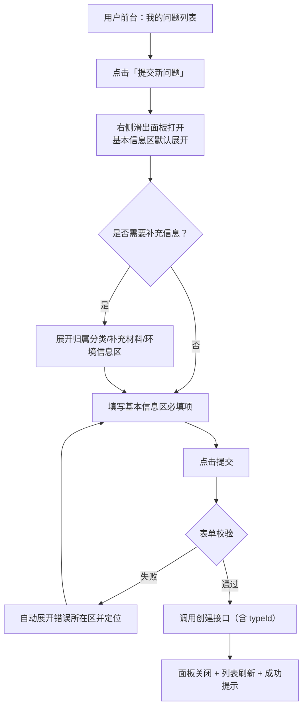

# issueFlow Phase 6 产品需求文档（PRD）

| 项目信息 | 内容 |
| --- | --- |
| 项目名称 | issue_flow |
| 迭代版本 | Phase 6 |
| 文档语言 | 中文 |
| 技术栈 | 后端 Spring Boot 3.2 + MyBatis-Plus + MySQL 8 + Redis 7 + JWT；前端 Vue 3 + Element Plus + Pinia + Vue Router + Vite |
| 产品经理 | 许清楚 |
| 前置版本 | Phase 5（抽屉组件 FormDrawer、模块配置、流程配置可视化、后台「返回前台」底部固定、系统设置-数据初始化） |
| 入口区分 | 本文档全文严格区分「用户前台」（UserLayout，`/user/**`）与「管理后台」（AdminLayout，`/admin/**`） |

---

## 一、产品目标

**一句话价值**：让 issueFlow 从「能用」走向「好用且可定制」——通过导航收敛、提交表单分区化、交互形态统一（右侧滑出）、问题类型可配置、多语言与多主题支持，为不同角色和不同租户提供一致、可配置、可扩展的使用体验。

三个正交目标：

| # | 目标 | 衡量指标 |
| --- | --- | --- |
| G1 | **交互一致性**：前台/后台所有编辑与详情类浮层统一为右侧滑出面板，减少认知负担 | 除 `ElMessageBox` 提示框外，`el-dialog` 使用数归零 |
| G2 | **提交效率**：问题提交从独立页面改为原地弹出的分区表单，减少页面跳转与滚动成本 | 「提交新问题」不再跳转路由；首屏可见必填字段 100% |
| G3 | **可配置性**：问题类型、界面语言、前台主题、网站基础信息均可由管理员在后台配置 | 4 类配置项均有后台可视化入口，且改动即时生效 |

---

## 二、用户故事

| # | 角色 | 用户故事 | 关联需求 |
| --- | --- | --- | --- |
| US1 | 提交者（SUBMITTER） | 作为提交者，我希望在「我的问题」页点击「提交新问题」时直接弹出表单，这样我不用离开列表页就能提交，提交完还能立刻看到新记录 | R2 |
| US2 | 提交者 | 作为提交者，我希望提交表单按「基本信息 / 补充材料 / 环境信息」分区且次要区默认折叠，这样我一眼就知道最少要填什么，不被长表单吓退 | R2 |
| US3 | 提交者 | 作为提交者，我希望提交问题时能从下拉框选择「问题类型」（缺陷/需求/咨询…），这样我的问题能被更准确地分派 | R4 |
| US4 | 管理员（ADMIN） | 作为管理员，我希望能在后台维护「问题类型」清单并配置「网站名称」「前台默认主题」，这样我不改代码就能让系统贴合本单位的叫法与品牌 | R4、R10 |
| US5 | 管理员 | 作为管理员，我希望后台导航栏撑满屏幕高度、「返回前台」固定在最底部、每个菜单都有图标，这样在长菜单下依然能稳定操作 | R7、R8 |
| US6 | 访客/多语言用户 | 作为非中文用户，我希望能一键把界面切换为英文并被记住，这样我能独立完成问题提交与查询 | R6 |
| US7 | 全体前台用户 | 作为前台用户，我希望能挑选自己喜欢的主题风格（浅色/深色/蓝/绿等）并被记住，这样长时间使用更舒适 | R9 |

---

## 三、需求池

优先级定义：**P0 = 必须有（本迭代不做则不可交付）**；**P1 = 应该有**；**P2 = 可以有（时间允许再做）**。

### P0 需求

| ID | 需求 | 归属入口 | 验收标准（可测试） |
| --- | --- | --- | --- |
| R1 | 前台导航移除「提交问题」菜单项 | 用户前台 | 1. 前台侧栏不再出现「提交问题」；2. `menu` 表中 `path='/user/submit-issue' AND type=1` 记录被逻辑删除（`deleted=1`）；3. 直接访问 `/user/submit-issue` 重定向至 `/user/my-issues`（或 404 兜底），不报错 |
| R2 | 「提交新问题」改为右侧滑出分区面板 | 用户前台 | 1. 「我的问题」页点击「提交新问题」不跳转路由，右侧滑出面板；2. 面板右上角有**仅图标**的全屏放大按钮（无文字），点击后面板宽度变为 100%，图标切换为「还原」，再次点击恢复；3. 表单至少分 3 个可折叠区；4. 首区默认展开，其余默认折叠；5. 折叠状态下点击区标题可展开；6. 提交成功后面板关闭且列表自动刷新，新问题出现在首行 |
| R3 | 前台新增「问题管理」父菜单，「我的问题」变为其子项 | 用户前台 | 1. 前台侧栏出现「问题管理」（带图标）可展开父节点；2. 展开后包含「我的问题」子项；3. 点击子项进入 `/user/my-issues` 且父节点保持展开、子项高亮 |
| R4 | 问题类型（issue_type）管理 + Issue 新增「类型」字段 | 管理后台 + 用户前台 | 1. 后台新增「问题类型」菜单，可**新增/编辑/删除/启用停用**类型；2. 删除已被问题引用的类型时给出阻断提示，不产生脏数据；3. `issue` 表新增 `type_id` 字段；4. 前台提交/编辑表单出现「问题类型」下拉，数据来源为启用中的类型清单；5. 前台「我的问题」列表、后台「问题管理」列表、问题详情面板均展示类型；6. 后台问题列表支持按类型筛选 |
| R5 | 所有弹窗（不含提示框）统一改为右侧滑出面板 | 用户前台 + 管理后台 | 1. 全量代码检索 `el-dialog` 命中数为 0（`ElMessageBox`/`ElMessage`/`ElNotification` 不在范围内）；2. 改造后的每个入口功能等价（打开、校验、保存、取消、关闭后重置）；3. 移动端（≤768px）自动满宽 |
| R6 | 多语言（中文/English）切换 | 用户前台 + 管理后台 | 1. 引入 vue-i18n，前台顶栏与后台顶栏各有语言切换入口；2. 切换后当前页面文案即时变化，无需刷新；3. 刷新后语言保持（localStorage）；4. 本迭代新增/改造的所有界面文案 0 硬编码中文；5. 缺失 key 时回退中文且控制台可见告警 |
| R7 | 后台导航栏样式优化：高度撑满屏幕、「返回前台」固定底部 | 管理后台 | 1. 任意视口高度下侧栏高度 = 100vh，无底部留白；2. 菜单项超出时仅菜单区滚动，「返回前台」始终吸附在侧栏最底部可见；3. 侧栏折叠态下「返回前台」降级为纯图标且仍在底部 |
| R10 | 系统管理 → 新增「网站设置」子菜单 | 管理后台 | 1. 「系统管理」下出现「网站设置」子菜单；2. 可配置「网站名称」「前台默认主题」等参数并保存成功；3. 保存后前台 Logo 文案、浏览器标题、未做个人选择用户的默认主题随之变化 |

### P1 需求

| ID | 需求 | 归属入口 | 验收标准（可测试） |
| --- | --- | --- | --- |
| R8 | 模块配置菜单加图标 | 管理后台 | 1. 「项目管理 → 模块配置」菜单项左侧展示图标（`Grid`）；2. 后台「菜单管理」中该记录 `icon` 字段非空；3. 侧栏折叠态下图标仍可见 |
| R9 | 前台多主题风格切换 | 用户前台 | 1. 前台顶栏有主题切换入口，至少 4 种主题；2. 切换后立即生效且不影响后台配色；3. 刷新后保持（localStorage）；4. 未手动选择过的用户使用后台配置的默认主题 |

### P2 需求

| ID | 需求 | 归属入口 | 验收标准 |
| --- | --- | --- | --- |
| R11 | 问题类型支持自定义图标/颜色标记 | 管理后台 | 列表与详情中类型以带色标签展示 |
| R12 | 提交面板区块展开/折叠状态记忆 | 用户前台 | 用户上次的展开状态在下次打开时恢复（localStorage） |
| R13 | 网站设置支持上传 Logo | 管理后台 | 上传后前台侧栏 Logo 位显示图片 |

---
## 四、功能详细设计

### 4.1 前台导航调整（R1 / R3）

前台菜单数据源为 `menu` 表（`type=1` 为前台端），由 `SideMenu.vue` 递归渲染，因此调整以**数据迁移为主、路由为辅**。

调整后前台菜单结构：

| 层级 | 菜单名称 | path | icon | sort | 说明 |
| --- | --- | --- | --- | --- | --- |
| 一级 | 工作台 | `/user` | HomeFilled | 1 | 不变 |
| 一级 | 问题管理 | `/user/issue` | Tickets | 2 | **新增**，仅作分组父节点，无独立页面（点击仅展开） |
| 二级 | 我的问题 | `/user/my-issues` | Document | 1 | **由一级改挂到「问题管理」下**，路由路径不变 |
| 一级 | 提交问题（删除） | `/user/submit-issue` | - | - | **移除**（逻辑删除 deleted=1） |
| 一级 | 个人看板 | `/user/stats` | DataAnalysis | 3 | 不变 |

路由变更：

| 路由 | 变更 | 说明 |
| --- | --- | --- |
| `/user/submit-issue` | 保留但改为 redirect 到 `/user/my-issues` | 兼容旧书签与旧链接，不出现白屏；IssueCreate.vue 不再作为菜单入口 |
| `/user/my-issues` | 不变 | 父菜单为纯分组节点，无需新增路由层级 |

验收注意：SideMenu.vue 高亮逻辑基于 `route.path`，「问题管理」为无 path 分组节点时需走 `menu-{id}` 索引分支，不得影响子项高亮与父节点自动展开。

---

### 4.2 「提交新问题」滑出面板（R2）

#### 4.2.1 交互流程

```
「我的问题」列表页
  └─ 点击 [提交新问题]
       └─ 右侧滑出面板（默认宽 800px，移动端 100%）
            ├─ 头部：标题「提交新问题」 + [全屏图标按钮] + [关闭 X]
            ├─ 主体：4 个可折叠区（el-collapse，手风琴=否，允许多区同时展开）
            └─ 底部：[取消]   [提交]
       └─ 提交成功 → 面板关闭 → 列表刷新 → 成功提示
```

#### 4.2.2 分区方案与字段清单

| 区序 | 区名称 | 默认状态 | 字段 | 必填 | 控件 |
| --- | --- | --- | --- | --- | --- |
| 1 | 基本信息 | **展开** | 标题 | 是 | 输入框（<=200 字，显示字数） |
| 1 | 基本信息 | 展开 | 问题类型 | 是 | 下拉框（数据源：启用中的问题类型清单）**【新增】** |
| 1 | 基本信息 | 展开 | 严重等级 | 是 | 下拉框（致命/严重/一般/轻微） |
| 1 | 基本信息 | 展开 | 详细描述 | 是 | 多行文本（4 行） |
| 2 | 归属与分类 | 折叠 | 关联项目 | 否 | 可搜索下拉 |
| 2 | 归属与分类 | 折叠 | 所属模块 | 否 | 树选择（随项目联动） |
| 2 | 归属与分类 | 折叠 | 分类标签 | 否 | 多选可创建下拉 |
| 3 | 补充材料 | 折叠 | 复现步骤 | 否 | 多行文本（3 行） |
| 3 | 补充材料 | 折叠 | 附件 | 否 | AttachmentUploader |
| 4 | 环境信息 | 折叠 | 操作系统 / 浏览器 / 应用版本 / 设备型号 | 否 | 输入框 x4（两列栅格） |

设计原则：**最重要信息置顶且默认展开；补充材料与次要信息靠下且默认折叠**。区 1 承载全部必填字段，保证用户「只展开一个区即可完成提交」。

编辑场景（编辑问题面板）复用同一分区结构，但**四个区全部默认展开**，便于核对已填内容。

#### 4.2.3 全屏按钮交互规格

| 项 | 规格 |
| --- | --- |
| 位置 | 面板头部右侧，位于关闭「X」按钮左侧 |
| 展示 | **仅图标，不显示文字**（text/link 型按钮，无文案） |
| 图标 | 非全屏态使用 `FullScreen`；全屏态使用 `Aim`（或 `ScaleToOriginal`）表示还原 |
| 可达性 | 必须提供 title / aria-label 悬浮提示（「全屏」/「退出全屏」），做到无文字但不失可用性 |
| 行为 | 点击切换面板宽度 800px 与 100%，带过渡动画；关闭面板后状态重置为非全屏 |
| 复用 | 该能力沉淀进 FormDrawer 组件（新增 `fullscreenable` 属性，默认 false） |

#### 4.2.4 校验与异常

| 场景 | 期望表现 |
| --- | --- |
| 必填项未填且所在区已折叠 | 提交时**自动展开**含错误字段的区，并滚动定位到首个错误项 |
| 提交中重复点击 | 提交按钮 loading 且禁用 |
| 面板关闭 | 表单重置（含附件列表与折叠状态），下次打开无残留 |
| 附件上传失败 | 不阻断表单，单条附件给出错误提示并可移除重试 |

---

### 4.3 问题类型管理（R4）

#### 4.3.1 数据表设计 issue_type

| 字段 | 类型 | 约束 | 说明 |
| --- | --- | --- | --- |
| id | BIGINT | PK, AUTO_INCREMENT | 主键 |
| name | VARCHAR(50) | NOT NULL | 类型名称，如「功能缺陷」 |
| code | VARCHAR(50) | NOT NULL, UNIQUE | 类型编码，如 BUG；供程序判断与多语言 key 拼接 |
| description | VARCHAR(200) | NULL | 描述 |
| sort | INT | DEFAULT 0 | 排序号，升序展示 |
| enabled | TINYINT | NOT NULL DEFAULT 1 | 1=启用 / 0=停用；停用后不出现在提交下拉，历史数据仍可展示 |
| created_at / updated_at | DATETIME | - | 与既有表保持一致（BaseEntity） |
| deleted | TINYINT | NOT NULL DEFAULT 0 | 逻辑删除 |

初始种子数据（随迁移脚本写入）：

| code | 中文名称 | 英文名称 | sort |
| --- | --- | --- | --- |
| BUG | 功能缺陷 | Bug | 1 |
| FEATURE | 需求建议 | Feature Request | 2 |
| PERFORMANCE | 性能问题 | Performance | 3 |
| UI | 界面样式 | UI / Style | 4 |
| QUESTION | 使用咨询 | Question | 5 |
| OTHER | 其他 | Other | 99 |

#### 4.3.2 与 Issue 的关联

| 变更 | 说明 |
| --- | --- |
| issue 表新增 `type_id BIGINT DEFAULT NULL` | 允许为空以兼容历史数据；新增索引 `idx_issue_type(type_id)` |
| 历史数据回填 | 迁移脚本将存量问题 type_id 统一置为 OTHER 对应 id，避免列表出现空白 |
| 新建校验 | 新建问题时 typeId **必填**，且必须指向 enabled=1 的类型 |
| 展示规则 | 列表与详情展示类型名称；类型被停用后，历史问题仍正常显示其名称 |
| 返回结构 | Issue 的 VO 需附带 `typeId` 与 `typeName`，避免前端二次查询 |

#### 4.3.3 接口清单

| 方法 | 路径 | 权限码 | 说明 |
| --- | --- | --- | --- |
| GET | `/api/issue-types` | issue:type:list | 列表查询（后台管理用，含停用项） |
| GET | `/api/issue-types/options` | 登录即可 | **下拉数据源**，仅返回 enabled=1，按 sort 升序 |
| POST | `/api/issue-types` | issue:type:create | 新增，code 唯一性校验 |
| PUT | `/api/issue-types/{id}` | issue:type:update | 编辑（code 允许修改，仍须唯一） |
| PUT | `/api/issue-types/{id}/status` | issue:type:update | 启用 / 停用切换 |
| DELETE | `/api/issue-types/{id}` | issue:type:delete | 删除；**被 issue 引用时返回业务错误**，前端提示「该类型下存在 N 个问题，无法删除，可改为停用」 |

新增权限码需写入 permission 表并授予 ADMIN 角色：`issue:type:list`、`issue:type:create`、`issue:type:update`、`issue:type:delete`。

#### 4.3.4 后台菜单与页面

| 项 | 规格 |
| --- | --- |
| 菜单方案 | 将现有一级菜单「问题管理」升级为**分组父节点**，其下挂两个子项 |
| 调整后结构 | 问题管理（分组，`/admin/issue`，icon Tickets）→ 子项①「问题列表」`/admin/issues`（icon List）；子项②「问题类型」`/admin/issue-types`（icon CollectionTag） |
| 页面形态 | 表格 + 右上角「新增类型」按钮；行操作：编辑 / 删除 / 启停开关；新增与编辑均走 FormDrawer（sm 尺寸） |
| 表格列 | 类型名称、编码、描述、排序、状态（开关）、更新时间、操作 |
| 排序维护 | 通过「排序」数字字段维护，列表默认按 sort 升序 |

#### 4.3.5 受影响页面清单（须同步改造）

| 入口 | 页面 / 组件 | 改动 |
| --- | --- | --- |
| 用户前台 | IssueForm.vue | 新增「问题类型」必填下拉（位于基本信息区） |
| 用户前台 | UserIssueList.vue | 列表新增「类型」列；筛选区新增类型下拉 |
| 用户前台 | IssueDetailDrawer.vue | 详情新增「类型」展示项 |
| 用户前台 | UserDashboard.vue / UserStats.vue | 若含问题卡片或统计维度，补充类型显示（P2） |
| 管理后台 | AdminIssueList.vue | 列表新增「类型」列 + 类型筛选条件 |
| 管理后台 | IssueTable.vue（共用表格组件） | 增加类型列定义 |
| 后端 | Issue 实体 / DTO / VO / Mapper / Service / Controller | 增加 typeId 字段的接收、存储、查询过滤与回显 |

---

### 4.4 弹窗改造为右侧滑出面板的范围（R5）

范围界定：改造所有 `el-dialog`；**不改造** `ElMessageBox.confirm/alert/prompt`、`ElMessage`、`ElNotification`（提示框保持原样）。

| # | 入口 | 文件 | 现有弹窗 | 改造目标 | 尺寸 |
| --- | --- | --- | --- | --- | --- |
| 1 | 用户前台 | views/user/UserIssueList.vue | 「编辑问题」el-dialog 680px | FormDrawer + 分区折叠 | lg (800) |
| 2 | 用户前台 | views/user/UserIssueList.vue | 「提交新问题」（当前为路由跳转） | FormDrawer + 分区折叠 + 全屏按钮 | lg (800)，可全屏 |
| 3 | 管理后台 | views/admin/AdminIssueList.vue | 「编辑问题」el-dialog 680px | FormDrawer + 分区折叠 | lg (800) |
| 4 | 前台+后台 | components/StatusFlowButtons.vue | 「填写备注」el-dialog 420px | FormDrawer | sm (480) |
| 5 | 管理后台 | layouts/AdminLayout.vue | 「个人设置」el-dialog 420px | FormDrawer（只读，底部仅「关闭」） | sm (480) |

统一规范（沿用 Phase 5 FormDrawer 约定并扩展）：

| 规范项 | 要求 |
| --- | --- |
| 方向 | direction="rtl"，即右侧滑出 |
| 尺寸档 | sm=480 / md=620 / lg=800；视口 <=768px 自动 100% |
| 标题 | 「{动作}{对象}」格式，如「编辑问题」「提交新问题」 |
| 底部 | 左「取消」右「保存/提交」（主按钮带 loading）；只读面板仅「关闭」 |
| 关闭行为 | close-on-click-modal=false；@closed 由父级重置表单 |
| 新增能力 | fullscreenable（是否显示全屏图标按钮，默认 false） |
| 验收 | 全量检索 `el-dialog` 命中数为 0 |

---
### 4.5 多语言方案（R6）

#### 4.5.1 技术方案

| 项 | 方案 |
| --- | --- |
| 依赖 | vue-i18n@9（Composition API 模式，legacy: false） |
| 资源目录 | `src/frontend/src/locales/` |
| 文件组织 | `locales/index.js`（初始化与聚合）、`locales/zh-CN/*.js`、`locales/en-US/*.js`，按模块分文件（common / menu / issue / issueType / site / theme / admin） |
| 持久化 | localStorage key = `if_locale`，取值 `zh-CN` / `en-US` |
| 初始语言 | 优先 localStorage → 其次后台配置 `site.default_locale` → 缺省 `zh-CN` |
| 组件库联动 | 通过 el-config-provider 同步切换 Element Plus 的 zhCn / en 语言包（分页、日期、上传等内建文案） |
| 回退策略 | fallbackLocale = 'zh-CN'；缺失 key 时回退中文并在控制台输出告警 |
| 切换入口 | 前台顶栏与后台顶栏各放一个「语言」下拉（地球图标 + 当前语言名） |
| 动态内容 | 数据库文案（菜单名、问题类型名）本迭代不做多语言存储，前端按 code 映射翻译；无映射时回退数据库原值 |
| 页面标题 | 路由 meta.title 改为 i18n key，切换语言后浏览器标题同步更新 |

#### 4.5.2 键值命名约定

格式：`{模块}.{页面或组件}.{语义}`，小写驼峰 + 点分隔。动作用 `action.*`，字段名用 `field.*`，提示文案用 `msg.*`，分区名用 `section.*`。

示例：

```
common.action.save
menu.user.issueManage
issue.form.section.basic
issue.form.field.title
issueType.msg.deleteInUse
site.settings.field.siteName
theme.name.light
```

#### 4.5.3 新增键清单（zh-CN / en-US 一一对应）

| key | zh-CN | en-US |
| --- | --- | --- |
| common.action.save | 保存 | Save |
| common.action.cancel | 取消 | Cancel |
| common.action.submit | 提交 | Submit |
| common.action.create | 新增 | Create |
| common.action.edit | 编辑 | Edit |
| common.action.delete | 删除 | Delete |
| common.action.reset | 重置 | Reset |
| common.action.search | 查询 | Search |
| common.action.fullscreen | 全屏 | Fullscreen |
| common.action.exitFullscreen | 退出全屏 | Exit fullscreen |
| common.status.enabled | 启用 | Enabled |
| common.status.disabled | 停用 | Disabled |
| menu.user.dashboard | 工作台 | Workspace |
| menu.user.issueManage | 问题管理 | Issue Management |
| menu.user.myIssues | 我的问题 | My Issues |
| menu.user.stats | 个人看板 | My Dashboard |
| menu.admin.issueList | 问题列表 | Issue List |
| menu.admin.issueTypes | 问题类型 | Issue Types |
| menu.admin.moduleConfig | 模块配置 | Module Config |
| menu.admin.siteSettings | 网站设置 | Site Settings |
| issue.action.createNew | 提交新问题 | New Issue |
| issue.form.title.create | 提交新问题 | New Issue |
| issue.form.title.edit | 编辑问题 | Edit Issue |
| issue.form.section.basic | 基本信息 | Basic Info |
| issue.form.section.category | 归属与分类 | Scope and Tags |
| issue.form.section.material | 补充材料 | Attachments and Steps |
| issue.form.section.env | 环境信息 | Environment |
| issue.form.field.title | 标题 | Title |
| issue.form.field.type | 问题类型 | Issue Type |
| issue.form.field.severity | 严重等级 | Severity |
| issue.form.field.description | 详细描述 | Description |
| issue.form.field.project | 关联项目 | Project |
| issue.form.field.module | 所属模块 | Module |
| issue.form.field.tags | 分类标签 | Tags |
| issue.form.field.steps | 复现步骤 | Steps to Reproduce |
| issue.form.field.attachment | 附件 | Attachments |
| issue.form.field.envOs | 操作系统 | OS |
| issue.form.field.envBrowser | 浏览器 | Browser |
| issue.form.field.envAppVersion | 应用版本 | App Version |
| issue.form.field.envDevice | 设备型号 | Device |
| issue.form.msg.typeRequired | 请选择问题类型 | Please select an issue type |
| issue.form.msg.submitSuccess | 问题提交成功 | Issue submitted successfully |
| issueType.page.title | 问题类型管理 | Issue Type Management |
| issueType.field.name | 类型名称 | Name |
| issueType.field.code | 类型编码 | Code |
| issueType.field.description | 描述 | Description |
| issueType.field.sort | 排序 | Sort |
| issueType.field.enabled | 状态 | Status |
| issueType.msg.codeDuplicated | 类型编码已存在 | Type code already exists |
| issueType.msg.deleteInUse | 该类型下存在 {count} 个问题，无法删除，可改为停用 | {count} issue(s) use this type. Disable it instead of deleting. |
| issueType.value.BUG | 功能缺陷 | Bug |
| issueType.value.FEATURE | 需求建议 | Feature Request |
| issueType.value.PERFORMANCE | 性能问题 | Performance |
| issueType.value.UI | 界面样式 | UI / Style |
| issueType.value.QUESTION | 使用咨询 | Question |
| issueType.value.OTHER | 其他 | Other |
| site.settings.title | 网站设置 | Site Settings |
| site.settings.field.siteName | 网站名称 | Site Name |
| site.settings.field.siteShortName | 网站简称 | Short Name |
| site.settings.field.siteSubtitle | 网站副标题 | Subtitle |
| site.settings.field.defaultTheme | 前台默认主题 | Default Front-end Theme |
| site.settings.field.defaultLocale | 默认语言 | Default Language |
| site.settings.field.copyright | 版权信息 | Copyright |
| site.settings.field.icp | 备案号 | ICP License |
| site.settings.msg.saved | 网站设置已保存 | Site settings saved |
| theme.action.switch | 主题风格 | Theme |
| theme.name.light | 清爽浅色 | Light |
| theme.name.dark | 沉稳深色 | Dark |
| theme.name.blue | 科技蓝 | Tech Blue |
| theme.name.green | 自然绿 | Nature Green |
| locale.action.switch | 语言 | Language |
| locale.name.zhCN | 简体中文 | 简体中文 |
| locale.name.enUS | English | English |

覆盖范围：本迭代要求**用户前台全部页面 + 管理后台本次新增/改造页面**做到 0 硬编码中文；其余存量后台页面（组织/用户/角色/流程等）允许分批补齐，作为 P1 尾随任务（见待确认问题 Q4）。

---

### 4.6 前台主题切换（R9）

#### 4.6.1 技术方案

沿用 Phase 5 已有的 CSS 变量体系（`styles/variables.css` + `utils/theme.js` 的 `applyThemeVars`），从「单一主题色」升级为「预设主题包」。

| 项 | 方案 |
| --- | --- |
| 实现方式 | 在前台根元素（`.if-layout--user`）上写 `data-if-theme="{themeKey}"` 属性，并由 `styles/themes.css` 按属性选择器定义整套 CSS 变量 |
| 作用域隔离 | **严禁写入 document.documentElement**，避免污染管理后台（后台风格由 Phase 5 的 adminStyle 独立控制） |
| 状态管理 | 扩展 `store/theme.js`，新增 `frontTheme` 字段 |
| 持久化 | localStorage key `if_theme`，新增 `frontTheme` 属性；兼容旧结构（旧值缺失时取默认） |
| 默认值 | 用户未选择过时，取后台配置 `site.default_theme`；后台未配置时取 `light` |
| 切换入口 | 前台顶栏右侧「主题」下拉（调色板图标），列出主题名称 + 色块预览，当前项打勾 |
| 生效时机 | 点击即时生效，无需刷新；刷新后保持 |

#### 4.6.2 主题列表与关键变量

| themeKey | 名称 | --theme-color | --bg-page | --bg-container | --text-primary | --if-sidebar-bg |
| --- | --- | --- | --- | --- | --- | --- |
| light | 清爽浅色（默认） | #409EFF | #F5F7FA | #FFFFFF | #303133 | #FFFFFF |
| dark | 沉稳深色 | #409EFF | #1E1E20 | #2B2B2E | #E5EAF3 | #232324 |
| blue | 科技蓝 | #1E6FFF | #EEF3FC | #FFFFFF | #24304A | #F3F7FF |
| green | 自然绿 | #17A97C | #F2F8F5 | #FFFFFF | #22322C | #F0F7F3 |

每个主题需同时覆盖：`--theme-color`、`--theme-color-light`、`--bg-page`、`--bg-container`、`--text-primary`、`--text-regular`、`--text-secondary`、`--border-color`、`--if-sidebar-bg`，以及 Element Plus 主色阶梯（`--el-color-primary` 及 light-1..5、dark-2）。

深色主题额外要求：表格、卡片、下拉、抽屉在深色下文字对比度不低于 WCAG AA（4.5:1），不得出现「白底白字」。

#### 4.6.3 与后台的关系

| 场景 | 表现 |
| --- | --- |
| 前台切换主题 | 仅影响 `/user/**` 页面 |
| 后台风格设置（Phase 5 AdminStyleDrawer） | 仅影响 `/admin/**` 页面，不受前台主题影响 |
| 后台「网站设置」配置默认主题 | 仅作为**前台**新用户/未选择用户的初始主题 |

---

### 4.7 网站设置（R10）

#### 4.7.1 菜单与页面

| 项 | 规格 |
| --- | --- |
| 菜单位置 | 系统管理 → 网站设置 |
| 路由 | `/admin/system/site` |
| 图标 | `Monitor`（或 `Platform`） |
| 权限码 | `site:config:view` / `site:config:update`（授予 ADMIN） |
| 排序 | 置于「系统设置」之前，sort=5，原「系统设置」调整为 6 |

#### 4.7.2 sys_config 键名设计

复用既有 `sys_config` 表（config_key / config_value / description），键名统一 `site.` 前缀：

| config_key | 字段标签 | 类型 | 默认值 | 校验 | 说明 |
| --- | --- | --- | --- | --- | --- |
| site.name | 网站名称 | 文本 | issueFlow | 必填，<=50 字 | 前台侧栏 Logo 文案、浏览器标题、登录页标题 |
| site.short_name | 网站简称 | 文本 | IF | 必填，<=8 字 | 侧栏折叠态显示 |
| site.subtitle | 网站副标题 | 文本 | 问题跟踪与流程管理平台 | 选填，<=100 字 | 登录页副标题 |
| site.default_theme | 前台默认主题 | 下拉 | light | 必选，枚举 light/dark/blue/green | 前台用户未自选时的初始主题 |
| site.default_locale | 默认语言 | 下拉 | zh-CN | 必选，枚举 zh-CN/en-US | 首次访问的初始语言 |
| site.copyright | 版权信息 | 文本 | (c) 2026 issueFlow | 选填，<=100 字 | 登录页与前台页脚 |
| site.icp | 备案号 | 文本 | 空 | 选填，<=50 字 | 页脚展示，为空则不显示 |

#### 4.7.3 接口

| 方法 | 路径 | 权限 | 说明 |
| --- | --- | --- | --- |
| GET | `/api/site/config` | 公开（登录页需用） | 返回全部 `site.*` 键值的 Map |
| PUT | `/api/admin/site/config` | site:config:update | 批量保存，键不存在则插入，存在则更新 |

前端在应用启动（main.js / App.vue）时拉取一次 `/api/site/config`，写入 `store/app.js` 的 `siteConfig`，供 Logo、标题、默认主题、默认语言使用；保存后前台刷新即生效（后台保存成功后即时更新本地 store）。

#### 4.7.4 页面布局

单列表单卡片，字段自上而下：基础信息（名称/简称/副标题）→ 外观默认值（默认主题/默认语言）→ 页脚信息（版权/备案号）；底部「保存」「恢复默认」两个按钮。保存成功给出成功提示。

---

### 4.8 后台导航栏样式优化（R7）

Phase 5 已实现「返回前台」入口固定在侧栏底部（`LayoutSwitchEntry variant="sidebar"` + 侧栏 `padding-bottom` 预留），Phase 6 在此基础上补齐**高度撑满**与**滚动收敛**。

| 调整点 | 现状 | 目标 |
| --- | --- | --- |
| 侧栏高度 | `.if-layout { height: 100% }` 依赖父级链，极端场景可能出现底部留白 | `.if-layout--admin .if-sidebar { height: 100vh; }`（配合 `min-height: 100vh` 兜底） |
| 布局方式 | flex column + padding-bottom 预留 | 保持 flex column；菜单容器 `.if-sidebar__menu { flex: 1; min-height: 0; overflow-y: auto; }`，「返回前台」块 `margin-top: auto; flex-shrink: 0;` |
| 定位方式 | 依赖 fixed + padding 预留 | 改为**flex 自然吸底**（避免 fixed 与折叠宽度变化不同步）；如需保留 fixed 需同步 width 与 `--sidebar-collapsed-width` |
| 滚动行为 | 侧栏 overflow hidden | 菜单区独立滚动，滚动时底部入口不动 |
| 折叠态 | 已降级为纯图标 | 保持；确认折叠宽度 64px 下图标居中、tooltip 正常 |
| 兼容性 | - | 不得影响前台 UserLayout 的侧栏底部入口；不得覆盖 Phase 5 的 admin 风格变量（`--admin-sidebar-bg` 等） |

补充：`LayoutSwitchEntry` 与菜单之间增加 1px 分隔线（`border-top: 1px solid rgba(255,255,255,.08)`），在深色侧栏下形成视觉分层。

---

### 4.9 模块配置菜单图标（R8）

| 项 | 内容 |
| --- | --- |
| 现状 | Phase 5 迁移脚本已为 `/admin/modules` 写入 icon='Tree'，但 Element Plus 图标集中**无 `Tree` 图标**，导致渲染为空 |
| 修复 | 将 icon 更新为 **`Grid`**（或 `Share`），确保为 @element-plus/icons-vue 中真实存在的组件名 |
| 落地方式 | 迁移脚本 UPDATE menu 记录；同时排查其它菜单 icon 是否均为合法图标名（`Management`、`Tickets`、`Setting` 等已确认存在） |
| 验收 | 后台侧栏「项目管理 → 模块配置」左侧出现图标；折叠态下图标可见；菜单管理页该记录 icon 字段非空 |

---
## 五、UI 设计草图

### 5.1 用户前台 - 侧栏导航（调整后）

```
┌──────────────────────┬──────────────────────────────────────────────┐
│  issueFlow           │  我的问题            [语言▾] [主题▾] [头像▾] │
├──────────────────────┼──────────────────────────────────────────────┤
│  ⌂  工作台            │  ┌ 筛选：状态 类型 严重等级 关键字 [查询] ┐  │
│  ▤  问题管理      ▾   │  └──────────────────────[ + 提交新问题 ]─┘  │
│      • 我的问题       │  ┌────────────────────────────────────────┐ │
│  ▦  个人看板          │  │ 编号 标题  类型  严重  状态  时间  操作 │ │
│                       │  │ ...                                    │ │
│                       │  └────────────────────────────────────────┘ │
│                       │                                              │
│  ─────────────────    │                                              │
│  ⇄  切换区域          │                                              │
└──────────────────────┴──────────────────────────────────────────────┘
```

要点：一级「问题管理」为分组节点，展开后显示「我的问题」；顶栏新增「语言」与「主题」两个下拉；原「提交问题」菜单项已移除，入口收敛到列表页按钮。

### 5.2 用户前台 - 提交新问题滑出面板

```
                       ┌───────────────────────────────────────────┐
                       │ 提交新问题                    [⛶]   [✕]   │
                       ├───────────────────────────────────────────┤
                       │ ▼ 基本信息                    （默认展开） │
                       │    标题       [___________________]  *    │
                       │    问题类型   [功能缺陷        ▾]   *    │
                       │    严重等级   [一般            ▾]   *    │
                       │    详细描述   [                     ]  *  │
                       │               [                     ]     │
                       ├───────────────────────────────────────────┤
                       │ ▶ 归属与分类                  （默认折叠） │
                       ├───────────────────────────────────────────┤
                       │ ▶ 补充材料                    （默认折叠） │
                       ├───────────────────────────────────────────┤
                       │ ▶ 环境信息                    （默认折叠） │
                       ├───────────────────────────────────────────┤
                       │                     [ 取消 ]  [ 提交 ]     │
                       └───────────────────────────────────────────┘
                        ← 从右侧滑出，宽 800px；点击 ⛶ 展开为全屏
```

`⛶` 为**纯图标按钮**（无文字），hover 时显示 tooltip「全屏」。

### 5.3 管理后台 - 侧栏（高度撑满 + 底部固定）

```
┌─────────────────────┐  ← height: 100vh
│  issueFlow 管理台    │
├─────────────────────┤
│ ▤ 概览               │
│ ▤ 问题管理        ▾  │
│    • 问题列表        │
│    • 问题类型  【新】 │
│ ▤ 项目管理        ▾  │
│    • 项目配置        │
│    • ▦ 模块配置 【图标】
│ ▤ 流程监控           │  ← 菜单区可滚动 (flex:1, overflow-y:auto)
│ ▤ 流程配置           │
│ ▤ 系统管理        ▾  │
│    • 用户管理        │
│    • 组织管理        │
│    • 菜单管理        │
│    • 角色管理        │
│    • 网站设置  【新】 │
│    • 系统设置        │
│                     │
├─────────────────────┤  ← 分隔线
│ ⇦ 返回前台           │  ← margin-top:auto，永远吸底
└─────────────────────┘
```

### 5.4 管理后台 - 问题类型管理

```
┌───────────────────────────────────────────────────────────────┐
│ 问题类型管理                              [ + 新增类型 ]       │
├───────────────────────────────────────────────────────────────┤
│ 名称      编码         描述          排序  状态     操作        │
│ 功能缺陷  BUG          程序错误      1     [开启]  编辑 删除    │
│ 需求建议  FEATURE      新功能诉求    2     [开启]  编辑 删除    │
│ 性能问题  PERFORMANCE  响应慢/卡顿   3     [开启]  编辑 删除    │
│ 界面样式  UI           样式与布局    4     [开启]  编辑 删除    │
│ 使用咨询  QUESTION     操作疑问      5     [开启]  编辑 删除    │
│ 其他      OTHER        未分类        99    [开启]  编辑 删除    │
└───────────────────────────────────────────────────────────────┘
     点击「新增类型 / 编辑」→ 右侧滑出 FormDrawer（sm 480px）
```

### 5.5 管理后台 - 网站设置

```
┌───────────────────────────────────────────────────────────────┐
│ 网站设置                                                       │
├───────────────────────────────────────────────────────────────┤
│  基础信息                                                      │
│    网站名称    [ issueFlow                    ]  *            │
│    网站简称    [ IF                           ]  *            │
│    网站副标题  [ 问题跟踪与流程管理平台        ]               │
│                                                                │
│  外观默认值                                                    │
│    前台默认主题 [ 清爽浅色 ▾ ]                                 │
│    默认语言     [ 简体中文 ▾ ]                                 │
│                                                                │
│  页脚信息                                                      │
│    版权信息    [ (c) 2026 issueFlow           ]               │
│    备案号      [                              ]               │
├───────────────────────────────────────────────────────────────┤
│                              [ 恢复默认 ]  [ 保存 ]            │
└───────────────────────────────────────────────────────────────┘
```

### 5.6 交互流程图



---

## 六、非功能性要求

| 类别 | 要求 |
| --- | --- |
| 兼容性 | 保持 Phase 1-5 已有功能不回归；旧链接 `/user/submit-issue` 不报错 |
| 数据迁移 | 新增迁移脚本 `scripts/V20260803_issueflow_phase6.sql`，全部语句幂等（`WHERE NOT EXISTS` / `IF NOT EXISTS`），可重复执行 |
| 响应式 | 所有滑出面板在 <=768px 视口下满宽；折叠区在移动端仍可正常展开 |
| 性能 | 问题类型下拉数据在前端缓存（store），单页面生命周期内不重复请求 |
| 可访问性 | 纯图标按钮必须有 aria-label / title；深色主题文字对比度 >= 4.5:1 |
| 权限 | 新增权限码须写入 permission 表并授予 ADMIN；非 ADMIN 访问后台新页面返回 403 |
| 交付流程 | 开发完成后须 commit + push + 部署 23/24 + 冒烟验证；验收汇报须分「用户前台」「管理后台」两段陈述 |

---

## 七、待确认问题

| # | 问题 | 备选方案 | PM 建议 |
| --- | --- | --- | --- |
| Q1 | **问题类型是否需要支持层级（父子类型）？** | A. 仅一级平铺（本 PRD 方案）<br>B. 支持二级树形 | 建议 A。当前问题量级下二级分类会增加提交成本；如后续需要，可通过增加 parent_id 平滑升级 |
| Q2 | **前台主题具体提供几种？** | A. 4 种（浅色/深色/科技蓝/自然绿，本 PRD 方案）<br>B. 仅 2 种（浅色/深色）<br>C. 开放自定义主题色（沿用 Phase 5 取色器） | 建议 A。4 种覆盖主流偏好且工作量可控；自定义取色器可作为 P2 叠加 |
| Q3 | **网站设置是否本期就要支持上传 Logo 图片？** | A. 本期仅文字名称（本 PRD 方案，Logo 列 P2）<br>B. 本期即支持图片上传 | 建议 A。图片上传涉及存储路径、尺寸裁剪与前台适配，单列一个小迭代更稳 |
| Q4 | **多语言覆盖范围：是否要求 Phase 1-5 所有存量页面本期全部国际化？** | A. 本期覆盖「前台全部 + 后台新增/改造页面」，其余分批（本 PRD 方案）<br>B. 本期全量覆盖 | 建议 A。全量覆盖涉及 12+ 后台页面上百条文案，会显著拉长本期周期与回归成本 |
| Q5 | **后台「问题管理」由页面改为分组父节点，是否可接受路径变化？** | A. 接受，`/admin/issues` 保留为子项「问题列表」（本 PRD 方案）<br>B. 不动后台菜单，「问题类型」挂到「系统管理」下 | 建议 A。语义更清晰，且与前台「问题管理」分组保持一致；若担心管理员使用习惯，可在上线公告中说明 |
| Q6 | **停用的问题类型在筛选条件下拉中是否仍可选？** | A. 可选（便于查历史数据）<br>B. 不可选 | 建议 A。提交表单只显示启用项，筛选下拉显示全部并对停用项加「(已停用)」后缀 |

---

## 八、交付清单（供架构师拆解参考）

| 类别 | 交付物 |
| --- | --- |
| 数据库 | `scripts/V20260803_issueflow_phase6.sql`：issue_type 建表 + 种子；issue 加 type_id + 回填；menu 增删改（前台问题管理分组、移除提交问题、后台问题类型、网站设置、模块配置图标修复）；permission + role_permission 种子；sys_config 的 site.* 默认值 |
| 后端 | IssueType 实体/Mapper/Service/Controller；Issue 相关 DTO/VO/Service 增加 typeId；SiteConfigController（GET 公开 / PUT 管理） |
| 前端-通用 | FormDrawer 增强（fullscreenable）；locales 目录与 vue-i18n 接入；styles/themes.css；store/theme.js 扩展 frontTheme；store/app.js 增加 siteConfig；LocaleSwitch 与 ThemeSwitch 两个顶栏组件 |
| 前端-用户前台 | UserIssueList（提交/编辑改滑出面板 + 类型列与筛选）；IssueForm（分区折叠 + 类型字段）；IssueDetailDrawer（类型展示）；UserLayout（语言/主题入口）；路由 redirect |
| 前端-管理后台 | IssueTypeManage 新页面；AdminIssueList（类型列与筛选）；SiteSettings 新页面；AdminLayout（个人设置改抽屉 + 侧栏 100vh 与吸底）；StatusFlowButtons 改抽屉；路由新增 |
| 文档 | 本 PRD、架构增量设计、CHANGELOG |

---

**文档版本**：v1.0　　**编写人**：许清楚（产品经理）　　**状态**：待评审
