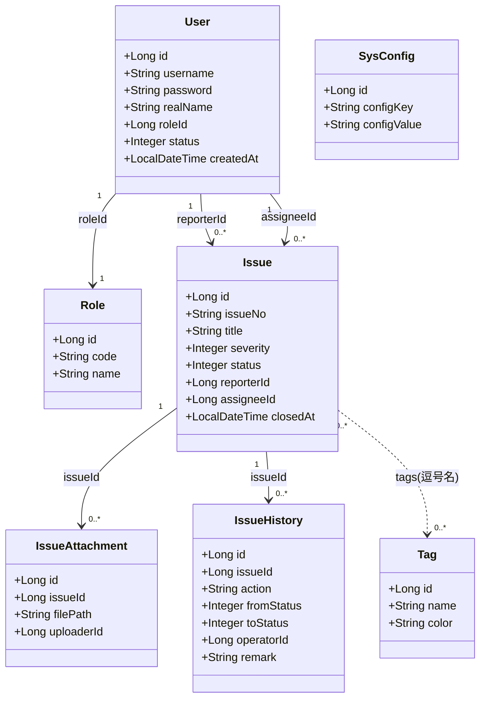
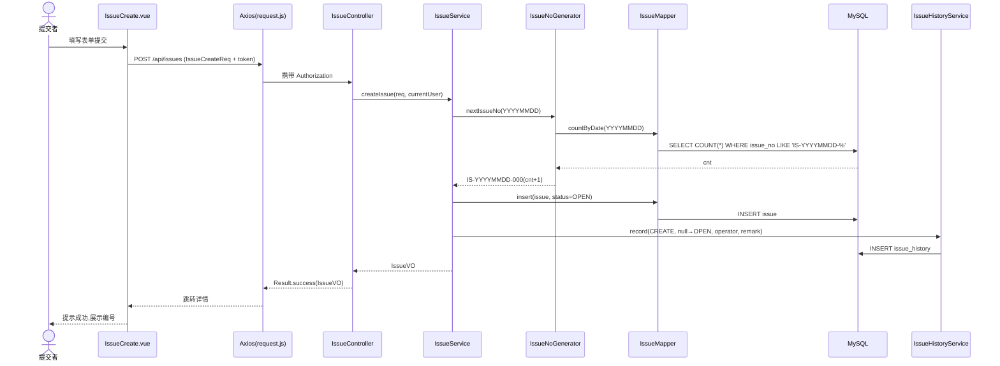
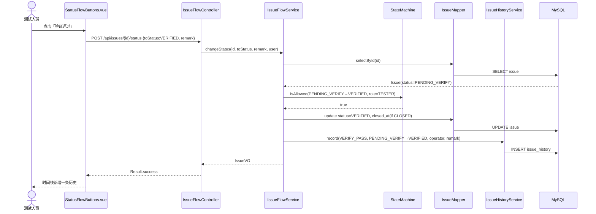
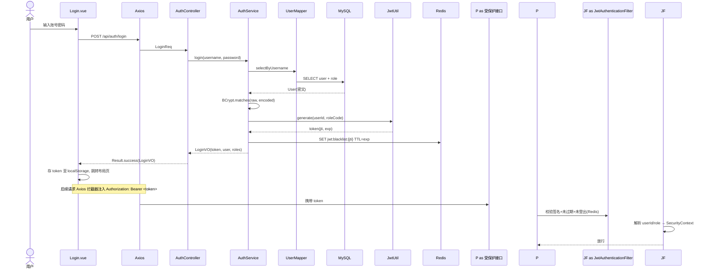
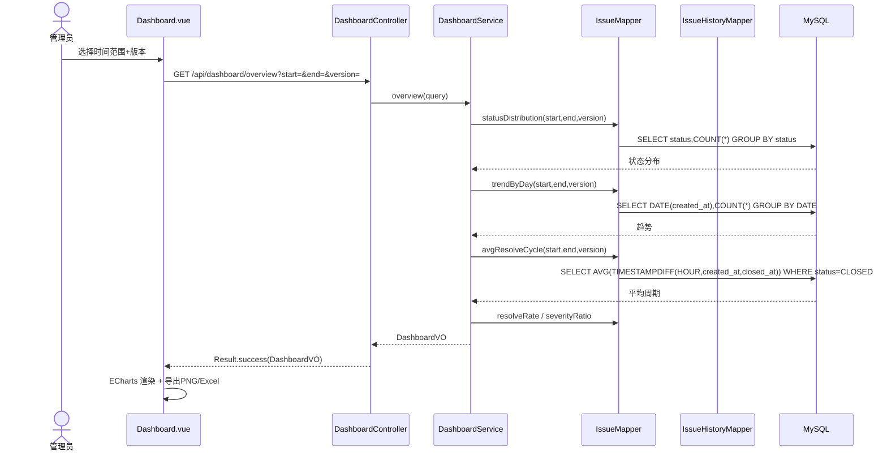
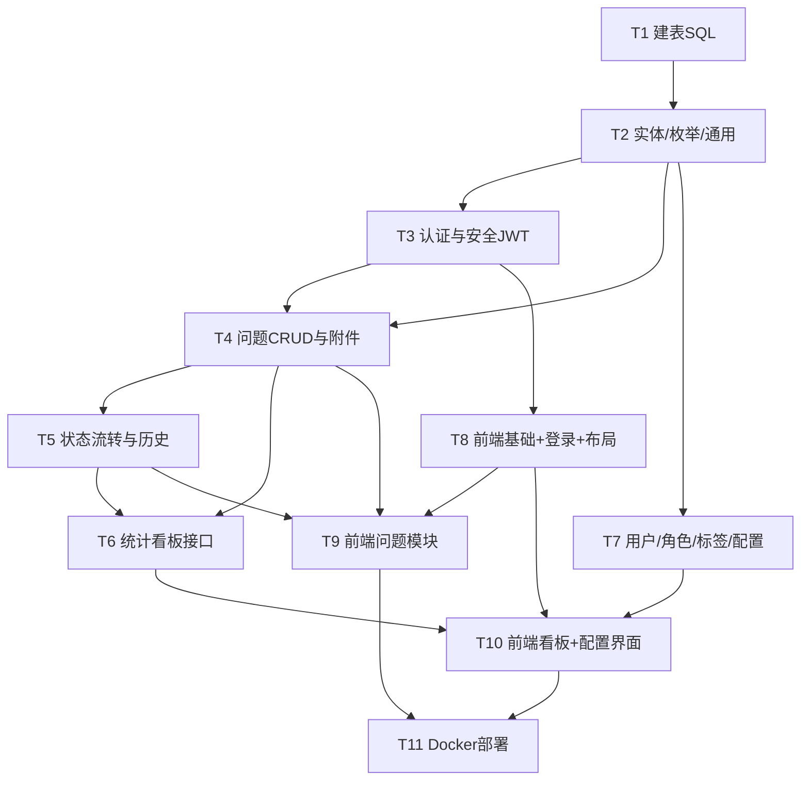

# issueFlow 架构设计与任务分解（Architecture & Task Breakdown）

> 文档版本：v1.0
> 角色：架构师 高见远
> 技术栈（已定）：Spring Boot 3.2 + MyBatis-Plus 3.5.x + MySQL 8 + Redis 7 + JWT + Spring Security 6 + Knife4j + Vue3 + Element Plus + Vue Router 4 + Pinia + Axios + ECharts + Vite + Docker Compose
> 约束：本机无 JDK17 无法编译 → 本文档所有签名/枚举/SQL 必须语法严谨、可直接落地，不写方法体实现。

---

## 1. 实现方案与框架选型说明

### 1.1 分层架构（后端）

```
┌─────────────────────────────────────────────┐
│ Controller 层   REST 端点 / 参数校验 / 鉴权注解 │
├─────────────────────────────────────────────┤
│ Service 层     业务逻辑 / 事务 / 状态机 / 编号生成 │
├─────────────────────────────────────────────┤
│ Mapper 层      MyBatis-Plus 持久化 / 分页 / 逻辑删除 │
├─────────────────────────────────────────────┤
│ Entity 层      表映射 / 枚举                       │
└─────────────────────────────────────────────┘
横切：Security(JWT Filter) · common(Result/异常/常量) · util · config
```

**为什么这样分层**
- **MyBatis-Plus 3.5.x**：在 Spring Boot 3 下使用 `mybatis-plus-spring-boot3-starter`，内置通用 Mapper/Service、分页插件、逻辑删除、自动填充，减少 70% CRUD 样板代码。
- **Spring Security 6（Spring Boot 3.2 内置）**：采用 `SecurityFilterChain` Bean（已废弃 `WebSecurityConfigurerAdapter`），以 `JwtAuthenticationFilter` 注入 `SecurityContext`，无状态（`STATELESS`），契合前后端分离。
- **JWT（jjwt 0.12.x）**：无状态鉴权，Token 含 `userId + roleCode + jti`；登出/强制失效用 **Redis 黑名单**（key=`jwt:blacklist:{jti}`，TTL=剩余有效期）。
- **Redis 7**：Token 黑名单、看板统计缓存（可选）、登录失败计数（可选）。
- **Knife4j（OpenAPI3）**：自动生成 `/doc.html` 交互式 API 文档，便于前端联调与 QA。
- **文件上传**：`MultipartFile` 落地到 Docker 卷挂载路径 `/data/attachments`，DB 仅存相对路径，单文件 ≤20MB，图片可在线预览。

### 1.2 前端架构

- **Vue3 + Vite**：组合式 API（`<script setup>`），构建快、HMR 优。
- **Vue Router 4 + 路由守卫**：按角色动态决定可访问布局（UserLayout / AdminLayout），未登录跳 `/login`，越权跳 `/403`。
- **Pinia**：`user`（token/info/roles）、`theme`（主题色/布局/菜单，持久化 localStorage）、`app`（侧栏折叠）。
- **Axios 封装**：请求拦截器注入 `Authorization: Bearer <token>`，响应拦截器统一解包 `Result<T>`、处理 401（清 token 跳登录）/403。
- **Element Plus**：表单/表格/抽屉/时间线等组件，降低 UI 工作量。
- **ECharts**：看板趋势/分布/占比图，前端 `getDataURL` 导出 PNG；Excel 由后端 EasyExcel 生成。

### 1.3 已拍板决策落地映射

| 决策 | 落地方式 |
|---|---|
| 流程配置 MVP：仅启用/禁用回退与重开 | `sys_config` 表存 `flow_reopen_enabled` / `flow_reject_enabled`；`StateMachine` 读取开关决定转移是否允许 |
| 附件本地卷 ≤20MB，图片预览 | `AttachmentController` + `FileUtil` 落 `/data/attachments`；`/api/attachments/{id}/preview` 内联图片 |
| 编号 `IS-YYYYMMDD-序号`（每日 0001 起） | `IssueNoGenerator` 按日期计数生成，DB 唯一索引兜底 |
| 已关闭重开仅管理员、无次数上限 | `StateMachine` 允许 `CLOSED→OPEN` 仅 `ADMIN`；`IssueFlowService.reopen` |

---

## 2. 完整文件列表及相对路径

> 根目录：`D:/WorkBuddyProjects/issueFlow/`，后端 `backend/`、前端 `frontend/`、部署 `deploy/`。

### 2.1 后端文件（`backend/`）

```
backend/
├── pom.xml                                              # 依赖与构建(见第7节)
├── Dockerfile                                           # 后端 jar 镜像
├── src/main/java/com/issueflow/
│   ├── IssueFlowApplication.java                        # 启动类 @SpringBootApplication
│   ├── config/
│   │   ├── MybatisPlusConfig.java                       # 分页插件 + 逻辑删除 + 自动填充
│   │   ├── RedisConfig.java                             # RedisTemplate<String,Object> 序列化
│   │   ├── Knife4jConfig.java                           # OpenAPI3 + Knife4j 文档
│   │   ├── WebMvcConfig.java                            # 跨域 + 附件静态资源映射 + 拦截器注册
│   │   └── SecurityConfig.java                          # SecurityFilterChain(放行/校验/无状态)
│   ├── common/
│   │   ├── Result.java                                  # 统一返回体 Result<T>
│   │   ├── PageResult.java                              # 分页返回 {list,total,page,size}
│   │   ├── ResultCode.java                              # 异常码枚举
│   │   ├── BaseEntity.java                              # 公共字段 createdAt/updatedAt/deleted
│   │   ├── Constants.java                               # 常量(角色码/路径/RedisKey)
│   │   └── BizException.java                            # 业务异常(带 code)
│   ├── enums/
│   │   ├── RoleEnum.java                                # SUBMITTER/DEVELOPER/TESTER/ADMIN
│   │   ├── IssueStatusEnum.java                         # OPEN/IN_PROGRESS/PENDING_VERIFY/VERIFIED/CLOSED
│   │   ├── SeverityEnum.java                            # FATAL/SERIOUS/NORMAL/MINOR
│   │   └── HistoryActionEnum.java                       # CREATE/CLAIM/SUBMIT_FIX/VERIFY_PASS/VERIFY_REJECT/CLOSE/REOPEN/EDIT
│   ├── entity/
│   │   ├── User.java                                    # 用户(含 roleId 单角色)
│   │   ├── Role.java                                    # 角色字典
│   │   ├── Issue.java                                   # 问题主表
│   │   ├── IssueAttachment.java                         # 附件
│   │   ├── IssueHistory.java                            # 操作历史
│   │   ├── Tag.java                                     # 分类标签字典
│   │   └── SysConfig.java                               # 主题/流程/菜单配置
│   ├── mapper/
│   │   ├── UserMapper.java
│   │   ├── RoleMapper.java
│   │   ├── IssueMapper.java
│   │   ├── IssueAttachmentMapper.java
│   │   ├── IssueHistoryMapper.java
│   │   ├── TagMapper.java
│   │   └── SysConfigMapper.java
│   ├── dto/req/
│   │   ├── LoginReq.java                                # {username,password}
│   │   ├── IssueCreateReq.java                          # 新建问题字段
│   │   ├── IssueUpdateReq.java                          # 编辑字段
│   │   ├── IssuePageReq.java                            # 分页+多条件(状态/等级/标签/版本/负责人/关键词/时间范围)
│   │   ├── StatusChangeReq.java                         # {toStatus,remark}
│   │   ├── HistoryQueryReq.java                         # 操作人+时间范围+分页
│   │   ├── UserReq.java                                 # 用户新增/编辑
│   │   ├── DashboardQueryReq.java                       # 时间范围+版本
│   │   └── SysConfigReq.java                            # {configKey,configValue}
│   ├── dto/resp/
│   │   ├── LoginVO.java                                 # {token,userInfo,roles}
│   │   ├── UserVO.java                                  # 用户视图(隐去密码)
│   │   ├── IssueVO.java                                 # 问题列表视图
│   │   ├── IssueDetailVO.java                           # 详情(含附件列表+最近历史)
│   │   ├── IssueHistoryVO.java                          # 历史视图(含操作人姓名)
│   │   └── DashboardVO.java                             # 看板聚合(趋势/状态分布/周期/解决率/严重占比)
│   ├── service/                                         # 具体类(无接口, @Service)
│   │   ├── UserService.java
│   │   ├── AuthService.java                             # 登录/登出/当前用户
│   │   ├── IssueService.java                            # CRUD + 分页筛选 + 权限过滤
│   │   ├── IssueFlowService.java                        # 状态流转 + 重开 + 写历史
│   │   ├── IssueAttachmentService.java                  # 上传/下载/预览/删除
│   │   ├── IssueHistoryService.java                     # 写历史 + 按操作人/时间查询
│   │   ├── TagService.java
│   │   ├── DashboardService.java                        # 统计聚合
│   │   └── SysConfigService.java                        # 主题/流程/菜单读写
│   ├── controller/
│   │   ├── AuthController.java                          # /api/auth/*
│   │   ├── IssueController.java                         # /api/issues CRUD+分页+详情+历史
│   │   ├── IssueFlowController.java                     # /api/issues/{id}/status|reopen + /api/flow/config
│   │   ├── AttachmentController.java                    # /api/attachments/*
│   │   ├── UserController.java                          # /api/users + /api/roles
│   │   ├── TagController.java                            # /api/tags
│   │   ├── DashboardController.java                     # /api/dashboard/*
│   │   └── SysConfigController.java                     # /api/sys/config
│   ├── security/
│   │   ├── JwtUtil.java                                 # 生成/解析/校验(jjwt 0.12, HS256)
│   │   ├── JwtAuthenticationFilter.java                 # 校验 token→SecurityContext
│   │   └── RestAuthenticationEntryPoint.java            # 未认证 401 处理
│   ├── util/
│   │   ├── IssueNoGenerator.java                        # IS-YYYYMMDD-序号
│   │   ├── SecurityUtils.java                           # 取当前登录用户/角色
│   │   ├── FileUtil.java                                # 附件存储/校验大小类型
│   │   └── ExcelExportUtil.java                         # 看板 Excel 导出(EasyExcel)
│   └── handler/
│       ├── GlobalExceptionHandler.java                  # @RestControllerAdvice 统一异常→Result
│       └── StateMachine.java                            # 状态转移规则 + 角色校验 + 开关
└── src/main/resources/
    ├── application.yml                                  # 公共配置
    ├── application-dev.yml                              # 开发
    ├── application-prod.yml                             # 生产(读环境变量)
    ├── db/schema.sql                                    # 建表 SQL + 索引(见第3节)
    ├── db/data.sql                                      # 初始化 4 角色 + 默认 admin(BCrypt 运行时生成)
    ├── mapper/IssueMapper.xml                           # 复杂统计 SQL(可选注解替代)
    ├── mapper/IssueHistoryMapper.xml
    └── logback-spring.xml
```

**后端文件量**：约 71 个 Java 源文件 + 9 个资源文件。

### 2.2 前端文件（`frontend/`）

```
frontend/
├── package.json                                         # 依赖(见第7节)
├── vite.config.js                                       # 构建 + dev 代理
├── index.html
├── Dockerfile                                           # 构建后由 nginx 托管
├── nginx.conf                                           # SPA 路由 fallback + 静态资源
├── .env.development                                     # VITE_API_BASE=/api (或代理)
├── .env.production                                      # VITE_API_BASE=/api
└── src/
    ├── main.js                                          # 挂载 app + pinia + router + ElementPlus
    ├── App.vue                                          # 根组件 <router-view/>
    ├── router/
    │   ├── index.js                                     # createRouter + 全局前置守卫(鉴权/角色)
    │   └── routes.js                                    # 路由表(按布局分组 + meta:{roles})
    ├── store/
    │   ├── user.js                                      # token/userInfo/roles + login/logout action
    │   ├── theme.js                                     # 主题色/布局/菜单(读 localStorage→注入 CSS 变量)
    │   └── app.js                                       # 侧栏折叠等 UI 状态
    ├── api/
    │   ├── request.js                                   # Axios 实例 + 拦截器(注入token/解包Result/401)
    │   ├── auth.js                                      # login/logout/info
    │   ├── issue.js                                     # 问题CRUD + 分页 + 状态流转 + 附件(合并 flow/attachment)
    │   ├── user.js                                      # 用户 + 角色
    │   ├── tag.js                                       # 标签
    │   ├── dashboard.js                                 # 看板数据 + 导出
    │   └── sysConfig.js                                 # 主题/流程/菜单配置
    ├── utils/
    │   ├── auth.js                                      # token 存取(localStorage)
    │   ├── theme.js                                     # 注入/切换 CSS 变量(--theme-color 等)
    │   ├── exportUtil.js                                # 调后端 Excel + 前端 PNG(file-saver)
    │   ├── permission.js                                # v-permission 指令(按钮级角色控制)
    │   └── format.js                                    # 日期/枚举中文映射
    ├── layouts/
    │   ├── UserLayout.vue                               # 用户界面(侧栏+顶栏+主题)
    │   ├── AdminLayout.vue                              # 管理后台布局
    │   └── BlankLayout.vue                              # 登录/404 外壳
    ├── components/
    │   ├── IssueForm.vue                                # 新建/编辑结构化表单(含环境/复现/标签)
    │   ├── IssueTable.vue                               # 问题列表表格(筛选/分页/操作)
    │   ├── IssueDetailDrawer.vue                        # 详情抽屉(信息+附件+历史时间线)
    │   ├── StatusTimeline.vue                           # 操作历史时间线
    │   ├── StatusFlowButtons.vue                        # 按角色渲染可点流转按钮(依赖 StateMachine 规则)
    │   ├── AttachmentUploader.vue                       # 附件上传+预览(≤20MB,图片缩略)
    │   ├── DashboardFilters.vue                         # 时间范围+版本筛选条
    │   ├── ThemeConfigPanel.vue                         # 主题色/布局/菜单配置面板(管理员)
    │   └── charts/
    │       ├── TrendChart.vue                           # 趋势图(按时间/版本)
    │       └── DistributionChart.vue                    # 状态分布饼 + 严重等级柱状(合并)
    ├── views/
    │   ├── Login.vue                                    # 统一登录页
    │   ├── user/
    │   │   ├── UserDashboard.vue                        # 我的待办/我提交
    │   │   ├── UserIssueList.vue                        # 问题列表(仅自己)
    │   │   ├── IssueCreate.vue                          # 新建问题
    │   │   └── UserStats.vue                            # 个人维度看板
    │   ├── admin/
    │   │   ├── AdminIssueList.vue                       # 全部问题+高级筛选
    │   │   ├── FlowMonitor.vue                          # 验证流程总览
    │   │   ├── UserManage.vue                           # 用户+角色管理(RBAC)
    │   │   ├── FlowConfig.vue                           # 回退/重开开关
    │   │   ├── Dashboard.vue                            # 全局看板+筛选+导出
    │   │   └── SystemSettings.vue                       # 主题/布局/菜单配置
    │   └── error/
    │       ├── NotFound.vue                             # 404
    │       └── Forbidden.vue                            # 403 无权限
    └── styles/
        ├── index.css                                    # 全局基础样式
        ├── variables.css                                # CSS 变量(默认主题色/圆角)
        └── theme.css                                    # 布局/菜单样式
```

**前端文件量**：约 55 个文件（含配置/样式）。

> 说明：后端/前端实际文件数略高于需求软性估算（35-50 / 25-40），因按职责单文件细分便于"逐文件落地、减少歧义"。同域文件可合并（如 `charts` 进一步合并、`api` 按模块再收）压缩约 15-20%。

---

## 3. 数据模型

### 3.1 实体字段表

**User（用户）**

| 字段 | 类型 | 约束 | 说明 |
|---|---|---|---|
| id | BIGINT | PK, AUTO_INCREMENT | |
| username | VARCHAR(50) | UNIQUE, NOT NULL | 登录名 |
| password | VARCHAR(100) | NOT NULL | BCrypt 密文 |
| real_name | VARCHAR(50) | | 真实姓名 |
| email | VARCHAR(100) | | |
| phone | VARCHAR(20) | | |
| role_id | BIGINT | FK→role.id, NOT NULL | 单角色 |
| status | TINYINT | DEFAULT 1 | 1启用 0禁用 |
| created_at | DATETIME | | |
| updated_at | DATETIME | | |
| deleted | TINYINT | DEFAULT 0 | 逻辑删除 |

**Role（角色字典）**

| 字段 | 类型 | 约束 | 说明 |
|---|---|---|---|
| id | BIGINT | PK | |
| code | VARCHAR(30) | UNIQUE, NOT NULL | SUBMITTER/DEVELOPER/TESTER/ADMIN |
| name | VARCHAR(30) | NOT NULL | 提交者/开发人员/测试人员/管理员 |
| description | VARCHAR(200) | | |
| created_at | DATETIME | | |

**Issue（问题主表）**

| 字段 | 类型 | 约束 | 说明 |
|---|---|---|---|
| id | BIGINT | PK | |
| issue_no | VARCHAR(20) | UNIQUE, NOT NULL | IS-YYYYMMDD-0001 |
| title | VARCHAR(200) | NOT NULL | 标题 |
| description | TEXT | | 详细描述 |
| severity | TINYINT | NOT NULL DEFAULT 2 | 0致命1严重2一般3轻微 |
| tags | VARCHAR(255) | | 逗号分隔 tag 名称 |
| reproduce_steps | TEXT | | 复现步骤 |
| env_os | VARCHAR(100) | | 操作系统 |
| env_browser | VARCHAR(100) | | 浏览器 |
| env_app_version | VARCHAR(50) | | 应用版本(看板版本维度) |
| env_device | VARCHAR(100) | | 设备型号 |
| status | TINYINT | NOT NULL DEFAULT 0 | 0待处理1处理中2待验证3验证通过4已关闭 |
| reporter_id | BIGINT | NOT NULL | 提交者 |
| assignee_id | BIGINT | | 处理人/认领人 |
| closed_at | DATETIME | | 关闭时间(解决周期计算) |
| created_at | DATETIME | | |
| updated_at | DATETIME | | |
| deleted | TINYINT | DEFAULT 0 | 逻辑删除 |

索引：UNIQUE(issue_no)；INDEX(status)；INDEX(reporter_id)；INDEX(assignee_id)；INDEX(created_at)；INDEX(severity)；INDEX(env_app_version)。

**IssueAttachment（附件）**

| 字段 | 类型 | 约束 | 说明 |
|---|---|---|---|
| id | BIGINT | PK | |
| issue_id | BIGINT | FK→issue.id, NOT NULL | |
| file_name | VARCHAR(255) | NOT NULL | 存储名(uuid.ext) |
| original_name | VARCHAR(255) | | 原名 |
| file_path | VARCHAR(500) | NOT NULL | /data/attachments/... |
| file_size | BIGINT | | 字节 |
| content_type | VARCHAR(100) | | image/png 等 |
| uploader_id | BIGINT | | |
| created_at | DATETIME | | |
| deleted | TINYINT | DEFAULT 0 | |

索引：INDEX(issue_id)。

**IssueHistory（操作历史）**

| 字段 | 类型 | 约束 | 说明 |
|---|---|---|---|
| id | BIGINT | PK | |
| issue_id | BIGINT | NOT NULL | |
| action | VARCHAR(30) | NOT NULL | CREATE/CLAIM/SUBMIT_FIX/VERIFY_PASS/VERIFY_REJECT/CLOSE/REOPEN/EDIT |
| from_status | TINYINT | | 源状态 |
| to_status | TINYINT | | 目标状态 |
| operator_id | BIGINT | NOT NULL | 操作人 |
| remark | VARCHAR(500) | | 备注/原因 |
| created_at | DATETIME | | |
| deleted | TINYINT | DEFAULT 0 | |

索引：INDEX(issue_id)；INDEX(operator_id)；INDEX(created_at)；复合 INDEX(operator_id, created_at)。

**Tag（分类标签字典）** ｜ **SysConfig（配置）**

| Tag | | | | SysConfig | | |
|---|---|---|---|---|---|---|
| id | BIGINT | PK | | id | BIGINT | PK |
| name | VARCHAR(50) | UNIQUE | | config_key | VARCHAR(50) | UNIQUE |
| color | VARCHAR(20) | | | config_value | TEXT | JSON |
| created_at | DATETIME | | | description | VARCHAR(200) | |
| deleted | TINYINT | DEFAULT 0 | | updated_at | DATETIME | |

### 3.2 枚举 / 字典值

- **RoleEnum**：`SUBMITTER`(提交者) `DEVELOPER`(开发人员) `TESTER`(测试人员) `ADMIN`(管理员)
- **IssueStatusEnum**：`OPEN=0`(待处理) `IN_PROGRESS=1`(处理中) `PENDING_VERIFY=2`(待验证) `VERIFIED=3`(验证通过) `CLOSED=4`(已关闭)
- **SeverityEnum**：`FATAL=0`(致命) `SERIOUS=1`(严重) `NORMAL=2`(一般) `MINOR=3`(轻微)
- **HistoryActionEnum**：`CREATE`(新建) `CLAIM`(认领) `SUBMIT_FIX`(提交修复) `VERIFY_PASS`(验证通过) `VERIFY_REJECT`(验证回退) `CLOSE`(关闭) `REOPEN`(重开) `EDIT`(编辑)

### 3.3 MySQL 建表 SQL（`src/main/resources/db/schema.sql`）

```sql
-- 字符集 utf8mb4 / InnoDB
CREATE TABLE `role` (
  `id` BIGINT NOT NULL AUTO_INCREMENT,
  `code` VARCHAR(30) NOT NULL,
  `name` VARCHAR(30) NOT NULL,
  `description` VARCHAR(200) DEFAULT NULL,
  `created_at` DATETIME DEFAULT CURRENT_TIMESTAMP,
  PRIMARY KEY (`id`),
  UNIQUE KEY `uk_role_code` (`code`)
) ENGINE=InnoDB DEFAULT CHARSET=utf8mb4;

CREATE TABLE `user` (
  `id` BIGINT NOT NULL AUTO_INCREMENT,
  `username` VARCHAR(50) NOT NULL,
  `password` VARCHAR(100) NOT NULL,
  `real_name` VARCHAR(50) DEFAULT NULL,
  `email` VARCHAR(100) DEFAULT NULL,
  `phone` VARCHAR(20) DEFAULT NULL,
  `role_id` BIGINT NOT NULL,
  `status` TINYINT NOT NULL DEFAULT 1,
  `created_at` DATETIME DEFAULT CURRENT_TIMESTAMP,
  `updated_at` DATETIME DEFAULT CURRENT_TIMESTAMP ON UPDATE CURRENT_TIMESTAMP,
  `deleted` TINYINT NOT NULL DEFAULT 0,
  PRIMARY KEY (`id`),
  UNIQUE KEY `uk_user_username` (`username`),
  KEY `idx_user_role` (`role_id`),
  CONSTRAINT `fk_user_role` FOREIGN KEY (`role_id`) REFERENCES `role` (`id`)
) ENGINE=InnoDB DEFAULT CHARSET=utf8mb4;

CREATE TABLE `issue` (
  `id` BIGINT NOT NULL AUTO_INCREMENT,
  `issue_no` VARCHAR(20) NOT NULL,
  `title` VARCHAR(200) NOT NULL,
  `description` TEXT,
  `severity` TINYINT NOT NULL DEFAULT 2,
  `tags` VARCHAR(255) DEFAULT NULL,
  `reproduce_steps` TEXT,
  `env_os` VARCHAR(100) DEFAULT NULL,
  `env_browser` VARCHAR(100) DEFAULT NULL,
  `env_app_version` VARCHAR(50) DEFAULT NULL,
  `env_device` VARCHAR(100) DEFAULT NULL,
  `status` TINYINT NOT NULL DEFAULT 0,
  `reporter_id` BIGINT NOT NULL,
  `assignee_id` BIGINT DEFAULT NULL,
  `closed_at` DATETIME DEFAULT NULL,
  `created_at` DATETIME DEFAULT CURRENT_TIMESTAMP,
  `updated_at` DATETIME DEFAULT CURRENT_TIMESTAMP ON UPDATE CURRENT_TIMESTAMP,
  `deleted` TINYINT NOT NULL DEFAULT 0,
  PRIMARY KEY (`id`),
  UNIQUE KEY `uk_issue_no` (`issue_no`),
  KEY `idx_issue_status` (`status`),
  KEY `idx_issue_reporter` (`reporter_id`),
  KEY `idx_issue_assignee` (`assignee_id`),
  KEY `idx_issue_created` (`created_at`),
  KEY `idx_issue_severity` (`severity`),
  KEY `idx_issue_version` (`env_app_version`)
) ENGINE=InnoDB DEFAULT CHARSET=utf8mb4;

CREATE TABLE `issue_attachment` (
  `id` BIGINT NOT NULL AUTO_INCREMENT,
  `issue_id` BIGINT NOT NULL,
  `file_name` VARCHAR(255) NOT NULL,
  `original_name` VARCHAR(255) DEFAULT NULL,
  `file_path` VARCHAR(500) NOT NULL,
  `file_size` BIGINT DEFAULT NULL,
  `content_type` VARCHAR(100) DEFAULT NULL,
  `uploader_id` BIGINT DEFAULT NULL,
  `created_at` DATETIME DEFAULT CURRENT_TIMESTAMP,
  `deleted` TINYINT NOT NULL DEFAULT 0,
  PRIMARY KEY (`id`),
  KEY `idx_att_issue` (`issue_id`),
  CONSTRAINT `fk_att_issue` FOREIGN KEY (`issue_id`) REFERENCES `issue` (`id`)
) ENGINE=InnoDB DEFAULT CHARSET=utf8mb4;

CREATE TABLE `issue_history` (
  `id` BIGINT NOT NULL AUTO_INCREMENT,
  `issue_id` BIGINT NOT NULL,
  `action` VARCHAR(30) NOT NULL,
  `from_status` TINYINT DEFAULT NULL,
  `to_status` TINYINT DEFAULT NULL,
  `operator_id` BIGINT NOT NULL,
  `remark` VARCHAR(500) DEFAULT NULL,
  `created_at` DATETIME DEFAULT CURRENT_TIMESTAMP,
  `deleted` TINYINT NOT NULL DEFAULT 0,
  PRIMARY KEY (`id`),
  KEY `idx_his_issue` (`issue_id`),
  KEY `idx_his_operator` (`operator_id`),
  KEY `idx_his_created` (`created_at`),
  KEY `idx_his_op_created` (`operator_id`,`created_at`),
  CONSTRAINT `fk_his_issue` FOREIGN KEY (`issue_id`) REFERENCES `issue` (`id`)
) ENGINE=InnoDB DEFAULT CHARSET=utf8mb4;

CREATE TABLE `tag` (
  `id` BIGINT NOT NULL AUTO_INCREMENT,
  `name` VARCHAR(50) NOT NULL,
  `color` VARCHAR(20) DEFAULT NULL,
  `created_at` DATETIME DEFAULT CURRENT_TIMESTAMP,
  `deleted` TINYINT NOT NULL DEFAULT 0,
  PRIMARY KEY (`id`),
  UNIQUE KEY `uk_tag_name` (`name`)
) ENGINE=InnoDB DEFAULT CHARSET=utf8mb4;

CREATE TABLE `sys_config` (
  `id` BIGINT NOT NULL AUTO_INCREMENT,
  `config_key` VARCHAR(50) NOT NULL,
  `config_value` TEXT,
  `description` VARCHAR(200) DEFAULT NULL,
  `updated_at` DATETIME DEFAULT CURRENT_TIMESTAMP ON UPDATE CURRENT_TIMESTAMP,
  PRIMARY KEY (`id`),
  UNIQUE KEY `uk_cfg_key` (`config_key`)
) ENGINE=InnoDB DEFAULT CHARSET=utf8mb4;
```

> 初始化数据（`data.sql`）：插入 4 条 `role`；插入默认管理员 `user`（username=`admin`，role_id=ADMIN，password 由 `ApplicationRunner` 用 `BCryptPasswordEncoder` 编码 `admin123` 写入，避免硬编码密文）。本表不含 `user_role` 关联表（采用单角色模型）。

---

## 4. 接口设计

### 4.1 统一返回结构

```json
{ "code": 200, "message": "success", "data": <T>, "timestamp": 1690000000000 }
```
错误：`{ "code": <ResultCode>, "message": "<错误信息>", "data": null, "timestamp": ... }`

### 4.2 REST API 端点表

> 前缀 `/api`；角色列：S=提交者 D=开发 T=测试 A=管理员；`*`=任意登录用户；鉴权：除登录外均需 JWT。

| # | Method | Path | 角色 | 入参 | 出参 |
|---|---|---|---|---|---|
| 1 | POST | /api/auth/login | 公开 | LoginReq | Result\<LoginVO> |
| 2 | POST | /api/auth/logout | * | — | Result\<Void> |
| 3 | GET | /api/auth/info | * | — | Result\<LoginVO> |
| 4 | POST | /api/issues | * | IssueCreateReq(multipart 可附附件) | Result\<IssueVO> |
| 5 | PUT | /api/issues/{id} | 创建者/A | IssueUpdateReq | Result\<IssueVO> |
| 6 | DELETE | /api/issues/{id} | 创建者/A | — | Result\<Void> |
| 7 | GET | /api/issues/{id} | 创建者/DA/T | — | Result\<IssueDetailVO> |
| 8 | GET | /api/issues | 创建者(自分)/DA/T(全) | IssuePageReq | Result\<PageResult\<IssueVO>> |
| 9 | GET | /api/issues/{id}/history | 创建者(己问题)/DA/T | HistoryQueryReq | Result\<PageResult\<IssueHistoryVO>> |
| 10 | POST | /api/issues/{id}/status | 按转移规则(见下) | StatusChangeReq{toStatus,remark} | Result\<IssueVO> |
| 11 | POST | /api/issues/{id}/reopen | A | {remark} | Result\<IssueVO> |
| 12 | POST | /api/issues/{id}/attachments | 创建者/A | MultipartFile[] | Result\<List\<AttachmentVO>> |
| 13 | GET | /api/attachments/{id}/download | * | — | 文件流 |
| 14 | GET | /api/attachments/{id}/preview | * | — | 图片内联 |
| 15 | DELETE | /api/attachments/{id} | 创建者/A | — | Result\<Void> |
| 16 | GET | /api/users | A | 分页 | Result\<PageResult\<UserVO>> |
| 17 | POST | /api/users | A | UserReq | Result\<UserVO> |
| 18 | PUT | /api/users/{id} | A | UserReq | Result\<UserVO> |
| 19 | DELETE | /api/users/{id} | A | — | Result\<Void> |
| 20 | GET | /api/roles | * | — | Result\<List\<Role>> |
| 21 | GET/POST/PUT/DELETE | /api/tags | A(写)/* (读) | Tag | Result |
| 22 | GET | /api/dashboard/overview | 创建者(己)/DA/T | DashboardQueryReq | Result\<DashboardVO> |
| 23 | GET | /api/dashboard/export | 同上 | DashboardQueryReq | Excel 文件流 |
| 24 | GET | /api/flow/config | A | — | Result\<Map> |
| 25 | PUT | /api/flow/config | A | {rejectEnabled,reopenEnabled} | Result\<Void> |
| 26 | GET | /api/sys/config | * | — | Result\<Map> |
| 27 | PUT | /api/sys/config | A | SysConfigReq | Result\<Void> |

### 4.3 状态流转角色规则（`StateMachine`）

| 起始→目标 | 触发角色 | 备注必填 |
|---|---|---|
| OPEN→IN_PROGRESS | D / A | 认领 |
| IN_PROGRESS→PENDING_VERIFY | D / A | 提交修复 |
| PENDING_VERIFY→VERIFIED | T / A | 验证通过 |
| PENDING_VERIFY→IN_PROGRESS | T / A（需 `flow_reject_enabled`） | 回退，必填原因 |
| VERIFIED→CLOSED | T / A | 关闭，写 closed_at |
| CLOSED→OPEN | A（需 `flow_reopen_enabled`，无次数上限） | 重开 |

> 正向流转按角色权限；回退仅 `PENDING_VERIFY→IN_PROGRESS`，除管理员外仅测试可触发；管理员可从任意态强制置 `OPEN`。

### 4.4 核心实体关系（Mermaid classDiagram）



---

## 5. 程序调用流程（Mermaid sequenceDiagram）

### 5.1 提交问题



### 5.2 状态流转 + 写历史



### 5.3 登录鉴权



### 5.4 看板统计查询



---

## 6. 有序任务列表（按实现顺序，含依赖与验收点）

> 编号扩展为 T1–T11（在团队负责人示例 T1–T10 基础上，新增 T7 后端管理模块以覆盖用户/角色/标签/配置，保证完整闭环）。

| 任务 | 名称 | 依赖 | 涉及关键文件 | 验收点 |
|---|---|---|---|---|
| **T1** | 数据库与建表 SQL | 无 | `db/schema.sql`, `db/data.sql`, `application*.yml`(datasource) | 8 张表创建成功；4 角色+admin 初始化；索引生效 |
| **T2** | 实体/枚举/通用组件 | T1 | 7 entity + 4 enums + common(Result/PageResult/ResultCode/BaseEntity/Constants/BizException) + MybatisPlusConfig | 编译通过；Result/分页/异常可复用；MP 分页插件注册 |
| **T3** | 认证与安全(JWT) | T2 | SecurityConfig, JwtUtil, JwtAuthenticationFilter, RestAuthenticationEntryPoint, AuthService/Controller, GlobalExceptionHandler | /login 返回 token；受保护接口无 token→401；角色注解生效 |
| **T4** | 问题 CRUD 与附件 | T2,T3 | IssueService/Controller, IssueMapper, AttachmentController/Service, FileUtil, IssueCreateReq/UpdateReq/PageReq, IssueVO/DetailVO | 创建带编号；分页+多条件筛选；附件上传≤20MB、预览、下载、删除 |
| **T5** | 状态流转与历史 | T4 | IssueFlowService/Controller, StateMachine, IssueHistoryService/Mapper, HistoryQueryReq, IssueHistoryVO | 五态流转+回退+重开按角色受限；每次流转写历史；可按操作人+时间查 |
| **T6** | 统计看板接口 | T4 | DashboardService/Controller, DashboardQueryReq, DashboardVO, ExcelExportUtil, Mapper XML 统计 SQL | 状态分布/趋势/平均周期/解决率/严重占比正确；Excel 导出 |
| **T7** | 用户/角色/标签/系统配置(后端) | T2,T3 | UserService/Controller, TagService/Controller, SysConfigService/Controller, UserReq, UserVO, SysConfigReq | 用户增删改查+角色分配；标签管理；主题/流程开关读写 |
| **T8** | 前端基础设施+登录+布局 | T3 | main.js, App.vue, router/*, store(user/theme/app), api/request.js, utils(auth/theme/permission/format), layouts/*, Login.vue, error/* | 路由守卫鉴权；Axios 拦截器；双布局切换；主题注入 CSS 变量 |
| **T9** | 前端问题模块 | T4,T5,T8 | IssueForm/Table/DetailDrawer, StatusTimeline, StatusFlowButtons, AttachmentUploader, IssueCreate.vue, UserIssueList/UserDashboard, AdminIssueList, FlowMonitor, api/issue.js | 提交/编辑/删除按权限；流转按钮按角色；历史时间线；附件上传预览 |
| **T10** | 前端看板+用户/角色/配置界面 | T6,T7,T8 | Dashboard.vue, UserStats.vue, charts/*, DashboardFilters, UserManage.vue, FlowConfig.vue, SystemSettings.vue, ThemeConfigPanel, api(dashboard/user/sysConfig) | 看板筛选+渲染+导出PNG/Excel；用户/角色管理；主题/流程配置生效 |
| **T11** | Docker Compose 部署 | T4..T10 | `deploy/docker-compose.yml`, backend/Dockerfile, frontend/Dockerfile, nginx.conf, `.env` | 一键 `up` 启动 mysql/redis/backend/frontend；登录可用、全链路联通 |

---

## 7. 依赖包列表

### 7.1 后端 `backend/pom.xml`（关键依赖，版本对齐 Spring Boot 3.2）

```xml
<parent>
  <groupId>org.springframework.boot</groupId>
  <artifactId>spring-boot-starter-parent</artifactId>
  <version>3.2.5</version>
</parent>

<dependencies>
  <dependency><groupId>org.springframework.boot</groupId><artifactId>spring-boot-starter-web</artifactId></dependency>
  <dependency><groupId>org.springframework.boot</groupId><artifactId>spring-boot-starter-security</artifactId></dependency>
  <dependency><groupId>org.springframework.boot</groupId><artifactId>spring-boot-starter-data-redis</artifactId></dependency>
  <dependency><groupId>org.springframework.boot</groupId><artifactId>spring-boot-starter-validation</artifactId></dependency>
  <!-- MyBatis-Plus (Spring Boot 3 专用 starter) -->
  <dependency><groupId>com.baomidou</groupId><artifactId>mybatis-plus-spring-boot3-starter</artifactId><version>3.5.7</version></dependency>
  <!-- MySQL -->
  <dependency><groupId>com.mysql</groupId><artifactId>mysql-connector-j</artifactId><version>8.3.0</version><scope>runtime</scope></dependency>
  <!-- JWT (jjwt 0.12.x) -->
  <dependency><groupId>io.jsonwebtoken</groupId><artifactId>jjwt-api</artifactId><version>0.12.5</version></dependency>
  <dependency><groupId>io.jsonwebtoken</groupId><artifactId>jjwt-impl</artifactId><version>0.12.5</version><scope>runtime</scope></dependency>
  <dependency><groupId>io.jsonwebtoken</groupId><artifactId>jjwt-jackson</artifactId><version>0.12.5</version><scope>runtime</scope></dependency>
  <!-- Knife4j / OpenAPI3 -->
  <dependency><groupId>com.github.xiaoymin</groupId><artifactId>knife4j-openapi3-spring-boot-starter</artifactId><version>4.4.0</version></dependency>
  <!-- Excel 导出 -->
  <dependency><groupId>com.alibaba</groupId><artifactId>easyexcel</artifactId><version>3.3.4</version></dependency>
  <!-- 工具 -->
  <dependency><groupId>org.projectlombok</groupId><artifactId>lombok</artifactId><optional>true</optional></dependency>
  <dependency><groupId>cn.hutool</groupId><artifactId>hutool-all</artifactId><version>5.8.27</version></dependency>
  <dependency><groupId>org.springframework.boot</groupId><artifactId>spring-boot-starter-test</artifactId><scope>test</scope></dependency>
</dependencies>
```

### 7.2 前端 `frontend/package.json`（关键依赖）

```json
{
  "dependencies": {
    "vue": "^3.4.27",
    "vue-router": "^4.3.2",
    "pinia": "^2.1.7",
    "element-plus": "^2.7.3",
    "@element-plus/icons-vue": "^2.3.1",
    "axios": "^1.7.2",
    "echarts": "^5.5.0",
    "file-saver": "^2.0.5"
  },
  "devDependencies": {
    "vite": "^5.2.11",
    "@vitejs/plugin-vue": "^5.0.4",
    "sass": "^1.77.2",
    "@vue/compiler-sfc": "^3.4.27"
  }
}
```

---

## 8. 共享知识 / 跨文件约定

1. **统一返回体 `Result<T>`**：字段 `code`(int) / `message`(String) / `data`(T) / `timestamp`(long)。成功 `code=200`；业务失败用 `BizException(code, msg)`，由 `GlobalExceptionHandler` 统一包装。
2. **异常码 `ResultCode`**（节选）：`200 SUCCESS`、`401 UNAUTHORIZED`、`403 FORBIDDEN`、`404 NOT_FOUND`、`400 VALID_ERROR`、`500 SYSTEM_ERROR`、`1001 ISSUE_NOT_FOUND`、`1002 STATUS_TRANSITION_DENIED`、`1003 FILE_TOO_LARGE`、`1004 PERMISSION_DENIED`。
3. **分页对象 `PageResult<T>`**：`{ list, total, page, size }`；请求分页统一字段 `page`(默认1) / `size`(默认10)。
4. **JWT 约定**：HS256；payload=`{userId, roleCode, jti, exp}`；有效期 2h；请求头 `Authorization: Bearer <token>`；登出/强制失效写 Redis `jwt:blacklist:{jti}`（TTL=剩余时长）；`SecurityUtils.getCurrentUser()` 从 `SecurityContext` 取登录主体。
5. **前端 API 封装约定**：`api/request.js` 单例 Axios；请求拦截器注入 token；响应拦截器 `res.data` 即 `Result`，`code!==200` 用 `ElMessage` 报错，`code===401` 清 token 跳 `/login`，`code===403` 跳 `/403`；各业务 `api/*.js` 仅导出函数，不直接��理 UI。
6. **主题配置机制**：`SysConfig` 存 `theme_color/layout/menu_config`(JSON)；前端 `store/theme.js` 读取并 `utils/theme.js` 运行时注入 CSS 变量（`--theme-color` 等）到 `:root`；用户选择持久化 `localStorage`，优先级：用户本地 > 后台配置 > 默认值。
7. **权限指令**：`v-permission="['ADMIN']"`（来自 `utils/permission.js`）控制按钮级显隐；路由 `meta.roles` 控制页面级访问。
8. **附件约定**：存储根 `/data/attachments/{yyyyMM}/{uuid}.ext`（Docker 卷挂载）；DB 仅存 `file_path`；单文件 ≤20MB；非图片返回下载、图片支持 `preview` 内联。
9. **编号生成**：`IssueNoGenerator.nextIssueNo()` 取 `YYYYMMDD`，查当日计数+1，格式化 `IS-YYYYMMDD-0001`；并发由 DB 唯一索引兜底（插入冲突则重试）。
10. **时间/时区**：统一 UTC 存储，前端按浏览器时区展示；看板时间范围入参为 `yyyy-MM-dd`。

---

## 9. 待明确事项（仅技术层面）

1. **JWT 刷新**：MVP 采用单 token + Redis 黑名单（2h 过期重登）。是否需 `refreshToken` 无感刷新？（建议 MVP 不做，后续迭代）
2. **看板导出分工**：当前设计 PNG 由前端 ECharts `getDataURL` 导出、Excel 由后端 EasyExcel 生成。是否接受该分工（数据口径以后端为准）？
3. **版本维度来源**：看板"版本"复用 `issue.env_app_version` 字符串聚合，未建版本字典表。是否需要独立 `version` 字典以便统一筛选？
4. **并发乐观锁**：`issue` 表未加 `version` 字段做 MP 乐观锁。高并发编辑是否需启用？（建议 MVP 不启用，逻辑删除+历史可追溯即可）
5. **附件安全**：MVP 仅按 `content_type` + 大小校验，不做病毒扫描/类型白名单强制。是否需扩展名白名单？
6. **逻辑删除与历史外键**：`issue` 软删除后 `issue_history` 保留（`FK` 不设 `ON DELETE CASCADE`，避免历史丢失）。查询历史时需 `LEFT JOIN` 或忽略已删主表——请工程师实现时确认历史查询是否包含已删问题。

---

## 附录：任务依赖图（Mermaid）


