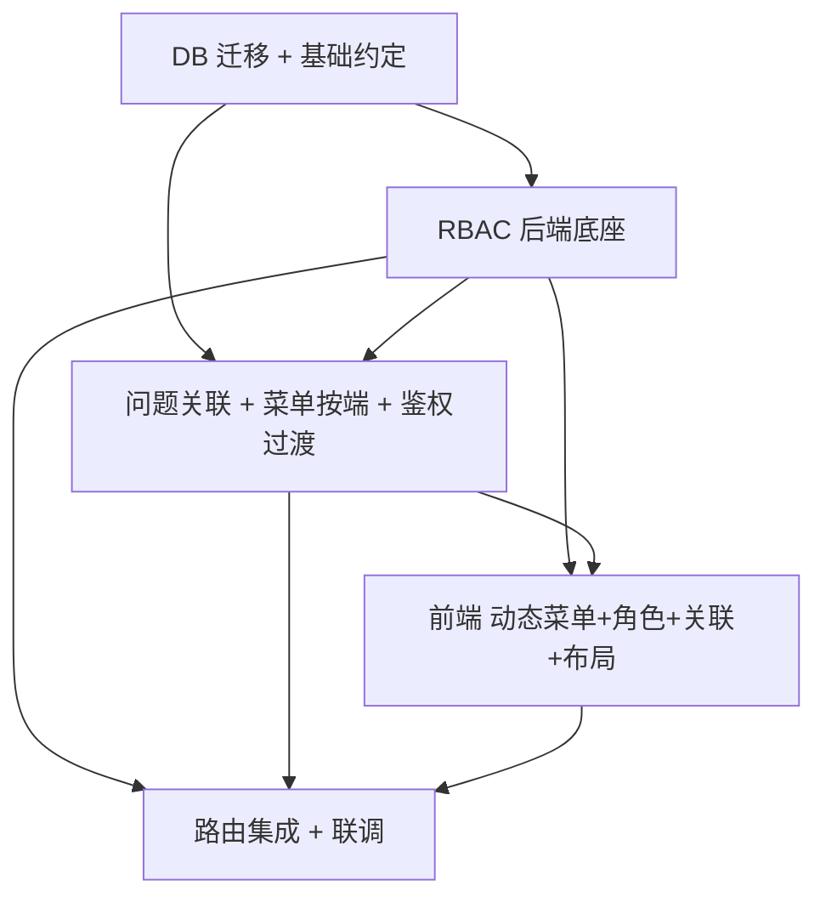

# issueFlow 增量技术设计 + 任务分解（Phase 2）

> 架构师：高见远｜基于产品经理增量 PRD（prd-phase2.md）与主理人 6 项决策
> 代码根：`D:\WorkBuddyProjects\issueFlow`（`src/backend` 与 `src/frontend`）
> 本文为**增量设计**，仅描述 Phase 2 新增/改动点；既有 `architecture.md` / `incremental-design.md`（P0）/ 基线 mermaid 不覆盖。
> 配套图文件：`docs/incremental-class-diagram-phase2.mermaid`、`docs/incremental-sequence-diagram-phase2.mermaid`。
> 硬性约束：**不引入任何新第三方依赖**（后端无新 starter，前端零新包）。

---

## 1. 实现方案 + 框架选型

### 1.1 核心难点与原则
- **最小改动落地**：复用既有分层（Controller/Service/Mapper/Entity + req/resp DTO）、`Result<>`/`PageResult<>` 响应、`BaseEntity` 逻辑删除、私有 `requireAdmin()` 权限模式。Phase 2 在 P0 基座上做「横向能力增强」而非重构。
- **6 项需求归类**：
  - R1 后台顶栏入口收敛（纯前端，删 1 行）→ T04
  - R2 前台缓存清理（纯前端，加 1 项）→ T04
  - R3 问题关联（前置边建模 + 防环）→ T03（后端）+ T04（前端）
  - R4 菜单按端可配置 + 动态渲染（自引用树 + 递归 `SideMenu`）→ T03（后端）+ T04（前端）
  - R5 角色管理 + RBAC（单角色 + 权限集，Redis 缓存）→ T02（后端底座）+ T04（前端页）
  - R6 测试数据（幂等种子 SQL）→ T01
- **不触碰 JWT / AuthUtils 结构**（决策 1）：JWT 仍仅携带 `roleCode`；权限集走 Redis 缓存（key `perm:role:{roleId}`），变更即失效，无需重新登录（决策 4）。

### 1.2 技术选型（沿用既有栈，无新增）
| 关注点 | 选型 | 说明 |
|---|---|---|
| 后端 ORM | MyBatis-Plus（`BaseMapper` + `LambdaQueryWrapper`） | 实体继承 `BaseEntity`，逻辑删除 `deleted` |
| 鉴权助手 | `PermissionService.requirePermission(...)` 替代各 service 私有 `requireAdmin()` | ADMIN 首判放行；其余查 Redis 权限集 |
| 权限缓存 | Redis（`RedisTemplate<String,Object>`，与 `AuthService` 同 bean） | key `perm:role:{roleId}`，value 为逗号分隔权限码字符串 |
| 防环算法 | 内存 BFS（数据量小） | 沿"前置边"反向遍历；可选 MySQL 8 `WITH RECURSIVE` CTE |
| 前端框架 | Vue3 + Element Plus + Pinia + Vue Router | 复用 `request.js` 拦截器 |
| 动态菜单 | 新增递归组件 `SideMenu.vue`（`el-menu`/`el-sub-menu`） | 后端返回按端树，前端递归渲染 |
| 树/表单/表格 | `el-tree-select` / `el-table` + `el-dialog` | 与 `MenuManage`/`UserManage` 同范式 |

### 1.3 架构模式
沿用「贫血实体 + Service 业务逻辑 + Mapper 数据访问」MVC 变体；前后端分离、JWT 无状态。
新增模块（Permission/Role/IssueRelation）与既有 `Menu`/`Project` 完全同构。
`requirePermission` 作为共享 `@Service` 注入各业务 Service/Controller，取代散落的私有 `requireAdmin()`，实现「平滑迁移、ADMIN 始终放行、管理接口逐步切到权限码」。

---

## 2. 数据库变更清单（精确 DDL，落在 T01）

> 约定（与 `BaseEntity` 对齐）：`id BIGINT AUTO_INCREMENT`；`created_at`/`updated_at DATETIME`（MP 自动填充）；`deleted INT DEFAULT 0`；字符集 `utf8mb4`、引擎 `InnoDB`。
> 全部写入 `scripts/V20250801_issueflow_phase2.sql`，幂等（`CREATE TABLE IF NOT EXISTS` + `INSERT ... WHERE NOT EXISTS` + 动态 `ALTER` 防重复列）。

### 2.1 新表：`issue_relation`（仅存前置边，后置由反向推导）
```sql
CREATE TABLE IF NOT EXISTS `issue_relation` (
  `id`         BIGINT NOT NULL AUTO_INCREMENT,
  `issue_id`   BIGINT NOT NULL COMMENT '当前问题 X',
  `related_id` BIGINT NOT NULL COMMENT '关联问题 P（rel_type=1 表示 P 是 X 的前置）',
  `rel_type`   TINYINT NOT NULL DEFAULT 1 COMMENT '1=related_id 是 issue_id 的前置任务',
  `created_at` DATETIME DEFAULT NULL,
  `updated_at` DATETIME DEFAULT NULL,
  `deleted`    INT DEFAULT 0,
  PRIMARY KEY (`id`),
  UNIQUE KEY `uk_ir` (`issue_id`,`related_id`,`rel_type`),
  KEY `idx_ir_related` (`related_id`,`rel_type`),
  KEY `idx_ir_issue` (`issue_id`,`rel_type`)
) ENGINE=InnoDB DEFAULT CHARSET=utf8mb4 COMMENT='问题关联表（前置边）';
```

### 2.2 新表：`permission`（权限目录）
```sql
CREATE TABLE IF NOT EXISTS `permission` (
  `id`         BIGINT NOT NULL AUTO_INCREMENT,
  `code`       VARCHAR(100) NOT NULL COMMENT 'module:resource:action',
  `name`       VARCHAR(100) NOT NULL COMMENT '权限名称',
  `module`     VARCHAR(50)  DEFAULT NULL COMMENT '模块',
  `action`     VARCHAR(30)  DEFAULT NULL COMMENT '动作',
  `type`       TINYINT DEFAULT 2 COMMENT '1=前台端 2=后台端（授权页分组）',
  `sort`       INT DEFAULT 0,
  `created_at` DATETIME DEFAULT NULL,
  `updated_at` DATETIME DEFAULT NULL,
  `deleted`    INT DEFAULT 0,
  PRIMARY KEY (`id`),
  UNIQUE KEY `uk_perm_code` (`code`)
) ENGINE=InnoDB DEFAULT CHARSET=utf8mb4 COMMENT='权限目录';
```

### 2.3 新表：`role_permission`（角色-权限映射）
```sql
CREATE TABLE IF NOT EXISTS `role_permission` (
  `id`            BIGINT NOT NULL AUTO_INCREMENT,
  `role_id`       BIGINT NOT NULL,
  `permission_id` BIGINT NOT NULL,
  `created_at`    DATETIME DEFAULT NULL,
  PRIMARY KEY (`id`),
  UNIQUE KEY `uk_rp` (`role_id`,`permission_id`),
  KEY `idx_rp_role` (`role_id`)
) ENGINE=InnoDB DEFAULT CHARSET=utf8mb4 COMMENT='角色权限映射';
```

### 2.4 既有 `menu` 加端维度（迁移，防重复列）
```sql
SET @c := (SELECT COUNT(*) FROM information_schema.COLUMNS
  WHERE TABLE_SCHEMA=DATABASE() AND TABLE_NAME='menu' AND COLUMN_NAME='type');
SET @sql := IF(@c=0,
  'ALTER TABLE `menu` ADD COLUMN `type` TINYINT NOT NULL DEFAULT 2 COMMENT \'1前台端 2后台端\' AFTER `icon`',
  'SELECT 1');
PREPARE s FROM @sql; EXECUTE s; DEALLOCATE PREPARE s;
```

### 2.5 种子数据（R6，幂等，节选要点，详见 T01 任务说明）
- 组织层级、项目（默认项目 + 3 个新项目）、用户（admin + 职能角色用户各 2~3 名）。
- **权限目录**：写入 §5 附录全部权限码（约 27 条）。
- **角色权限映射**：ADMIN 全量；SUBMITTER/DEVELOPER/TESTER 最小集（`issue:list/create/update`、`dashboard:view`）。
- **菜单（按端）**：后台端(type=2) 整棵树（含「系统管理」父级 + 用户/组织/菜单/**角色**管理子项，均带 `permission`）；前台端(type=1) 工作台/我的问题/提交问题/个人看板。
- **问题 ≥12 条**：覆盖 status/severity/标签/项目；构造链式关联（A 前置 B、B 前置 C；D 前置 E），仅落前置边。
- **流程配置**：`sys_config` 置 `flow_reopen_enabled=1`、`flow_reject_enabled=1`。

---

## 3. 后端 API 契约（REST URL / Method / DTO / 权限）

> 权限列：`登录`=仅需 JWT；`ADMIN`=原 `requireAdmin`；`PERM:xxx`=本期 `requirePermission("xxx")`。
> `/options` 等只读下拉保持仅登录（决策：过渡期不收紧）。

### 3.1 问题关联（IssueController 新增，挂 `/api/issues`）
| Method | URL | 入参 | 出参 | 权限 |
|---|---|---|---|---|
| GET | `/api/issues/{id}/relations` | path `id` | `IssueRelationVO{predecessors:List<IssueRefVO>, successors:List<IssueRefVO>}` | 登录 |
| PUT | `/api/issues/{id}/relations` | path `id`；body `IssueRelationReq{predecessorIds:Long[], successorIds:Long[]}` | `void` | 登录 +（ADMIN 或 提交人）；成环抛 `RELATION_CYCLE` |
| GET | `/api/issues/options` | query `excludeId`(可选) | `List<IssueRefVO{id,issueNo,title,status}>` | 登录 |

- `IssueRefVO`：`Long id; String issueNo; String title; Integer status`
- 后置由反向推导：`successors` = 满足 `(issue_id=S, related_id=当前)` 的 S。
- 防环仅在前置边建模下校验（见 §6 + 时序图）。

### 3.2 菜单按端 + 动态渲染（MenuController 改造）
| Method | URL | 入参 | 出参 | 权限 |
|---|---|---|---|---|
| GET | `/api/menus` | query `type`(可选 1/2) | `List<MenuVO>`（扁平，含 `type`） | `PERM:menu:list`（ADMIN 放行） |
| GET | `/api/menus/sidebar` | query `type`(1/2，必填) | `List<MenuNodeVO>`（树，含 `children`） | 登录 |
| POST | `/api/menus` | `MenuReq(+type)` | `MenuVO` | `PERM:menu:create` |
| PUT | `/api/menus/{id}` | `MenuReq(+type)` | `MenuVO` | `PERM:menu:update` |
| DELETE | `/api/menus/{id}` | path `id` | `void` | `PERM:menu:delete`（有子节点 `NODE_HAS_CHILDREN`） |

- `MenuVO` 新增 `Integer type`；`MenuNodeVO extends MenuVO { List<MenuNodeVO> children; }`。
- `sidebar` 接口按 `type` + `deleted=0` + `sort,id` 排序后前端/后端组装树，返回整棵该端菜单树。

### 3.3 角色管理 + 权限目录（RoleController 新增，`/api/roles`；PermissionController 新增，`/api/permissions`）
| Method | URL | 入参 | 出参 | 权限 |
|---|---|---|---|---|
| GET | `/api/roles` | — | `List<RoleVO{id,code,name,description,permissionCount,builtin}>` | `PERM:role:list` |
| POST | `/api/roles` | `RoleReq{code,name,description}` | `RoleVO` | `PERM:role:create`（码不可与内置重复→`ROLE_CODE_DUPLICATE`） |
| PUT | `/api/roles/{id}` | `RoleReq{name,description}`（码不可改） | `RoleVO` | `PERM:role:update` |
| DELETE | `/api/roles/{id}` | path `id` | `void` | `PERM:role:delete`（内置角色→`ROLE_BUILTIN_PROTECTED`） |
| GET | `/api/roles/{id}/permissions` | path `id` | `List<String>` 权限码 | `PERM:role:assign` |
| PUT | `/api/roles/{id}/permissions` | body `RolePermissionReq{permissionCodes:String[]}` | `void`（整体替换 + 失效缓存） | `PERM:role:assign` |
| GET | `/api/permissions` | — | `List<PermissionVO{id,code,name,module,action,type,sort}>` | `PERM:role:assign`（或登录） |
| POST | `/api/roles/permissions/refresh` | — | `void`（重载全部角色权限缓存） | `PERM:role:assign` |

- 内置角色码集合：`ADMIN/SUBMITTER/DEVELOPER/TESTER`（`Constants.BUILTIN_ROLE_CODES`）；`builtin` 字段由 `code ∈ 内置集合` 推导。
- 原 `UserController.GET /api/roles` 迁移至 `RoleController`，避免重复映射（T02 同步移除 `UserController` 中的 `/roles`）。

### 3.4 全局 `requireAdmin → requirePermission` 过渡（T03 收口）
将以下管理模块 Service 层私有 `requireAdmin()` 替换为 `permissionService.requirePermission("xxx:action")`（ADMIN 在 `requirePermission` 内首判放行，行为不回退）：

| 模块 Service | 替换点 → 权限码 |
|---|---|
| `ProjectService` | create→`project:create`、update→`project:update`、delete→`project:delete`（list 保持仅登录） |
| `UserService` | 用户 CRUD→`user:create/update/delete`（list 保持仅登录） |
| `OrganizationService` | create/update/delete→`organization:create/update/delete` |
| `MenuService` | create/update/delete→`menu:create/update/delete`（list→`menu:list`） |
| `IssueService` | list/detail→`issue:list`、create→`issue:create`、update/delete→`issue:update`/`issue:delete`（保留 SUBMITTER 数据范围 + 提交人规则） |
| `SysConfigService` | 流程配置/系统设置写→`flow:config` / `settings:update`（读→`flow:view`/`settings:view`） |

> 说明：前端 admin 路由仍由 `routes.js` 的 `meta.roles:['ADMIN']` 守卫（P0 行为不变）；本期仅完成后端鉴权底座与「管理接口逐步切权限码」，功能角色可访问 admin 页面的路由级放行列入 P1（不阻塞本期交付）。

---

## 4. 数据结构与接口（类图，详见 `incremental-class-diagram-phase2.mermaid`）

### 4.1 新增实体
| 类 | 关键字段 |
|---|---|
| `IssueRelation extends BaseEntity` | `Long issueId; Long relatedId; Integer relType`（默认 1） |
| `Permission` | `String code; String name; String module; String action; Integer type; Integer sort`（**不继承 BaseEntity**，与 `role`/`sys_config` 同风格，无逻辑删除） |
| `RolePermission` | `Long roleId; Long permissionId`（**不继承 BaseEntity**） |
| `Menu`(+type) | 原字段 + `Integer type`（1前台/2后台，默认2） |

### 4.2 新增/扩展 DTO
| 类 | 字段 |
|---|---|
| `IssueRelationReq` | `List<Long> predecessorIds; List<Long> successorIds` |
| `IssueRelationVO` | `List<IssueRefVO> predecessors; List<IssueRefVO> successors` |
| `IssueRefVO` | `Long id; String issueNo; String title; Integer status` |
| `MenuReq`(+type) | 原字段 + `Integer type` |
| `MenuVO`(+type) | 原字段 + `Integer type` |
| `MenuNodeVO` | `MenuVO` + `List<MenuNodeVO> children` |
| `RoleReq` | `String code; String name; String description` |
| `RoleVO` | `Long id; String code; String name; String description; Integer permissionCount; Boolean builtin` |
| `RolePermissionReq` | `List<String> permissionCodes` |
| `PermissionVO` | `Long id; String code; String name; String module; String action; Integer type; Integer sort` |

### 4.3 新增 Mapper（均 `extends BaseMapper<T>`）
- `IssueRelationMapper`：`selectByIssueId(Long)`、`deleteByIssueId(Long)`、`selectIssueIdsByRelatedId(Long)`（自定义 `@Select`）
- `PermissionMapper`：`extends BaseMapper<Permission>`
- `RolePermissionMapper`：自定义 `@Select` `List<String> selectPermissionCodesByRoleId(Long roleId)`、`deleteByRoleId(Long)`、`insertBatch(...)`

### 4.4 新增 Service / Controller
- `PermissionService`（核心）：`requirePermission(String... perms)`、`Set<String> getPermissions(Long roleId)`（Redis 读→DB 兜底→写回）、`invalidate(Long roleId)`、`refreshAll()`、`@PostConstruct init()` 预热全部角色权限集与 `code→id` 内存映射。
- `RoleService`：CRUD + `assignPermissions(id, codes)`（整体替换 `role_permission` + 调 `permissionService.invalidate`）+ 内置保护。
- `IssueRelationService`：`getRelations(id)`、`saveRelations(id, predIds, succIds, uid, roleCode)`（防环 BFS + 事务替换）、`listOptions(excludeId)`。
- `RoleController` / `PermissionController`（见 §3.3）。
- `IssueController` 增 §3.1 三接口；`MenuController` 增 `sidebar` + `type` 过滤；`MenuService` 增 `listByType`/`listSidebarTree`。

---

## 5. 程序调用流程（时序图，详见 `incremental-sequence-diagram-phase2.mermaid`）

三张关键时序图：
1. **问题关联保存防环**：`IssueDetailDrawer` → `PUT /relations` → `IssueRelationService.saveRelations` → 权限校验 → 逐边 BFS 防环（`selectIssueIdsByRelatedId` 沿后继扩展）→ 事务删旧边 + 批量插新边 → 返回/抛 `RELATION_CYCLE`。
2. **角色权限分配与鉴权生效**：`RoleManage` → `PUT /roles/{id}/permissions` → `RoleService.assignPermissions` → 替换映射 → `permissionService.invalidate(roleId)`（删 `perm:role:{id}`）→ 下次请求 `requirePermission` 读 Redis 未命中→DB 重新加载→写回→即时生效（无需重新登录）。
3. **菜单动态渲染**：`AdminLayout` 挂载 `SideMenu type=2` → `onMounted` 调 `GET /menus/sidebar?type=2` → 后端按端组装树 → `SideMenu` 递归 `el-sub-menu`/`el-menu-item` 渲染（图标动态组件 + 激活态 + 折叠态保留）。

---

## 6. 关联防环算法（重点，具体实现建议）

### 6.1 建模约定（决策 2）
- 仅存**前置边**：`issue_relation(issue_id=X, related_id=P, rel_type=1)` ⇔ **P 是 X 的前置**（P 必须先于 X 完成）。
- 后置由反向查询推导：`X` 的后置 = 满足 `(issue_id=S, related_id=X)` 的 S。
- UI 提交 `{predecessorIds, successorIds}` 的落库映射：
  - `predecessorIds` 中每个 P → 边 `(issue_id=当前, related_id=P)`（P 是当前的前置）。
  - `successorIds` 中每个 S → 边 `(issue_id=S, related_id=当前)`（S 的前置是当前）。

### 6.2 成环判定（BFS，推荐，数据量小内存遍历即可）
新增边 `e=(issue_id=A, related_id=Y)`（即 Y 成为 A 的前置）。**成环当且仅当 A 已经（传递）必须在 Y 之前**——即存在 must-precede 路径 `A → … → Y`。
BFS 从 `A` 出发，沿"后继"方向扩展：当前节点 `N` 的后继 = `SELECT issue_id FROM issue_relation WHERE related_id = N AND rel_type=1 AND deleted=0` 得到的 `issue_id`（即 N 作为其前置的那些问题）。
- 若遍历中命中 `Y` → 成环，拒绝并提示冲突对 `(A, Y)`。
- 自关联 `A==Y` 直接拒绝。

```java
// IssueRelationService 片段（伪代码）
boolean wouldCreateCycle(Long A, Long Y) {
    if (A.equals(Y)) return true;                 // 自环
    Set<Long> visited = new HashSet<>();
    Deque<Long> q = new ArrayDeque<>();
    q.add(A); visited.add(A);
    while (!q.isEmpty()) {
        Long n = q.poll();
        if (n.equals(Y)) return true;             // A 能到达 Y → 成环
        for (Long succ : mapper.selectIssueIdsByRelatedId(n)) {  // related_id=n 的 issue_id
            if (visited.add(succ)) q.add(succ);
        }
    }
    return false;
}
```
- `saveRelations` 对每条待写边先 `wouldCreateCycle` 校验，全部通过后才在 `@Transactional` 内「删 `issue_id=A` 旧边 + 批量插新边」。
- **可选 MySQL 8 CTE 实现**（更稳，适合大数据）：用 `WITH RECURSIVE` 从 A 沿 `related_id` 反向展开后继，判断是否能到达 Y；本项目数据量小，BFS 更直观，推荐 BFS。

### 6.3 种子数据防环验证
构造链：5001 前置 5002、5002 前置 5003（边 `(5001,5002)`、`(5002,5003)`）。再尝试 5003 前置 5001（边 `(5003,5001)`）→ BFS 从 5003 命中 5001 → 应被拒。该用例供联调（T05）验证。

---

## 7. 前端设计要点

### 7.1 `SideMenu.vue`（递归动态菜单，R4 重点）
- Props：`type: Number`（1/2）。
- `onMounted` 调 `GET /menus/sidebar?type={type}`，存入 `menuTree`。
- 递归渲染：`v-for` 节点，有 `children` 用 `<el-sub-menu>`（index=path），否则 `<el-menu-item>`（index=path）；`router` 模式 + `:default-active="route.path"` 保持激活态。
- 图标：`icon` 字段（Element Plus 图标名）→ `<component :is="resolveIcon(icon)" />` 动态组件（`@element-plus/icons-vue` 按需引入映射表；未知图标降级为 `Menu` 默认图标）。
- 折叠态：接收 `appStore.sidebarCollapsed && !appStore.isMobile`，`el-menu :collapse` 保持现状体验。
- 权限过滤（P1 基础版，本期一并实现）：节点有 `permission` 且 `!userStore.isAdmin && !hasPerm(code)` 则隐藏；无 `permission` 对登录用户可见。（`hasPerm` 见 `utils/permission.js` 扩展。）

### 7.2 `AdminLayout.vue` / `UserLayout.vue`（R1 + R4 + R2）
- `AdminLayout`：① 移除顶栏 `<LayoutSwitchEntry variant="topbar" />`（第 85 行，R1）；② 侧栏 `<el-menu>` 硬编码整段替换为 `<SideMenu :type="2" />`，保留底部 `<LayoutSwitchEntry variant="sidebar" />` 与头像下拉（清理缓存/个人设置/退出）。
- `UserLayout`：① 侧栏硬编码菜单替换为 `<SideMenu :type="1" />`；② 头像下拉在「退出登录」前新增「清理缓存」（command=`clearCache`，图标 `Refresh`），逻辑复用后台 `localStorage.clear() + ElMessage + 600ms reload`（R2）。

### 7.3 `RoleManage.vue`（R5 前端，置于「系统管理」下）
- 列表 `el-table`：角色码/名称/描述/权限数/操作（编辑、分配权限、删除；内置角色禁用删除与改码）。
- 新建/编辑 Dialog：`RoleReq`（新建可填 code，内置角色不可改码）。
- 分配权限 Dialog：左模块分组 + 右操作复选（查看/新增/编辑/删除/导出），保存调 `PUT /roles/{id}/permissions`；权限目录来自 `GET /permissions` 按 `module` 分组。
- 路由：`routes.js` 在 `system` 父级下新增 `roles` 子路由（`meta.roles:['ADMIN']`，与现有 admin 页一致），`SystemLayout.vue` 作为容器透传。

### 7.4 `IssueDetailDrawer.vue`（R3 前端）
- 新增「关联问题」区（`el-divider` 分隔）：两个 `el-select multiple`「前置任务」「后置任务」，选项来自 `GET /issues/options`（排除自身）。
- 列表展示已关联问题（issueNo + 标题 + 状态标签），可点击跳转 `/admin/issues?issueId=xxx` 或调起详情。
- 抽取 `components/IssueRelationPanel.vue` 承载关联编辑 UI，被 `IssueDetailDrawer` 引入；保存调 `PUT /issues/{id}/relations`，失败（成环）提示具体冲突对。

### 7.5 `MenuManage.vue`（R4 管理页）
- 顶部「端」切换（Radio：前台端/后台端），列表与表单仅操作当前端。
- 表单新增「端」`el-radio`（1前台/2后台）。
- 树形列表按当前端构建；`parentTreeOptions` 仅含同端节点（跨端不可做父子）。
- 调用 `GET /menus?type=` 拉取当前端扁平列表，本地组装树。

---

## 8. 新增/修改文件列表（按路径，标注 后端/前端/DB）

> 后端根：`src/backend/src/main/java/com/issueflow/`；前端根：`src/frontend/src/`。

### 8.1 DB
- `scripts/V20250801_issueflow_phase2.sql`（新建 3 表 + menu 加 type + 全模块种子数据）

### 8.2 后端（新增 / 修改）
新增：
- `entity/IssueRelation.java`、`entity/Permission.java`、`entity/RolePermission.java`
- `mapper/IssueRelationMapper.java`、`mapper/PermissionMapper.java`、`mapper/RolePermissionMapper.java`
- `service/PermissionService.java`、`service/RoleService.java`、`service/IssueRelationService.java`
- `controller/RoleController.java`、`controller/PermissionController.java`
- `dto/req/RoleReq.java`、`dto/req/RolePermissionReq.java`、`dto/req/IssueRelationReq.java`
- `dto/resp/RoleVO.java`、`dto/resp/PermissionVO.java`、`dto/resp/IssueRelationVO.java`、`dto/resp/IssueRefVO.java`、`dto/resp/MenuNodeVO.java`

修改：
- `entity/Menu.java`（+`type`）、`dto/req/MenuReq.java`（+`type`）、`dto/resp/MenuVO.java`（+`type`）
- `common/ResultCode.java`（+`RELATION_CYCLE`/`ROLE_BUILTIN_PROTECTED`/`ROLE_CODE_DUPLICATE`）
- `common/Constants.java`（+`BUILTIN_ROLE_CODES`/`REDIS_PERM_ROLE_PREFIX`/`MENU_TYPE_*`）
- `service/MenuService.java`（+`type` 过滤、`listSidebarTree`、`requirePermission` 替换 `requireAdmin`）
- `service/IssueService.java`（+`requirePermission` 过渡；可选注入 `IssueRelationService` 供列表/详情回显关联摘要）
- `service/ProjectService.java` / `UserService.java` / `OrganizationService.java` / `SysConfigService.java`（私有 `requireAdmin` → `permissionService.requirePermission(...)`）
- `controller/MenuController.java`（+`/menus?type`、`/menus/sidebar`）
- `controller/IssueController.java`（+`/relations` 两接口、`/options`）
- `controller/UserController.java`（移除 `GET /roles` 列表，避免与 `RoleController` 冲突）

### 8.3 前端（新增 / 修改）
新增：
- `components/SideMenu.vue`、`components/IssueRelationPanel.vue`
- `views/admin/RoleManage.vue`
- `api/role.js`、`api/permission.js`

修改：
- `layouts/AdminLayout.vue`（移除顶栏 `LayoutSwitchEntry variant="topbar"`；侧栏硬编码菜单→`<SideMenu :type="2" />`）
- `layouts/UserLayout.vue`（侧栏→`<SideMenu :type="1" />`；头像下拉加「清理缓存」）
- `views/admin/MenuManage.vue`（+端切换）
- `components/IssueDetailDrawer.vue`（+关联区，引入 `IssueRelationPanel`）
- `api/menu.js`（+`getSidebarMenus(type)`、`listMenus(type)`）、`api/issue.js`（+`getRelations`、`saveRelations`、`listIssueOptions`）
- `store/user.js`（+`permissions` 状态、`getInfo` 时从 `GET /roles/{id}/permissions` 或独立接口装载；`hasPerm` getter）
- `utils/permission.js`（扩展 `hasPerm(code)` 按权限码判断；`v-perm` 指令兼容权限码）
- `router/routes.js`（system 下加 `roles` 子路由）

---

## 9. 任务列表（有序 + 依赖 + 实现顺序）

> 优先级均为 P0（本期交付）。依赖关系保证「DB→后端底座→后端收口→前端功能→集成联调」。
> 硬性约束：任务数 ≤5，每任务 ≥3 个相关文件，首任务为基础设施（本增量项目无新依赖/配置，故以「DB 迁移 + 基础约定」作为地基）。

| 任务 | 名称 | 源文件（新增/修改，标注 后端/F/前端/DB） | 依赖 | 优先级 |
|---|---|---|---|---|
| **T01** | 数据库迁移 + 基础数据约定 | DB：`scripts/V20250801_issueflow_phase2.sql`；后端：`common/ResultCode.java`、`common/Constants.java`、`entity/Menu.java`、`dto/req/MenuReq.java`、`dto/resp/MenuVO.java` | 无 | P0 |
| **T02** | RBAC 后端底座（角色/权限/鉴权助手） | 后端：`entity/Permission.java`、`entity/RolePermission.java`、`mapper/PermissionMapper.java`、`mapper/RolePermissionMapper.java`、`service/PermissionService.java`、`service/RoleService.java`、`controller/RoleController.java`、`controller/PermissionController.java`、`dto/req/RoleReq.java`、`dto/req/RolePermissionReq.java`、`dto/resp/RoleVO.java`、`dto/resp/PermissionVO.java`、`controller/UserController.java`（移除/roles） | T01 | P0 |
| **T03** | 问题关联 + 菜单按端 + 全局鉴权过渡（后端收口） | 后端：`entity/IssueRelation.java`、`mapper/IssueRelationMapper.java`、`service/IssueRelationService.java`、`dto/req/IssueRelationReq.java`、`dto/resp/IssueRelationVO.java`、`dto/resp/IssueRefVO.java`、`controller/IssueController.java`（+relations/options）、`service/MenuService.java`（+type/sidebar/`requirePermission`）、`controller/MenuController.java`（+/menus?type、/menus/sidebar）、`dto/resp/MenuNodeVO.java`、`service/IssueService.java`（+requirePermission 过渡）、`service/ProjectService.java`/`UserService.java`/`OrganizationService.java`/`SysConfigService.java`（requireAdmin→requirePermission）、`entity/Menu.java`/`dto/req/MenuReq.java`/`dto/resp/MenuVO.java`（已在 T01 改，本任务联调） | T01, T02 | P0 |
| **T04** | 前端 动态菜单 + 角色管理 + 问题关联 + 布局收敛 | 前端：`components/SideMenu.vue`、`components/IssueRelationPanel.vue`、`views/admin/RoleManage.vue`、`api/role.js`、`api/permission.js`、`layouts/AdminLayout.vue`（移除顶栏入口 + 用 SideMenu）、`layouts/UserLayout.vue`（用 SideMenu + 清理缓存）、`views/admin/MenuManage.vue`（+端）、`components/IssueDetailDrawer.vue`（+关联）、`api/menu.js`（+sidebar/options）、`api/issue.js`（+relations）、`store/user.js`（+permissions）、`utils/permission.js`（+hasPerm）、`router/routes.js`（+roles 路由） | T02, T03 | P0 |
| **T05** | 路由集成 + 联调回归 | 前端：`router/routes.js`（与 T04 同一文件，本任务核对 role 路由 + 权限守卫）、`views/admin/SystemLayout.vue`（确认 role 子路由容器）；测试：`tests/api/issueflow.postman_collection.json`（补充角色/权限/关联/菜单接口用例）；回归验证 6 需求 + 防环 + 权限即时生效 | T02, T03, T04 | P0 |

> 说明：T01 为地基；T02/T03 为后端（T03 依赖 T02 的 `PermissionService`）；T04 为前端功能（依赖后端接口）；T05 为集成与回归。R1（顶栏收敛）与 R2（前台缓存）已在 T04 的 `AdminLayout.vue`/`UserLayout.vue` 改动中落实，故不单列任务。

### 任务依赖关系图


---

## 10. 依赖包

**无新第三方依赖**（硬性约束）。
- 后端沿用：Spring Boot 3.2.5、MyBatis-Plus 3.5.7、MySQL 8 Connector、Redis 7（Spring Data Redis）、jjwt 0.12.x、Element/BCrypt 等既有依赖。
- 前端沿用：Vue3、Element Plus、Pinia、Vue Router、Axios、@element-plus/icons-vue。
- 防环 BFS 为纯 Java 集合实现；动态菜单复用 Element Plus `el-menu`；权限缓存复用既有 `RedisTemplate<String,Object>`。

---

## 11. 共享约定（跨模块，供 Engineer 遵循）

1. **权限模型**：单角色 `User.roleId` + 权限集（`role_permission`→`permission`）；JWT 不改结构，仅携带 `roleCode`；权限集走 Redis（`perm:role:{roleId}`，逗号分隔码字符串），变更即失效，无需重新登录。
2. **`requirePermission` 语义**：ADMIN 首判放行；其余取该角色权限集，与入参权限码做「存在交集即放行」（`!Collections.disjoint`，OR 语义，与 PRD 一致）；无权限抛 `PERMISSION_DENIED`。所有管理接口逐步从 `requireAdmin()` 切到 `requirePermission("module:resource:action")`。
3. **权限码命名**：`module:resource:action`，`action∈{list,create,update,delete,export,assign,view,config}`；模块见 §3.3 与权限目录种子。
4. **关联仅存前置边**：`issue_relation(issue_id=X, related_id=P, rel_type=1)` ⇔ P 是 X 的前置；后置由反向查询推导；保存时整体替换 `issue_id=当前` 的边；成环抛 `RELATION_CYCLE`（含冲突对）。
5. **菜单端维度**：`menu.type` 1=前台端 / 2=后台端（默认2）；整棵树（含「系统管理」父级）完全来自 `menu` 自引用 `parent_id`，数据驱动；前端 `SideMenu` 按 `type` 动态递归渲染，激活态/图标/折叠态保持现状。
6. **内置角色保护**：`ADMIN/SUBMITTER/DEVELOPER/TESTER` 禁止删除、禁止改角色码；新建角色码不可与内置重复（`ROLE_CODE_DUPLICATE`）。
7. **统一响应**：`Result<T>`/`PageResult<T>`；分页 `page`(默认1)/`size`(默认10)；列表 `sort ASC, id ASC`。
8. **逻辑删除**：`deleted`(0/1) + MP 全局；菜单/组织删除前校验无子节点（`NODE_HAS_CHILDREN`）；`issue_relation` 软删（MP 逻辑删）。
9. **种子数据幂等**：`CREATE TABLE IF NOT EXISTS` + `INSERT ... WHERE NOT EXISTS`；菜单/组织父子用「按 name+type 子查询解析 parent_id」保证可重跑；权限/角色权限映射用「按 code 子查询解析 id」避免硬编码 ID。
10. **前端调用约定**：复用 `request.js` 拦截器（解包 `Result`、401→登录、403→/403）；新增 API 封装到对应 `api/*.js`。

---

## 12. 风险与待明确事项

### 12.1 风险点（需主理人/工程师特别注意）
1. **菜单种子必须覆盖全部路由 path**：动态渲染后侧栏完全来自 `menu` 表；若种子漏写某路由（如新增的 `/admin/system/roles`），对应页面将无法从侧栏进入（路由本身仍可达）。**务必按 `routes.js` 现有/新增 path 一一对应写入种子**（见 T01 种子脚本注释清单）。
2. **`requireAdmin→requirePermission` 过渡的隐性放行**：`requirePermission` 对 ADMIN 首判放行，但若某管理接口误写为不调用 `requirePermission` 且未保留 `requireAdmin`，则任何登录用户可访问。**T03 替换时需逐方法核对，禁止「既无 requireAdmin 也无 requirePermission」的裸接口**（写操作）。
3. **权限缓存与 `code→id` 映射一致性**：`PermissionService` 在内存维护 `roleCode→roleId` 映射用于查缓存 key；新建/删除角色后必须 `refreshAll()` 或至少刷新该映射，否则新角色权限查不到（会被拒）。种子数据在应用首次启动 `@PostConstruct` 预热，需确认启动顺序（DB 已初始化后再起后端）。
4. **关联防环的并发写**：BFS 校验与落库非原子；高并发下两个请求可能同时通过校验后插入成环边。**本期数据量小、管理后台低频操作，可接受**；如需严格，可在 `(issue_id, related_id, rel_type)` 唯一索引 + 插入冲突时回滚并提示，或在事务内加 `SELECT ... FOR UPDATE` 锁。建议在 T03 实现时用 `@Transactional` + 唯一索引兜底。
5. **`/options` 等只读下拉保持仅登录**：过渡期不收紧，避免影响非管理员前端页面（如提交问题页的下拉）。切勿给 `/issues/options`、`/projects/options` 加 `requirePermission`。

### 12.2 待明确（已给推荐默认值，非阻塞）
1. **功能角色能否进入 admin 页面**：本期 admin 路由仍由 `meta.roles:['ADMIN']` 守卫（P0 行为），故即便后端授予 `issue:list`，功能角色仍被路由挡在 admin 页外；前端路由级按权限放行列入 P1。推荐本期保持 ADMIN 守卫，仅完成后端权限底座。
2. **`store/user.js` 权限装载时机**：推荐在 `getInfo()` 成功后并行拉取当前角色权限码集合（`GET /roles/{roleId}/permissions`）存入 `permissions`，供 `SideMenu` 过滤与 `v-perm` 指令使用；若担心额外请求，可改由后端 `info()` 一并返回（需改 `LoginVO`/`UserVO`，改动较大，故不采用）。
3. **前台「个人设置」**：按决策 6 本期不做，仅前台加「清理缓存」；个人设置 Dialog 沿用后台已有实现，不新增。

---

## 13. 待明确事项（Anything UNCLEAR / 假设）

- 假设：种子数据中的角色 ID、权限 ID 由 `WHERE NOT EXISTS` + 自增生成，不硬编码；菜单/组织父子用 name+type 子查询解析，避免重跑冲突。
- 假设：前端 `SideMenu` 图标映射表覆盖现有菜单所用图标（DataLine/Tickets/Folder/Switch/Setting/Brush/Tools/User/OfficeBuilding/Grid/HomeFilled/EditPen/DataLine 等），未知图标降级。
- 假设：`IssueService` 列表/详情本期不强制回显关联摘要（关联在详情 Drawer 内独立拉取），降低改动面；P1 再扩展列表「有依赖」标记列。
- 未明确（采用推荐默认）：功能角色进入 admin 页面的路由级放行（P1）；关联依赖图可视化（P2）；菜单拖拽排序（P2）；行级数据权限精细化（保持现状）。

---

> 配套图：`docs/incremental-class-diagram-phase2.mermaid`（实体/DTO/Service/Controller 关系）、`docs/incremental-sequence-diagram-phase2.mermaid`（防环保存 / 权限分配生效 / 菜单动态渲染）。
