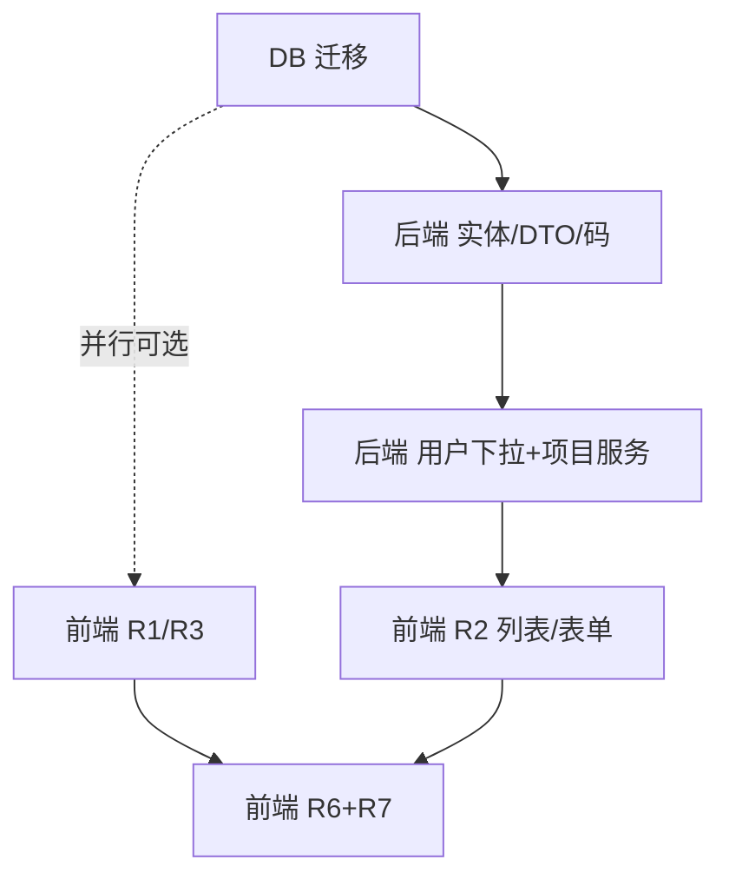

# issueFlow 增量架构设计（Phase 3）

> 文档版本：v1.0（增量设计）
> 角色：架构师 高见远
> 关联：产品经理 PRD `docs/prd-phase3.md`、主理人 8 项决策、Phase 2 设计 `docs/incremental-design-phase2.md`
> 技术栈（沿用）：后端 Spring Boot 3.2.5 + MyBatis-Plus 3.5.7 + MySQL 8 + Redis 7 + JWT；前端 Vue3 + Element Plus + Pinia + Vue Router + Vite。**不引入任何新第三方依赖。**

---

## 1. 实现方案

### 1.1 技术难点与应对

| 难点 | 应对方案 |
|---|---|
| **R2 成员/负责人批量回填（避免 N+1）** | `ProjectService.pageProjects` 在 `toVO` 阶段，汇总当页所有 `leaderId` 与切分后的 `memberIds`，**一次性** `userMapper.selectBatchIds(...)`，构建 `Map<Long,User>`，回填 `leaderName` 与 `members`。逐行查 user 一律禁止。 |
| **R4 停用校验的一致性** | `ProjectService.updateProject` 加 `@Transactional`；仅当 `req.status==0 && exist.status==1` 时 `issueMapper.selectCount(projectId + status!=CLOSED + deleted=0)`，`>0` 抛 `BizException(PROJECT_HAS_OPEN_ISSUES)`。窄竞态由事务 + 既有行锁兜底，本期不做乐观锁。 |
| **R7 作用域隔离（不污染前台）** | 新写 `applyAdminStyleVars(state, rootEl)`，只写 **AdminLayout 根元素**（`.if-layout--admin`）的内联 CSS 变量 + `data-if-admin-style` 属性，**严禁**写 `document.documentElement`。前台 `UserLayout` 的 `el-color-picker` 仍走 `store/theme` + `localStorage['if_theme']`，互不影响。 |
| **R7 sticky 与现有 flex 布局兼容** | `position: sticky` 需要可滚动祖先与 `top:0`/`align-self`。在 `admin-style.css` 中为 `.if-topbar`/`.if-sidebar` 绑定 `--if-topbar-position`/`--if-sidebar-position` 变量（默认 `sticky`）。已知限制见 §9。 |
| **R5/R6 幂等种子 SQL** | 菜单 UPDATE 用子查询 `SELECT id FROM menu WHERE path='/admin/system'`（派生表包裹）解析父 id，避免硬编码；菜单软删除用 `deleted=1`。重跑安全。 |
| **R2 切换状态会误清空负责人/成员** | 后端 `updateProject` 对 `leaderId/memberIds` 采用「存在即覆盖」（不过滤 null）。前端 `onToggleStatus` 必须发送**完整 payload**（含 `leaderId`/`memberIds`），否则每次切状态会把负责人/成员置空。见 §9 风险 1。 |

### 1.2 框架选型

- 后端：沿用 Spring Boot + MyBatis-Plus + JWT + Redis。**无新依赖**。
- 前端：沿用 Vue3 + Element Plus + Pinia + Vue Router + Vite。**无新依赖**。
- 复用范式：`BaseEntity` / `Result<T>` / `PageResult<T>` / `ResultCode` / `BizException` / `PermissionService.requirePermission`（ADMIN 始终放行）；菜单动态渲染沿用 `SideMenu` + `menu.type`（R5 仅改种子，无前端代码）。
- R7 风格状态仅写 `localStorage`（key `if_admin_style`），**不进 Pinia**（避免 store 膨胀），由 `AdminStyleDrawer` 持有、`AdminLayout` `onMounted` 读取一次。

---

## 2. 数据库变更

> 文件：`scripts/V20260730_issueflow_phase3.sql`（今天 2026-07-30）
> 约定：ALTER 用 `information_schema` 动态防重复；菜单变更用软删除 + 子查询解析父 id；全部可重跑。

```sql
-- ============================================================
-- issueFlow Phase 3 增量 DDL + 种子数据（R2 / R5 / R6）
-- 幂等：ALTER 防重复列；菜单 UPDATE 用子查询解析父 id；软删除 deleted=1
-- ============================================================
SET NAMES utf8mb4;

-- ---------------------------------------------------------------------------
-- 1. project 加 leader_id / member_ids（动态 ALTER 防重复）
-- ---------------------------------------------------------------------------
SET @c1 := (SELECT COUNT(*) FROM information_schema.COLUMNS
  WHERE TABLE_SCHEMA=DATABASE() AND TABLE_NAME='project' AND COLUMN_NAME='leader_id');
SET @sql := IF(@c1=0,
  'ALTER TABLE `project` ADD COLUMN `leader_id` BIGINT DEFAULT NULL COMMENT \'负责人 id（user.id）\' AFTER `status`',
  'SELECT 1');
PREPARE s FROM @sql; EXECUTE s; DEALLOCATE PREPARE s;

SET @c2 := (SELECT COUNT(*) FROM information_schema.COLUMNS
  WHERE TABLE_SCHEMA=DATABASE() AND TABLE_NAME='project' AND COLUMN_NAME='member_ids');
SET @sql := IF(@c2=0,
  'ALTER TABLE `project` ADD COLUMN `member_ids` VARCHAR(500) DEFAULT NULL COMMENT \'项目成员 id，逗号分隔（上限约 80 人）\' AFTER `leader_id`',
  'SELECT 1');
PREPARE s FROM @sql; EXECUTE s; DEALLOCATE PREPARE s;

-- ---------------------------------------------------------------------------
-- 2. R5：流程配置 parent_id 指向「系统管理」（用子查询解析父 id，防硬编码）
--    派生表包裹以绕过 MySQL「不能在同一语句中 UPDATE 目标表又 SELECT 它」的限制
-- ---------------------------------------------------------------------------
UPDATE `menu`
SET `parent_id` = (SELECT `pid` FROM (
  SELECT `id` AS `pid` FROM `menu`
  WHERE `path` = '/admin/system' AND `type` = 2 AND `deleted` = 0
) AS `_p`)
WHERE `path` = '/admin/flow-config' AND `type` = 2 AND `deleted` = 0
  AND `parent_id` <> (SELECT `pid` FROM (
    SELECT `id` AS `pid` FROM `menu`
    WHERE `path` = '/admin/system' AND `type` = 2 AND `deleted` = 0
  ) AS `_p2`);

-- ---------------------------------------------------------------------------
-- 3. R6：系统设置菜单软删除（deleted=1，与 BaseEntity 软删约定一致）
-- ---------------------------------------------------------------------------
UPDATE `menu` SET `deleted` = 1
WHERE `path` = '/admin/settings' AND `type` = 2 AND `deleted` = 0;

-- ---------------------------------------------------------------------------
-- 4. （可选）R2 测试数据：给默认项目补负责人 + 成员（幂等 UPDATE，按 name 解析用户）
--    仅用于联调演示；生产环境可省略
-- ---------------------------------------------------------------------------
UPDATE `project`
SET `leader_id` = (SELECT `id` FROM `user` WHERE `username` = 'dev_zhang' AND `deleted` = 0 LIMIT 1),
    `member_ids` = (
      SELECT GROUP_CONCAT(`id`) FROM `user`
      WHERE `username` IN ('dev_zhao','test_li','test_qian') AND `deleted` = 0
    )
WHERE `name` = '核心交易系统' AND `deleted` = 0
  AND (`leader_id` IS NULL OR `member_ids` IS NULL);
```

> 说明：`sys_config` 表与 `/api/sys-config` 接口**保留不动**（主理人决策 R6）；`theme_color`/`layout`/`menu_config` 三个 key 本期不再由前端写入（R7 改存 localStorage），但库中不删除。

---

## 3. 新增 / 修改文件列表

### 3.1 后端（Spring Boot，`src/backend/.../com/issueflow/`）

| 操作 | 文件 | 改动要点 |
|---|---|---|
| 修改 | `entity/Project.java` | 新增 `leaderId`(Long)、`memberIds`(String) |
| 修改 | `dto/req/ProjectReq.java` | 新增 `leaderId`(Long)、`memberIds`(String)（非必填） |
| 修改 | `dto/resp/ProjectVO.java` | 新增 `leaderId`、`leaderName`、`memberIds`、`members: List<UserBriefVO>` |
| 新增 | `dto/resp/UserBriefVO.java` | `{id, realName, username, roleName}` |
| 修改 | `common/ResultCode.java` | 新增 `PROJECT_HAS_OPEN_ISSUES(40020, "该项目下存在未关闭问题，无法停用")` |
| 修改 | `service/ProjectService.java` | 注入 `UserMapper`/`IssueMapper`/`RoleMapper`；`pageProjects` 批量回填；`createProject`/`updateProject` 写 `leaderId`/`memberIds`；`updateProject` 加 `@Transactional` + R4 校验；`listOptions` 加 `.eq(status,1)`（R3） |
| 修改 | `controller/UserController.java` | 新增 `GET /api/users/options?keyword=`（仅登录，返回 `List<UserBriefVO>`） |
| 修改 | `service/UserService.java` | 新增 `listUserOptions(String keyword)`：查 `status=1 & deleted=0`，按 `real_name/username` 模糊匹配，上限 100，回填 `roleName` |

### 3.2 前端（`src/frontend/src/`）

| 操作 | 文件 | 改动要点 |
|---|---|---|
| 修改 | `api/user.js` | 新增 `listUserOptions(params)` → `GET /users/options` |
| 修改 | `views/admin/AdminIssueList.vue` | **R1**：删除头部「提交问题」按钮 + `goCreate` + `Plus` 引用 |
| 修改 | `views/admin/ProjectManage.vue` | **R2**：新增「负责人」「项目成员」列；表单加负责人/成员远程搜索 `el-select`；新增「列设置」Popover（localStorage `if_project_columns`）；`onToggleStatus` 发送完整 payload |
| 修改 | `components/IssueForm.vue` | **R3**：移除 `:disabled="p.status!==1"` 与「（停用）」后缀文案（后端已过滤） |
| 修改 | `router/routes.js` | **R6**：删除 `/admin/settings` 路由条目及 `SystemSettings.vue` 懒加载引用 |
| 删除 | `views/admin/SystemSettings.vue` | **R6**：迁移后死代码，删除 |
| 删除 | `components/ThemeConfigPanel.vue` | **R6**：能力已迁至 R7 抽屉，删除 |
| 修改 | `layouts/AdminLayout.vue` | **R7**：头像下拉加「整体风格设置」项（command=`styleSettings`）；挂载 `AdminStyleDrawer`；`onMounted` 读取 `if_admin_style` 并 `applyAdminStyleVars` |
| 新增 | `components/AdminStyleDrawer.vue` | **R7**：`ElDrawer` 右侧抽屉，7 项控件（本期仅亮色/暗色、主题色 10 预设、侧边菜单类型、内容区域宽度、固定 Header、固定侧边菜单、色弱模式），变更即时应用 + 持久化 |
| 修改 | `utils/theme.js` | 新增 `applyAdminStyleVars(state, rootEl)`（仅写 AdminLayout 根元素） |
| 新增 | `utils/adminStyle.js` | 常量 `ADMIN_STYLE_KEY`、`DEFAULT_ADMIN_STYLE`、`ADMIN_THEME_COLORS`（10 色）、`loadAdminStyle()`、`saveAdminStyle()` |
| 新增 | `styles/admin-style.css` | **R7** 作用域 CSS：仅对 `.if-layout--admin` / `[data-if-admin-style]` 生效，绑定 `--admin-sidebar-bg`/`--admin-content-max`/`--if-topbar-position`/`--if-sidebar-position`/`--if-color-weak-filter` 及暗色模式 |

> `api/sysConfig.js` 在 R6 后变为无引用死代码，可保留（不影响编译）或确认无引用后删除；`components/README.md`、`views/README.md`、`router/README.md` 中仍有 `SystemSettings.vue`/`ThemeConfigPanel.vue` 文档描述，非阻塞，建议后续清理。

---

## 4. 接口契约

统一响应：`Result<T> = { code, data, message }`，`code=200` 成功；业务异常由全局异常处理器返回对应 `code` + `message`，前端响应拦截器统一 `ElMessage.error(message)`。

| Method | URL | 入参 | 出参 | 权限 |
|---|---|---|---|---|
| GET | `/api/users/options` | `keyword`(可选，模糊匹配 real_name/username) | `List<UserBriefVO{id,realName,username,roleName}>`（上限 100，仅 `status=1 & deleted=0`） | 仅登录 |
| GET | `/api/projects` | `page,size` | `PageResult<ProjectVO>`（含 `leaderId,leaderName,memberIds,members`） | `project:list` |
| POST | `/api/projects` | `ProjectReq{name,description,status,leaderId,memberIds}` | `ProjectVO` | `project:create` |
| PUT | `/api/projects/{id}` | `ProjectReq`（同上；切停用走 R4） | `ProjectVO` | `project:update` |
| DELETE | `/api/projects/{id}` | path | `void` | `project:delete` |
| GET | `/api/projects/options` | — | `List<ProjectOptionVO>`（**R3 后仅 `status=1`**，保留 `status` 字段恒为 1） | 仅登录 |
| PUT | `/api/projects/{id}`（R4 校验失败） | `status` 由 1→0 且存在未关闭问题 | `BizException` → `Result{code:40020, message:"该项目下存在未关闭问题，无法停用"}` | `project:update` |

**UserBriefVO（新增）**
```java
class UserBriefVO { Long id; String realName; String username; String roleName; }
```

**ProjectVO 扩展字段**
```java
// 在既有 id/name/description/status/createdAt/updatedAt 基础上新增：
Long leaderId;
String leaderName;        // 由 userService 回查，缺省 null
String memberIds;         // 原始逗号串
List<UserBriefVO> members;// 由 memberIds 切分后批量查 user 封装（按原顺序，丢弃无效 id）
```

**权限要点**
- R2 项目负责人/成员维护沿用 `project:create`/`project:update`，不新增权限码。
- R2 `/api/users/options`、R3 `/api/projects/options`：仅登录（不调 `permissionService`），收紧的是可见性而非权限。
- R5/R6 菜单迁移为种子 SQL，无运行时权限变更；既有 `ADMIN` 始终放行规则不变。

---

## 5. 程序调用流程

> 完整时序见 `docs/incremental-sequence-diagram-phase3.mermaid`（R4 停用校验、R2 批量回填、R7 风格即时应用）。

**R2 项目分页批量回填（后端）**
`AdminLayout→ProjectManage.vue` 调 `GET /api/projects` → `ProjectController.page` → `ProjectService.pageProjects` → `projectMapper.selectPage` → 汇总当页 `leaderId` + 切分 `memberIds` → `userMapper.selectBatchIds(ids)`（一次）→ 构建 `Map<Long,User>` + `roleMap` → `toVO` 回填 `leaderName`/`members` → `PageResult<ProjectVO>`。

**R4 停用校验（后端）**
`ProjectManage.vue` `onToggleStatus`（完整 payload） → `PUT /api/projects/{id}` → `ProjectService.updateProject`@Transactional → `status` 由 1→0 且存在 `issue.project_id=id & status!=CLOSED & deleted=0` 时 `selectCount>0` → 抛 `BizException(40020)` → 全局异常处理器 → 前端 `catch` 回滚 `row.status` + 拦截器提示。

**R7 风格抽屉即时应用（前端）**
`AdminLayout.onMounted` → `loadAdminStyle()`（localStorage）→ `applyAdminStyleVars(state, rootEl)` 写 `.if-layout--admin` 内联变量 + `data-if-admin-style`。点击头像「整体风格设置」→ `AdminStyleDrawer` 打开 → 任一控件 change → `applyAdminStyleVars(state, document.querySelector('.if-layout--admin'))` 即时生效 + `saveAdminStyle(state)`。`rootEl` 限定后台根，不触 `document.documentElement`。

---

## 6. 任务列表（有序、含依赖、按实现顺序）

> 标注：【DB】数据库 /【后端】Spring Boot /【前端】Vue3。工程师按 T 序号顺序实现。

### T01【DB】Phase 3 数据库迁移（无后端依赖，最先执行）
- 文件：`scripts/V20260730_issueflow_phase3.sql`
- 内容：§2 的 ALTER（leader_id/member_ids）+ R5 菜单 UPDATE + R6 菜单软删除 + 可选测试数据。
- 依赖：无
- 验收：重跑 2 次无报错；`project` 含两新列；「流程配置」父级为「系统管理」；「系统设置」`deleted=1`。

### T02【后端】实体 / DTO / 业务码扩展
- 文件：`entity/Project.java`、`dto/req/ProjectReq.java`、`dto/resp/ProjectVO.java`、`dto/resp/UserBriefVO.java`（新）、`common/ResultCode.java`
- 内容：Project 加 `leaderId`/`memberIds`；ProjectReq 同加；ProjectVO 加 `leaderId/leaderName/memberIds/members`；新增 UserBriefVO；ResultCode 加 `PROJECT_HAS_OPEN_ISSUES(40020,...)`。
- 依赖：T01（字段需与 DB 对齐，但编译不依赖；可并行）
- 验收：`mvn compile` 通过；新枚举存在。

### T03【后端】用户下拉 + 项目服务（R2/R3/R4 核心）
- 文件：`service/UserService.java`、`controller/UserController.java`、`service/ProjectService.java`
- 内容：
  - `UserService.listUserOptions(keyword)`：登录用户、`status=1 & deleted=0`、模糊匹配、`LIMIT 100`、回填 `roleName`。
  - `UserController` 新增 `GET /api/users/options`。
  - `ProjectService`：注入 `UserMapper`/`IssueMapper`/`RoleMapper`；`pageProjects` 批量回填（见 §5）；`createProject`/`updateProject` 写 `leaderId`/`memberIds`（存在即覆盖）；`updateProject` 加 `@Transactional` + R4 校验；`listOptions` 加 `.eq(status,1)`。
- 依赖：T02
- 验收：分页接口返回 `leaderName`/`members`；`/api/users/options` 上限 100；停用有未关闭问题返回 40020；`/api/projects/options` 仅启用项。

### T04【前端】R1/R3 收口（纯前端，轻量）
- 文件：`views/admin/AdminIssueList.vue`、`components/IssueForm.vue`
- 内容：
  - R1：删除「提交问题」按钮 + `goCreate` + `Plus` import。
  - R3：`IssueForm` 关联项目下拉移除 `:disabled` 与「（停用）」后缀（`label` 直接用 `p.name`）。
- 依赖：无（可与 T05 并行）
- 验收：`/admin/issues` 头部无新建按钮；提交问题页下拉无停用项且无灰显。

### T05【前端】R2 项目列表/表单增强
- 文件：`api/user.js`、`views/admin/ProjectManage.vue`
- 内容：
  - `api/user.js` 加 `listUserOptions(params)`。
  - `ProjectManage.vue`：列表加「负责人」「项目成员」列（成员首 3 名 +「…等 N 人」）；表单加负责人/成员远程搜索 `el-select`（成员 `multiple`）；「列设置」Popover + Checkbox（localStorage `if_project_columns`，操作列恒显）；`onToggleStatus` 发送**完整 payload**（含 `leaderId`/`memberIds`）；提交表单带 `leaderId`/`memberIds`。
- 依赖：T03（接口就绪）
- 验收：新建项目选负责人+成员后列表正确回显；列设置持久化；切状态不丢负责人/成员。

### T06【前端】R6 收尾 + R7 风格抽屉
- 文件：`router/routes.js`、`views/admin/SystemSettings.vue`（删）、`components/ThemeConfigPanel.vue`（删）、`layouts/AdminLayout.vue`、`components/AdminStyleDrawer.vue`（新）、`utils/theme.js`、`utils/adminStyle.js`（新）、`styles/admin-style.css`（新）
- 内容：
  - R6：`routes.js` 删除 `/admin/settings` 路由及 `SystemSettings.vue` 引用；删除两个 vue 文件；`grep` 清理悬空 import。
  - R7：`utils/theme.js` 加 `applyAdminStyleVars(state, rootEl)`（仅写 AdminLayout 根）；`utils/adminStyle.js` 加常量/读写；`AdminStyleDrawer` 实现 7 项控件（按 §3.2 + 决策 6/7）；`AdminLayout` 下拉加项 + 挂载抽屉 + `onMounted` 应用；`admin-style.css` 作用域 CSS。
- 依赖：T04/T05 已稳定（避免冲突）；R7 独立
- 验收：侧栏无「系统设置」；抽屉 7 项即时生效且刷新保持；前台 `UserLayout` 不受任何项影响；`grep ThemeConfigPanel|SystemSettings` 无残留引用（README 除外）。

### 任务依赖关系图


---

## 7. 依赖包

**无新增依赖。** 全部复用既有栈：
- 后端：`spring-boot-starter-web` 3.2.5、`mybatis-plus-boot-starter` 3.5.7、`spring-boot-starter-data-redis` 7、`jjwt`(JWT)、`lombok`、`mysql-connector-j` 8。
- 前端：`vue` 3、`element-plus`、`pinia`、`vue-router`、`axios`、`@element-plus/icons-vue`、`vite`。

---

## 8. 共享约定

1. **响应契约**：`Result<T>{code,data,message}`，`code=200` 成功；业务异常由 `GlobalExceptionHandler` 统一包装；前端 `api/request.js` 拦截器对 `code!=200` 调 `ElMessage.error(message)` 并 reject。
2. **日期**：JSON 用 `yyyy-MM-dd HH:mm:ss`（`@JsonFormat`）。
3. **localStorage key 约定**：
   - `if_project_columns`：项目列表列显隐（JSON 数组，操作列恒显）。
   - `if_admin_style`：R7 后台风格（JSON，仅 AdminLayout）。
   - `if_theme`：前台主题（store/theme，独立于 R7）。
   - `if_user` / `if_app`：既有用户态 / 侧栏折叠态。
4. **软删除**：`deleted=1`；查询过滤 `deleted=0`；菜单/用户下拉均过滤。
5. **权限**：`PermissionService.requirePermission` 鉴权；`ADMIN` 始终放行；下拉类接口仅登录（不调 `requirePermission`）。
6. **R7 作用域铁律**：`applyAdminStyleVars` 第一个参数为 AdminLayout 根元素，**绝不**写 `document.documentElement`；CSS 选择器以 `.if-layout--admin` / `[data-if-admin-style]` 限定。

---

## 9. 风险与待明确事项

1. **【高】R4 与切状态会清空负责人/成员**：后端 `updateProject` 对 `leaderId/memberIds` 采用「存在即覆盖」，前端 `onToggleStatus` **必须**发送完整 payload（`name/description/status/leaderId/memberIds`）。若只发 `{name,status}`，每次切状态会把负责人/成员置空。`ProjectManage.vue` 的 `onToggleStatus` 必须用 `row.leaderId`/`row.memberIds` 补足。
2. **【高】R7 作用域污染**：`applyAdminStyleVars` 严禁写 `document.documentElement`；一旦写全局 `:root`，前台 `UserLayout` 顶栏 `el-color-picker` 会串色。落点必须是 `.if-layout--admin` 根元素。
3. **【中】R7 sticky 已知限制**：当前布局 `.if-layout{height:100%}` + `.if-content{overflow:auto}`（内容内部滚动），`.if-topbar`/`.if-sidebar` 当前本就「固定」。将 `fixedHeader/fixedSidebar` 切为 `static` 时可见差异有限，属已知限制；建议默认保持 ON，滚动模型改造留 P1。
4. **【中】R2 N+1 回归**：`pageProjects` 必须一次性 `selectBatchIds` 回填，禁止在 `toVO` 中对单行逐个查 user；成员 `memberIds` 切分后丢弃无法解析的 id（避免脏数据导致回显缺失）。
5. **【中】R6 死代码清理**：删除 `SystemSettings.vue`/`ThemeConfigPanel.vue` 后，需 `grep` 确认 `routes.js`、`api/sysConfig.js` 引用清理；`api/sysConfig.js` 将无引用，可保留（无害）或删除（需确认无其他 import）。
6. **【低】R5 路由 path 兼容**：保留 `/admin/flow-config` 旧 path（深链兼容），仅改菜单 `parent_id`；SideMenu 动态渲染使其归到「系统管理」下，无前端路由改动。P1 再考虑 301 到 `/admin/system/flow-config`。
7. **【待明确】R7 主题色 10 色具体 hex**：主理人决策「完全沿用截图 10 色预设（蓝/浅蓝/红/橙/黄/绿/青/紫/紫红/粉灰）」，但设计侧未拿到精确 hex。本设计在 `adminStyle.js` 给出**推荐默认 10 色**（蓝 #409EFF、浅蓝 #69B1FF、红 #F56C6C、橙 #E6A23C、黄 #FADB14、绿 #67C23A、青 #13C2C2、紫 #722ED1、紫红 #EB2F96、粉灰 #D597B9），**工程师实现时需对照实际截图核对精确色值**。
8. **【低】R3 前端冗余**：`IssueForm` 移除 `disabled` 后，后端已过滤停用项，下拉不会出现停用项；保留 `status` 字段用于 P1 扩展，但不应再用于前端判断。
9. **【低】暗色模式范围**：R7「主题模式（亮色/暗色）」仅作用于后台内容区/文本底色（`admin-style.css` 提供 `[data-if-admin-theme="dark"]` 最小覆盖），侧栏默认深色不变；完整暗色主题（含 Element Plus 组件暗色）留 P1。
