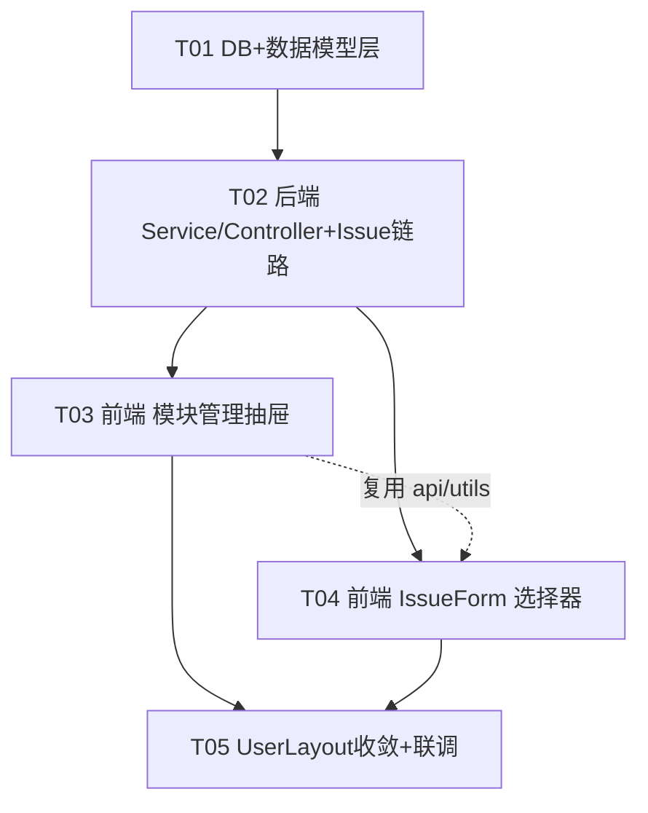

# issueFlow 增量架构设计（Phase 4）

> 文档版本：v1.0（增量设计）
> 角色：架构师 高见远
> 关联：产品经理 PRD `docs/prd-phase4.md`、主理人 10 项决策（Q1~Q10 已全部拍板）、Phase 3 设计 `docs/incremental-design-phase3.md`
> 技术栈（沿用）：后端 Spring Boot 3.2.5 + MyBatis-Plus 3.5.7 + MySQL 8 + Redis 7 + JWT；前端 Vue3 + Element Plus + Pinia + Vue Router + Vite。**不引入任何新第三方依赖。**
> 配套图：`docs/incremental-class-diagram-phase4.mermaid`、`docs/incremental-sequence-diagram-phase4.mermaid`

---

## 1. 实现方案

### 1.1 技术难点与应对

| 难点 | 应对方案 |
|---|---|
| **R1 树形存储与「查子孙」**（Q1 已拍板：邻接表） | `module` 表 `parent_id` 自引用（与 `menu` 表同范式）。单项目模块量级可控（P2 才考虑 >1000 节点），所有树操作采用「**一次全量查该项目模块 → 内存组树**」：`ModuleService.loadProjectModules(projectId)` 返回 `List<Module>`，内存构建 `parentId -> children` 映射，`collectDescendantIds` / `depthOf` 均为内存递归。**禁止**逐层递归查库，不用 MySQL 递归 CTE。 |
| **R1 层级软上限**（Q2：产品软限 10 层） | `create`：`depthOf(parentId)+1 > 10` 抛 `MODULE_DEPTH_EXCEEDED`；`move`/`batch-move`：`目标深度 + 被移子树高度 > 10` 同样拦截（子树高度内存计算）。技术上不设硬限。 |
| **R1 拖拽即拖即存**（Q3） | 一次拖拽 = 1 个接口：`PUT /api/modules/{id}/move`，body `{targetParentId, orderedSiblingIds}`。后端在事务内：改 `parent_id` + 按 `orderedSiblingIds` 全量重排目标层级 `sort=1..n`。前端 `@node-drop` 调接口，**失败 catch 后重新拉树回滚 UI**（不做本地 undo，简单可靠）。 |
| **R1 拖拽/移动防环** | `targetParentId` 命中「自身或其子孙集合」→ 抛 `MODULE_MOVE_CYCLE`。前端 `el-tree` 的 `allow-drop` 做同规则预检（体验），后端为最终裁决（安全）。 |
| **R1 依赖标记防环**（Q4：提 P0，单向 A→B，仅展示） | `PUT /api/modules/{id}/dependencies` 全量替换该模块的依赖集合。校验：以「项目内现有依赖边（排除本模块旧边）+ 本次新边」构有向图，从 `id` 出发 DFS，若可回到 `id` 则抛 `MODULE_DEPENDENCY_CYCLE`。 |
| **依赖表唯一索引与软删的冲突** | `module_dependency` 保留 `deleted` 列对齐 BaseEntity 范式，但唯一索引 `uk(from_module_id,to_module_id)` 与软删复活相斥（软删后重建同边会撞唯一键）。**设置依赖采用「先物理清空该 from 的全部行（含 deleted=1 残留）再批量插入」**：`ModuleDependencyMapper.deletePhysicalByFromId(fromId)`（自定义 `@Delete` SQL 绕过 `@TableLogic`）。关系表无审计价值，物理清空可接受；删除模块时同样物理清理其作为 from / to 的所有边。 |
| **R5-2 删除校验（Q5 批量整体原子阻断 + Q6 级联软删子孙）** | 事务内：收集所选节点 ∪ 各自子孙 → 去重得 `scopeIds` → `issueMapper.selectCount(module_id IN scopeIds AND deleted=0)`。批量删除按「所选根节点」分组统计关联数，任一 >0 则**整体拒绝**，message 列出「模块名(N)」明细；全部为 0 才对 `scopeIds` 批量软删 + 物理清理依赖边。单删是批量的特例（ids 长度 1）。 |
| **R5-1 模块归属校验** | `IssueService.createIssue/updateIssue`：`moduleId` 非空时查 `module`，要求 `deleted=0` 且 `module.project_id == 最终生效的 issue.projectId`（projectId 为空而 moduleId 非空也判 mismatch），否则抛 `MODULE_PROJECT_MISMATCH`。 |
| **问题列表回显模块路径（避免 N+1）** | 沿用 Phase 3 批量回填范式：当页收集 `moduleIds` → `ModuleService.pathMap(moduleIds)`：批查这些 module → 汇总涉及 projectIds → 一次查这些项目的全量模块 → 内存向上拼「父 > 子 > 孙」路径 Map → 回填 `IssueVO.modulePath`。无归属/查不到时前端显示「—」。 |
| **R2-2 搜索过滤高亮复用** | 后台抽屉搜索与前台 IssueForm 树选择器共用 `utils/moduleTree.js`：`filterTreeByKeyword`（命中节点 + 祖先链保留）、`splitByKeyword`（返回分段数组供自定义节点插槽渲染 `<span class="hl">`，**不用 v-html**，防 XSS）。 |
| **R4 菜单归拢零前端改动**（Q10：不建路由） | 「流程管理」父菜单 `path=/admin/flow` 仅作 `el-sub-menu` 的 index。论证：`SideMenu.vue` 对含 children 的节点渲染 `el-sub-menu`，点击父级只触发展开/收起、**不产生路由导航**（与「系统管理」父级行为一致——SystemLayout 路由从不经父菜单点击触达），故无 404 风险，**不加 redirect 兜底路由**，`routes.js` 零改动。手输 `/admin/flow` 属非预期路径，走全局 404 兜底，可接受。 |
| **R3 移除取色器不伤主题**（Q7：仅移除入口） | 仅删 `UserLayout.vue` 中 `<LayoutSwitchEntry variant="topbar">`、`el-color-picker` 及 `themeColor` / `onThemeChange` / `useThemeStore` 引用；`store/theme.js`、`utils/theme.js`、`localStorage['if_theme']` 与 `main.js` 的 `themeStore.init()` **全部保留**，已存主题色继续生效。`LayoutSwitchEntry.vue` 组件文件保留（sidebar 形态仍在用）。 |

### 1.2 框架选型

- 后端：沿用 Spring Boot + MyBatis-Plus + JWT + Redis，**无新依赖**。
- 前端：沿用 Vue3 + Element Plus（`el-tree` draggable/checkbox、`el-tree-select`、`el-drawer` 均为内置组件）+ Pinia + Vue Router + Vite，**无新依赖**。
- 复用范式：`BaseEntity` / `Result<T>` / `ResultCode` / `BizException` / `GlobalExceptionHandler` / `PermissionService.requirePermission`（ADMIN 放行）；菜单动态渲染 `SideMenu` + 种子 SQL（R4 零前端代码）。
- **权限决策**：模块写操作**复用 `project:update`**，`GET /api/modules/tree` 仅登录。理由：模块管理入口挂在「项目管理」页抽屉内，不新增独立菜单/页面；不新增 `module:*` 权限码即无 permission 表种子与角色勾选联动，改动面最小（采纳 PRD §6 备选一）。

---

## 2. 数据库变更

> 文件：`scripts/V20260801_issueflow_phase4.sql`
> 约定（沿用 Phase 3）：建表 `CREATE TABLE IF NOT EXISTS`；加列用 `information_schema` 动态防重复；菜单种子 `INSERT ... WHERE NOT EXISTS` + UPDATE 用派生表子查询解析父 id；全部可重跑（幂等）。

```sql
-- ============================================================
-- issueFlow Phase 4 增量 DDL + 种子（R1 / R2 / R4 / R5）
-- ============================================================
SET NAMES utf8mb4;

-- 1. module 表（邻接表：parent_id 自引用，0=根；同 menu 范式）
CREATE TABLE IF NOT EXISTS `module` (
  `id`          BIGINT       NOT NULL AUTO_INCREMENT,
  `project_id`  BIGINT       NOT NULL           COMMENT '所属项目 id（project.id，逻辑删除下不加外键）',
  `parent_id`   BIGINT       NOT NULL DEFAULT 0 COMMENT '父模块 id，0=根',
  `name`        VARCHAR(50)  NOT NULL           COMMENT '模块名称（同父级下唯一，应用层校验）',
  `description` VARCHAR(200) DEFAULT NULL       COMMENT '模块描述',
  `sort`        INT          NOT NULL DEFAULT 0 COMMENT '同级排序号，升序',
  `created_at`  DATETIME     DEFAULT NULL,
  `updated_at`  DATETIME     DEFAULT NULL,
  `deleted`     TINYINT      NOT NULL DEFAULT 0 COMMENT '逻辑删除 0/1',
  PRIMARY KEY (`id`),
  KEY `idx_module_project` (`project_id`, `parent_id`, `deleted`)
) ENGINE=InnoDB DEFAULT CHARSET=utf8mb4 COMMENT='项目模块（树形，邻接表）';

-- 2. module_dependency 表（单向 A 依赖 B；uk 防重；service 层物理清空重建，deleted 列仅对齐范式）
CREATE TABLE IF NOT EXISTS `module_dependency` (
  `id`             BIGINT   NOT NULL AUTO_INCREMENT,
  `from_module_id` BIGINT   NOT NULL COMMENT '依赖方模块 id（A）',
  `to_module_id`   BIGINT   NOT NULL COMMENT '被依赖模块 id（B）',
  `created_at`     DATETIME DEFAULT NULL,
  `updated_at`     DATETIME DEFAULT NULL,
  `deleted`        TINYINT  NOT NULL DEFAULT 0,
  PRIMARY KEY (`id`),
  UNIQUE KEY `uk_dep_from_to` (`from_module_id`, `to_module_id`),
  KEY `idx_dep_to` (`to_module_id`)
) ENGINE=InnoDB DEFAULT CHARSET=utf8mb4 COMMENT='模块依赖（A 依赖 B，仅展示语义）';

-- 3. issue 加 module_id（可空 + 索引，动态 ALTER 防重复）
SET @c1 := (SELECT COUNT(*) FROM information_schema.COLUMNS
  WHERE TABLE_SCHEMA=DATABASE() AND TABLE_NAME='issue' AND COLUMN_NAME='module_id');
SET @sql := IF(@c1=0,
  'ALTER TABLE `issue` ADD COLUMN `module_id` BIGINT DEFAULT NULL COMMENT ''所属模块 id（module.id，可空）'' AFTER `project_id`, ADD INDEX `idx_issue_module` (`module_id`)',
  'SELECT 1');
PREPARE s FROM @sql; EXECUTE s; DEALLOCATE PREPARE s;

-- 4. R4 菜单种子：新增一级「流程管理」（无 permission，登录可见，同「系统管理」父级范式）
INSERT INTO `menu` (`name`, `path`, `parent_id`, `sort`, `permission`, `icon`, `type`, `created_at`, `updated_at`)
SELECT '流程管理', '/admin/flow', 0, 4, NULL, 'Operation', 2, NOW(), NOW()
WHERE NOT EXISTS (SELECT 1 FROM `menu` WHERE `path`='/admin/flow' AND `type`=2 AND `deleted`=0);

-- 4.1 「流程配置」父级：系统管理 → 流程管理（派生表绕过 MySQL 同表 UPDATE/SELECT 限制），子级 sort=1
UPDATE `menu`
SET `parent_id` = (SELECT `pid` FROM (
      SELECT `id` AS `pid` FROM `menu`
      WHERE `path`='/admin/flow' AND `type`=2 AND `deleted`=0) AS `_p`),
    `sort` = 1
WHERE `path`='/admin/flow-config' AND `type`=2 AND `deleted`=0
  AND `parent_id` <> (SELECT `pid` FROM (
      SELECT `id` AS `pid` FROM `menu`
      WHERE `path`='/admin/flow' AND `type`=2 AND `deleted`=0) AS `_p2`);

-- 4.2 「流程监控」父级：顶级(0) → 流程管理，子级 sort=2
UPDATE `menu`
SET `parent_id` = (SELECT `pid` FROM (
      SELECT `id` AS `pid` FROM `menu`
      WHERE `path`='/admin/flow' AND `type`=2 AND `deleted`=0) AS `_p`),
    `sort` = 2
WHERE `path`='/admin/flow-monitor' AND `type`=2 AND `deleted`=0
  AND `parent_id` <> (SELECT `pid` FROM (
      SELECT `id` AS `pid` FROM `menu`
      WHERE `path`='/admin/flow' AND `type`=2 AND `deleted`=0) AS `_p2`);
```

> 顶级菜单最终排序：概览(1) → 问题管理(2) → 项目管理(3) → **流程管理(4)** → 系统管理(5)。原顶级「流程监控」sort=4 被收编为子级后不与「流程管理」冲突。
> **不新增权限码种子**：模块写操作复用 `project:update`，permission 表零变更。

---

## 3. 新增 / 修改文件列表

### 3.1 数据库（`scripts/`）

| 操作 | 文件 | 改动要点 |
|---|---|---|
| 新增 | `scripts/V20260801_issueflow_phase4.sql` | §2 全部内容（module / module_dependency 建表 + issue 加列 + R4 菜单种子），幂等可重跑 |

### 3.2 后端（`src/backend/src/main/java/com/issueflow/`）

| 操作 | 文件 | 改动要点 |
|---|---|---|
| 新增 | `entity/Module.java` | 继承 `BaseEntity`；`projectId`(Long)、`parentId`(Long)、`name`、`description`、`sort`(Integer)；`@TableName("module")` |
| 新增 | `entity/ModuleDependency.java` | 继承 `BaseEntity`；`fromModuleId`、`toModuleId`；`@TableName("module_dependency")` |
| 新增 | `mapper/ModuleMapper.java` | `extends BaseMapper<Module>`，无自定义 SQL |
| 新增 | `mapper/ModuleDependencyMapper.java` | `extends BaseMapper<ModuleDependency>`；自定义物理删除：`deletePhysicalByFromId(Long)`、`deletePhysicalByModuleIds(List<Long>)`（`@Delete`，绕过 @TableLogic） |
| 修改 | `entity/Issue.java` | 新增 `moduleId`(Long) |
| 修改 | `common/ResultCode.java` | 新增 7 个业务码（见 §4.3） |
| 新增 | `dto/req/ModuleReq.java` | `{projectId, parentId, name, description}`；create 全用，update 仅取 `name/description` |
| 新增 | `dto/req/ModuleMoveReq.java` | `{targetParentId, orderedSiblingIds: List<Long>}` |
| 新增 | `dto/req/ModuleBatchReq.java` | `{projectId, ids: List<Long>, targetParentId}`；batch-delete 不读 `targetParentId`，batch-move 必填 |
| 新增 | `dto/req/ModuleDependencyReq.java` | `{dependsOnIds: List<Long>}`（全量替换语义，空数组=清空） |
| 新增 | `dto/resp/ModuleNodeVO.java` | `{id, projectId, parentId, name, description, sort, dependencyCount, dependencies: List<ModuleBriefVO>, children: List<ModuleNodeVO>}` |
| 新增 | `dto/resp/ModuleBriefVO.java` | `{id, name}`（悬浮依赖列表用） |
| 新增 | `service/ModuleService.java` | tree / create / update / delete / move / batchDelete / batchMove / setDependencies / pathMap；内部内存组树工具（见 §4.1） |
| 新增 | `controller/ModuleController.java` | 8 个端点（见 §4.2），瘦 Controller，逻辑全在 Service |
| 修改 | `dto/req/IssueCreateReq.java` | 新增 `moduleId`(Long，可空) |
| 修改 | `dto/req/IssueUpdateReq.java` | 新增 `moduleId`(Long)；**语义特殊**：编辑时前端始终携带该字段（含 null 清空），后端「存在即覆盖」——与 projectId 的「非空才更新」不同，避免无法清空模块 |
| 修改 | `dto/resp/IssueVO.java` | 新增 `moduleId`、`modulePath`(String，「父 > 子」全路径，null 时前端显「—」) |
| 修改 | `dto/resp/IssueDetailVO.java` | 同上新增 `moduleId`、`modulePath` |
| 修改 | `service/IssueService.java` | 注入 `ModuleService`（或 `ModuleMapper`）；create/update 写 `moduleId` + R5-1 归属校验；列表/详情 toVO 批量回填 `modulePath`（复用 `ModuleService.pathMap`，沿用「当页汇总→一次批查」范式） |

### 3.3 前端（`src/frontend/src/`）

| 操作 | 文件 | 改动要点 |
|---|---|---|
| 新增 | `api/module.js` | `fetchModuleTree(projectId)` / `createModule` / `updateModule` / `deleteModule` / `moveModule` / `batchDeleteModules` / `batchMoveModules` / `setModuleDependencies`，沿用 `request.js` 写法 |
| 新增 | `utils/moduleTree.js` | `filterTreeByKeyword(tree, kw)`、`splitByKeyword(text, kw)`（高亮分段）、`flattenTree(tree)`、`findPathNames(tree, id)`（「父 > 子」路径）、`collectDescendantIds(tree, id)`（前端防环预检）；抽屉与 IssueForm 共用 |
| 新增 | `components/ModuleManageDrawer.vue` | R1 核心组件（见 §5.1 交互清单） |
| 修改 | `views/admin/ProjectManage.vue` | 操作列新增「模块管理」按钮 → 打开 `ModuleManageDrawer`（传 `projectId`、`projectName`） |
| 修改 | `components/IssueForm.vue` | 「关联项目」之后新增「所属模块」`el-tree-select`（见 §5.2）；submit payload 增加 `moduleId: model.moduleId || null` |
| 修改 | `layouts/UserLayout.vue` | R3：删除 `<LayoutSwitchEntry variant="topbar" />` 与 `el-color-picker` 实例、`themeColor` ref、`onThemeChange`、`useThemeStore` import 与实例化；**保留** sidebar 形态入口与 `store/theme.js` 文件 |
| 修改 | `views/user/UserIssueList.vue`、`components/IssueDetailDrawer.vue` | 模块回显：详情/列表如展示模块则显 `modulePath || '—'`（P0 仅详情回显即可，列表列为 P1 R2-4） |

> **零改动确认**：`SideMenu.vue`（动态渲染，R4 由种子驱动）、`router/routes.js`（Q10 不建路由）、`AdminLayout.vue`、`store/theme.js`、`LayoutSwitchEntry.vue` 均不改。

---

## 4. 数据结构与接口

### 4.1 类图（描述）

> 完整 Mermaid 类图见 `docs/incremental-class-diagram-phase4.mermaid`。

核心关系：
- `Module`、`ModuleDependency` 继承 `BaseEntity`；`Issue` 新增 `moduleId` 关联 `Module`（弱引用，无外键）。
- `ModuleController --> ModuleService --> {ModuleMapper, ModuleDependencyMapper, IssueMapper, ProjectMapper, PermissionService}`。
- `IssueService --> ModuleService`（归属校验 `assertModuleBelongsToProject` + 路径回填 `pathMap`）。

`ModuleService` 关键方法签名：

```java
List<ModuleNodeVO> tree(Long projectId);                       // 全量组树 + 依赖数/依赖列表回填（两次查询：module 全量 + dependency IN 全量）
ModuleNodeVO create(ModuleReq req);                            // project:update；父存在性/同级重名/深度<=10 校验；sort=同级 max+1
ModuleNodeVO update(Long id, ModuleReq req);                   // 仅 name/description；同级重名校验（排除自身）
void delete(Long id);                                          // = batchDelete(单元素)；级联软删子孙 + R5-2 校验 + 物理清依赖边
void move(Long id, ModuleMoveReq req);                         // 防环 + 深度校验 + 改 parent_id + 同级 sort 全量重排（事务）
void batchDelete(ModuleBatchReq req);                          // Q5 整体原子阻断；message 含「模块名(N)」明细（事务）
void batchMove(ModuleBatchReq req);                            // 同项目内；目标≠所选自身/子孙；逐个挂到目标层末尾（事务）
List<ModuleBriefVO> setDependencies(Long id, ModuleDependencyReq req); // 全量替换 + 同项目校验 + DFS 防环（事务）
Map<Long, String> pathMap(Collection<Long> moduleIds);          // 批量构建「父 > 子」路径，供 IssueService 回填
void assertModuleBelongsToProject(Long moduleId, Long projectId); // R5-1，供 IssueService 调用
// 私有：loadProjectModules / buildChildrenMap / collectDescendantIds / depthOf / subtreeHeight / hasDependencyCycle
```

### 4.2 接口契约（8 个端点，统一 `Result<T>{code,data,message}`）

| # | Method | URL | 权限 | 入参 | 成功出参 `data` |
|---|---|---|---|---|---|
| 1 | GET | `/api/modules/tree?projectId={pid}` | 仅登录 | query `projectId`（必填） | `List<ModuleNodeVO>`（根级数组，children 递归；同级按 sort 升序） |
| 2 | POST | `/api/modules` | `project:update` | `{projectId, parentId, name, description}`（parentId 空=0 根级） | `ModuleNodeVO`（新节点，children 空） |
| 3 | PUT | `/api/modules/{id}` | `project:update` | `{name, description}` | `ModuleNodeVO` |
| 4 | DELETE | `/api/modules/{id}` | `project:update` | path `id` | `null`（级联软删子孙） |
| 5 | PUT | `/api/modules/{id}/move` | `project:update` | `{targetParentId, orderedSiblingIds}`（targetParentId 空/0=根级；orderedSiblingIds=目标层拖后完整顺序，含 id 自身） | `null` |
| 6 | POST | `/api/modules/batch-delete` | `project:update` | `{projectId, ids}` | `null` |
| 7 | POST | `/api/modules/batch-move` | `project:update` | `{projectId, ids, targetParentId}` | `null` |
| 8 | PUT | `/api/modules/{id}/dependencies` | `project:update` | `{dependsOnIds}`（全量替换；`[]`=清空） | `List<ModuleBriefVO>`（替换后的依赖列表） |

**ModuleNodeVO 示例**：

```json
{
  "id": 3, "projectId": 1, "parentId": 2, "name": "优惠券核销",
  "description": null, "sort": 1,
  "dependencyCount": 1,
  "dependencies": [ { "id": 8, "name": "营销中心" } ],
  "children": []
}
```

**错误响应示例（批量删除被阻断，Q5）**：

```json
{ "code": 40034, "data": null,
  "message": "以下模块（含子模块）存在关联问题，无法删除：支付中心(3)、订单中心(1)" }
```

**问题读写链路变更**：

| Method | URL | 变更点 |
|---|---|---|
| POST `/api/issues` | 新建问题 | `IssueCreateReq` + `moduleId`（可空）；moduleId 非空 → R5-1 校验，失败返 40034 |
| PUT `/api/issues/{id}` | 编辑问题 | `IssueUpdateReq` + `moduleId`（**存在即覆盖**，null=清空）；同上校验（以更新后生效的 projectId 为准） |
| GET `/api/issues`（分页）/ GET `/api/issues/{id}` | 列表/详情 | VO 增加 `moduleId`、`modulePath`（批量回填，null 前端显「—」） |

### 4.3 ResultCode 新增（延续 400xx 段）

```java
MODULE_NOT_FOUND(40030, "模块不存在"),
MODULE_NAME_DUPLICATE(40031, "同一父级下已存在同名模块"),
MODULE_DEPTH_EXCEEDED(40032, "模块层级不能超过 10 层"),
MODULE_MOVE_CYCLE(40033, "不能移动到自身或其子孙模块下"),
MODULE_HAS_ISSUES(40034, "该模块（含子模块）下存在关联问题，无法删除"),
MODULE_PROJECT_MISMATCH(40035, "模块与问题所属项目不一致"),
MODULE_DEPENDENCY_CYCLE(40036, "依赖关系存在循环，无法保存")
```

> 校验类错误允许 Service 用 `BizException(ResultCode, String)` 重载把 message 覆盖为含明细的文案（如批量删除时的「模块名(N)」清单），前端响应拦截器统一 `ElMessage.error(message)`，与 Phase 3 `PROJECT_HAS_OPEN_ISSUES(40020)` 范式一致。

### 4.4 校验规则汇总（后端为准，前端预检仅提升体验）

| 场景 | 规则 | 错误码 |
|---|---|---|
| 创建/编辑模块 | `name` 必填 ≤50 字、`description` ≤200 字（Bean Validation）；同 `projectId`+`parentId`+`deleted=0` 下 name 唯一 | 400 / MODULE_NAME_DUPLICATE |
| 创建 | `parentId≠0` 时父模块必须存在、同项目；深度 ≤10 | MODULE_NOT_FOUND / MODULE_PROJECT_MISMATCH / MODULE_DEPTH_EXCEEDED |
| move / batch-move | 目标父=自身或子孙 → 拒绝；目标父须同项目；移动后深度 ≤10；batch-move 的 ids 中互为祖先-子孙时，仅移动「顶层被选节点」（子孙随祖先移动，忽略重复项） | MODULE_MOVE_CYCLE 等 |
| delete / batch-delete | scope=所选∪子孙；`issue.module_id IN scope AND deleted=0` 计数 >0 → 整体拒绝（Q5）；通过则批量软删 + 物理清依赖边（Q6） | MODULE_HAS_ISSUES |
| 依赖设置 | dependsOnIds 均须同项目、非自身；DFS 防环（Q4/R1-6） | MODULE_PROJECT_MISMATCH / MODULE_DEPENDENCY_CYCLE |
| 问题保存 | moduleId 非空 → module 存在、未删、`module.project_id == issue.projectId` | MODULE_PROJECT_MISMATCH |

---

## 5. 前端组件设计与关键交互

### 5.1 `ModuleManageDrawer.vue`（R1，后台）

- **入口**：`ProjectManage.vue` 行操作「模块管理」→ `el-drawer`（size=560px，title=「模块管理 — {项目名}」），与 Phase 3 风格抽屉交互一致。
- **结构**：顶部工具条（新增根模块 / 批量删除 / 批量移动 / 搜索框）+ `el-tree`。
- **el-tree 配置**：`node-key="id"`、`draggable`、`show-checkbox`、`check-strictly`、`:expand-on-click-node="false"`、`:default-expanded-keys="expandedKeys"`、`:filter-node-method`、`:allow-drop`（禁止落入自身子孙内部，`inner` 与 `prev/next` 均校验目标最终父级）。
- **行内操作**（自定义节点插槽，悬浮显示）：`＋子`（弹新增框，parentId=当前）、`✎`（弹编辑框）、`依赖 N` 标签（点击开依赖弹窗；N=`dependencyCount`，`el-tooltip`/`el-popover` 悬浮列 `dependencies` 名称）、`🗑`（单删）。
- **新增/编辑弹窗**：`el-dialog` + `el-form`，字段 name（必填 ≤50）/ description（≤200）。
- **拖拽（Q3 即拖即存）**：`@node-drop(dragNode, dropNode, dropType)` → 计算 `targetParentId`（`inner`→dropNode.id；`prev/next`→dropNode 的父 id）与目标层 `orderedSiblingIds`（从树数据现序提取）→ `moveModule(id, {...})`；`catch` 时 `reloadTree()` 回滚 + 拦截器已提示。
- **单删（Q6）**：`ElMessageBox.confirm`，文案含「将同时删除 N 个子模块」（N=前端由树数据统计子孙数）；确认后 `deleteModule(id)`，40034 由拦截器提示。
- **批量删除（Q5）**：`getCheckedKeys()` ≥1 可用；确认弹窗列出所选模块名 + 子孙总数提示；整体失败时不部分删除。
- **批量移动**：弹窗内 `el-tree-select` 单选目标父（数据=当前树 + 顶部「根级」虚拟节点 `{id:0,name:'（根级）'}`，禁用所选节点及其子孙）→ `batchMoveModules`。
- **依赖设置弹窗（Q4）**：`el-dialog` 内 `el-tree-select`（`multiple`、`check-strictly`、`filterable`，数据=本项目树排除自身）回显现有 `dependencies` → 保存调 `setModuleDependencies(id, {dependsOnIds})`，40036 环路由拦截器提示。
- **搜索**：输入 → `treeRef.filter(kw)`；`filter-node-method` 用 `utils/moduleTree.filterTreeByKeyword` 同规则（命中自身或存在命中后代则保留）；节点插槽用 `splitByKeyword` 渲染 `<span class="hl">` 高亮；清空恢复全树。
- **展开状态记忆（R1-7）**：`@node-expand/@node-collapse` 维护 `expandedKeys` → 写 `localStorage['if_module_tree_expand_' + projectId]`（JSON 数组）；打开抽屉时读取。
- **任何写操作成功后** `reloadTree()`（全量重拉，简单一致）。

### 5.2 `IssueForm.vue` 模块选择器（R2，前台）

- 位置：「关联项目」表单项之后新增「所属模块」（**选填**，Q9）。
- 控件：`el-tree-select`，`v-model="model.moduleId"`，`:data="moduleTree"`，`node-key="id"`，`:props="{ label: 'name', children: 'children' }"`，`check-strictly`、`filterable`、`clearable`、`:filter-node-method`（同 §5.1 工具）、自定义节点插槽做关键字高亮、`default-expand-all=false`（filterable 命中时 el-tree-select 自动展开父路径）。
- 选中回显：`el-tree-select` 默认显示节点 label；如需全路径回显用 `findPathNames(moduleTree, moduleId).join(' > ')` 渲染（实现取其一即可，优先满足「路径感」）。
- 联动（R2-3）：`watch(() => model.projectId)`：变化 → `model.moduleId = null`；新值非空 → `fetchModuleTree(projectId)`，空 → 清空 `moduleTree` 并 `disabled`（placeholder「请先选择关联项目」）；树为空 → 空态「该项目暂无模块」。
- 编辑回显（R2-5）：`applyInitial` 设 `model.moduleId = src.moduleId`，并先按 `src.projectId` 拉树再回显。
- 提交：payload 增加 `moduleId: model.moduleId || null`。

### 5.3 `UserLayout.vue` 收敛（R3，纯删减）

删除项：template 中 `<LayoutSwitchEntry variant="topbar" />`、`<el-color-picker ...>`；script 中 `useThemeStore` import 与 `themeStore` 实例、`themeColor` ref、`onThemeChange`。保留项：sidebar 形态 `<LayoutSwitchEntry variant="sidebar" />` 及其 import、头像下拉（清理缓存/退出登录）、`store/theme.js` 文件与 `main.js` 中主题初始化（Q7）。

---

## 6. 程序调用流程

> 完整时序见 `docs/incremental-sequence-diagram-phase4.mermaid`（4 段：拖拽移动、批量删除阻断、问题提交归属校验、依赖设置防环）。

**① R1 拖拽移动（即拖即存 + 失败回滚）**
`ModuleManageDrawer` `@node-drop` → 计算 `{targetParentId, orderedSiblingIds}` → `PUT /api/modules/{id}/move` → `ModuleService.move`@Transactional：`requirePermission("project:update")` → `loadProjectModules` 内存组树 → 防环（目标∈自身∪子孙→40033）→ 深度校验（→40032）→ `updateById(parent_id)` + 按 `orderedSiblingIds` 循环重排 `sort=1..n` → 200。失败：`GlobalExceptionHandler` → 前端 catch → `reloadTree()` 回滚 UI + 拦截器提示。

**② R5-2 批量删除（整体原子阻断）**
抽屉勾选 → 确认弹窗 → `POST /api/modules/batch-delete {projectId, ids}` → `ModuleService.batchDelete`@Transactional：逐所选根节点收集子孙 → 汇总 `scopeIds` → 按所选根分组 `issueMapper.selectCount(module_id IN 组内scope AND deleted=0)` → 任一 >0 → 拼「模块名(N)」明细抛 `BizException(40034, 明细)` **整体不删** → 否则 `scopeIds` 批量软删 + `deletePhysicalByModuleIds` 清依赖边 → 200 → 前端 `reloadTree()`。

**③ R2/R5-1 提交问题携带模块**
`IssueForm` 选项目 → `GET /api/modules/tree?projectId` 加载树 → 选模块 → 提交 → `POST /api/issues`（含 `moduleId`）→ `IssueService.createIssue`：`moduleId` 非空 → `moduleService.assertModuleBelongsToProject(moduleId, projectId)`（module 不存在/已删→40030；`project_id` 不等或 projectId 为空→40035）→ 通过则落库。列表/详情读取时 `pathMap` 批量回填 `modulePath`。

**④ R1-5/R1-6 依赖设置（防环）**
依赖弹窗保存 → `PUT /api/modules/{id}/dependencies {dependsOnIds}` → `ModuleService.setDependencies`@Transactional：同项目/非自身校验 → 查项目内全部依赖边（排除 from=id 旧边）+ 新边构图 → 自 `id` DFS 检测可达自身 → 是→40036 → 否→`deletePhysicalByFromId(id)` + 批量 insert → 返回新依赖列表 → 前端更新节点「依赖 N」标签。

---

## 7. 任务列表（有序、含依赖，共 5 个）

> 标注：【DB】数据库 /【后端】Spring Boot /【前端】Vue3。优先级均为本期 P0（含已提级的依赖标记）。工程师按序实现。

### T01【DB + 后端】数据模型层（P0，依赖：无）
- **文件**：`scripts/V20260801_issueflow_phase4.sql`（新）、`entity/Module.java`（新）、`entity/ModuleDependency.java`（新）、`entity/Issue.java`（改，+moduleId）、`mapper/ModuleMapper.java`（新）、`mapper/ModuleDependencyMapper.java`（新，含 2 个物理删除 @Delete）、`common/ResultCode.java`（改，+7 码）、`dto/req/ModuleReq.java`、`dto/req/ModuleMoveReq.java`、`dto/req/ModuleBatchReq.java`、`dto/req/ModuleDependencyReq.java`、`dto/resp/ModuleNodeVO.java`、`dto/resp/ModuleBriefVO.java`（均新）
- **内容**：§2 迁移 SQL 全量（含 R4 菜单种子）；实体/Mapper/DTO/业务码按 §3.2、§4.3。
- **验收**：SQL 重跑 2 次无报错；`module`/`module_dependency` 表存在、`issue.module_id` 列存在；后台侧栏出现「流程管理 > 流程配置/流程监控」且旧深链可访问；`mvn compile` 通过。

### T02【后端】ModuleService/Controller + Issue 链路改造（P0，依赖：T01）
- **文件**：`service/ModuleService.java`（新）、`controller/ModuleController.java`（新）、`service/IssueService.java`（改）、`dto/req/IssueCreateReq.java`、`dto/req/IssueUpdateReq.java`、`dto/resp/IssueVO.java`、`dto/resp/IssueDetailVO.java`（均改）
- **内容**：§4.1 全部方法 + §4.2 八个端点 + §4.4 校验矩阵；IssueService 写 moduleId（update 存在即覆盖）+ R5-1 校验 + `pathMap` 批量回填 modulePath（禁止 N+1）。
- **验收**：8 接口 Postman 全通；跨项目模块保存问题返 40035；批量删除阻断返 40034 含明细；依赖成环返 40036；深度 11 层创建返 40032；问题列表 VO 含 modulePath。

### T03【前端】模块管理抽屉（R1 全量，P0，依赖：T02）
- **文件**：`api/module.js`（新）、`utils/moduleTree.js`（新）、`components/ModuleManageDrawer.vue`（新）、`views/admin/ProjectManage.vue`（改）
- **内容**：§5.1 全部交互（树 CRUD、即拖即存+失败回滚、批量删/移、依赖设置弹窗、搜索高亮、展开记忆、级联删除确认文案）。
- **验收**：4 层树增删改拖全通过；拖入自身子孙被 allow-drop 拦截；删除有关联问题模块被阻断且提示明细；刷新后展开状态保持；搜索命中高亮且祖先链保留。

### T04【前端】IssueForm 模块选择器 + 回显（R2，P0，依赖：T02、T03（复用 api/module.js 与 utils/moduleTree.js））
- **文件**：`components/IssueForm.vue`（改）、`views/user/UserIssueList.vue`（改，如涉及详情入口回显）、`components/IssueDetailDrawer.vue`（改，详情回显 modulePath || '—'）
- **内容**：§5.2 全部（el-tree-select、过滤高亮、项目切换清空联动、禁用态、空态、编辑回显、payload 带 moduleId）。
- **验收**：切项目后 moduleId 清空且树刷新；未选项目禁用；提交后 module_id 落库；详情回显路径，存量问题显「—」。

### T05【前端】UserLayout 收敛 + 全链路联调（R3 + 回归，P0，依赖：T03、T04）
- **文件**：`layouts/UserLayout.vue`（改）、`docs/CHANGELOG.md`（改，记录 Phase 4）、`src/frontend/src/components/README.md`（改，登记新组件，非阻塞）
- **内容**：§5.3 删减；全链路回归：R1~R5 验收标准逐条过 + 前台主题色仍生效（localStorage['if_theme'] 有值时）+ 后台 AdminLayout 不受影响 + SideMenu/routes 零改动确认（grep）。
- **验收**：前台顶栏仅剩头像下拉；左下角入口 ADMIN 可切后台；`grep -r "variant=\"topbar\"" src/frontend/src` 无残留；`grep onThemeChange` 无残留；CHANGELOG 更新。

### 任务依赖关系图



> 说明：T05 中的 R3 删减本身无依赖、可提前并行，但联调回归必须在 T03/T04 之后，故整体排在最后。

---

## 8. 依赖包

**无新增依赖。** 全部复用既有栈：
- 后端：`spring-boot-starter-web` 3.2.5、`mybatis-plus-boot-starter` 3.5.7、`spring-boot-starter-data-redis`、`jjwt`、`lombok`、`mysql-connector-j`。
- 前端：`vue` 3、`element-plus`（`el-tree` / `el-tree-select` / `el-drawer` 内置）、`pinia`、`vue-router`、`axios`、`@element-plus/icons-vue`、`vite`。

---

## 9. 共享约定

1. **响应契约**：`Result<T>{code,data,message}`；业务异常 `BizException` → `GlobalExceptionHandler`；前端 `api/request.js` 拦截器对 `code!=200` 统一 `ElMessage.error(message)`。
2. **包路径/命名**：后端新类落既有分包（`entity`/`mapper`/`dto.req`/`dto.resp`/`service`/`controller`）；模块相关统一 `Module` 前缀；REST 路径统一 `/api/modules/**`。
3. **树约定**：`parent_id=0` 表示根（与 `menu` 一致，非 NULL）；同级按 `sort` 升序、`sort` 从 1 连续重排；「查子孙/深度/高度」一律内存组树计算，禁止逐层查库。
4. **软删/物理删分界**：`module`、`issue` 软删（`deleted=1`）；`module_dependency` 因唯一索引采用**物理清空重建**（仅此一表例外，见 §1.1）。
5. **moduleId 更新语义**：`IssueUpdateReq.moduleId` 为「存在即覆盖」（前端编辑始终携带，null=清空）——与 `projectId`「非空才更新」不同，工程师注意勿套用同一模板。
6. **localStorage key**：新增 `if_module_tree_expand_{projectId}`（展开节点 id JSON 数组）；既有 `if_theme` / `if_admin_style` / `if_project_columns` / `if_user` / `if_app` 不变。
7. **树过滤/高亮工具**：统一走 `utils/moduleTree.js`，抽屉与 IssueForm 禁止各写一份；高亮用分段渲染（`splitByKeyword`），禁止 `v-html`。
8. **权限**：模块写操作 `requirePermission("project:update")`（ADMIN 放行）；`GET /api/modules/tree` 仅登录；不新增权限码。
9. **批量回填铁律**（沿用 Phase 3）：列表类 VO 的关联名称/路径回填必须「当页汇总 id → 一次批查 → Map 回填」，禁止行内单查。
10. **日期**：JSON `yyyy-MM-dd HH:mm:ss`（`@JsonFormat`），Module 相关 VO 如需时间戳沿用。

---

## 10. 待明确事项

**无。** Q1~Q10 已由主理人全部拍板并落入本设计（Q1 邻接表 / Q2 软限 10 层 / Q3 即拖即存 / Q4 依赖标记 P0 单向仅展示+防环 / Q5 批量删除整体原子阻断 / Q6 级联软删子孙 / Q7 仅移除取色器入口保留 store / Q8 模块无 status / Q9 issue.module_id 选填 / Q10 流程管理父菜单不建路由）。

### 附：实现风险提示（非阻塞）

1. **【中】el-tree-select 深层默认展开**：`filterable` 命中时自动展开父路径由组件保证，但「编辑回显时自动展开到已选节点」需设 `:default-expanded-keys="[moduleId]"` 或依赖组件内置行为，联调时验证（T04 验收项）。
2. **【中】拖拽 orderedSiblingIds 的口径**：必须是**拖拽完成后目标层的完整有序 id 列表（含被拖节点）**，从 el-tree 数据源（已被组件就地变更）提取，而非拖拽前快照。
3. **【低】batch-move 所选含祖先-子孙**：按 §4.4 只移「顶层被选节点」，工程师实现时先在所选集合内剔除「其祖先也被选中」的节点。
4. **【低】并发拖拽**：多管理员同时拖同一项目树可能互相覆盖 sort，本期量级下可接受（后写者胜），不做乐观锁（对齐 Phase 3 R4 决策口径）。
5. **【低】`module` 与 MySQL 关键字**：`module` 非 MySQL 8 保留字，但 DDL/自定义 SQL 中一律反引号包裹以防万一（MyBatis-Plus @TableName 无需处理）。
