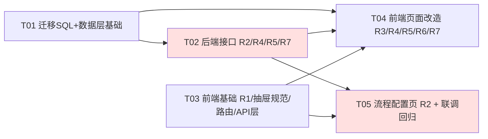

# issueFlow 增量架构设计 + 任务分解（Phase 5：管理后台界面优化）

> 文档版本：v1.0 · 架构师 高见远
> 上游输入：`docs/prd-phase5.md`（v1.0）；7 个决策已由主理人拍板（R1~R7）
> 关联图：`docs/incremental-class-diagram-phase5.mermaid`、`docs/incremental-sequence-diagram-phase5.mermaid`
> 所有结论均基于实际读码：`StateMachine.java`、`IssueStatusEnum.java`、`IssueFlowService.java`、`Organization*`、`User.java`、`routes.js`、`AdminLayout.vue`、`theme.css`、`V20260801_issueflow_phase4.sql` 等。

---

## 1. 实现方案与框架选型

**技术栈零变更、依赖零新增**：后端 Spring Boot 3.2.5 + MyBatis-Plus 3.5.7 + MySQL 8 + Redis 7；前端 Vue3 + Element Plus + Pinia + Vue Router 4 + Axios + echarts 5.5.0（已有）。

### 1.1 核心技术难点与决策

| # | 难点 | 方案 |
|---|---|---|
| 1 | **R2 状态机由硬编码转读库（主链路）** | `StateMachine` 保持对外签名兼容（`isAllowed` 不变），内部改为读 `flow_transition`+`flow_node`，加**进程内 volatile 缓存**（单实例部署，无需 Redis 广播）；配置变更由 `FlowDefinitionService` 显式调 `stateMachine.reload()`，**无需重启即生效**。**兜底**：库中查不到任何流转（清库/迁移未跑）→ 回退硬编码 `DEFAULT_TRANSITIONS`（即现有 6 条），保证流转永不断裂 |
| 2 | R2 与存量数据兼容 | `flow_node.status_code` 与 `IssueStatusEnum(0-4)` **一一对应且唯一**（唯一索引 `uk_flow_node_status`），issue 表不动、`issue.status` 语义不变；迁移 SQL **原样种子化** 6 条硬编码流转，升级后行为零变化 |
| 3 | R2 两个旧开关承接 | `flow_transition` 保留 `config_key` 列：VERIFY_REJECT 行写 `flow_reject_enabled`、REOPEN 行写 `flow_reopen_enabled`，`StateMachine` 命中带 key 的流转时仍查 `SysConfigService.isEnabled()`——旧开关、`FlowConfig` 两个 switch、`sys_config` 数据全部继续有效 |
| 4 | R2 流程图可视化 | **echarts `graph` 系列**（`layout:'none'` + 节点显式 x/y + `edgeSymbol:['none','arrow']` + `edgeLabel`）。理由：echarts 5.5.0 已在依赖内（FlowMonitor/Dashboard 已用），自带缩放/平移/tooltip/draggable，**零新依赖**；LogicFlow/X6 违反"不引新依赖"原则，自绘 SVG 需自实现箭头/自环/命中检测，成本高收益低。节点坐标持久化到 `flow_node.pos_x/pos_y`（用户拖动后点"保存布局"批量落库） |
| 5 | R1 固定"返回前台" | 按拍板采用字面 `position:fixed`：桌面态 `.if-switch-entry--sidebar{position:fixed;left:0;bottom:0;width:var(--sidebar-width)}`，折叠态跟随 `--sidebar-collapsed-width`；**三个边界**：① `theme.css` 的 `.if-sidebar{overflow:hidden}` 改为内部 `.if-sidebar__menu{flex:1;overflow-y:auto}` 滚动，侧栏 `padding-bottom` 预留入口高度防遮挡末项；② `--if-sidebar-position:static` 时 fixed 相对视口不受影响，表现一致；③ 移动端 ≤768px 侧栏本身是 fixed 抽屉 → 媒体查询内降级为 `position:absolute;bottom:0`（相对抽屉定位，抽屉关闭不残留） |
| 6 | R3 弹窗统一（有界迁移） | 新建通用 `FormDrawer.vue`（封装 el-drawer rtl + 三档宽度 + 固定底部操作条），本期迁移 Phase5 涉及页面的 **10 处 el-dialog**；`ElMessageBox.confirm` **保持不动**；剩余 4 处（AdminIssueList/UserIssueList/StatusFlowButtons/AdminLayout 个人设置）降 P2 |
| 7 | R4 code 唯一索引与存量数据 | 迁移 SQL 严格三步序：**加列（可空）→ 回填 `CONCAT('ORG', LPAD(id,3,'0'))` → 加唯一索引**，全程 information_schema 动态防重复 |
| 8 | R7 清库不锁死系统 | 单事务 DELETE（不用 TRUNCATE，TRUNCATE 隐式提交且无法保留 admin），按**依赖逆序先子后父**；显式保留 role/permission/role_permission/menu/sys_config/**flow_node/flow_transition**（流程配置属系统骨架，非业务数据）+ admin 账号；AUTO_INCREMENT 重置放事务提交后（ALTER 隐式提交，失败不影响主结果）；磁盘附件在 **DB 提交成功后**递归删除（已授权，不可逆） |
| 9 | R6 菜单调整 | 纯 SQL 完成（照搬 Phase4 `/admin/flow` 分组范式），`SideMenu.vue` 零改动；「模块配置」独立页与 Phase4 行内抽屉**并存**，树交互抽成共享组件 `ModuleTreePanel.vue` 避免双份逻辑 |

### 1.2 架构模式

沿用现有分层：Controller → Service（权限校验在 service 层 `PermissionService.requirePermission`）→ Mapper（MyBatis-Plus）→ MySQL；异常统一 `BizException` + 全局拦截；前端 API 模块化（`src/api/*.js`）+ 页面组件 + 通用组件。

---

## 2. 文件列表

### 2.1 数据库脚本（新增 1 个）

| 文件 | 说明 |
|---|---|
| `scripts/V20260802_issueflow_phase5.sql` 【新增】 | ① 建 `flow_node`/`flow_transition` 表（IF NOT EXISTS）+ 种子 5 节点/6 流转；② organization 加 `code`/`leader_id`/`status`/`description` 列 + 回填 + 唯一索引（三步序）；③ user 加 `leader_id`；④ R6 菜单：新增分组 `/admin/project`(sort=3)、`/admin/projects` 改名"项目配置"挂入(sort=1)、新增 `/admin/modules`"模块配置"(sort=2)、流程管理 sort=4、系统管理 sort=5；⑤ 权限种子 `system:reset`（数据初始化）+ 授予 ADMIN 角色。全程幂等 |

### 2.2 后端（`src/backend/src/main/java/com/issueflow/`）

| 文件 | 动作 | 说明 |
|---|---|---|
| `entity/FlowNode.java` | 新增 | name/code/statusCode/nodeType/color/posX/posY/sort/description/enabled，继承 BaseEntity |
| `entity/FlowTransition.java` | 新增 | fromNodeId/toNodeId/actionCode/actionName/allowRoles/remarkRequired/configKey/enabled/sort |
| `mapper/FlowNodeMapper.java`、`mapper/FlowTransitionMapper.java` | 新增 | BaseMapper 空接口 |
| `dto/req/FlowNodeReq.java`、`dto/req/FlowTransitionReq.java`、`dto/req/FlowNodePositionReq.java` | 新增 | 校验注解；PositionReq={id,posX,posY} 列表批量 |
| `dto/resp/FlowNodeVO.java`、`dto/resp/FlowTransitionVO.java`、`dto/resp/FlowGraphVO.java` | 新增 | GraphVO={nodes,transitions}；TransitionVO 附 fromStatusCode/toStatusCode/fromNodeName/toNodeName |
| `service/FlowDefinitionService.java` | 新增 | 图查询(flow:view) + 节点/流转 CRUD(flow:config) + 坐标批量保存 + resetDefault；删除节点校验（有流转引用或存量 issue 处于该状态 → BizException）；流转校验 from≠to、(from,to) 唯一 |
| `controller/FlowDefinitionController.java` | 新增 | `GET /api/flow/graph`、`POST/PUT/DELETE /api/flow/nodes(/{id})`、`PUT /api/flow/nodes/positions`、`POST/PUT/DELETE /api/flow/transitions(/{id})`、`POST /api/flow/reset-default` |
| `handler/StateMachine.java` | **修改** | 读库 + volatile 缓存 + `reload()` + 空库回退 `DEFAULT_TRANSITIONS`；`getAction` 改 `getActionCode(from,to):String`；新增 `isRemarkRequired(from,to)` |
| `service/IssueFlowService.java` | 修改 | "回退必须填原因"硬编码判断改为 `stateMachine.isRemarkRequired()`；history 记录改用 actionCode 字符串（`historyService.record` 本就收 String，兼容） |
| `entity/Organization.java`、`dto/req/OrganizationReq.java`、`dto/resp/OrganizationVO.java` | 修改 | 加 code/leaderId/status/description；VO 加 leaderName |
| `service/OrganizationService.java` | 修改 | `listAll(name,status)` 筛选（命中回带祖先链，P1）；create/update 增加 code 唯一校验、父级防环（排除自身及全部子孙）；toVO 补 leaderName（复用 `userService.userNameMap()`） |
| `controller/OrganizationController.java` | 修改 | list 加 `@RequestParam(required=false) name/status` |
| `entity/User.java`、`dto/req/UserReq.java`、`dto/resp/UserVO.java` | 修改 | 加 leaderId；VO 加 leaderName |
| `service/UserService.java` | 修改 | create/update 处理 leaderId（不能为自己；P1 汇报链防环 A→B→A 拒绝）；VO 组装 leaderName |
| `service/SystemDataService.java` | 新增 | resetData()：ADMIN + `system:reset` 双校验 → 事务内按序清 10 类业务数据（保留清单见 §4.3）→ 事务后重置自增 → 删磁盘附件 → 返回各表条数 |
| `controller/SystemDataController.java` | 新增 | `POST /api/system/data/reset` |

### 2.3 前端（`src/frontend/src/`）

| 文件 | 动作 | 说明 |
|---|---|---|
| `components/FormDrawer.vue` | 新增 | R3 统一右侧抽屉规范组件（见 §8 共享知识） |
| `components/ModuleTreePanel.vue` | 新增 | 自 `ModuleTreeDrawer.vue` 抽取的模块树交互组件（树+CRUD+拖拽+依赖），Drawer 与新页面共用 |
| `components/DataResetDrawer.vue` | 新增 | R7 确认抽屉：清除/保留双清单 + 输入 `RESET` 才启用提交 + loading 防重 |
| `views/admin/ModuleManage.vue` | 新增 | R6 模块配置页：顶部项目下拉（`GET /api/projects/options`，localStorage 记住上次项目 P1）+ `ModuleTreePanel` |
| `views/admin/SystemSettings.vue` | 修改 | R7 入口卡片"数据初始化"（仅 ADMIN），打开 DataResetDrawer；成功后展示各表条数 |
| `views/admin/FlowConfig.vue` | **重写** | R2：echarts graph 流程图（statusColor 色标、禁用流转虚线灰化、edgeLabel 动作+角色缩写、draggable+保存布局）+ 下方节点/流转双列表 + 顶部保留 2 个旧开关 + 无 flow:config 权限只读 |
| `views/admin/OrganizationManage.vue` | **重写** | R4：筛选区(名称/状态) + 工具栏(左：展开/收缩全部；右：新增/刷新/密度/列设置) + el-table 树形表格 + FormDrawer 表单（含 el-tree-select 上级组织、负责人远程搜索）；移除"新建根组织/新建子组织" |
| `views/admin/UserManage.vue` | 修改 | R5 上级领导选择器（复用 `listUserOptions`，排除自己）+ 列表加"上级领导"列 + R3 dialog→FormDrawer |
| `views/admin/ProjectManage.vue` | 修改 | R3 dialog→FormDrawer；页面标题「项目管理」→「项目配置」 |
| `views/admin/MenuManage.vue`、`views/admin/RoleManage.vue` | 修改 | R3 dialog→FormDrawer（RoleManage 2 处） |
| `components/ModuleTreeDrawer.vue` | 修改 | 内嵌 3 个 dialog→FormDrawer；树逻辑改用 ModuleTreePanel |
| `layouts/AdminLayout.vue` | 修改 | R1：SideMenu 外包 `.if-sidebar__menu` 滚动容器（个人设置 dialog 留 P2 不动） |
| `components/LayoutSwitchEntry.vue` | 修改 | R1：sidebar 变体 fixed 定位三态样式 |
| `styles/theme.css`、`styles/admin-style.css` | 修改 | R1：侧栏 flex 列 + 菜单区滚动 + padding-bottom 预留；fixed 按钮宽度跟随折叠变量与 0.2s transition |
| `router/routes.js` | 修改 | 新增 `/admin/modules`(ModuleManage)；`/admin/projects` meta.title → 项目配置 |
| `api/flow.js` | 新增 | getFlowGraph/createNode/updateNode/deleteNode/saveNodePositions/createTransition/updateTransition/deleteTransition/resetDefaultFlow |
| `api/system.js` | 新增 | resetSystemData() |
| `api/organization.js`、`api/user.js` | 修改 | 组织 list 加筛选参数；确认 listUserOptions 复用（大概率零改动） |
| `components/SideMenu.vue` | **零改动** | 菜单全 DB 驱动（验证项） |

---

## 3. 数据结构与接口

### 3.1 新表 DDL 要点（详见迁移 SQL 任务）

**`flow_node`（流程节点）**

| 列 | 类型 | 约束 | 说明 |
|---|---|---|---|
| id | BIGINT AI | PK | |
| name | VARCHAR(50) | NOT NULL | 节点名（待处理/处理中…） |
| code | VARCHAR(50) | NOT NULL | 节点编码（OPEN/IN_PROGRESS…） |
| status_code | INT | NOT NULL, **UNIQUE**(uk_flow_node_status, 含 deleted 条件处理) | **必须与 IssueStatusEnum 0-4 一一对应**，issue.status 的外延 |
| node_type | TINYINT | NOT NULL DEFAULT 2 | 1开始/2审核/3结束 |
| color | VARCHAR(20) | NULL | 状态色（缺省前端 statusColor 兜底） |
| pos_x / pos_y | INT | NOT NULL DEFAULT 0 | 流程图坐标（拖动持久化） |
| sort | INT | NOT NULL DEFAULT 0 | |
| description | VARCHAR(200) | NULL | |
| enabled | TINYINT | NOT NULL DEFAULT 1 | |
| created_at/updated_at/deleted | | | 对齐 BaseEntity |

**`flow_transition`（流转规则）**

| 列 | 类型 | 约束 | 说明 |
|---|---|---|---|
| id | BIGINT AI | PK | |
| from_node_id / to_node_id | BIGINT | NOT NULL, UNIQUE(from,to)（uk_flow_trans_from_to） | 禁 from==to（应用层） |
| action_code | VARCHAR(30) | NOT NULL | 对齐 HistoryActionEnum（CLAIM/SUBMIT_FIX/VERIFY_PASS/VERIFY_REJECT/CLOSE/REOPEN；允许自定义码） |
| action_name | VARCHAR(30) | NOT NULL | 展示名（认领/提交修复…） |
| allow_roles | VARCHAR(200) | NOT NULL | 逗号分隔角色码，如 `DEVELOPER,ADMIN` |
| remark_required | TINYINT | NOT NULL DEFAULT 0 | 承接原 VERIFY_REJECT 必填原因 |
| config_key | VARCHAR(50) | NULL | 承接旧开关：`flow_reject_enabled`/`flow_reopen_enabled`，其余 NULL |
| enabled | TINYINT | NOT NULL DEFAULT 1 | 禁用=图上虚线灰化+流转拒绝 |
| sort | INT | NOT NULL DEFAULT 0 | |
| created_at/updated_at/deleted | | | |

**种子数据（与 `StateMachine.TRANSITIONS` 逐条对齐，升级零行为变化）**

| from→to | action_code | allow_roles | remark_required | config_key |
|---|---|---|---|---|
| 0→1 | CLAIM | DEVELOPER,ADMIN | 0 | NULL |
| 1→2 | SUBMIT_FIX | DEVELOPER,ADMIN | 0 | NULL |
| 2→3 | VERIFY_PASS | TESTER,ADMIN | 0 | NULL |
| 2→1 | VERIFY_REJECT | TESTER,ADMIN | **1** | flow_reject_enabled |
| 3→4 | CLOSE | TESTER,ADMIN | 0 | NULL |
| 4→0 | REOPEN | ADMIN | 0 | flow_reopen_enabled |

**存量表加列**：`organization` + `code VARCHAR(50)`/`leader_id BIGINT NULL`/`status TINYINT NOT NULL DEFAULT 1`/`description VARCHAR(200)`（加列→`UPDATE organization SET code=CONCAT('ORG',LPAD(id,3,'0')) WHERE code IS NULL OR code=''`→`UNIQUE KEY uk_org_code(code)`）；`user` + `leader_id BIGINT NULL`。均 information_schema 动态防重复。

### 3.2 类图

见 `docs/incremental-class-diagram-phase5.mermaid`（FlowNode/FlowTransition/StateMachine 改造/FlowDefinitionService/Organization 扩展/User 扩展/SystemDataService）。

### 3.3 新增/变更 REST 接口

| 方法 & 路径 | 权限 | 入参 | 出参 | 说明 |
|---|---|---|---|---|
| GET `/api/flow/graph` | flow:view | - | FlowGraphVO{nodes[],transitions[]} | 图+双列表同源数据 |
| POST `/api/flow/nodes` | flow:config | FlowNodeReq | FlowNodeVO | status_code 唯一校验 |
| PUT `/api/flow/nodes/{id}` | flow:config | FlowNodeReq | FlowNodeVO | |
| DELETE `/api/flow/nodes/{id}` | flow:config | - | - | 有流转引用/存量 issue 该状态 → 拒绝 |
| PUT `/api/flow/nodes/positions` | flow:config | [{id,posX,posY}] | - | 拖动布局批量保存 |
| POST `/api/flow/transitions` | flow:config | FlowTransitionReq | FlowTransitionVO | from≠to、(from,to) 唯一 |
| PUT `/api/flow/transitions/{id}` | flow:config | FlowTransitionReq | FlowTransitionVO | 变更后 stateMachine.reload() |
| DELETE `/api/flow/transitions/{id}` | flow:config | - | - | 同上 reload |
| POST `/api/flow/reset-default` | flow:config | - | - | 清空两表→重灌 6 条默认（P1） |
| GET `/api/organizations?name=&status=` | organization:list | 可选筛选 | List\<OrganizationVO\>(+leaderName) | 命中回带祖先链（P1） |
| POST/PUT `/api/organizations` | organization:create/update | OrganizationReq(+code/leaderId/status/description) | OrganizationVO | code 唯一、父级防环（自身+子孙） |
| POST/PUT `/api/users` | user:create/update | UserReq(+leaderId) | UserVO(+leaderName) | leaderId≠自己 |
| POST `/api/system/data/reset` | ADMIN + system:reset | - | Map<表名,条数> | 见时序图场景三 |

既有接口零破坏：`PUT /api/issues/{id}/status`、`GET/PUT /api/flow/config`（旧开关）、`GET /api/users/options`、`api/module.js` 全部 8 接口签名不变。

## 4. 程序调用流程

见 `docs/incremental-sequence-diagram-phase5.mermaid`，三个场景：

1. **R2 状态流转（读库+缓存+兜底）**：changeStatus → StateMachine 缓存未命中则 JOIN 查两表构建规则 → 库空回退 DEFAULT_TRANSITIONS → configKey 命中再查 sys_config 开关 → remarkRequired 数据驱动 → history 记 actionCode。
2. **R2 配置变更即时生效**：FlowDefinition CRUD → 落库 → `stateMachine.reload()` → 下一次流转即用新规则，无需重启。
3. **R7 清库顺序**（单事务 DELETE，先子后父）：
   `issue_attachment`(先留存文件路径) → `issue_history` → `issue_relation` → `issue` → `tag` → `module_dependency` → `module` → `project` → `organization` → `user(username≠'admin')` → `UPDATE user SET leader_id=NULL WHERE username='admin'`；**保留** role/permission/role_permission/menu/sys_config/flow_node/flow_transition + admin；事务提交后逐表 `ALTER TABLE ... AUTO_INCREMENT=1`（隐式提交、失败仅告警）；最后递归删除 `ATTACHMENT_BASE_PATH` 下文件（已授权、不可逆）。
---

## 5. 待明确事项（Anything UNCLEAR）

| # | 事项 | 本设计采用的假设 |
|---|---|---|
| 1 | `flow_node.color` 与前端 `statusColor` 可能不一致 | 节点 color 为空时前端回退 `utils/format.js` 的 statusColor；种子数据直接写入与 statusColor 一致的色值 |
| 2 | 新增自定义节点（如"产品验收"）需要新的 status_code（≥5），`IssueStatusEnum.getByCode` 会返回 null | 本期允许建 ≥5 的节点；`IssueVO.statusDesc` 组装处需兼容：枚举查不到时回查 flow_node.name（工程师注意 IssueFlowService/IssueService 的 toVO）。若主理人认为超纲，可限制本期只允许编辑 0-4 内置节点、新增节点置灰（在流转校验上等价） |
| 3 | 权限缓存：`system:reset` 权限种子写入 role_permission 后，Redis `perm:role:{roleId}` 旧缓存可能未失效 | QA 验证前先用后台「清理缓存」或重启后端；SQL 无法清 Redis，属已知运维步骤 |
| 4 | R7 生产安全开关 | PRD 建议 `system.data-reset.enabled` 配置开关默认关闭；本期按"默认开启"实现（演示系统），仅在 application.yml 预留注释，若需要一行改动即可 |
| 5 | 组织筛选祖先链回带（R4-6 P1） | 后端全量查出后在内存过滤+回溯祖先（组织量级小，无性能问题），不写递归 SQL |

---

# Part B：任务分解

## 6. 依赖包列表

**零新增依赖**（硬性约束，前后端均是）：

- 前端流程图：复用 `echarts@5.5.0`（graph 系列，已在 package.json）
- 前端树选择：`el-tree-select` 为 Element Plus 2.x 内置组件，非新依赖
- 后端：无新 starter/库；缓存用进程内 volatile（单实例），不新增 Caffeine

## 7. 任务列表（共 5 个，按依赖排序）

| Task | 名称 | 优先级 | 依赖 | 源文件 |
|---|---|---|---|---|
| **T01** | 数据库迁移 + 后端数据层基础 | P0 | - | `scripts/V20260802_issueflow_phase5.sql`；`entity/FlowNode.java`、`entity/FlowTransition.java`、`mapper/FlowNodeMapper.java`、`mapper/FlowTransitionMapper.java`；`entity/Organization.java`、`entity/User.java` 加字段；`dto/req|resp` 全部新增/扩展 DTO（FlowNodeReq/FlowTransitionReq/FlowNodePositionReq/FlowNodeVO/FlowTransitionVO/FlowGraphVO、OrganizationReq/VO、UserReq/VO） |
| **T02** | 后端接口：R2 状态机数据化 + R4/R5 扩展 + R7 清库 | P0 | T01 | `handler/StateMachine.java`（读库+缓存+reload+兜底）、`service/IssueFlowService.java`（remarkRequired/actionCode 数据驱动）、`service/FlowDefinitionService.java`、`controller/FlowDefinitionController.java`；`service/OrganizationService.java`、`controller/OrganizationController.java`（code 唯一/防环/筛选/leaderName）；`service/UserService.java`（leaderId）；`service/SystemDataService.java`、`controller/SystemDataController.java`（清库顺序见 §4.3） |
| **T03** | 前端基础设施：R1 固定入口 + R3 抽屉规范 + R6 路由/共享组件 + API 层 | P0 | - （与 T02 并行；仅 api/flow.js、api/system.js 联调依赖 T02） | `components/FormDrawer.vue`、`components/ModuleTreePanel.vue`（自 ModuleTreeDrawer 抽取）；`layouts/AdminLayout.vue`、`components/LayoutSwitchEntry.vue`、`styles/theme.css`、`styles/admin-style.css`（R1 三态 fixed）；`router/routes.js`（/admin/modules + 项目配置 title）；`api/flow.js`、`api/system.js`、`api/organization.js` 扩展 |
| **T04** | 前端页面改造：R4 组织树形表格 + R5 用户表单 + R3 迁移 + R6 模块配置页 + R7 入口 | P0 | T01, T02, T03 | `views/admin/OrganizationManage.vue`（重写：筛选/工具栏/树形表格/抽屉表单/el-tree-select 防环/密度列设置 localStorage `if_org_columns`/`if_org_density`）；`views/admin/UserManage.vue`（上级领导+抽屉）；`views/admin/ProjectManage.vue`、`MenuManage.vue`、`RoleManage.vue`、`components/ModuleTreeDrawer.vue`（dialog→FormDrawer，共 8 处）；`views/admin/ModuleManage.vue`（新页面）；`views/admin/SystemSettings.vue` + `components/DataResetDrawer.vue`（R7 入口） |
| **T05** | R2 流程配置页（echarts graph）+ 全链路联调回归 | P0 | T02, T03 | `views/admin/FlowConfig.vue`（重写：graph 可视化/节点拖动保存布局/点击节点连线开抽屉编辑/双列表/旧开关保留/无权限只读）；联调项：6 条正向流转逐条回归、非法流转拒绝、双开关关闭态、清库后兜底流转、清库后 admin 可登录、菜单结构验证（SideMenu 零改动出新菜单）、R1 四态（展开/折叠/移动端/static 风格）不错位 |

> 说明：T03 不依赖 T01/T02 的代码，可与后端并行开工；T04 是唯一的三依赖汇聚点；T05 中"联调回归"覆盖全部 R1-R7 验收。

### QA 重点（严过关必读，随任务交付）

1. **R2 主链路（最高风险）**：6 条正向流转逐条与改造前行为一致；≥3 条非法流转（0→2、2→4、1→0）拒绝；`flow_reject_enabled=0` 时 2→1 拒绝、`flow_reopen_enabled=0` 时 4→0 拒绝；2→1 不填原因拒绝；**清空 flow_transition 表后流转仍按默认 6 条工作（兜底）**；配置修改后不重启立即生效。
2. **R7**：清库后 admin 仍可登录、菜单/角色/权限/流程配置完好、附件目录已清空、各表条数返回正确、二次执行幂等不报错。
3. **R4 迁移**：对存量组织执行 SQL 两遍验证幂等；code 回填后唯一索引创建成功。
4. **R1**：菜单撑长（可临时造 20 条菜单）验证菜单区滚动、按钮不裁切；折叠 64px、移动端 768px、风格设置切 static 三态回归。

## 8. 共享知识（Shared Knowledge，跨任务约定）

1. **FormDrawer 统一规范**：`direction="rtl"` + `append-to-body`；宽度档位 prop `size="sm|md|lg"` → 480/620/800px；标题 `{动作}{对象}`（新建组织/编辑流转规则）；底部固定操作条**左「取消」右「保存」**，保存带 loading；`@closed` 重置表单+清校验（对齐 ModuleTreeDrawer.onClosed）；遮罩保留、表单有改动时点遮罩需二次确认；`ElMessageBox.confirm` 破坏性确认**不迁移**。
2. **el-tree-select 上级选择防环**：编辑态传 `excludeId`，前端构树时把"自身及全部子孙"节点 `disabled:true`；后端仍必须二次校验（`assertNotDescendant`：沿 parentId 上溯 newParent 的祖先链含 id 即拒绝）。用户上级领导同理：options 过滤当前 id，后端校验 leaderId≠id。
3. **状态机兜底策略**：`flow_transition` 查询结果为空 ⇒ 使用类内 `DEFAULT_TRANSITIONS`（原 6 条硬编码，**保留不删**）；带 configKey 的流转永远叠加 `sysConfigService.isEnabled()` 判断；所有 FlowDefinition 写操作成功后必须调 `stateMachine.reload()`。
4. **菜单/权限种子 SQL 写法**（照搬 phase4）：新增用 `INSERT ... SELECT ... WHERE NOT EXISTS(path+type+deleted=0)`；改父级/改名用 `UPDATE ... SET parent_id=(SELECT pid FROM (子查询) AS _p)` 派生表绕过同表限制，并带"当前值≠目标值"条件保证幂等；加列一律 information_schema `COUNT(*)` + `PREPARE/EXECUTE`。
5. **localStorage 键名**：组织页 `if_org_columns`、`if_org_density`；模块配置页记住项目 `if_module_last_project`（范式对齐 ProjectManage 的 `if_project_columns`）。
6. **角色码来源**：allow_roles 多选项从 `GET /api/roles`（role:list）取 code；缩写图例 D=DEVELOPER/T=TESTER/A=ADMIN/S=SUBMITTER。
7. **echarts graph 关键配置**：`series:[{type:'graph',layout:'none',roam:true,draggable:true,edgeSymbol:['none','arrow'],edgeLabel:{show:true,formatter:动作名+角色缩写},lineStyle:禁用流转 type:'dashed'+灰色}]`；节点拖动结束（mouseup 收集 `chart.getOption().series[0].data` 坐标）后"保存布局"按钮亮起 → `PUT /api/flow/nodes/positions`。
8. **权限校验范式**：一律 service 层 `permissionService.requirePermission("xxx")`（无 @PreAuthorize）；R7 额外前置 `Constants.ROLE_ADMIN.equals(SecurityUtils.getCurrentRoleCode())`。
9. **Result 范式**：所有新接口返回 `Result<T>`；错误用 `BizException(ResultCode, msg)`，前端 request.js 拦截器统一提示。

## 9. 任务依赖图

> 红色为主链路高风险任务（状态机改造及其页面/回归）。T01→T02 后端线与 T03 前端线可双线并行。

---

*文档结束 · 交付给工程师（寇豆码）实现，QA（严过关）按 §7 QA 重点验收。*
