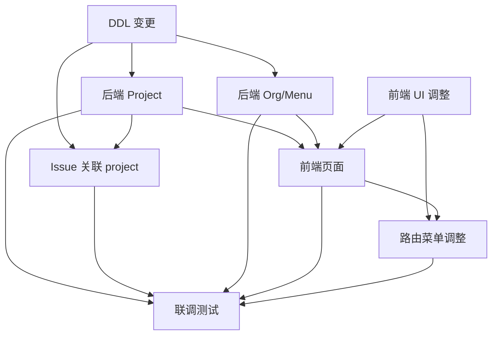

# issueFlow 增量技术设计 + 任务分解（P0）

> 架构师：高见远｜基于产品经理增量 PRD（项目管理 / 系统管理父菜单 / 后台 UI 调整）
> 代码根：`D:\WorkBuddyProjects\issueFlow`（实际位于 `src/backend` 与 `src/frontend`）
> 本文为**增量设计**，仅描述本次 P0 新增/改动点；既有 `docs/archive/2026-08-04/architecture.md` / `docs/class-diagram.mermaid` / `docs/sequence-diagram.mermaid` 为基线，不覆盖。
> 配套图文件：`docs/incremental-class-diagram.mermaid`、`docs/incremental-sequence-diagram.mermaid`。

---

## 1. 实现方案 + 框架选型

### 1.1 核心难点与原则
- **最小改动落地**：复用现有分层（Controller/Service/Mapper/Entity + req/resp DTO）、`Result/PageResult` 响应、`requireAdmin()` 权限模式、`BaseEntity` 逻辑删除约定。本项目**不引入任何新第三方依赖**。
- **前端零新依赖**：组织树用 Element Plus 内置 `el-tree`；项目/菜单用 `el-table` + `el-dialog`（与 `UserManage.vue` 同范式）；路由改用 Vue Router 嵌套路由实现「系统管理」父级。

### 1.2 技术选型（沿用既有栈）
| 关注点 | 选型 | 说明 |
|---|---|---|
| 后端 ORM | MyBatis-Plus（`BaseMapper` + `LambdaQueryWrapper`） | 实体继承 `BaseEntity`，逻辑删除 `deleted` |
| 权限校验 | `SecurityUtils.getCurrentRoleCode()` + `Constants.ROLE_ADMIN` | 沿用 `requireAdmin()` 私有方法 |
| 前端框架 | Vue3 + Element Plus + Pinia + Vue Router | 复用 `request.js` 拦截器 |
| 树形组件 | `el-tree`（组织管理） | 后端返回扁平列表，前端组装树 |
| 表单/表格 | `el-table` + `el-dialog` + `el-form` | 与 `UserManage.vue` 一致 |

### 1.3 架构模式
沿用「贫血实体 + Service 业务逻辑 + Mapper 数据访问」的 MVC 变体；前后端分离、JWT 无状态。新增模块与既有 `User/Tag` 模块完全同构，便于 Engineer 复制范式实现。

---

## 2. 数据库变更清单（精确 DDL）

> 约定（与 `BaseEntity` 对齐）：`id BIGINT AUTO_INCREMENT`；`created_at`/`updated_at DATETIME`（MP 自动填充）；`deleted INT DEFAULT 0`（逻辑删除）；字符集 `utf8mb4`、引擎 `InnoDB`。

### 2.1 `project` 表
```sql
CREATE TABLE `project` (
  `id`          BIGINT       NOT NULL AUTO_INCREMENT,
  `name`        VARCHAR(100) NOT NULL COMMENT '项目名称',
  `description` VARCHAR(500) DEFAULT NULL COMMENT '项目描述',
  `status`      TINYINT      NOT NULL DEFAULT 1 COMMENT '状态：1启用 0停用',
  `created_at`  DATETIME     DEFAULT NULL,
  `updated_at`  DATETIME     DEFAULT NULL,
  `deleted`     INT          DEFAULT 0,
  PRIMARY KEY (`id`),
  UNIQUE KEY `uk_project_name` (`name`),
  KEY `idx_project_deleted` (`deleted`)
) ENGINE=InnoDB DEFAULT CHARSET=utf8mb4 COMMENT='项目表';
```

### 2.2 `organization` 表
```sql
CREATE TABLE `organization` (
  `id`         BIGINT   NOT NULL AUTO_INCREMENT,
  `name`       VARCHAR(100) NOT NULL COMMENT '组织名称',
  `parent_id`  BIGINT   NOT NULL DEFAULT 0 COMMENT '父级id，0表示根',
  `sort`       INT      NOT NULL DEFAULT 0 COMMENT '排序号，升序展示',
  `created_at` DATETIME DEFAULT NULL,
  `updated_at` DATETIME DEFAULT NULL,
  `deleted`    INT      DEFAULT 0,
  PRIMARY KEY (`id`),
  KEY `idx_org_parent` (`parent_id`),
  KEY `idx_org_deleted` (`deleted`)
) ENGINE=InnoDB DEFAULT CHARSET=utf8mb4 COMMENT='组织表';
```

### 2.3 `menu` 表
```sql
CREATE TABLE `menu` (
  `id`         BIGINT   NOT NULL AUTO_INCREMENT,
  `name`       VARCHAR(50)  NOT NULL COMMENT '菜单名称',
  `path`       VARCHAR(200) DEFAULT NULL COMMENT '路由路径',
  `parent_id`  BIGINT   NOT NULL DEFAULT 0 COMMENT '父级id，0表示根',
  `sort`       INT      NOT NULL DEFAULT 0 COMMENT '排序号，升序展示',
  `permission` VARCHAR(100) DEFAULT NULL COMMENT '权限标识 module:resource:action',
  `icon`       VARCHAR(50)  DEFAULT NULL COMMENT '图标名（Element Plus icon 名）',
  `created_at` DATETIME DEFAULT NULL,
  `updated_at` DATETIME DEFAULT NULL,
  `deleted`    INT      DEFAULT 0,
  PRIMARY KEY (`id`),
  KEY `idx_menu_parent` (`parent_id`),
  KEY `idx_menu_deleted` (`deleted`)
) ENGINE=InnoDB DEFAULT CHARSET=utf8mb4 COMMENT='菜单表';
```

### 2.4 `issue` 表新增 `project_id`（含索引/外键）
```sql
ALTER TABLE `issue`
  ADD COLUMN `project_id` BIGINT DEFAULT NULL COMMENT '关联项目id（外键→project.id）'
    AFTER `assignee_id`,
  ADD KEY `idx_issue_project` (`project_id`);

-- 外键（逻辑删除下 project 行不物理删除，外键安全；如不想加 FK 可省略）
ALTER TABLE `issue`
  ADD CONSTRAINT `fk_issue_project`
  FOREIGN KEY (`project_id`) REFERENCES `project` (`id`);
```

---

## 3. 后端 API 设计

### 3.1 新增实体 / DTO / Mapper / Service / Controller

| 层 | 类 | 关键方法签名 |
|---|---|---|
| Entity | `Project extends BaseEntity` | `String name; String description; Integer status` |
| Entity | `Organization extends BaseEntity` | `String name; Long parentId; Integer sort` |
| Entity | `Menu extends BaseEntity` | `String name; String path; Long parentId; Integer sort; String permission; String icon` |
| req DTO | `ProjectReq` | `String name(@NotBlank); String description; Integer status=1` |
| req DTO | `OrganizationReq` | `String name(@NotBlank); Long parentId=0; Integer sort=0` |
| req DTO | `MenuReq` | `String name(@NotBlank); String path; Long parentId=0; Integer sort=0; String permission; String icon` |
| resp DTO | `ProjectVO` | `Long id; String name; String description; Integer status; LocalDateTime createdAt; LocalDateTime updatedAt` |
| resp DTO | `ProjectOptionVO` | `Long id; String name` |
| resp DTO | `OrganizationVO` | `Long id; String name; Long parentId; Integer sort; LocalDateTime createdAt; LocalDateTime updatedAt` |
| resp DTO | `MenuVO` | `Long id; String name; String path; Long parentId; Integer sort; String permission; String icon` |
| Mapper | `ProjectMapper extends BaseMapper<Project>` | （无自定义方法，options 在 Service 内用 wrapper 组装） |
| Mapper | `OrganizationMapper extends BaseMapper<Organization>` | — |
| Mapper | `MenuMapper extends BaseMapper<Menu>` | — |
| Service | `ProjectService` | `PageResult<ProjectVO> pageProjects(int page,int size)`<br>`ProjectVO createProject(ProjectReq req)`<br>`ProjectVO updateProject(Long id, ProjectReq req)`<br>`void deleteProject(Long id)`<br>`List<ProjectOptionVO> listOptions()`<br>`Map<Long,String> nameMap()` |
| Service | `OrganizationService` | `List<OrganizationVO> listAll()`<br>`OrganizationVO create(OrganizationReq req)`<br>`OrganizationVO update(Long id, OrganizationReq req)`<br>`void delete(Long id)` |
| Service | `MenuService` | `List<MenuVO> listAll()`<br>`MenuVO create(MenuReq req)`<br>`MenuVO update(Long id, MenuReq req)`<br>`void delete(Long id)` |
| Controller | `ProjectController @RequestMapping("/api/projects")` | `GET /projects`(ADMIN 分页)<br>`POST /projects`(ADMIN 新建)<br>`PUT /projects/{id}`(ADMIN 编辑)<br>`DELETE /projects/{id}`(ADMIN 删除)<br>`GET /projects/options`(**仅登录**，无 ADMIN 要求) |
| Controller | `OrganizationController @RequestMapping("/api/organizations")` | `GET /organizations`(ADMIN 列表)<br>`POST /organizations`(ADMIN 新建)<br>`PUT /organizations/{id}`(ADMIN 编辑)<br>`DELETE /organizations/{id}`(ADMIN 删除) |
| Controller | `MenuController @RequestMapping("/api/menus")` | `GET /menus` / `POST` / `PUT /{id}` / `DELETE /{id}`（均 ADMIN） |

### 3.2 既有 `Issue` 模块改动点（不新增接口，仅透传字段）
- `Issue` 实体：新增 `private Long projectId;`
- `IssueCreateReq`：新增 `private Long projectId;`（可空）
- `IssueUpdateReq`：新增 `private Long projectId;`（可空，非空才更新）
- `IssuePageReq`：新增 `private Long projectId;`（可空，作为筛选）
- `IssueVO`：新增 `private Long projectId; private String projectName;`
- `IssueService`：
  - 注入 `ProjectService`，`createIssue` 中 `issue.setProjectId(req.getProjectId())`；
  - `update` 中 `if (req.getProjectId()!=null) issue.setProjectId(...)`；
  - `pageQuery` 中 `if (req.getProjectId()!=null) wrapper.eq(Issue::getProjectId, ...)`；
  - `toIssueVO` 中用 `projectService.nameMap()` 填充 `projectName`。
- `IssueController`：**无需改动**（字段随现有 `multipart`/`@RequestBody` 自动绑定）。

### 3.3 `ResultCode` 新增
```java
PROJECT_NAME_DUPLICATE(1005, "项目名称已存在"),
NODE_HAS_CHILDREN(1006, "该节点下存在子节点，无法删除");  // 组织/菜单复用
```
- `ProjectService.createProject` 先按 `name + deleted=0` 查重，命中则抛 `PROJECT_NAME_DUPLICATE`；
- `OrganizationService/MenuService.delete` 先按 `parent_id + deleted=0` 查子节点，存在则抛 `NODE_HAS_CHILDREN`。

---

## 4. 前端路由与菜单结构

### 4.1 调整后的 `routes.js` 片段（项目同级 + 系统管理父级）
在 `/admin` 的 `children` 中：新增 `projects` 兄弟项；将 `users` 移入新建 `system` 父级（含 `organizations`、`menus`、`users`）。

```js
// /admin 下 children 调整后（节选）
{
  path: 'issues', name: 'admin-issues',
  component: () => import('@/views/admin/AdminIssueList.vue'),
  meta: { title: '问题管理', roles: ['ADMIN'] }
},
// ① 项目管理：与问题管理同级
{
  path: 'projects', name: 'project-manage',
  component: () => import('@/views/admin/ProjectManage.vue'),
  meta: { title: '项目管理', roles: ['ADMIN'] }
},
// ② 系统管理父路由（容器，redirect 到首个子项）
{
  path: 'system',
  component: () => import('@/views/admin/SystemLayout.vue'),
  redirect: '/admin/system/organizations',
  meta: { title: '系统管理', roles: ['ADMIN'] },
  children: [
    { path: 'organizations', name: 'organization-manage',
      component: () => import('@/views/admin/OrganizationManage.vue'),
      meta: { title: '组织管理', roles: ['ADMIN'] } },
    { path: 'menus', name: 'menu-manage',
      component: () => import('@/views/admin/MenuManage.vue'),
      meta: { title: '菜单管理', roles: ['ADMIN'] } },
    { path: 'users', name: 'user-manage',
      component: () => import('@/views/admin/UserManage.vue'),
      meta: { title: '用户管理', roles: ['ADMIN'] } }
  ]
},
// （原 /admin/users 平级项删除，flow-config / settings 保留）
```

> `SystemLayout.vue` 为极简透传容器：`<template><router-view/></template>`，用于承载 `system` 子路由。

### 4.2 `AdminLayout.vue` 改动点（详见任务 T05）
- **移除顶栏主题色选择器**：删除 `<el-color-picker v-model="themeColor" .../>`（原第 68–72 行）及对应的 `themeColor` ref、`onThemeChange`、`useThemeStore` 引用（主题色仍由全局 `theme.js` 在登录后应用，仅不再提供手动切换入口）。
- **头像下拉新增两项并加图标**：在 `el-dropdown-menu` 中将原单一 `退出登录` 改为三项：
  - `清理缓存`（command=`clearCache`，图标 `Refresh`）
  - `个人设置`（command=`profile`，图标 `User`）
  - `退出登录`（command=`logout`，图标 `SwitchButton`）
- **侧边栏菜单重构**：将「用户管理」移入「系统管理」`el-sub-menu`；新增「项目管理」「组织管理」「菜单管理」入口；补全图标。

侧栏菜单结构（示意）：
```
概览(/admin/index)  问题管理(/admin/issues)  项目管理(/admin/projects)
流程监控(/admin/flow-monitor)
系统管理(子菜单): 用户管理 / 组织管理 / 菜单管理
流程配置(/admin/flow-config)  系统设置(/admin/settings)
```

---

## 5. 类图与时序图（Mermaid）

### 5.1 类图（增量部分，含与基线的关联）

```mermaid
classDiagram
    class BaseEntity {
        +Long id
        +LocalDateTime createdAt
        +LocalDateTime updatedAt
        +Integer deleted
    }
    class Project {
        +String name
        +String description
        +Integer status
    }
    class Organization {
        +String name
        +Long parentId
        +Integer sort
    }
    class Menu {
        +String name
        +String path
        +Long parentId
        +Integer sort
        +String permission
        +String icon
    }
    class Issue {
        +String issueNo
        +String title
        +Integer severity
        +Integer status
        +Long reporterId
        +Long assigneeId
        +Long projectId
    }
    class ProjectReq { +String name; +String description; +Integer status }
    class ProjectVO { +Long id; +String name; +String description; +Integer status; +LocalDateTime createdAt; +LocalDateTime updatedAt }
    class ProjectOptionVO { +Long id; +String name }
    class OrganizationReq { +String name; +Long parentId; +Integer sort }
    class OrganizationVO { +Long id; +String name; +Long parentId; +Integer sort; +LocalDateTime createdAt; +LocalDateTime updatedAt }
    class MenuReq { +String name; +String path; +Long parentId; +Integer sort; +String permission; +String icon }
    class MenuVO { +Long id; +String name; +String path; +Long parentId; +Integer sort; +String permission; +String icon }

    BaseEntity <|-- Project
    BaseEntity <|-- Organization
    BaseEntity <|-- Menu
    BaseEntity <|-- Issue
    Issue "0..*" ..> "1" Project : projectId

    ProjectController "1" --> "1" ProjectService
    OrganizationController "1" --> "1" OrganizationService
    MenuController "1" --> "1" MenuService
    ProjectService "1" --> "1" ProjectMapper
    OrganizationService "1" --> "1" OrganizationMapper
    MenuService "1" --> "1" MenuMapper
    ProjectMapper ..|> BaseMapper : extends
    OrganizationMapper ..|> BaseMapper : extends
    MenuMapper ..|> BaseMapper : extends
    IssueService "1" --> "1" ProjectService : nameMap()
```


### 5.2 时序图（关键流程）
```mermaid
%% 1. ADMIN 创建项目（含重名校验）
sequenceDiagram
    actor Ad as 管理员
    participant PC as ProjectController
    participant PS as ProjectService
    participant PM as ProjectMapper
    participant DB as MySQL
    Ad->>PC: POST /api/projects (ProjectReq)
    PC->>PC: requireAdmin()
    PC->>PS: createProject(req)
    PS->>PM: selectOne(name, deleted=0)
    PM->>DB: SELECT project
    DB-->>PS: 已有同名?
    alt 已存在同名
        PS-->>PC: BizException(PROJECT_NAME_DUPLICATE)
        PC-->>Ad: 409 项目名称已存在
    else 不重复
        PS->>PM: insert(project)
        PM->>DB: INSERT project
        PS-->>PC: ProjectVO
        PC-->>Ad: 200 ProjectVO
    end

%% 2. 普通用户获取项目下拉选项（仅登录）
sequenceDiagram
    actor U as 用户
    participant PC as ProjectController
    participant PS as ProjectService
    participant PM as ProjectMapper
    U->>PC: GET /api/projects/options
    Note over PC: 仅校验登录，不要求 ADMIN
    PC->>PS: listOptions()
    PS->>PM: selectList(deleted=0) 仅取 id,name
    PM->>DB as MySQL: SELECT id,name
    DB-->>PS: List<Project>
    PS-->>PC: List<ProjectOptionVO>
    PC-->>U: 200 [ {id,name} ]

%% 3. 提交问题关联项目
sequenceDiagram
    actor R as 提交者
    participant IC as IssueController
    participant IS as IssueService
    participant IM as IssueMapper
    participant PS as ProjectService
    R->>IC: POST /api/issues (multipart issue{...projectId})
    IC->>IS: createIssue(req, uid)
    IS->>IM: insert(issue, projectId)
    IM->>DB as MySQL: INSERT issue
    IS->>PS: nameMap()
    PS-->>IS: Map<id,name>
    IS->>IS: toIssueVO(projectName=map.get(projectId))
    IS-->>IC: IssueVO(projectId, projectName)
    IC-->>R: 200 IssueVO

%% 4. 组织树加载 + 新增节点（菜单同构）
sequenceDiagram
    actor Ad as 管理员
    participant OC as OrganizationController
    participant OS as OrganizationService
    participant OM as OrganizationMapper
    participant DB as MySQL
    Ad->>OC: GET /api/organizations
    OC->>OS: listAll()
    OS->>OM: selectList(deleted=0, order by sort,id)
    OM->>DB: SELECT organization
    DB-->>OS: List<Organization>
    OS-->>OC: List<OrganizationVO>
    OC-->>Ad: 200 扁平列表(前端 el-tree 组装)
    Ad->>OC: POST /api/organizations (OrganizationReq{parentId})
    OC->>OS: create(req)
    OS->>OM: insert(org)
    OM->>DB: INSERT organization
    OS-->>OC: OrganizationVO
    OC-->>Ad: 200

%% 5. 删除组织/菜单（有子节点禁止）
sequenceDiagram
    actor Ad as 管理员
    participant C as OrganizationController
    participant S as OrganizationService
    participant M as OrganizationMapper
    participant DB as MySQL
    Ad->>C: DELETE /api/organizations/{id}
    C->>S: delete(id)
    S->>M: selectList(parent_id=id, deleted=0)
    M->>DB: SELECT child
    DB-->>S: 有子节点?
    alt 存在子节点
        S-->>C: BizException(NODE_HAS_CHILDREN)
        C-->>Ad: 409 该节点下存在子节点，无法删除
    else 无子节点
        S->>M: deleteById(id) 逻辑删除
        M->>DB: UPDATE deleted=1
        S-->>C: void
        C-->>Ad: 200
    end
```

> 完整图见 `docs/incremental-class-diagram.mermaid` 与 `docs/incremental-sequence-diagram.mermaid`。

---

## 6. 任务列表（有序 + 依赖）

> 优先级 P0（全部）。依赖关系保证「后端先建表/接口 → 前端页面 → 路由联调」。

| 任务 | 名称 | 源文件（新增/改动） | 依赖 | 优先级 |
|---|---|---|---|---|
| **T01** | 数据库 DDL 变更 | `scripts/` 下新增 `V20250730_issueflow_p0.sql`（含 §2 全部建表/改表语句） | 无 | P0 |
| **T02** | 后端 Project 模块 | `entity/Project.java`、`dto/req/ProjectReq.java`、`dto/resp/ProjectVO.java`、`dto/resp/ProjectOptionVO.java`、`mapper/ProjectMapper.java`、`service/ProjectService.java`、`controller/ProjectController.java`、`common/ResultCode.java`（+2 枚举） | T01 | P0 |
| **T03** | Issue 关联 project | `entity/Issue.java`、`dto/req/IssueCreateReq.java`、`dto/req/IssueUpdateReq.java`、`dto/req/IssuePageReq.java`、`dto/resp/IssueVO.java`、`service/IssueService.java`（注入 ProjectService） | T01, T02 | P0 |
| **T04** | 后端 Organization / Menu 模块 | `entity/Organization.java`、`entity/Menu.java`、`dto/req/OrganizationReq.java`、`dto/req/MenuReq.java`、`dto/resp/OrganizationVO.java`、`dto/resp/MenuVO.java`、`mapper/OrganizationMapper.java`、`mapper/MenuMapper.java`、`service/OrganizationService.java`、`service/MenuService.java`、`controller/OrganizationController.java`、`controller/MenuController.java` | T01 | P0 |
| **T05** | 前端 UI 调整（AdminLayout） | `layouts/AdminLayout.vue`（移除 el-color-picker、头像下拉加两项+图标、侧栏重构为含系统管理子菜单） | 无 | P0 |
| **T06** | 前端页面（项目/组织/菜单） | `api/project.js`、`api/organization.js`、`api/menu.js`、`views/admin/ProjectManage.vue`、`views/admin/OrganizationManage.vue`、`views/admin/MenuManage.vue`、`views/admin/SystemLayout.vue`、`views/admin/AdminIssueList.vue`(筛选+列)、`views/user/IssueCreate.vue`(关联项目) | T02, T04, T05 | P0 |
| **T07** | 路由菜单调整 | `router/routes.js`（projects 同级 + system 父级 + users 移入）、`layouts/AdminLayout.vue`（菜单项与图标对齐新路由） | T05, T06 | P0 |
| **T08** | 联调测试 | `src/backend` 启动 + `src/frontend` 启动；端到端验证 8 条主流程 | T02, T03, T04, T06, T07 | P0 |

> 说明：T05 为纯前端且独立于后端，可与 T02/T04 并行；T06 需在后端接口（T02/T04）就绪后联调真实数据；T07 依赖 T05/T06 的组件与菜单结构；T08 为收口。

### 任务依赖关系图


---

## 7. 共享约定（跨模块，供 Engineer 遵循）

1. **权限码统一 `ADMIN`**：项目/组织/菜单的所有写操作（CRUD）仅在 `SecurityUtils.getCurrentRoleCode() == Constants.ROLE_ADMIN` 时放行，沿用 `requireAdmin()` 私有方法；`GET /api/projects/options` **仅需登录**（任意角色可调用）。
2. **下拉选项接口统一**：`GET /api/projects/options` 返回 `List<ProjectOptionVO{id,name}>`，全站「关联项目」选择器统一调用此接口。
3. **树形 `parent_id=0` 表示根**：`organization` 与 `menu` 表 `parent_id` 默认 `0` 即根节点；前端 `el-tree` 以 `id`/`parentId` 组装，根节点 `parentId===0`。
4. **菜单 `permission` 字段格式**：`module:resource:action`（如 `system:organization:list`、`system:menu:edit`）；当前仅**存储/展示**，后端仍用 `ADMIN` 统一校验，不做细粒度拦截（后续可接 RBAC）。
5. **逻辑删除**：沿用 `deleted`（0/1）+ MyBatis-Plus 全局 logic-delete；组织/菜单**删除前校验无子节点**（否则 `NODE_HAS_CHILDREN`），不做级联删。
6. **统一响应**：`Result<T>` / `PageResult<T>`；分页入参 `page`(默认1)/`size`(默认10)，出参 `list/total/page/size`。
7. **命名与分层**：实体继承 `BaseEntity`；Mapper 继承 `BaseMapper<T>`；req/resp 分 DTO；Controller `@RequestMapping("/api/xxx")`；Service `@Service @RequiredArgsConstructor`。
8. **排序**：`sort` 为 `INT`，列表按 `sort ASC, id ASC` 展示。
9. **状态值**：项目 `status` 1启用/0停用，前端用 `el-switch`（`active-value=1`/`inactive-value=0`）。

---

## 8. 待明确事项（≤3，非 PM 待确认问题，给出推荐默认值）

1. **「个人设置」功能边界**：PM 未定义内容。推荐默认实现为**只读用户信息 Dialog**（展示姓名/账号/角色，取自 `useUserStore`），密码修改列入后续迭代，避免本次范围膨胀（T05 落地）。
2. **项目下拉选项是否过滤停用项目**：PM 未明确。推荐 `options` 返回**全部未删除项目**（含 `status=0`），前端按 `status` 置灰/标注「停用」，保证历史 Issue 关联停用项目时仍可正确回显 `projectName`。
3. **组织/菜单删除策略**：存在子节点时。推荐「**有子节点禁止删除**」（返回 `NODE_HAS_CHILDREN`），而非级联删除，避免误删与数据不一致；如需级联可在后续通过配置开关开启。

---

## 附：落地顺序建议（与任务对应）
1. 跑 `V20250730_issueflow_p0.sql`（T01）。
2. 实现 `Project` 模块并自测 `/api/projects` 与 `/options`（T02）。
3. `Issue` 实体/DTO/Service 加 `projectId` 并回显 `projectName`（T03）。
4. 实现 `Organization`/`Menu` 模块（T04）。
5. `AdminLayout` 顶栏/侧栏改造（T05）。
6. 三个管理页 + API 封装 + Issue 页筛选/表单改造（T06）。
7. `routes.js` 嵌套路由 + 菜单对齐（T07）。
8. 全链路联调（T08）。
