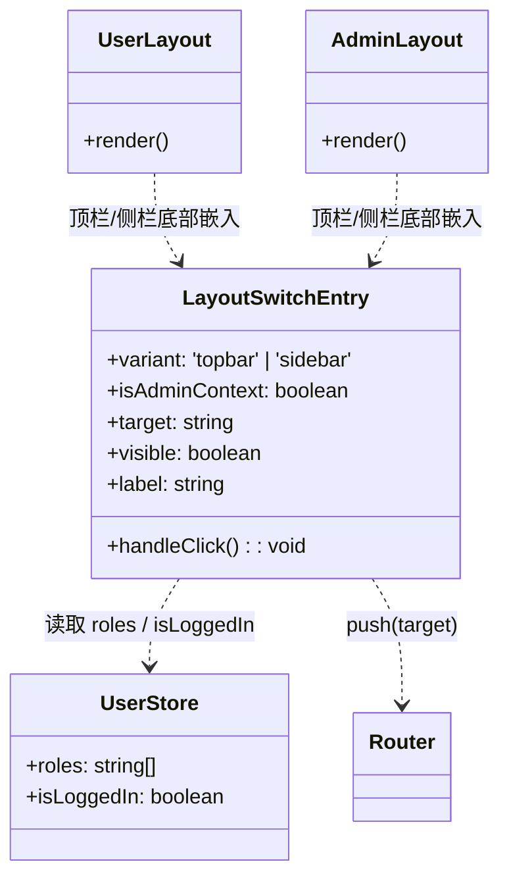
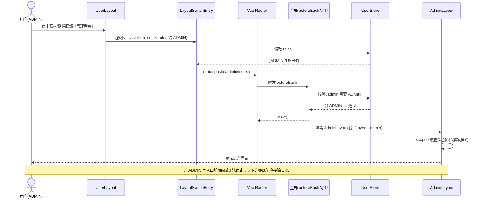
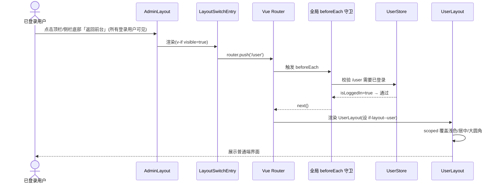

# issueFlow 前端增量设计：双布局解耦 + 双向跳转入口

> 角色：前端架构师 高见远（Bob）
> 范围：仅前端 UI / 路由层，**无后端变更**
> 技术栈：Vue3 + Element Plus + Pinia + Vue Router 4 + Vite（保持不变）
> 硬约束：不引入新依赖；改动文件 ≤ 4 个

---

## 1. 实现方案 + 框架选型

### 1.1 核心难点
1. 两个布局当前是「克隆式」：根节点同为 `<div class="if-layout">`，共享同一套 `theme.css` 全局骨架，仅靠 logo 文字区分，无法满足 PRD 要求的「布局结构 / 配色 / 组件风格」三方面明显区分。
2. 普通端「管理后台」入口必须**前置隐藏**（非 `ADMIN` 不可见），否则点击会触发 `/admin` 路由守卫被拦到 `/403`。
3. 后台深色侧栏要「固定深蓝灰、不随 `themeColor` 变化」，而 Element Plus 菜单颜色由 `--el-menu-*` 变量驱动，须局部覆盖且**不污染全局**。

### 1.2 框架 / 库选型
- **不引入任何新依赖**。视觉隔离完全用**原生 CSS 自定义属性（CSS Variables）+ Vue `<style scoped>`** 实现，零运行时、零包体积增加。
- 跳转复用现有 `vue-router`（`router.push`），不新增路由、不动 `variables.css` 全局 token。

### 1.3 布局级 CSS 变量作用域隔离（关键手法）
采用「**全局骨架 + 局部变量覆盖**」两层：

1. **共享骨架保留在 `theme.css`**：结构样式（`.if-layout`/`.if-sidebar`/`.if-content`/`.if-topbar` 等）不动，但把「可差异化」属性改为读取**局部变量并带 fallback**，例如：
   ```css
   .if-sidebar { background: var(--if-sidebar-bg, var(--bg-container)); }
   .if-content__inner { max-width: var(--if-content-max, none); margin: 0 auto; }
   .page-card, .if-card { border-radius: var(--if-radius, var(--border-radius-base)); }
   ```
2. **两布局根节点加修饰类**：
   - `UserLayout`：`<div class="if-layout if-layout--user">`
   - `AdminLayout`：`<div class="if-layout if-layout--admin">`
3. **各自 `<style scoped>` 覆盖局部变量**（CSS 变量沿 DOM 继承，子组件渲染出的 Element Plus 内部节点也会读到）：
   ```css
   /* UserLayout scoped —— 浅色 / 居中定宽 / 大圆角柔和 */
   .if-layout--user {
     --if-sidebar-bg: #ffffff;
     --if-content-max: 1200px;
     --if-radius: 16px;
   }
   /* AdminLayout scoped —— 紧凑 / 内容满宽 */
   .if-layout--admin {
     --if-sidebar-bg: #1f2d3d;
     --if-content-max: none;
     --if-radius: 4px;
   }
   ```
4. **后台深色固定侧栏**：在 `.if-layout--admin` 作用域内覆盖 Element Plus 菜单变量（`.el-menu` 是 `.if-sidebar` 的后代，自然继承）：
   ```css
   .if-layout--admin .if-sidebar {
     background: var(--if-sidebar-bg);            /* 固定 #1f2d3d */
     --el-menu-text-color: #c0c4cc;
     --el-menu-hover-bg-color: #263445;
     --el-menu-active-color: var(--theme-color);  /* 激活态用主题色点缀 */
     --el-menu-border-color: transparent;
   }
   .if-layout--admin .if-logo { color: #ffffff; } /* 深色底上 logo 反白 */
   /* 激活项背景高亮（EP 默认仅改文字色，这里补背景保证对比度） */
   .if-layout--admin .if-menu .el-menu-item.is-active {
     background-color: rgba(64, 158, 255, 0.16);
   }
   /* 高密度：压缩内容区内边距 */
   .if-layout--admin .if-content { padding: 12px; }
   ```
   > 由于变量写在 `.if-layout--admin` 子树内，且 `:root`/全局未被改写，**不会泄漏到普通端**，满足「视觉明显区分且不污染全局」。侧栏固定 `#1f2d3d` 与 `themeColor` 解耦，对比度稳定。

### 1.4 为什么是「最小改动」
- **否决**新增 `styles/layouts.css`：那会把差异化规则又变成全局，违背「作用域隔离」初衷。
- 不碰 `variables.css` 的全局 token；局部变量默认 fallback 直接写进 `theme.css` 的 `var()`。
- 共享骨架、移动端抽屉、顶栏结构继续复用 `theme.css`，差异化仅在两个布局内「设变量」，改动收敛在 4 个文件内。

---

## 2. 文件清单（相对前端根目录 `src/`）

| 操作 | 文件 | 改动说明 |
|------|------|----------|
| 修改 | `styles/theme.css` | 骨架改读局部变量（`--if-sidebar-bg` / `--if-content-max` / `--if-radius`，带 fallback）；新增 `.if-content__inner` 居中容器；`.if-logo` 颜色改可由布局覆盖；移动端抽屉保持兼容 |
| 修改 | `layouts/UserLayout.vue` | 根节点加 `if-layout--user`；模板 `<main class="if-content">` 内包一层 `<div class="if-content__inner">`；`<style scoped>` 覆盖浅色/居中/大圆角；顶栏与侧栏底部插入切换入口 |
| 修改 | `layouts/AdminLayout.vue` | 根节点加 `if-layout--admin`；同样加 `.if-content__inner`；`<style scoped>` 覆盖深色固定侧栏（`--el-menu-*`）+ 紧凑风格；顶栏与侧栏底部插入切换入口 |
| 新增 | `components/LayoutSwitchEntry.vue` | 共享「切换区域」组件（`variant: 'topbar' | 'sidebar'`，统一推断目标路由 / ADMIN 显隐 / `router.push`） |

**组件化 vs 内联（推荐）**：切换入口在「两个布局 × 两个位置（顶栏 + 侧栏底部）= 4 处」复用，且逻辑一致（当前端推断 → 目标路由 → ADMIN 显隐 → push）。抽成 `LayoutSwitchEntry.vue`（用 `variant` 区分形态）可避免 4 处重复、集中维护显隐规则；代价仅 +1 文件（仍在 ≤4 内）。**推荐组件化**。若坚持极简 3 文件，可内联到两布局（但会复制显隐/跳转逻辑，不推荐）。

---

## 3. 数据结构 / 接口（类图）

本功能为纯 UI / 路由层，**无后端 / 状态变更**，无需新增 Pinia 状态，无需新增 `route.meta`（组件按 `route.path` 前缀推断所属端）。以下仅给出前端相关类结构：



推断逻辑（设计约定，非代码）：
- `isAdminContext = route.path.startsWith('/admin')`
- `target = isAdminContext ? '/user' : '/admin/index'`
- `visible = isAdminContext ? userStore.isLoggedIn : userStore.roles.includes('ADMIN')`

---

## 4. 程序调用流程（时序图）

### 4.1 普通端点「管理后台」→ 守卫校验 → 进入后台


### 4.2 后台点「返回前台」→ 进入普通端


---

## 5. 任务列表（按实现顺序，含依赖）

| ID | 任务 | 改动文件（改什么） | 依赖 | 优先级 |
|----|------|------------------|------|--------|
| **T01** | 根节点修饰类 + 各自 scoped 视觉区分 | `UserLayout.vue`：根加 `if-layout--user` + scoped 设 `--if-sidebar-bg:#fff; --if-content-max:1200px; --if-radius:16px`；`AdminLayout.vue`：根加 `if-layout--admin` + scoped 设 `--if-sidebar-bg:#1f2d3d; --if-content-max:none; --if-radius:4px` 及 `.if-sidebar` 内 `--el-menu-*` 深色覆盖 + `.if-content` 压缩内边距 | 无 | P0 |
| **T02** | 顶栏入口按钮（含 ADMIN 显隐） | 新增 `components/LayoutSwitchEntry.vue`（`variant='topbar'`，按 route 推断 target/visible/label）；`UserLayout.vue` 顶栏 `.topbar-right` 前插入（ADMIN 显隐）；`AdminLayout.vue` 顶栏同样插入（全登录可见） | T01 | P0 |
| **T03** | 侧栏底部「切换区域」次级入口（P1） | `LayoutSwitchEntry.vue` 增 `variant='sidebar'` 形态（固定底、全宽按钮）；`UserLayout.vue` / `AdminLayout.vue` 侧栏 `.if-menu` 之后插入同一组件 | T02 | P1 |
| **T04** | 全局骨架微调（共享样式收口） | `theme.css`：`.if-sidebar` 改 `var(--if-sidebar-bg, var(--bg-container))`；新增 `.if-content__inner { max-width: var(--if-content-max, none); margin: 0 auto }`；`.if-logo` 颜色允许被布局覆盖；移动端抽屉态深色侧栏兼容 | T01 | P1 |
| **T05** | 自测清单（回归验证，无代码变更） | 见下方清单；人工 / 浏览器验证 | T01–T04 | P2 |

> 说明：受「改动文件 ≤ 4」硬约束，本分解把「全局骨架微调」收敛为单文件 `theme.css`（T04），未做文件拆分；通用规范中「每任务 ≥3 文件」在此被用户硬约束覆盖。

**自测清单（T05）**：
- [ ] 非 `ADMIN` 登录后，普通端顶栏 / 侧栏底部**看不到**「管理后台」；直接访问 `/admin/index` 被守卫拦到 `/403`。
- [ ] `ADMIN` 登录后，普通端可见「管理后台」，点击进入后台且侧栏为深蓝灰 `#1f2d3d`、内容区浅色紧凑。
- [ ] 任意已登录用户在后台可见「返回前台」，点击回到普通端且为浅色 / 居中定宽 / 大圆角。
- [ ] 两侧侧栏底部「切换区域」均可跳转，行为与顶栏一致。
- [ ] 切换 `themeColor` 时，后台侧栏背景仍固定 `#1f2d3d`（不变），仅激活项点缀色跟随。
- [ ] 移动端抽屉打开后台时，侧栏仍深色、可正常操作。
- [ ] 普通端内容容器宽度 ≤1200px 居中；后台内容满宽不居中。

---

## 6. 依赖包列表

**无新增依赖。** 视觉隔离仅用原生 CSS 变量 + Vue scoped 样式，跳转复用现有 `vue-router`，组件复用现有 Pinia `useUserStore`。引入任何 UI / 工具库都会增加包体积且与「最小改动、保持现有栈」相悖，当前原生方案已可完整落地。

---

## 7. 共享知识（跨文件约定）

- **修饰类命名**：布局根节点固定为 `if-layout--user` / `if-layout--admin`，禁止在其它地方复用这两个类做全局样式。
- **局部 CSS 变量命名**：差异化变量统一前缀 `--if-*`（如 `--if-sidebar-bg` / `--if-content-max` / `--if-radius`），在 `theme.css` 以 `var(--if-*, <fallback>)` 读取，在各布局 scoped 中覆盖；**禁止把 `--if-*` 写进 `:root`**（保持作用域隔离）。
- **入口跳转统一调用**：`router.push(target)`，其中 `target = isAdminContext ? '/user' : '/admin/index'`，集中在 `LayoutSwitchEntry` 内，禁止在布局里各写各的跳转路径。
- **显隐统一规则**：普通端入口 `userStore.roles.includes('ADMIN')`；后台入口对所有 `isLoggedIn` 用户可见。两处判定只在 `LayoutSwitchEntry` 内实现，布局仅负责嵌入组件。
- **所属端推断**：组件用 `route.path.startsWith('/admin')` 判断当前端，**不**新增 `route.meta.layout`，避免路由配置改动。
- **Element Plus 深色菜单**：仅在 `.if-layout--admin .if-sidebar` 内覆盖 `--el-menu-*`，不得在 `:root` 或 `theme.css` 全局覆盖。

---

## 8. 待明确事项（<3 个，需拍板）

1. **后台激活态高亮是否仍用全局 `--theme-color`？** PRD 要求侧栏背景固定 `#1f2d3d` 不随 `themeColor` 变化；但激活菜单项若纯灰会偏死板。设计中已预留「激活项文字 + 背景点缀用 `--theme-color`」，请确认是否接受（否则改为固定浅色高亮）。
2. **切换布局时是否用 `keep-alive` 缓存两端页面状态？** 当前 `/` 与 `/admin` 为路由顶层组件，互相切换会卸载对方，导致普通端 / 后台的表单输入、滚动位置、列表筛选丢失。是否引入 `<router-view v-slot="{ Component }">` + `keep-alive`（含 `include` 限定两个布局）？会增加少量复杂度，请确认是否需要。
3. **侧栏折叠（collapsed，220px→64px）状态下底部「切换区域」如何呈现？** 折叠后空间仅 64px，入口是改为纯图标按钮、还是隐藏仅保留顶栏入口？影响 `variant='sidebar'` 在折叠态的样式实现，请确认。
